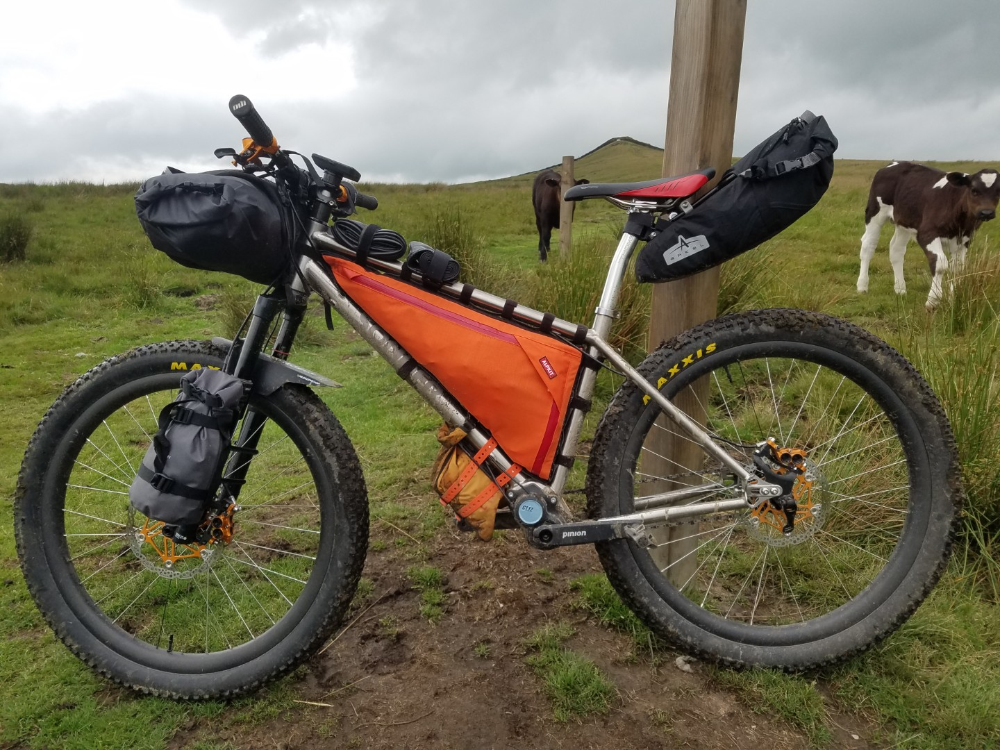
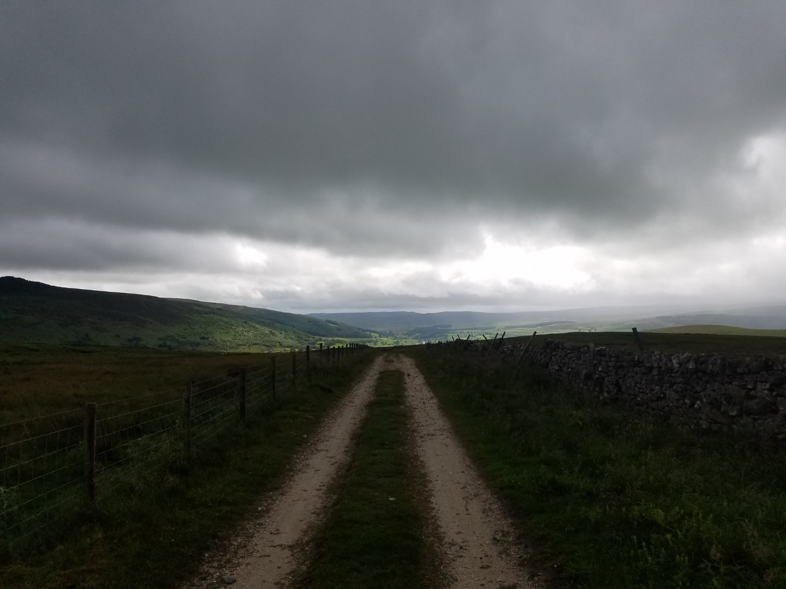
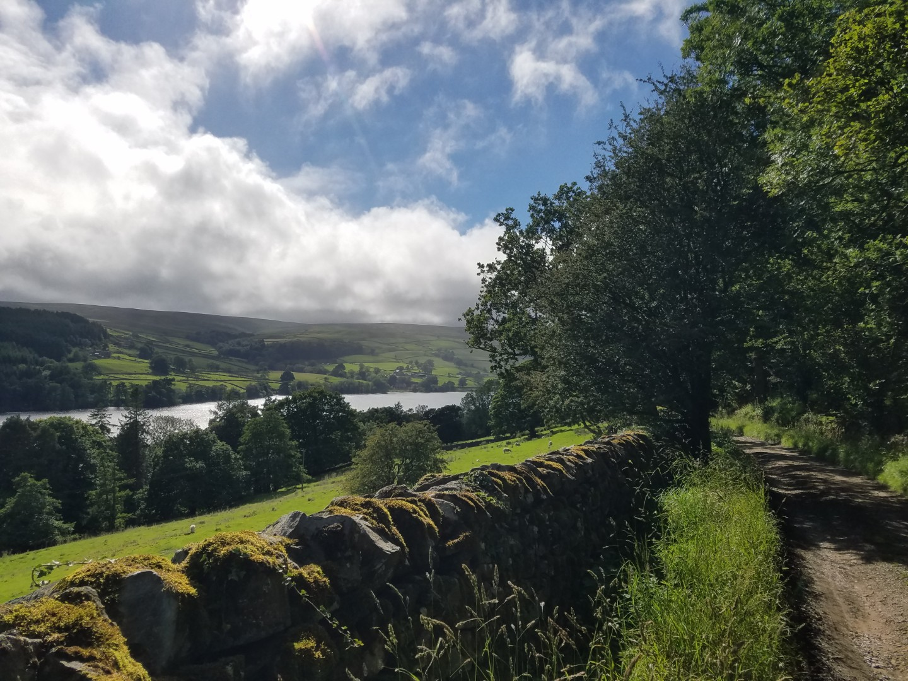
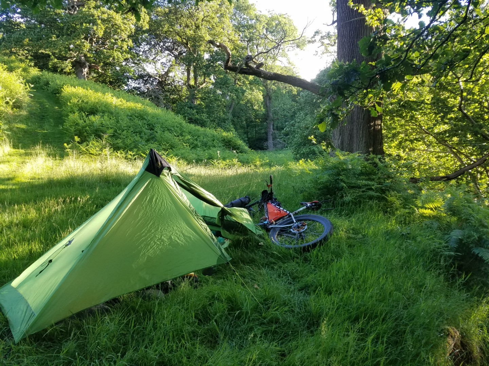

# 3 x National Park Tour
## Day 1 - Airton to Leighton
**4th July 2020**

I'd planned this trip as a replacement for doing the Highland 550 which I had to cancel due to the Covid-19 outbreak. Originally it was to be a 4 park tour and included the North York Moors but for some reason which I've forgot I changed it. I would wild camp all the way, unless a bothy was open and empty. I also had a new bike for the trip, a Sonder Broken Road with a Pinion gearbox. I'd bought it as a winter bikepacking bike that was more reliable than my full suspension bike. I has significantly fewer moving parts than my Yeti. All my previous rides on it had been great, except for a snapped chain which was very strange as it was a brand new chain.

<figure style="text-align: center;">  <figcaption><i>Sonder Broken Road Pinion loaded up</i></figcaption> </figure>

**Day 1 - Airton to near Leighton Hall, near Masham**

80.26km
**11.9kph average**
**6hr 43min moving time**
**1406 vertical metres**

**An uneventful day** over mostly good tracks in good weather. A leisurely start after walking the dogs and a large sausage sandwich breakfast. 

It threatened rain all day. There were black clouds all around and I could often see rain in the distance. There was a bit of light rain every so often (what's less than drizzle? Mizzle?) but not enough to need a waterproof. I had the wind at my back most of the way and it was quite warm so the waterproof was never needed.

<figure style="text-align: center;">  <figcaption><i>Looking towards Lord's Seat and Wharfdale</i></figcaption> </figure>

I saw a group (a "caravan" apparently) of stoats by the side of the track. I'd never seen so many together, there were about 6. They ran off into the heather when they saw me but not immediately, they seemed to run around each other, calling to each other. I could see a line of heather move as they ran away.

<figure style="text-align: center;">  <figcaption><i>Reservoir above Wath</i></figcaption> </figure>

I only planned to do about 70km day today and I was hoping to camp on Masham Moor, between Nidderdale and Masham. Unfortunately it turned out to be game shooting land. I saw the gamekeeper as I rode up the hill out of Bouthwaite and he looked a particularly grumpy soul. It was forecast to be windy overnight so I wanted to camp in some shelter but all I found was exposed moorland and thick heather. There were a few potential campsites bit I didn't fancy meeting the gamekeeper in the morning or having my tent blow away.  

I'd looked for potential camping spots on the map and made some notes before I left. There was another potential site on Caldbergh Moor and in between was only low farm land. I didn't fancy my chances around farms but in the end I found a delightful spot near a stream and in an oak woodland. It wasn't far from Leighton Hall but it was secluded enough for an early get away.

<figure style="text-align: center;">  <figcaption><i>Leighton Hall camp</i></figcaption> </figure>
