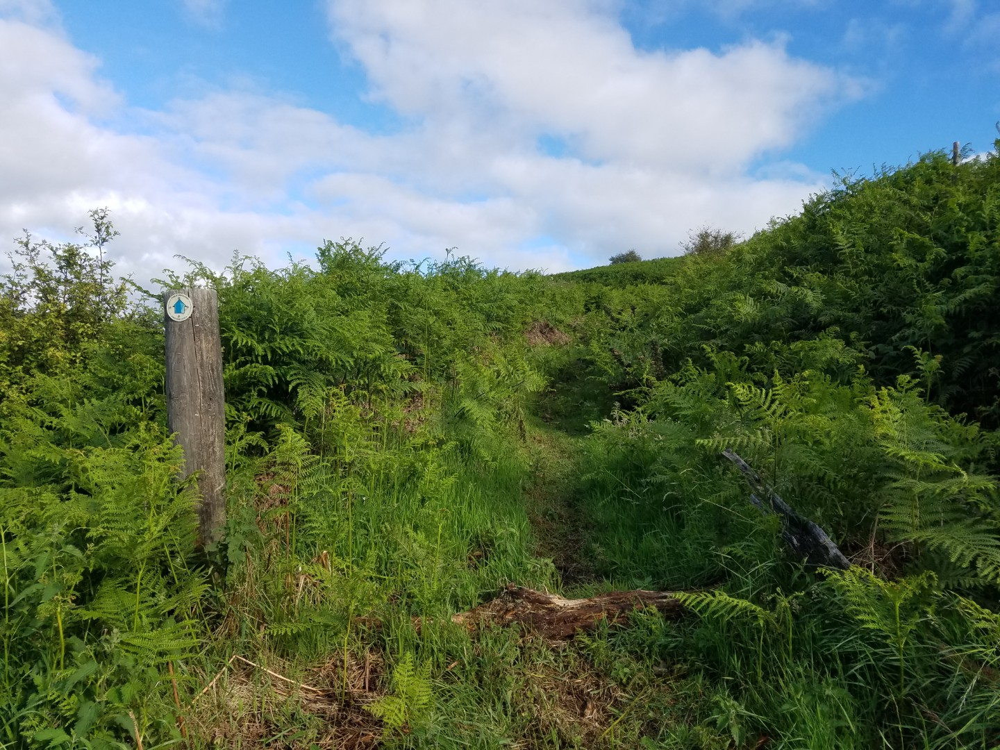
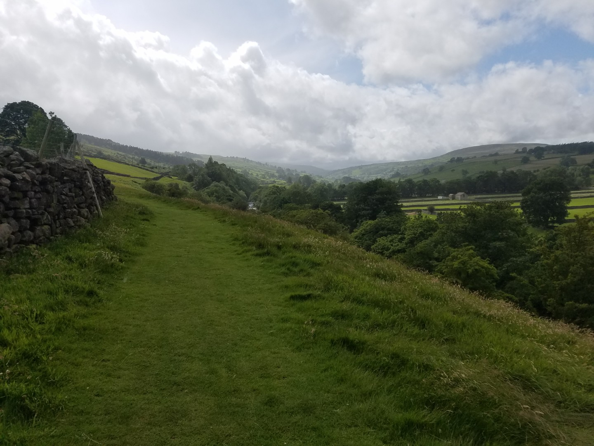
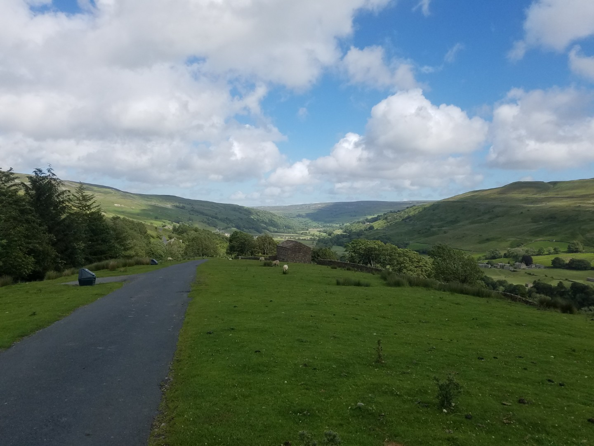
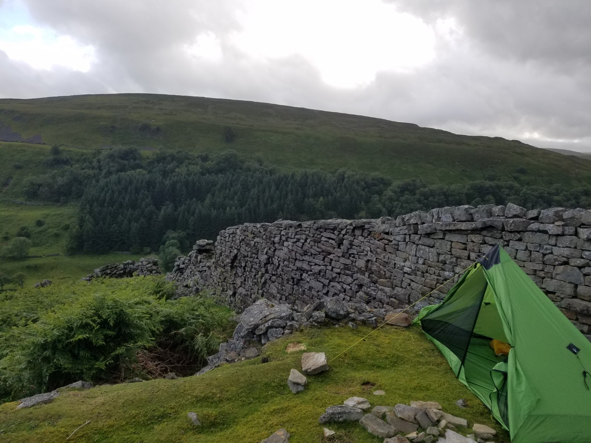
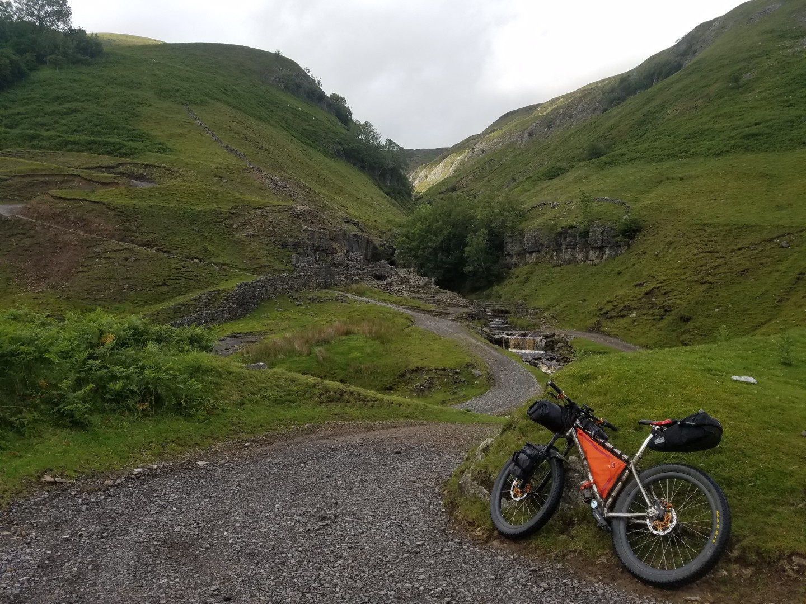
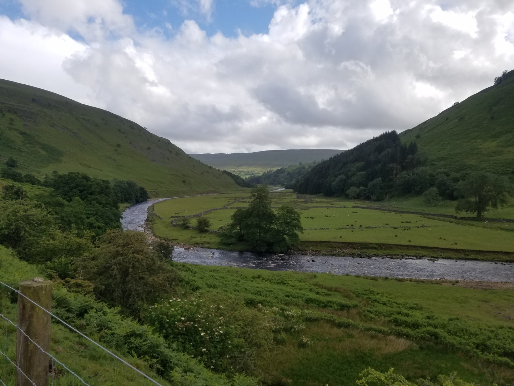

# 3 National Park Tour
## Day 2 - Leighton Hall to Crackpot Hall, Swaledale

**5th July 2020**

**71.61km**
**6hr 51min riding**
**10.5kph average**
**1441vm**
**Min 9C, max 20C**

Now that was a windy night. I put my ear plugs in at 3am but gave up trying to sleep at 5am. I'm glad I wasn't on the tops. Plus, the place I'd looked at on the map on Caldbergh Moor turned out to be pants for camping. All the flat areas were covered in thick heather and there was no shelter.

An early start was handy because it was really windy and slow going all day. The bridleway out of Colsterdale that runs past Slipstones started off as a push and stayed as a push all the way to the top. It was a narrow, unrideable single-track bounded by thick heather, bracken and a deep ravine. I missed my left turn, I'm not sure it exists, and so had to reroute. Luckily it was a tailwind over the top and became slightly rideable. The forecast was for 50 - 60kph winds, significantly more on top. Every so often the wind would be side on and I'd be blown all over the place.

<figure style="text-align: center;">
  
  <figcaption><i>Climb out of Colsterdale</i></figcaption>
</figure>

I was pushing it uphill on the road in places, it was so windy. I didn't fancy camping tonight and was hoping that the Dales Bike Centre in Grinton was open. After I got out of Colsterdale it was good tracks and small roads to Aysgarth. Except for the Ben Riding track, far too narrow.

When I made the route I either combined someones route into mine, on the basis that it would be rideable, or I chose bridleways that I'd never done before. This latter approach occasionally let me down, as it did climbing out of Colsterdale and as it did with the climb out of Castle Bolton. It was far too steep and grassy so I diverted up the road. My original route would rejoin this road part way down the other side and then head west along Harkerside Moor on a bridleway. I was so fed up of fighting the wind that I didn't bother with that, I went straight down the road to Grinton, hoping that the Dales Bike Centre was open, serving food and offering accommodation.

It was open but no accommodation. The cafe was open but only seating outside and I got quite cold by the time I'd eaten. Good news though, I learnt that my bridleway up to Tan Hill doesn't exist but I was told about a low level route along the Swale Trail and a bivvy spot at Crackpot Hall near Keld. It turned out to be a great campsite. Awesome views and enough shelter behind walls. Although there was a point climbing on the road out of Gunnerside, into a horrendous headwind when it started to rain and felt like ice daggers, that I wondered if I'd make it.

<figure style="text-align: center;">
  
  <figcaption><i>Swale Trail</i></figcaption>
</figure>

<figure style="text-align: center;">
  
  <figcaption><i>Down Swaledale towards Gunnerside</i></figcaption>
</figure>
After putting up my tent and getting changed it started to rain and didn't stop. Good timing. There was a bit of thunder, which I wasn't expecting, though it passed quickly. My evening meal was lentils, chorizo and Dolmio tomato sauce. A simple but tasty choice I thought. It was awful and the bottom of the pan took ages to clean. I was cooking in a 750ml metal mug, the idea being that it was smaller and lighter than a normal pan, and easier to pack. In actual fact it was easier to burn things at the bottom without heating up the top.

<figure style="text-align: center;">
  
  <figcaption><i>Crackpot Hall camp</i></figcaption>
</figure>

<figure style="text-align: center;">
  
  <figcaption><i>Swinner Gill</i></figcaption>
</figure>

<figure style="text-align: center;">
  
  <figcaption><i>Upper Swaledale below Crackpot Hall</i></figcaption>
</figure>
