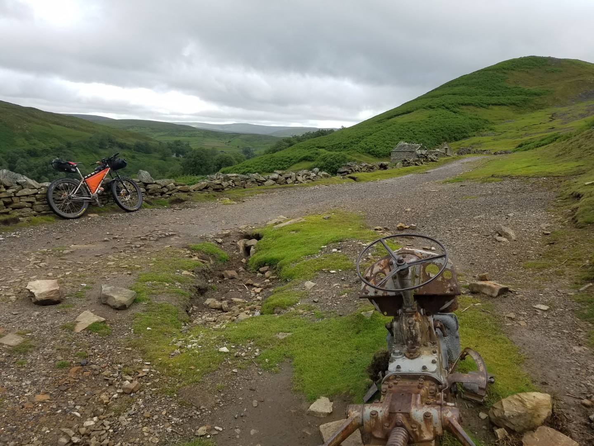
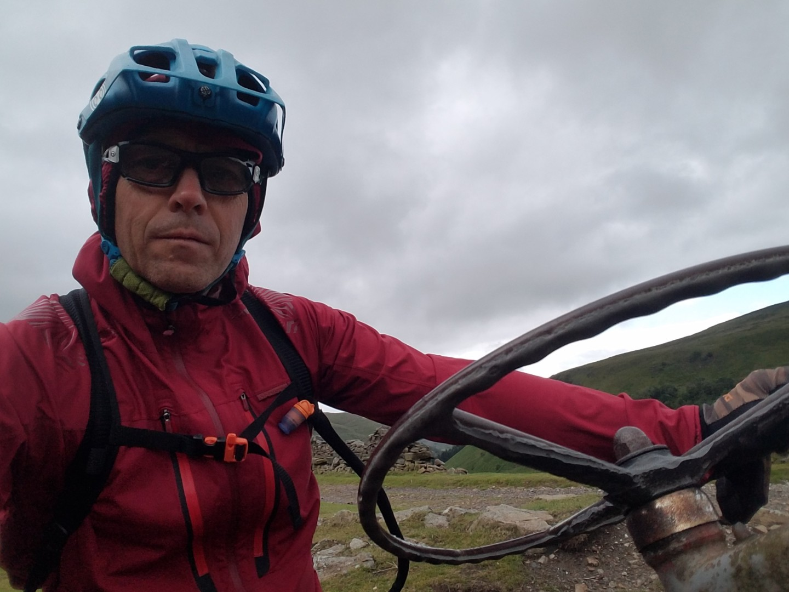
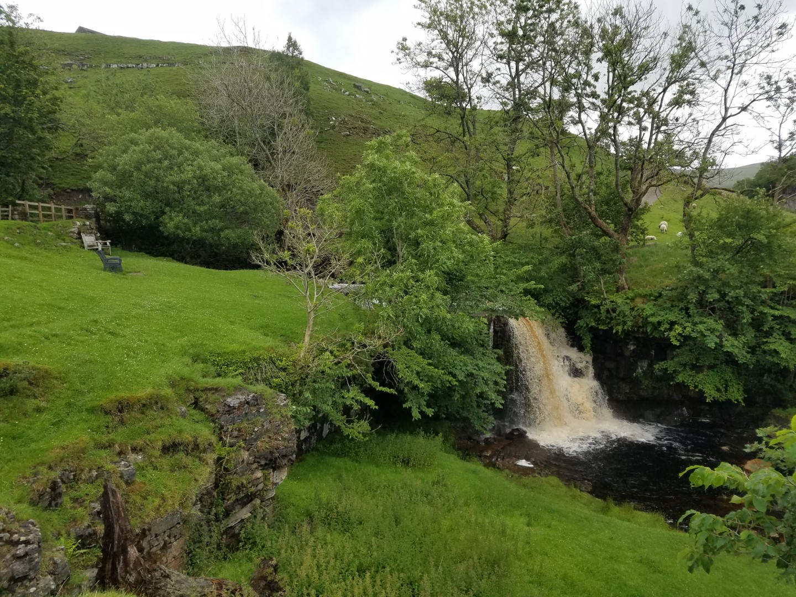
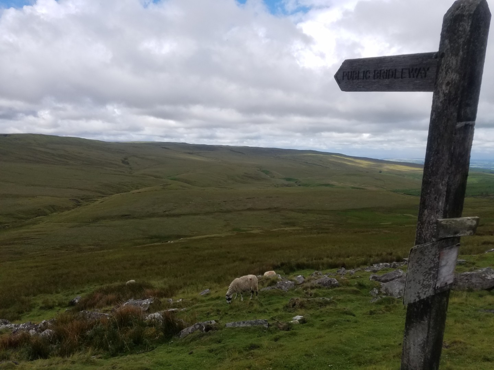
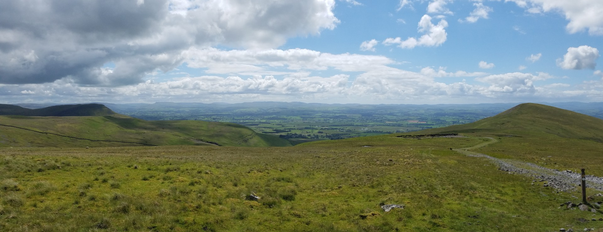
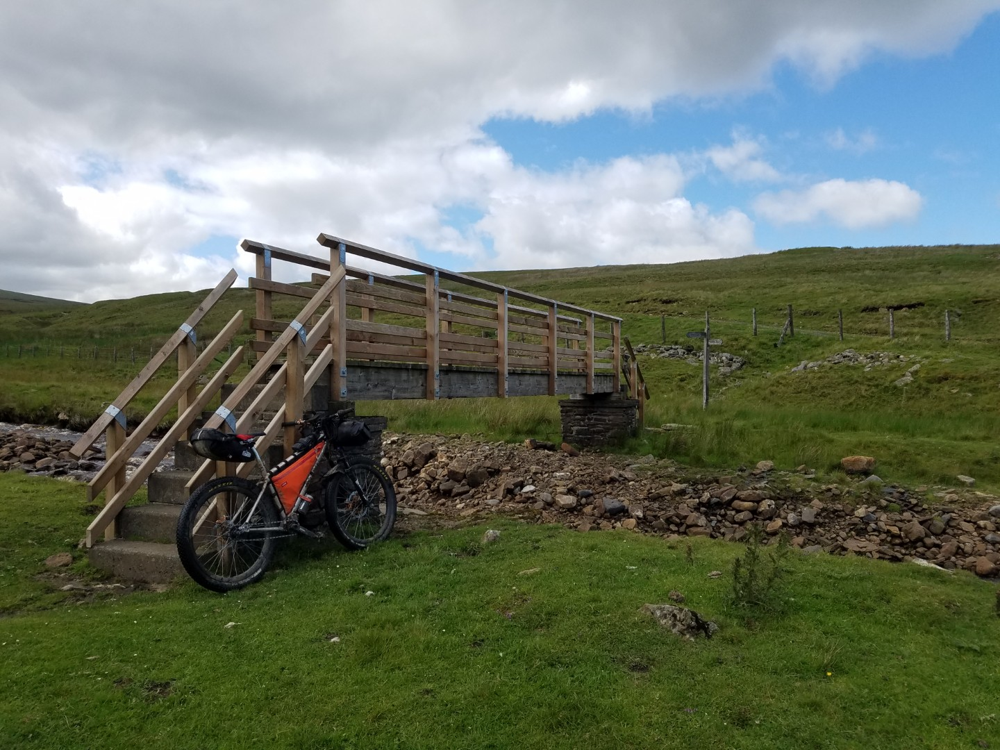
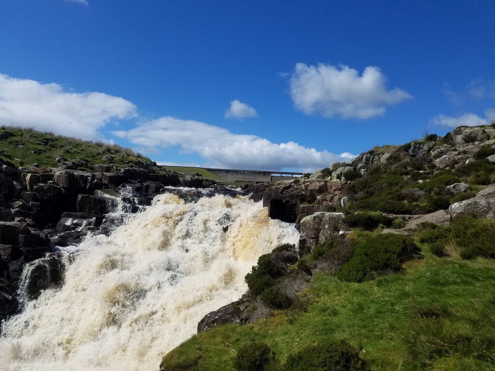
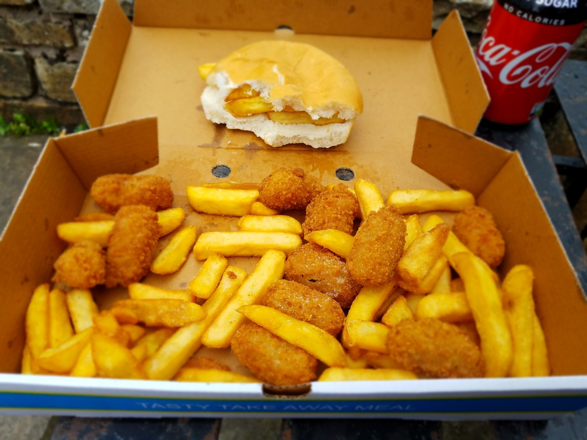

# 3 x National Park Tour
## Day 3 - Crackpot Hall to Alston
**6th July 2020**

**79.3km**
**6hr 40min ride**
**11.9kph av**
**1465vm**

A good night's sleep, I even slept in till 6am. Breezy but mostly dry in the morning. Had some big climbs to do today - up to Tan Hill Inn and up High Cup Nick from Dufton.

<figure style="text-align: center;">
  
  <figcaption><i>Near Crackpot Hall - One of these modes of transport is faster than the other, but not by much.</i></figcaption>
</figure>

<figure style="text-align: center;">
  
  <figcaption><i></i></figcaption>
</figure>

<figure style="text-align: center;">
  
  <figcaption><i>Catrake Force near Keld</i></figcaption>
</figure>

There was a mild breeze and although it was threatening to rain there were no showers yet. I took the road to Tan Hill, partly because the very start of the bridleway was really steep and partly because I wanted to save some energy for the climb out of Dufton up High Cup Nick.

I was tempted to have some food at Tan Hill but it was till early and I wanted to make progress. Another one of my "bridleways that I'd never ridden and wanted to" turned out not to exist, the bridleway at Potter Side which would have taken me to Kirkby Stephen. No point going to Kirkby Stephen as there wasn't a decent bridleway alternative so I took the road to Brough, where ate lunch, felt warm then suddenly got cold), and on to Murton. 

<figure style="text-align: center;">
  
  <figcaption><i>Potter Side, spot the bridleway</i></figcaption>
</figure>

I changed my mind about the route at Murton. Both climbs, from Murton and Dufton, were probably a push but the Murton route looks easier and was possibly rideable although it still turned out to be a push. Which I should have remembered as I've been here before. Once on top the track turned became a grassy,  damp track, very slow going. Awesome views though.

<figure style="text-align: center;">
  
  <figcaption><i>Murton Pike</i></figcaption>
</figure>
 

There are bridleways either side of Maize Beck but it's best to cross to the north side at the footbridge (which isn't particularly bike friendly), other wise you end up in Warcop land and with a wide river to cross. As the Pennine Way leaves Maize Beck it climbs up a boggy grass slope, an annoying push, eventually getting to a welcome shooting track which isn't on the map. It was slow going from Murton to Maize Beck but once on the shooting track things really sped up down to Cow Green reservoir. It's an impressive concrete damn and the outflow feeds the nearby Cauldron Snout.

<figure style="text-align: center;">
  
  <figcaption><i>Push your fully loaded bike up that!</i></figcaption>
</figure>

<figure style="text-align: center;">
  
  <figcaption><i>Cauldron Snout</i></figcaption>
</figure>

There's a good track from Cow Green reservoir out to the B6277 then road down hill to Garrigill and along back roads Alston.

I really fancied fish and chips but the chippy is closed in Alston, However, there's a pizza kebab place open the does fish and chips. Unfortunately he's run out of fish but he's got some scampi! Followed by some Belgian chocolate buns from the Co-op. I bought enough food for about three days to get me through Northumberland to Carlisle which was where I knew there would be another shop.

I was tuck in a valley and nor sure where I'd be able to wild camp. On the map there were a few potential spots next to the South Tynedale Railway, which was a short section of restored railway line. It was originally built for the mines in the area but now took tourists up and down the valley. There was a picnic spot next to the river which turned out to be a perfect campsite. Met two blokes carrying the biggest salmon I've ever seen, which they offered to sell to me.

My legs aches slightly tonight but I should be ok for a couple of more days. No undercarriage fatigue yet!

<figure style="text-align: center;">
  
  <figcaption><i></i></figcaption>
</figure>
