# 3 National Park Tour
## Day 4 Alston to Spithope Bothy, Northumberland
**7th July 2020**

**87.39km**
**13.9kph av**
**6hr 17min riding**
**1249 vm**

Great nights sleep. Found a railway waiting shelter further down the line, Lintly Halt, would have been a nice overnight.

<figure style="text-align: center;">
  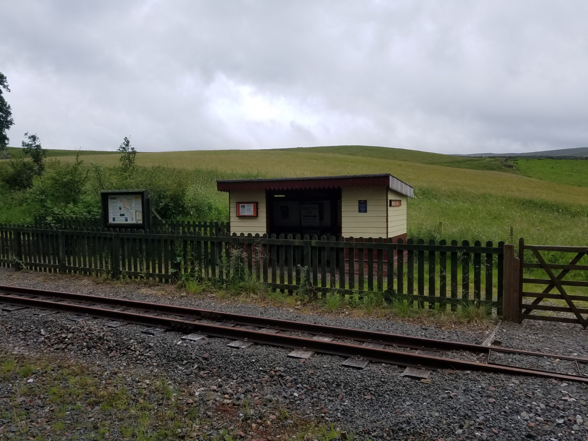
  <figcaption><i>Lintly Halt Station / bothy</i></figcaption>
</figure>

<figure style="text-align: center;">
  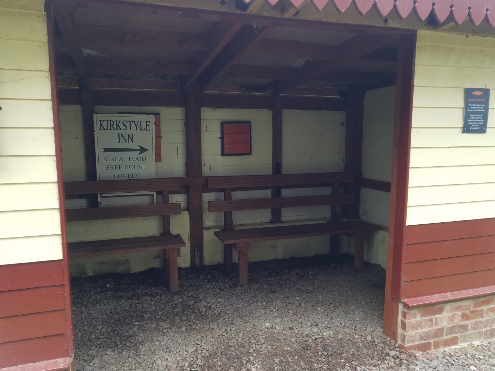
  <figcaption><i>Lintly Halt Station / bothy</i></figcaption>
</figure>

Just before Haltwhistle was the majestic Lambley Viaduct. The map shows the pan flat converted railway track going straight across it but unfortunately the OS had made a mistake. The actual route went down some steps,  across a narrow bridge, up some steps and up a final metal staircase, with a 90 degree bend in it. Arse.

<figure style="text-align: center;">
  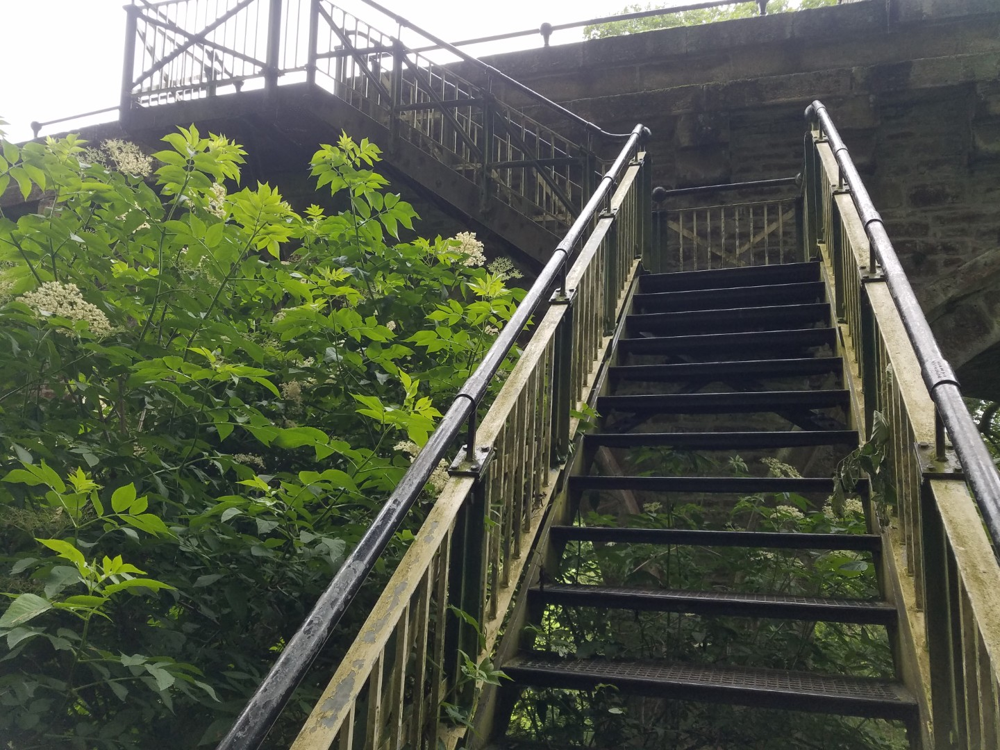
  <figcaption><i>The final kick in the balls</i></figcaption>
</figure>

<figure style="text-align: center;">
  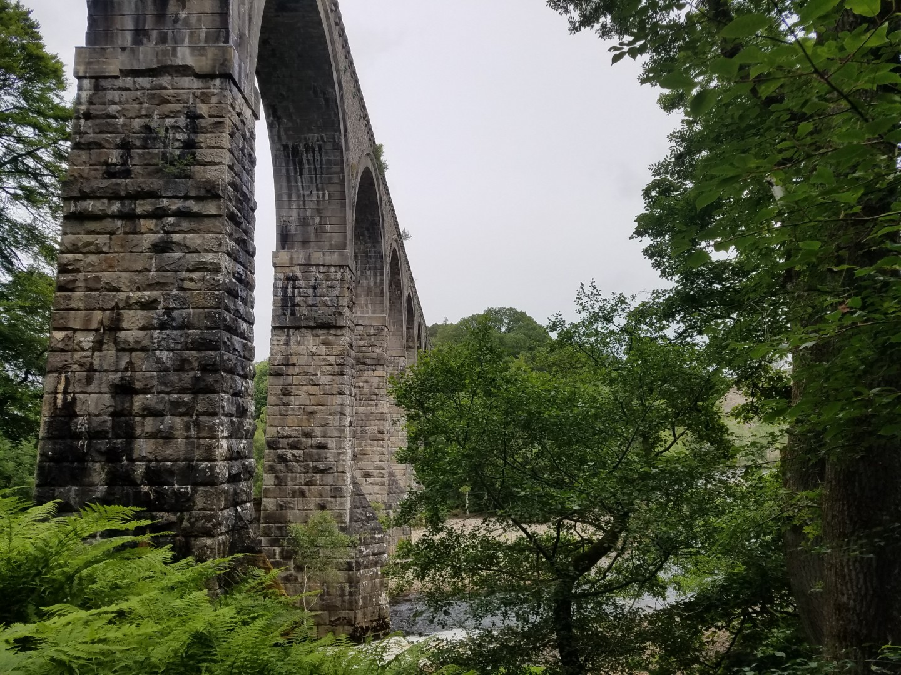
  <figcaption><i>Lambley Viaduct</i></figcaption>
</figure>

<figure style="text-align: center;">
  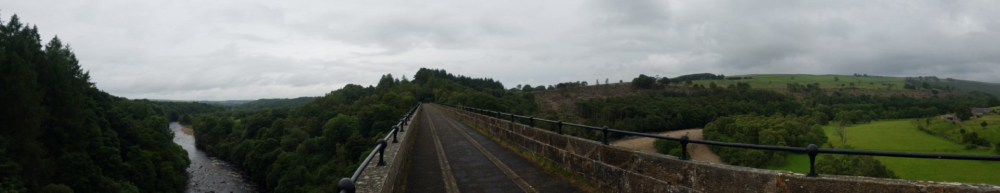
  <figcaption><i>Lambley Viaduct</i></figcaption>
</figure>

The railway cyclelane had been great, flat, traffic free and sheltered. I had a coffee and cheesecake in Haltwhistle but didn't linger too long as it wasn't particularly warm.

I followed the road out of Haltwhistle, past Hadrian's Wall which is never as impressive as I think it'll be. I could see rain approaching over Haltwhistle so I threw grass in the air to check the wind direction. I could feel spots of rain and so decided that everything pointed to it being about to rain on my head and so put my waterproofs on. I soon reached  the first forest track on Sustrans 68 to Stonehaugh & Bellingham. I hoped the forest would keep the worst of the approaching rain off me.

Of course it never rained after putting on my waterproofs.

<figure style="text-align: center;">
  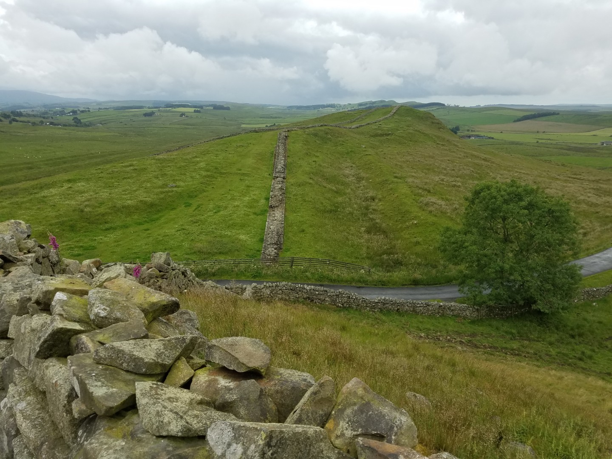
  <figcaption><i>I'm not sure Trump would be impressed by Hadrian's efforts.</i></figcaption>
</figure>

<figure style="text-align: center;">
  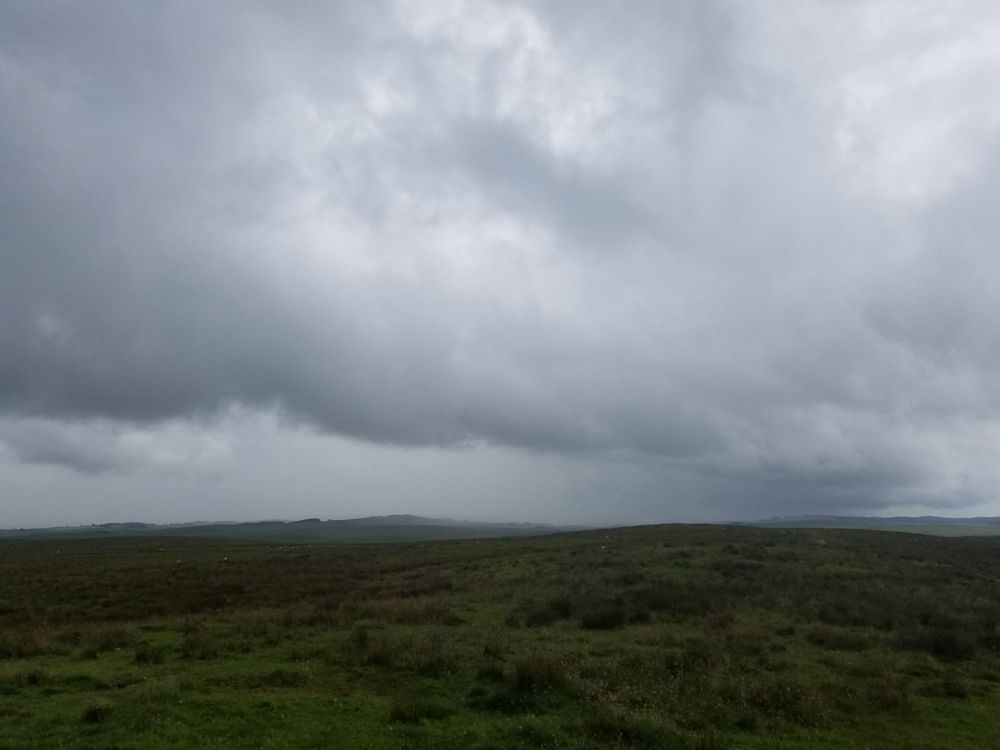
  <figcaption><i>That says rain, but it never did</i></figcaption>
</figure>

It was good going in Kielder Forest. I was following the Dirty Reiver or the Reiver Raid, can't remember which, so I assumed that any routes off the main tracks would be good. Northumberland has a lot of bridleways that don't really exist on the ground and there were a couple of sections on this route. Luckily they were obviously crap on the turn off so I just diverted along a parallel track.

<figure style="text-align: center;">
  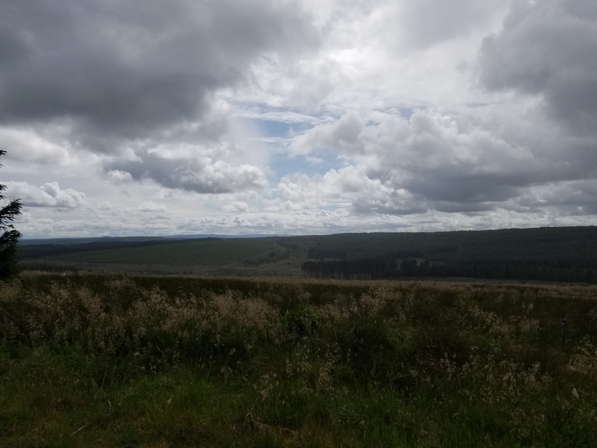
  <figcaption><i>Somewhere in Kielder Forest</i></figcaption>
</figure>

The final climb was out of the River Rede valley, following the Pennine Way from Bryness. It goes up the east side of Spithope Burn and leads straight to Spithope bothy, where I hoped to stay. The Mountain Bothy Association website said that the bothies were still locked and there were also signs on the approaches confirming this. Earlier in the day I'd ridden past Green Bothy and stopped just to check.  It was open and although it was too early to stop there it gave me hope that Spithope would be open. It was worth riding another 45km to find out.

I'd visited Spithope Bothy the last time I came to Northumberland. I ridden down the west side of Spithope Burn on a good forest track, seen the bothy and crossed the burn to check it out. I noted that the bridleway, the Pennine Way, that goes past the bothy was bush whacking madness. Now I was at the bottom of this route but I hoped (assumed) that because it was on an organised route, the Reiver something or other, it would mostly be good. Maybe it was just the bit near the bothy that was bad?

The first problem was that there was some logging at the bottom of the bridleway and it was a muddy, churned up mess. However, there was footpath which led to a forest track just above it which ran parallel until they both joined up. I pushed up a footpath which started out as steep but doable until that also turned into a churned up mess, only steeper than the bridleway.  Eventually I joined the good track which soon became a muddy mess but not as bad as the other route.

Eventually it turned into a good track and I thought it would be easy riding most of the way to the bothy. What an idiot! The last 800 metres was a pure pushing nightmare.

<figure style="text-align: center;">
  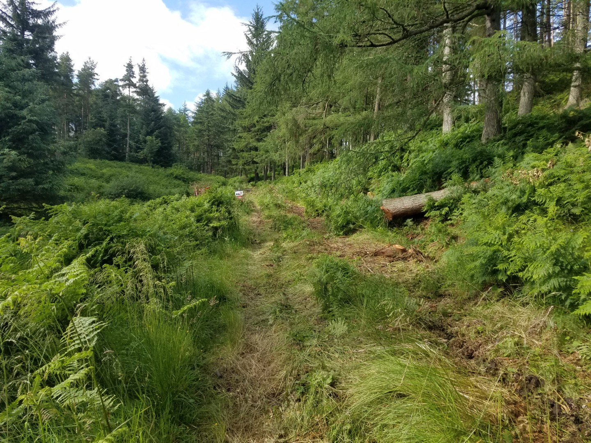
  <figcaption><i>That's a bridleway</i></figcaption>
</figure>

<figure style="text-align: center;">
  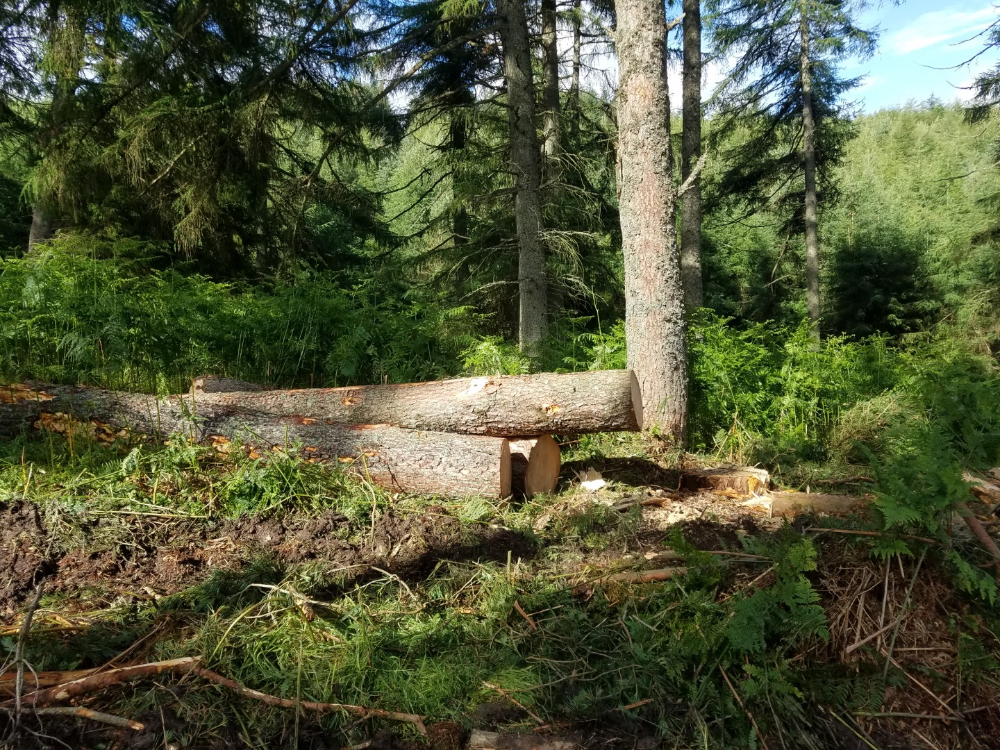
  <figcaption><i>That's a footpath used to avoid the Pennine Bridleway</i></figcaption>
</figure>

<figure style="text-align: center;">
  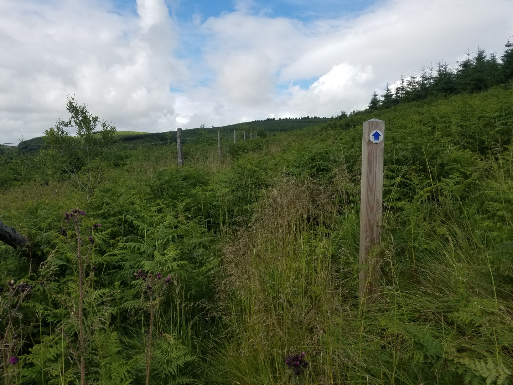
  <figcaption><i>That's the bridleway that doesn't want you to visit Spithope bothy</i></figcaption>
</figure>

The bothy was open and empty. It was also warm enough outside to have a bath in the stream. Perfect. Well, not quite a bath, I stood in ankle deep water and splashed cold water over me, partly to have a wash and partly to keep the midges off. I even washed my socks, which, although being made of merino wool and supposedly don't smell, were starting to smell strong enough to ward of Lancastrians.

<figure style="text-align: center;">
  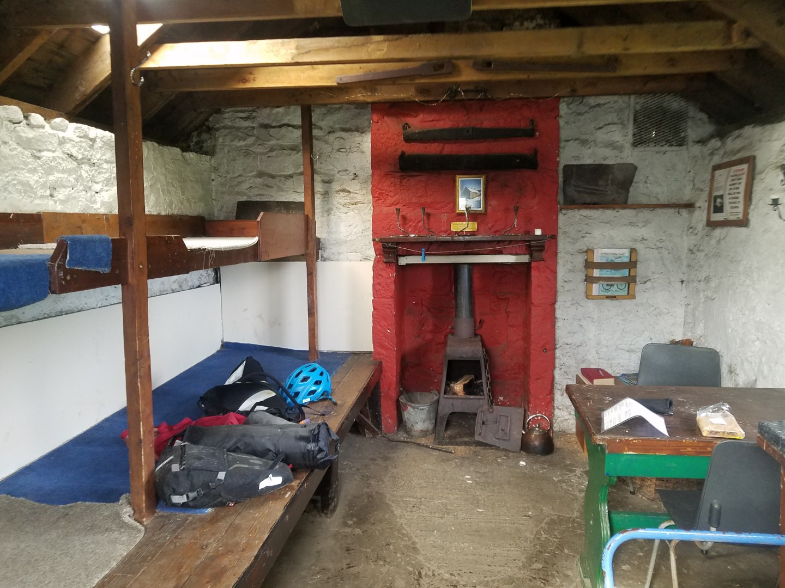
  <figcaption><i>Spithope Bothy</i></figcaption>
</figure>

