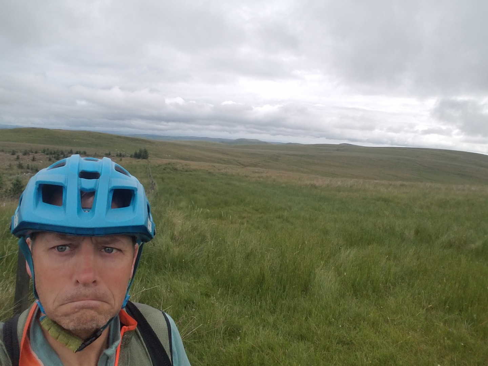
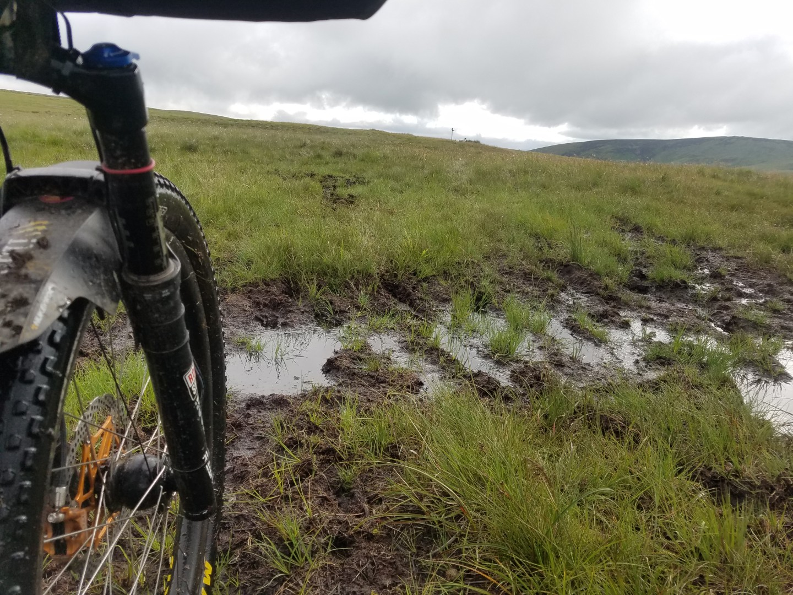
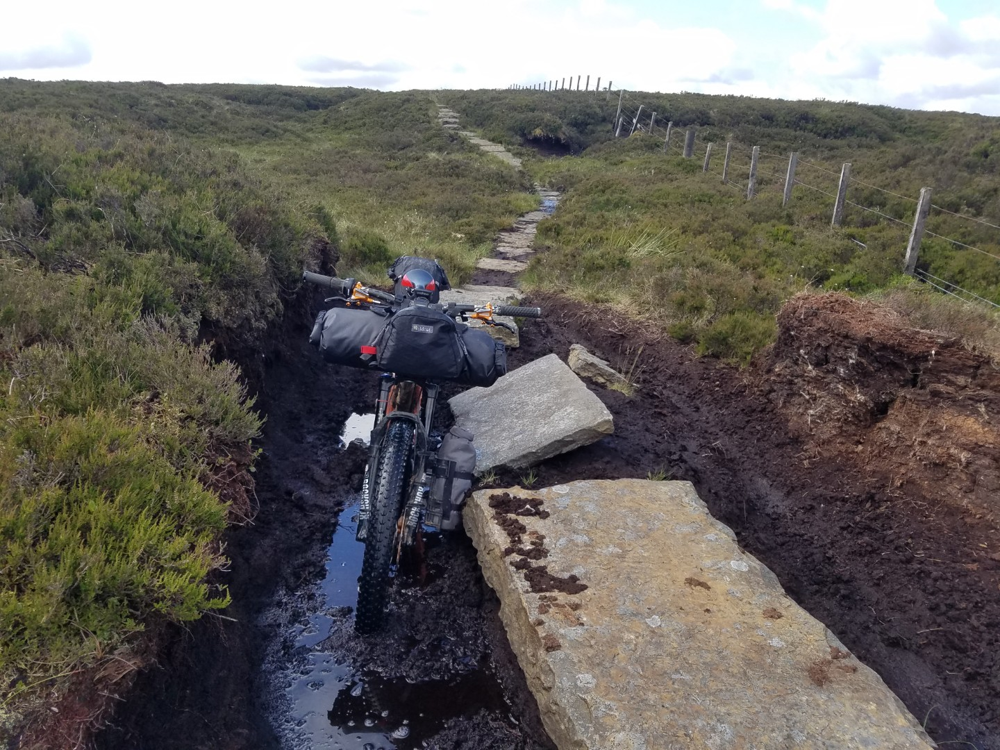
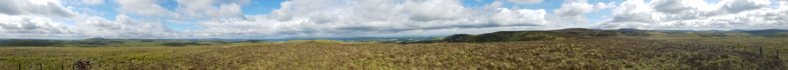
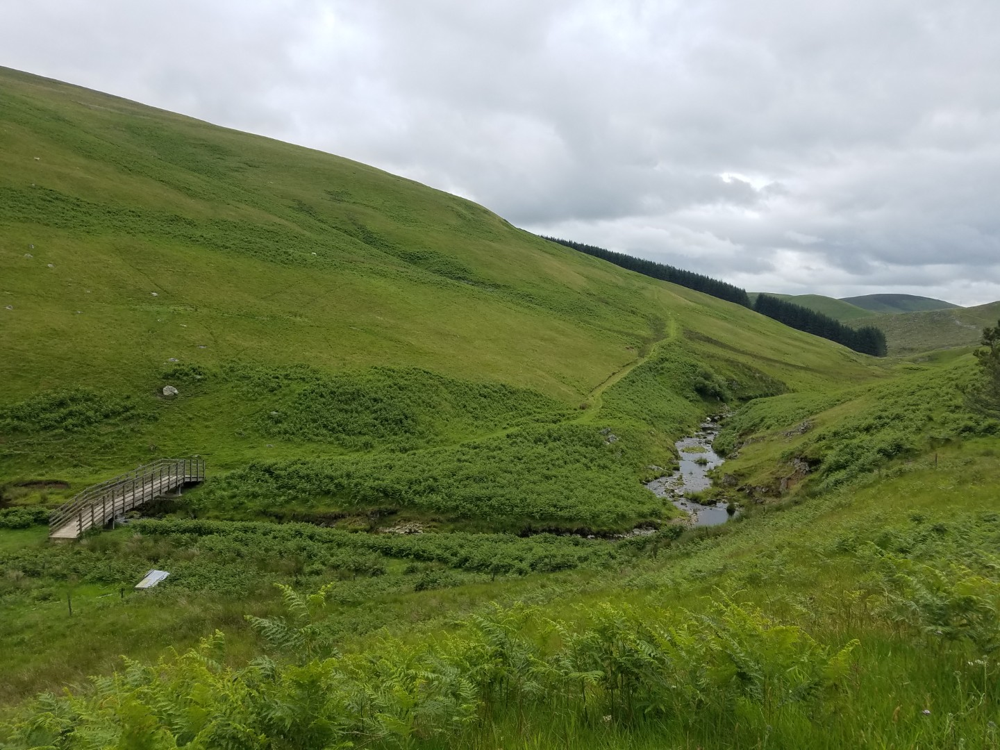
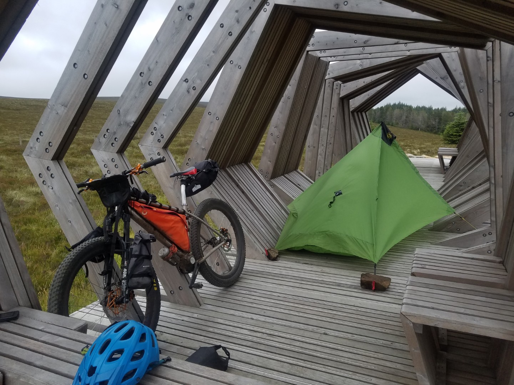
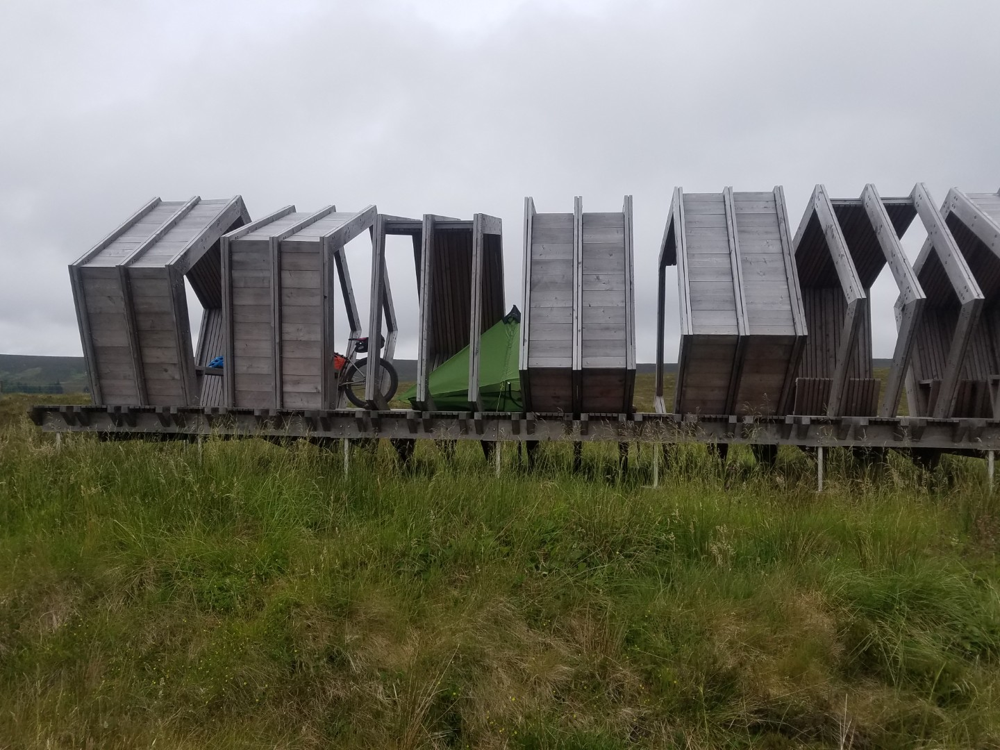
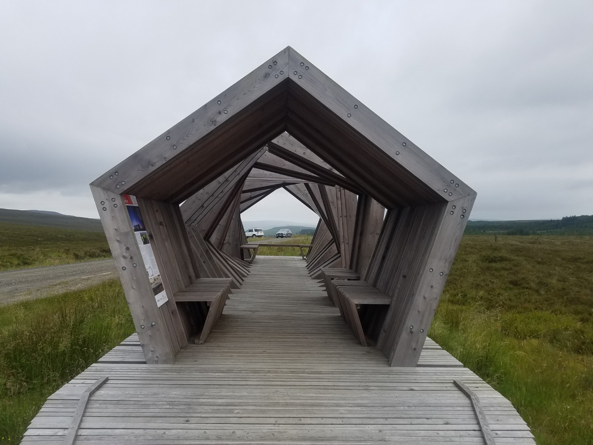

# 3 National Park Tour
## Day 5 - Spithope Bothy to Blakehope Nick

**8th July 2020**

**6hr 33 min ride time**
**69.3km**
**10.6kph av**
**1295vm**

My legs ached on the walk back up to the bothy from the stream in the morning. My socks still stink, they'll be living outside permanently now. Zero midge bites. Kershopehead Bothy is a long way off.

Nice start up a forest road then it turned grassy, push, ride, push, ride. The Border route was no better, boggy and hard going. Great views though. I missed out dropping down to the Roman camp at Chew Green and then climbing back up to save some height. I'd seen it before.

My first hour had been at an average of 5.7kph! Just past Brownhart Law I joined Deer Street and the track was rideable. 

<figure style="text-align: center;">
  
  <figcaption><i>Start of the Border route</i></figcaption>
</figure>

<figure style="text-align: center;">
  
  <figcaption><i>Welcome to Scotland</i></figcaption>
</figure>

<figure style="text-align: center;">
  
  <figcaption><i>Slightly worse for wear</i></figcaption>
</figure>

<figure style="text-align: center;">
  
  <figcaption><i>View from Lamb Hill</i></figcaption>
</figure>

Think I wrote that too soon, still slow going. After the refuge at Yearning Saddle (good emergency bivvy) there were paving slabs in various states of levelness. By 2.5hrs my average was 5.9kph!

I was enjoying the area, the views were great and it was a beautiful place to be but I wasn't feeling the urge to ever come back with my bike. 

I crossed The Street (that looks rideable, why wasn't I on that?) at Plea Knowe and thought about dropping down to the valley and finding a more sensible route. Ahead of me was Windy Gyle which looked like a big push. It was very tempting to reroute but I knew I'd be annoyed with myself. It was a points along this section, all the points in fact, that I'd wished I'd done a bit more research into the quality of the tracks. God it was slow work!

There was actually a track of some sorts at the top of Windy Gyle! At Little Ward Law my route dropped down to the valley below at Barrowburn and then climbed back up another valley. The route made a big V shape with significant height loss and climbing when in theory I could just nip across about a kilometre of bridleway and save some climbing and time. It looked like my alternative route went through a forest which meant that the track probably didn't exist. The original route dropped down to a bunkhouse which I assume was a checkpoint on the Reiver ride thingy. Hmm. I went for the alternative route. In the end I didn't follow all of the bridleway on the map but there was enough there to make it work. I re-joined the original route on a smooth, wide forest road, I'd won one over Northumberland and I felt like I was in civilisation! This whole section, from Spithope bothy across the moors along the Border route, had felt very remote and was tough going. I didn't see anyone all day. 3.5hrs, 21.6km, 6.3av!

The riding was much better on Clennel Street. Some superb firm grassy riding and descents. The road at Alwinton was a welcome relief, as was The Star Inn at Harbottle. I didn't want to leave but I hadn't travelled far enough today so after a coffee, magnum ice cream, 2 sausage rolls, another coffee, a chocolate brownie, an almond slice and a chat with a local, I left.

<figure style="text-align: center;">
  
  <figcaption><i>Usway Burn bridge, near Yarnspath Law</i></figcaption>
</figure>

The red flags were flying at Otterburn ranges so I started to plan a diversion to avoid being blown up. Just as I left on my new route I met a local who said it was ok as long as I didn't go through a barrier, so I believed him! Got a fair way before a closed barrier at Cocklaw Green but it was an easy diversion down to the A68.

There was no way to get to Kershopehead bothy today, I'd aim for Blakehope Nick instead which was a high point in Kielder Forest and so hopefully midge free. There was a sculpture at Blakehope Nick to obviously I camped in it, the best campsite ever. Just as I'd settled down I got told to move on by a Forestry England Ranger but after a chat and a promise not to leave any mess he let me stay. They've had trouble in the past with people leaving rubbish and tents. 

My legs didn't really ache all day in the end, it was just that initial effort  in the morning. I've also still got minimal undercarriage fatigue, good news!

<figure style="text-align: center;">
  
  <figcaption><i>Ingenious use of pegs not pictured</i></figcaption>
</figure>

<figure style="text-align: center;">
  
  <figcaption><i></i></figcaption>
</figure>

<figure style="text-align: center;">
  
  <figcaption><i>Blakehope Nick thing</i></figcaption>
</figure>
