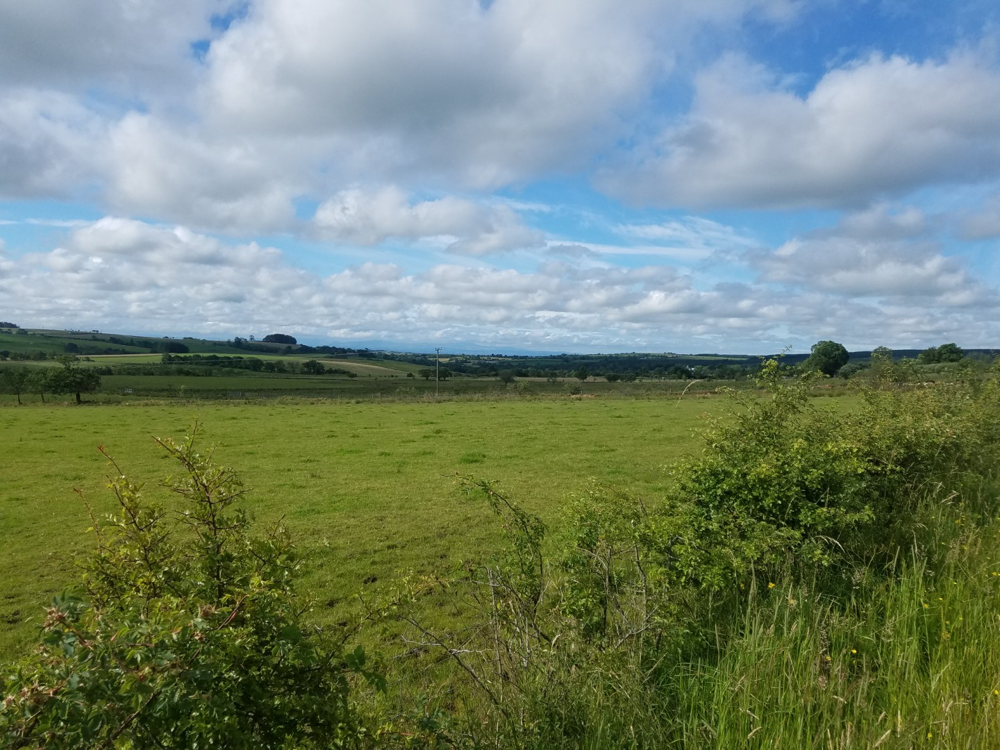
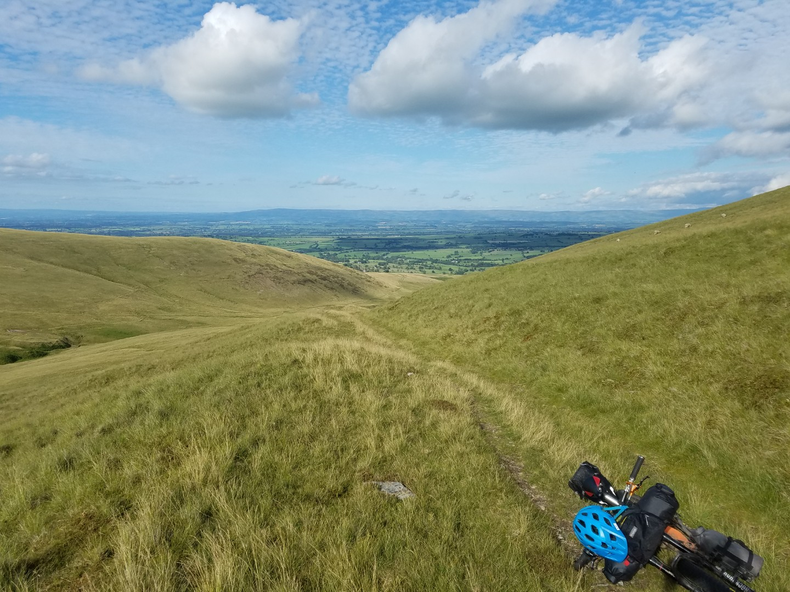
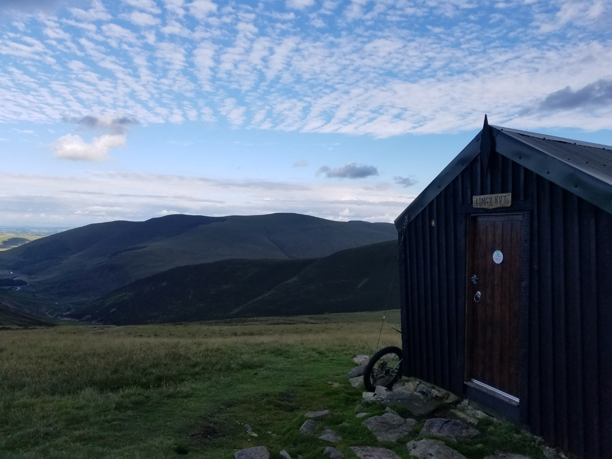

# 3 National Park Tour
## Day 6 - Blakehope Nick to Lingy Hut, Skiddaw

**9th July 2020**

**114.9km**
**8hrs 7 mins**
**14.2kph av**
**1386vm**

5am start, got away for 6. It was a bit chilly at one point last night and it was a chilly start, especially since the first 10km were down hill to Kielder where unfortunately it was too midgy to stop and eat. So it was up and over the next hill, past Kershopehead Bothy before I had breakfast. Then it was easy cruising on roads in the sun to Carlisle, a nice riverside bike path through Carlisle and back roads to Fellside, north of Skiddaw. 

<figure style="text-align: center;">
  
  <figcaption><i>The Lakes are over there somewhere</i></figcaption>
</figure>

<figure style="text-align: center;">
  
  <figcaption><i>The climb up from Fellside</i></figcaption>
</figure>

My rear hub had been playing up all week, even though it was brand new. It made lots of horrible noises and occasionally it didn't engage immediately but it worked well enough to keep going. By Carlisle it had got a bit worse but I still stocked up on food for the last two days. 

By the time I got to Fellside, at the north side of the Skiddaw hills, I was a bit tired and there was a fair bit of pushing on the route I'd chosen. I did see three mountain biker on a much easier footpath that goes over Low Pike and High Pike, missing out Calebreck and the push up Carrock Beck bridleway. Wish I'd know about that before hand, looked much easier. There's some great riding round here that I've never explored, I must come back. I met more mtbs here than on the rest of the trip - five, and saw another three.

Lingy Hut was empty. It's quite warm inside, I assume they insulated it. I could sit outside, sheltered from the wind looking at the view down Grainsgill Beck towards Mosedale, it was fantastic.

<figure style="text-align: center;">
  
  <figcaption><i>View from Lingy Hut</i></figcaption>
</figure>

By now I was close to giving up on my hub, it was getting too problematic. I'd see how it was in the morning. In theory I still had High Street to do, through Borrowdale (not the Keswick one), then across to the north of the Howgills, up and over to Sedbergh and then home via the Pennine Bridleway. I wanted to complete it although a failed hub would mean I didn't have to blame my legs for stopping.