# A Dales and North Pennines bikepacking trip
**May 2021**

This was meant to be the Highland 550, which was meant to be last year. Last year was stopped by Covid, this year was a combination of feeling ill, and maybe overtraining, and an outbreak of damp in my lockup which I needed to fix. So instead I quickly put together a route up to the North Pennines, aiming to criss cross Melmerby Fell, Cross Fell and Great Dun Fell on tracks I'd not ridden before, with some tracks along the way which I'd also not done before.

<figure style="text-align: center;">
  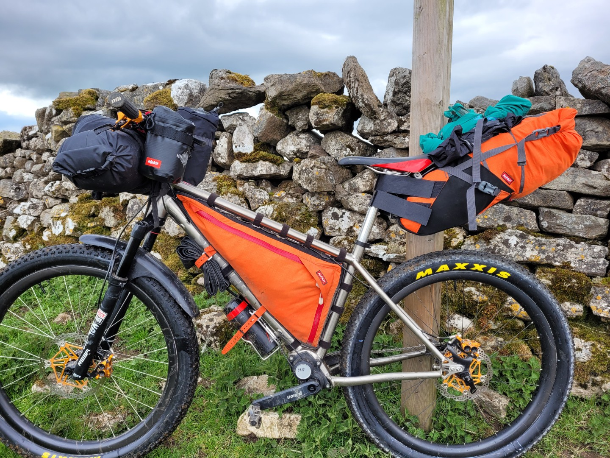
  <figcaption><i>Sonder Broken Road loaded up</i></figcaption>
</figure>

I was also going to try packing without a rucksack, as every one else seems to rave about it. In the end I didn't particularly like it, the bike felt heavy and cumbersome, especially when pushing or negotiating obstacles. Admittedly I've got 4 and a half days of food packed away, which is fairly heavy, I reckon there was about 3.5kg of food.

## Day 1 Malhamdale to Crackpot Hall, allegedly.

**5hrs, 59km 1.3vkm**

A late start and a gentle pootle, mostly because I wasn't sure if I was ill. Turned out I didn't feel too bad really. Gilbert Lane, above Cray in Wharfedale, was the first up hill push on a loose, rocky track, and the first indication that I should have stuck with a rucksack, or packed less food. There were lots of big black clouds and a bit of rain did push in up on Cragdale Moor but luckily it was a tailwind. I was trying another experiment on this trip; I was wearing normal summer full fingered gloves and carrying some large marigolds to go on top when it rained. If they had been a bit larger it would have worked but they were a bit tight and made my hands a bit colder. There were some fantastic views of Semer Water and Wensleydale when the rain cleared.

<figure style="text-align: center;">
  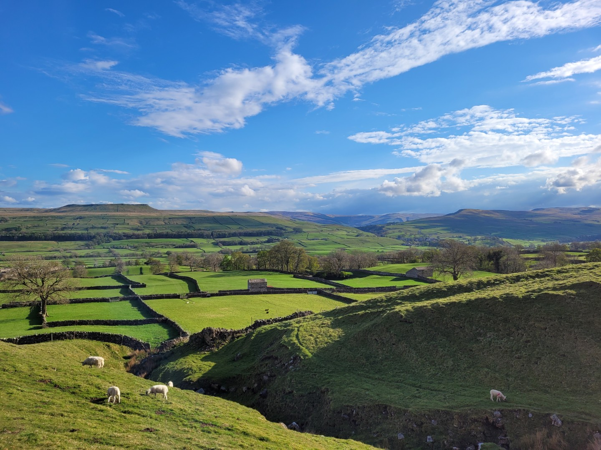
  <figcaption><i>Wensleydale</i></figcaption>
</figure>

<figure style="text-align: center;">
  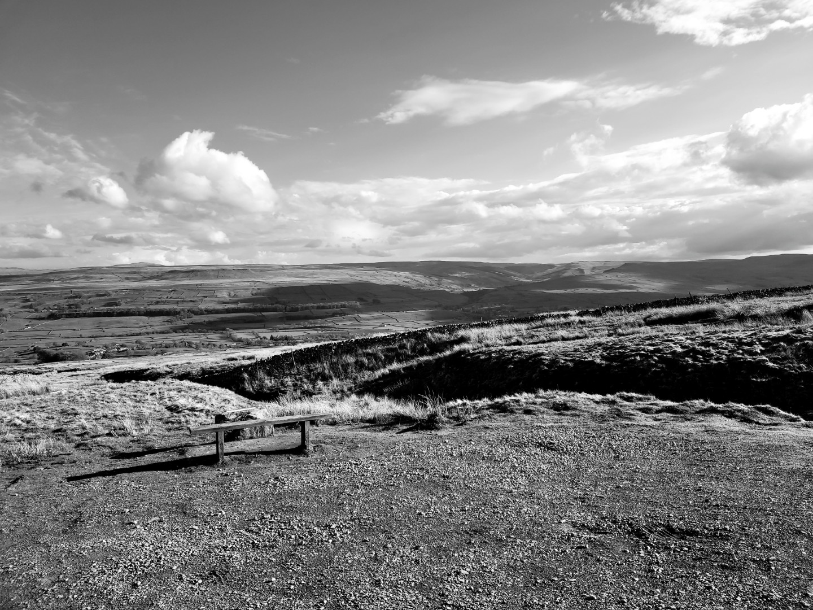
  <figcaption><i>Askrigg Common</i></figcaption>
</figure>

 The 25% road climb out of Askrigg was a bit of a shock. At the top I met a gamekeeper and handed him a birthday balloon that I'd found and asked him to bin it for me. He was quite pleasant and asked me where I was going. I thought he was just being curious but he then casually mentioned that they don't "encourage" wild camping on the estate and that there was an campsite in Muker.

At Gunnerside Lodge I got off to push up another short, ferociously steep road climb. A lady dressed in regulation estate green with two dogs casually asked me where I was heading to. I innocently said Crackpot Hall and she proceeded to tell me twice that it was illegal to wild camp. She was right of course but I'd not experienced people complaining about wild camping before. Maybe it was due to lockdown wild campers camping near roads and dumping rubbish or maybe it was just an estate thing. I made my excuses, saying I had to leave as I had to ride further if she was going to turf me off her land. She told me it was illegal to wild camp again. I went and hid. I could have told her exactly where I camped and she wouldn't have found a single trace. I, on the other hand, found traces of the estate everywhere in the form of traps, presumably for stoats, weasels and rats. Anything that interferes with the rearing of grouse is killed up here. Then they kill the grouse.

## Day 2 Somewhere near Crackpot Hall to just north of Cow Green Reservoir
**6hrs 20min, 65km, 1.1vkm**

It was a bit chilly overnight. I'd lost a bit of weight over the last year and I think I now sleep a bit colder. My PHD Minimus bag is rated to 5 or 8 degrees celsius I think and it wasn't quite warm enough. This would be a reacurring theme until the last night, even as I added more clothes each night. 

One success of my sleep system was the addition of a pillow holder. I'd had a sleeve made which went over the top of my mat and on this sleeve was another small sleeve which held my inflatable pillow. It was a great improvement. Previously I either put the pillow on the mat resulting in it always slipping off at some point or I put it inside the sleeping bag hood but this stopped me closing up the hood completely. The pillow holder held it in position and improved my nights sleep no end.

I'd avoided the bridleway from Kisdon Force up towards Tan Hill on a previous trip, mostly because it started out really steeply. I shouldn't have because once over this bit it was actually quite good. It climbed gently on a combination of good track or decent grassy track, with only a short section of soft going. I went as far as Stonesdale Bridge before joining the road because after this it was less of a track and more of a push up a grassy hill. At Tan Hill the same bridleway joined the road as a decent track so maybe it's only a short rubbish section?

<figure style="text-align: center;">
  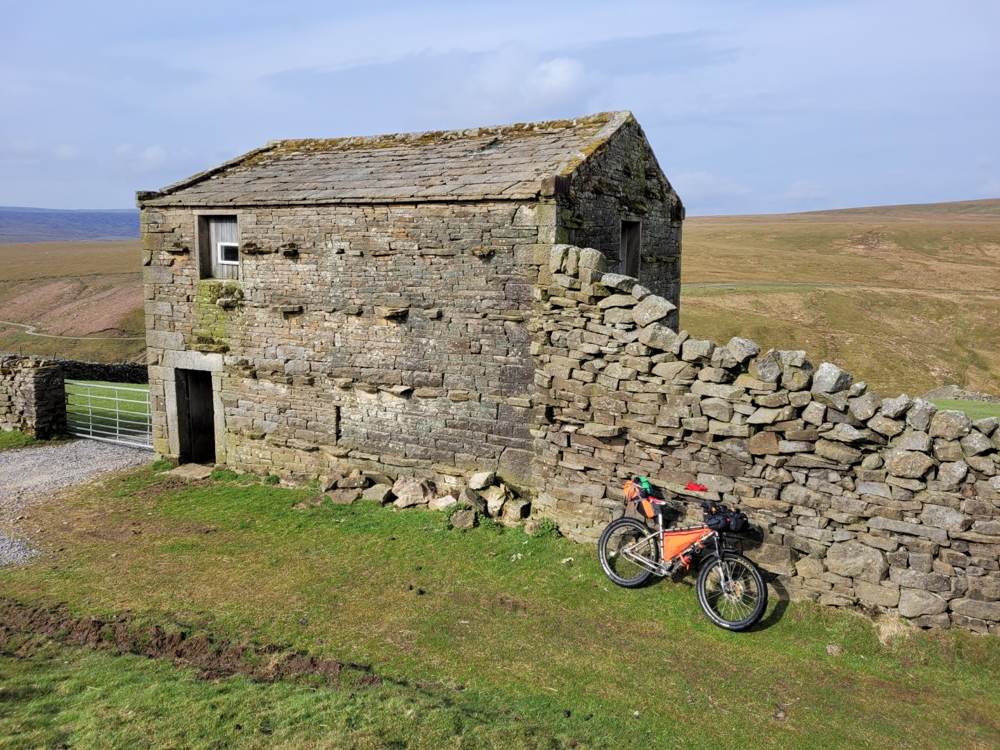
  <figcaption><i>Why does that wall need to be so big?</i></figcaption>
</figure>

 <figure style="text-align: center;">
  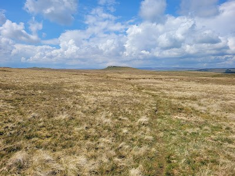
  <figcaption><i>Tough going near Goldsborough</i></figcaption>
</figure>

The Sleighthome Moor bridleway was a good track and I had my breakfast porridge here in the sun sat next to a stream, watching a pair of owls fly around. Hopefully the two estate workers with shotguns that I saw a bit later weren't trying to shoot them. My planned crossing of the River Greta near Bowes was a bit less successfull. The map said there was a weir but the depth of the water forced a diversion.

Between Bowes and Blackton Reservoir in Baldersdale was Ladyfold Rigg on Cotherstone Moor and this was a tough going over tufty grass, sometimes boggy ground. Lune Moor between Selset Reservoir and Holwick was similar and I seemed to be on these two sections for ages. The descent into Holwick was also a slow downhill push!

<figure style="text-align: center;">
  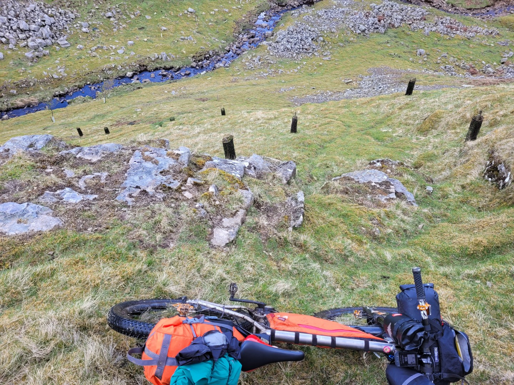
  <figcaption><i>Holwick Scars descent</i></figcaption>
</figure>

<figure style="text-align: center;">
  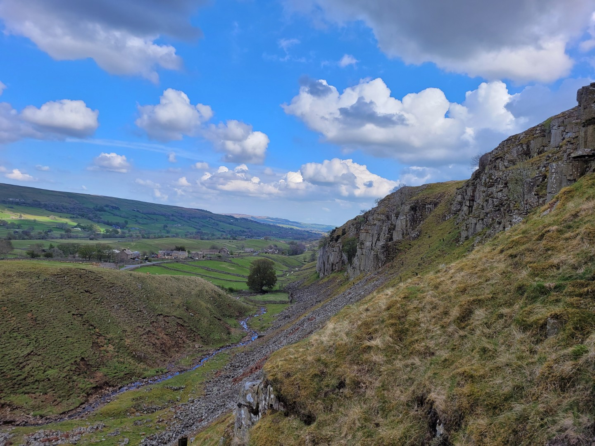
  <figcaption><i>Holwick Scars</i></figcaption>
</figure>

Between Holwick Lodge and the B6277 there's a C road which turns into a very good estate track which is marked as a footpath, it's on either the Raby or Strathmore (?) estate. I knew it was a footpath but often when you get there they tolerate cycling. Not here though, even though it was a perfectly good, wide track used by vehicles. I pushed it for this one and a bit km section, just to avoid trouble. I had a nice chat with a farmer halfway along who'd had a walker angrily tell her it was a bridleway according to her map. It definitely wasn't. Estates like this could easily improve their image by making tracks like this a permissive bridleway but I often get the impression they resent anyone being on their land. I originally had wanted to ride the bridleway from Holwick Scars to Maize Beck near Cow Green Reservoir but had been told that it started out well but eventually disappeared. It might be worth a look on an unloaded bike.

There's another estate track here, from the end of the road at Cow Green Reservoir north west and then north to the B6277, which is in perfectly good condition, regularly used by the estate gamekeepers and could easily take bikes. But it's only a footpath and the gamekeepers' boss doesn't like bikes on here. 

Today had been a slow day so I stopped about 17km early from where I thought I might get to. It was another cheeky campsite which the estate wouldn't have liked. But once again if I told them where it was they would never be able to tell, especially as I took away some one else's rubbish that I found. The Raby estate at Cow Green Reservoir looks beautiful at first inspection. It's not really though; there's hardly anyone wildlife due to sheep farming which stops trees growing, and thereby attracking other wildlife, and the estate then trying to kill everything else which interferes with their grouse. There are traps and poison everywhere. It's a pretty shit awful place really.

<figure style="text-align: center;">
  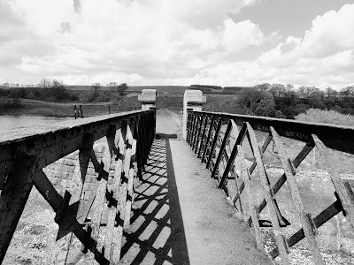
  <figcaption><i>Hury Reservoir</i></figcaption>
</figure>

<figure style="text-align: center;">
  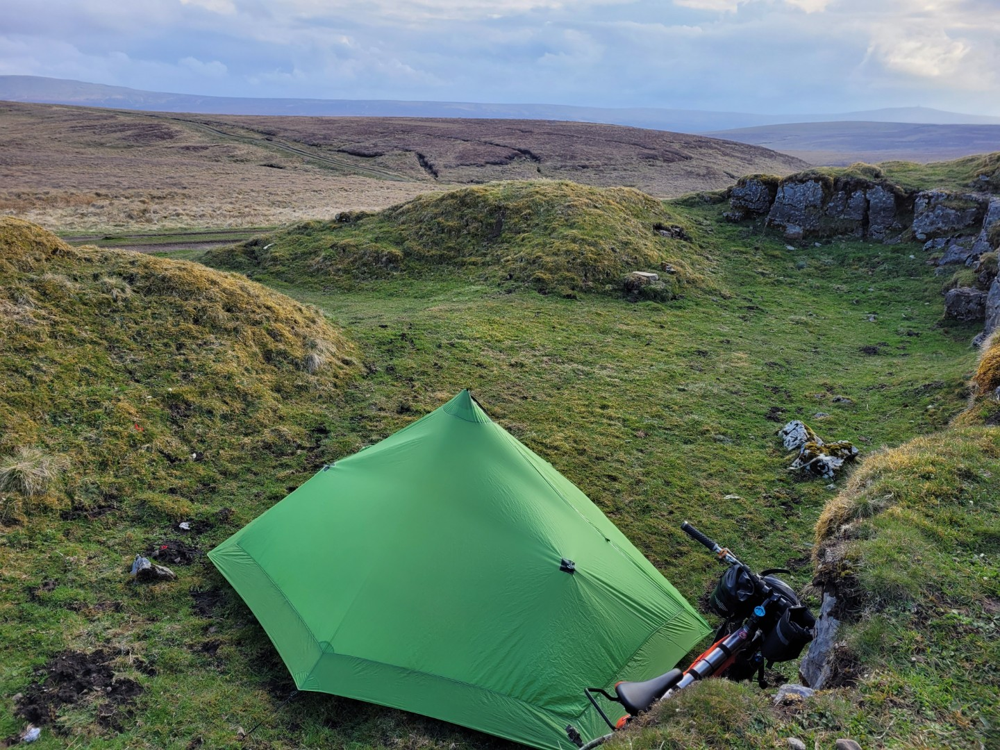
  <figcaption><i>Somewhere near Cow Green Reservoir</i></figcaption>
</figure>

## Day 3 North of Cow Green Reservoir to High Cup Nick
**7hrs 12 mins, 72km, 1.5vkm**

An odd day route wise. I didn't camp where I planned to camp, or even on my route, and the two campsites were only separated by about 11kms.

A chilly night, a cold and foggy start and an early get away to avoid any over officious jobsworths. I had on all my clothes because I was starting at 594 metres and dropping down to 343 metres at Garrigill along a road. I rode all the way down alternating putting a hand behind my back to give it a chance to warm up.

<figure style="text-align: center;">
  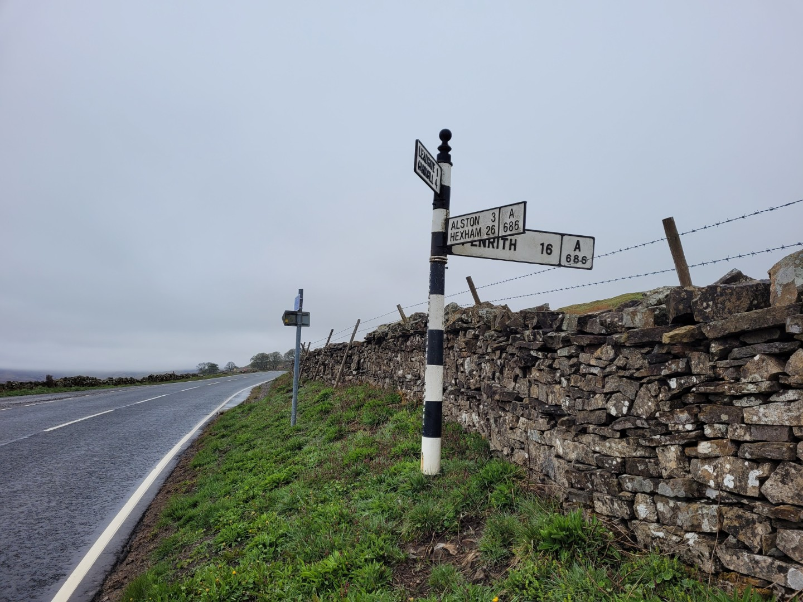
  <figcaption><i>I don't believe that sign</i></figcaption>
</figure>

From Garrigill I followed a C road and then an A road to Meathaw Hill where I turned off onto the Maiden Way. This was one of the bridleways that I hadn't ridden. It started with a descent and then climb on a very good estate track but just over halfway up it turned into a soft, grassy, boggy track.I was wondering if I'd made the right choice but higher up it was easier to follow and once over the top it was superb. Not a particularly great track but awesome views and just enough of a descent to make the grassy riding enjoyable. At Meg's Cairn it gets steeper, down grassy tracks, old mine working tracks and little valleys. It is really good and well worth revisiting with an unloaded bike. One of the highlights of the trip.

<figure style="text-align: center;">
  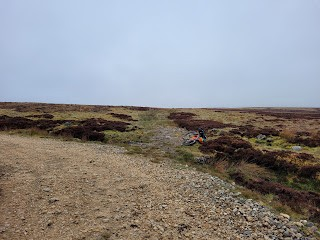
  <figcaption><i>Where the Maiden Way changes from easy to hard.</i></figcaption>
</figure>

<figure style="text-align: center;">
  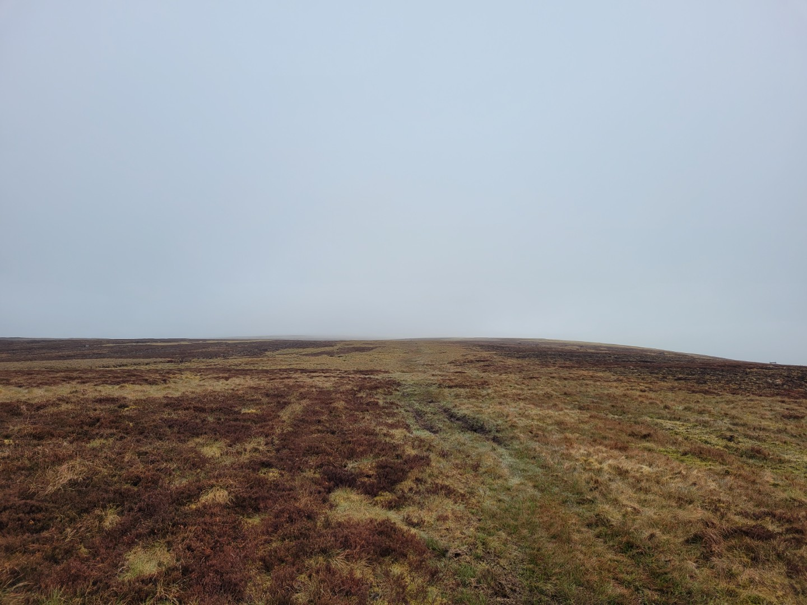
  <figcaption><i>Tough going</i></figcaption>
</figure>

<figure style="text-align: center;">
  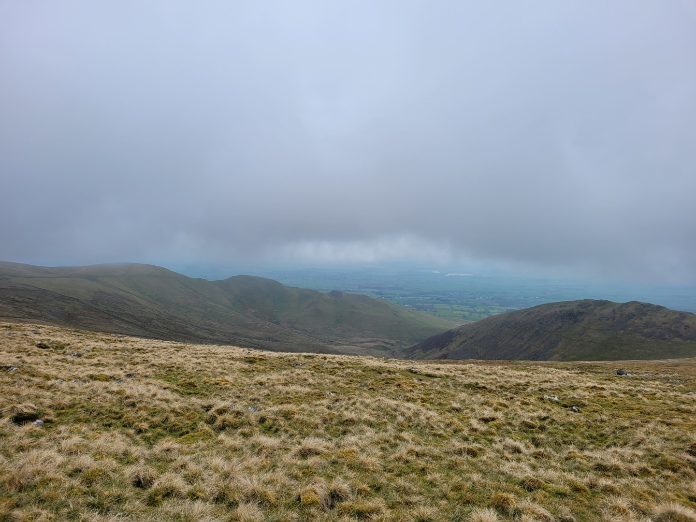
  <figcaption><i>This picture won't entice you to the Maiden Way but it is very good.</i></figcaption>
</figure>

From Kirkland at the bottom of the Maiden Way I rode south round to Knock and up the road towards Great Dun Fell. My original plan was to ride back over to Garrigill in the east, then cross back over again via Cross Fell and onto the start of High Street in the Lakes. I was a bit behind schedule though so after riding (pushing) up towards Great Dun Fell I turned off towards Silverband Mine to find the bridleway descent back to Milburn near Knock, in the hope that I could get to the start of High Street today. I'd decided that I really wanted to ride up High Street but wouldn't make it today if I crossed back via Cross Fell. Hence the search for the what proved to be elusive BW descent back to Milburn. It didn't exist and I really couldn't face riding back down a road that I'd put so much effort getting up so I changed my mind again and decided to stick to my original plan and cross back over to Garrigill. 

Except I messed it up. After doing all the difficult offroad bit, with the pushing and regular stream crossings (the Knock to Garrigil crossing really isn't worth it), I saw what I though was a cheeky shortcut on my gps unit which would cut off about 17km. My god I was pleased! I rode for a kilometre on a track and then pushed for a kilometre. Superb, a shortcut that worked! Except it brough me out onto the wrong track, it was the Cow Green Reservoir to the B6277 track which I'd ridden yesterday. In my haste to make progress I'd failed to look at my intended route. Doh! Luckily I wasn't far from High Cup Nick and that has one of the best wild camp views anywhere.

<figure style="text-align: center;">
  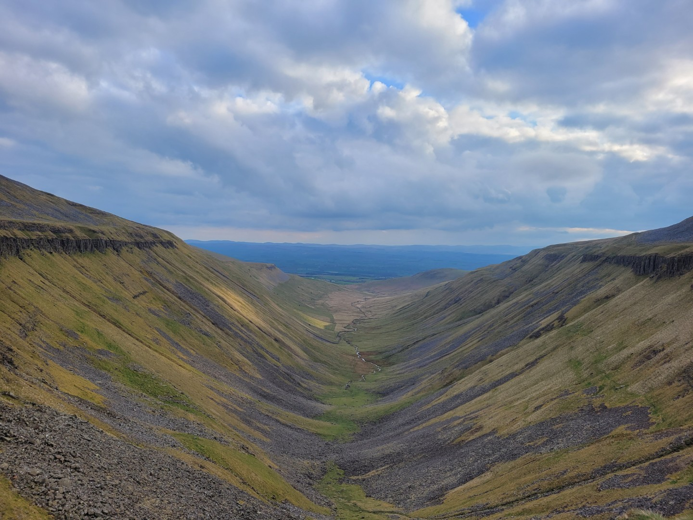
  <figcaption><i>High Cup Nick</i></figcaption>
</figure>

<figure style="text-align: center;">
  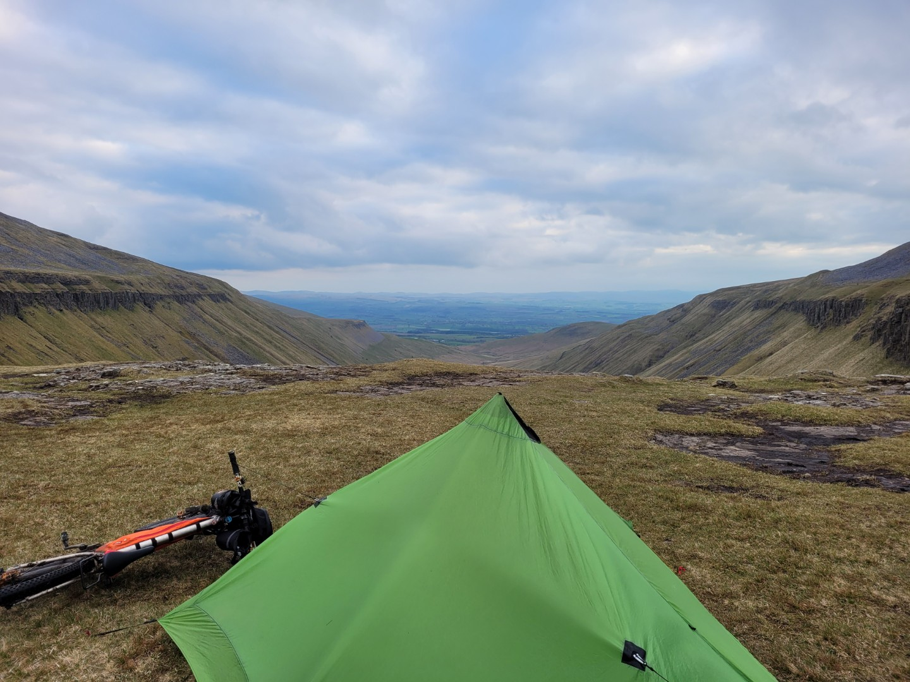
  <figcaption><i>The best wild camp views of the trip</i></figcaption>
</figure>

## Day 4 High Cup Nick to the Mary Ann Clifford Highway
**7hrs 18 mins, 89 km, 1.3vkm**

A windy night, which kept any condensation away, and a popular spot, there were two other tents in the area. By the morning I'd decided to abandon High Street as I didn't really want to miss the Garrigill to Kirkland via Cross Fell crossing. It meant partially reversing my route but it was worth it. The track out of Garrigill is steep at first but ridable on a good estate track. Towards the top where it mostly levels out the estate track veers off to the south, and looks to eventually disappear according to satellite images, but the track I wanted to follow turns into a rougher and older miners track, past Greg's Hut and over the shoulder of Cross Fell. The descent from here is fantastic and another one to come back for. It's grassy the whole way and starts off slightly boggy in places but as it gets steeper it gets a lot faster and has some massive berms to rail round. I was surprised that my luggage stayed on.

From the bottom I had a leisurely amble to Appleby for a late lunch stop and then on to the Mary Ann Clifford Highway just past Kirkby Stephen, via Pendragon Castle, to a sheltered little campsite just off the track.

<figure style="text-align: center;">
  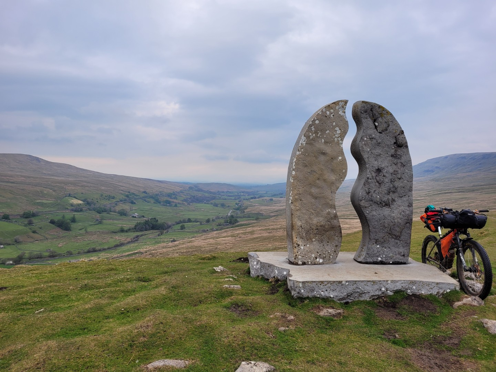
  <figcaption><i>I've been here before and I still don't know what it is.</i></figcaption>
</figure>

<figure style="text-align: center;">
  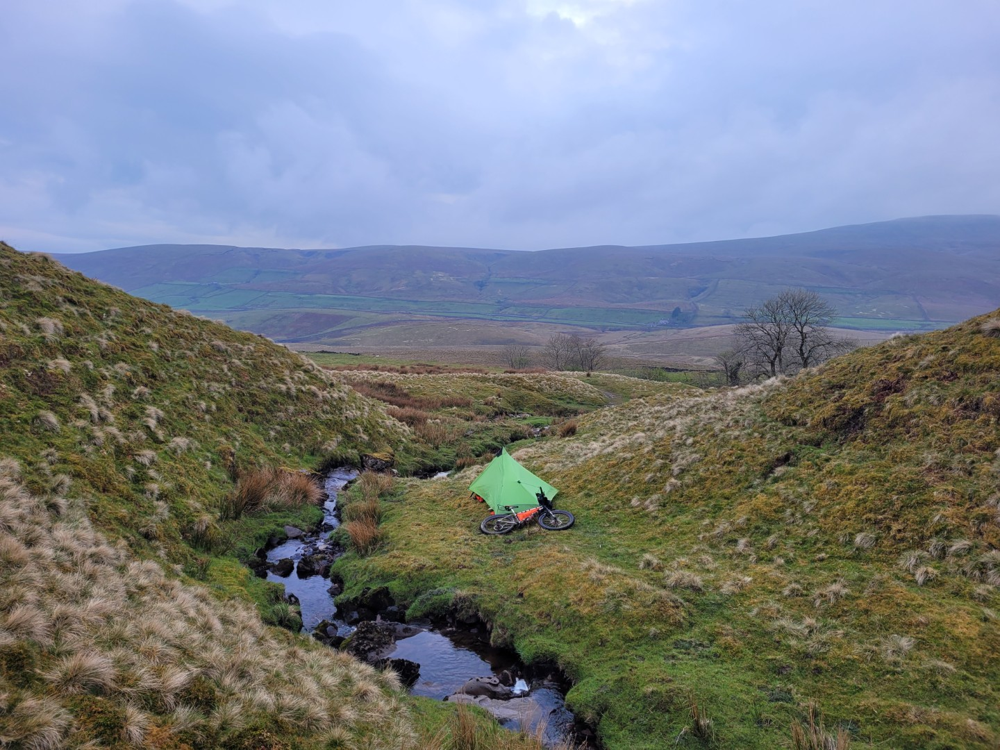
  <figcaption><i>Mary Anne Cliffird Highway campsite</i></figcaption>
</figure>
 

## Day 5 MAC Highway to Malhamdale
**4hrs 40 minutes, 60km, 0.84vkm**

My first truly warm night. 

The Dales is great for tracks that get up high and stay there. The MAC Highway and the Cam High Road both do that. The climb out of Burtersett is reasonably steep but rideable on a reasonably good track. Having partly cancelled my H550 trip due to feeling ill / over trained I'd felt remarkedly good on this trip. That was until the last hill out of Settle, which is steep but which I ride all the time. It seemed to kill my legs, I felt like I'd done a set of hard squats.

<figure style="text-align: center;">
  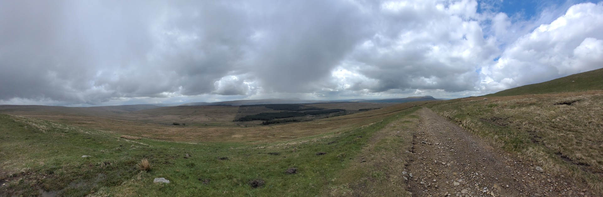
  <figcaption><i>Ingleborough from the Cam High Road</i></figcaption>
</figure>

I've missed off High Street from the end of a few rides now, the next one will definitely have to include it.