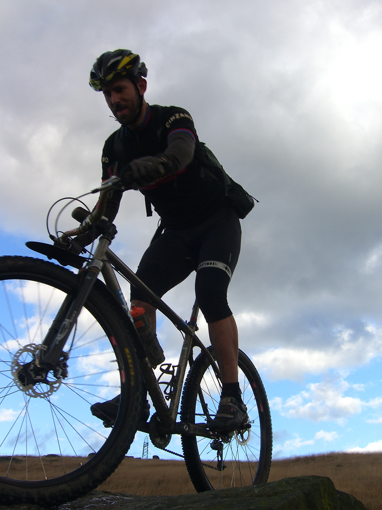
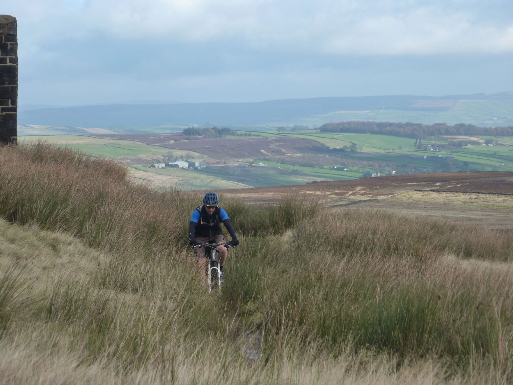
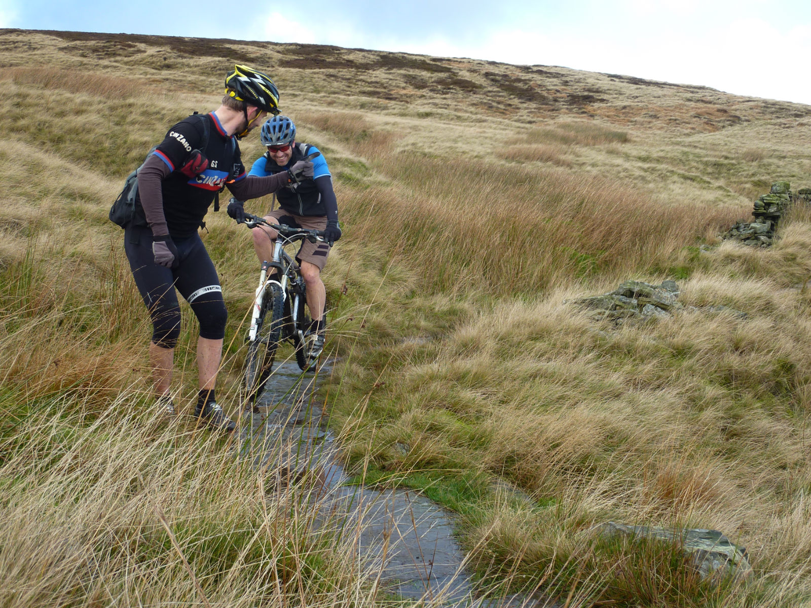
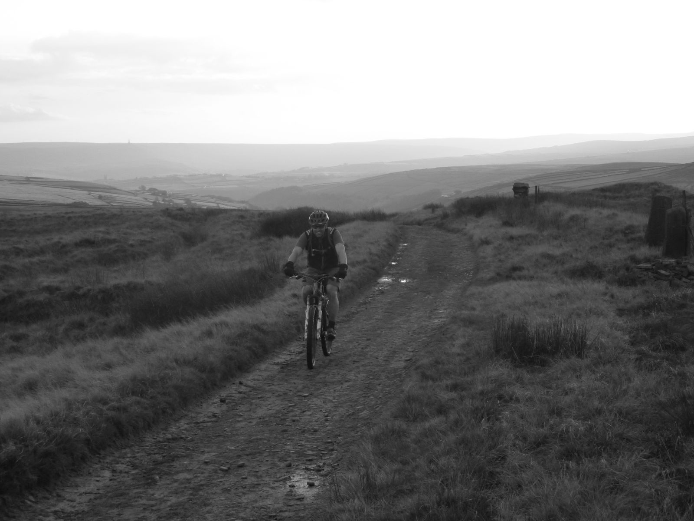
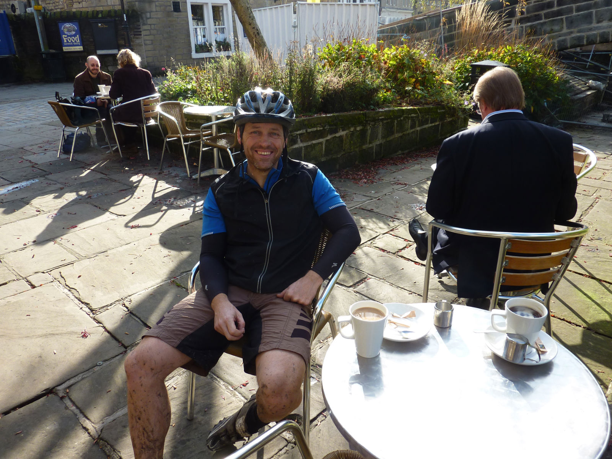
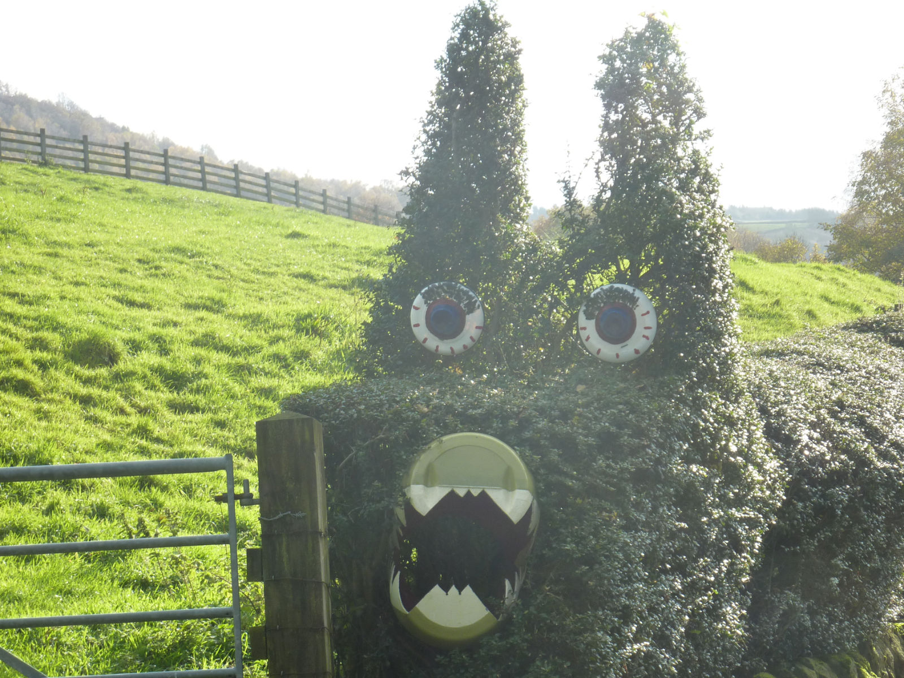
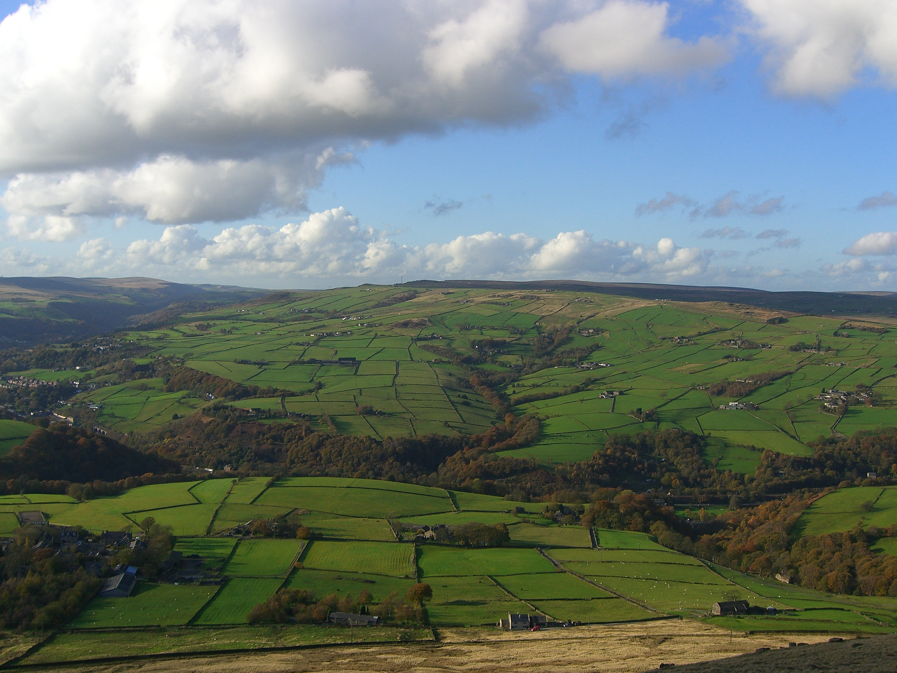
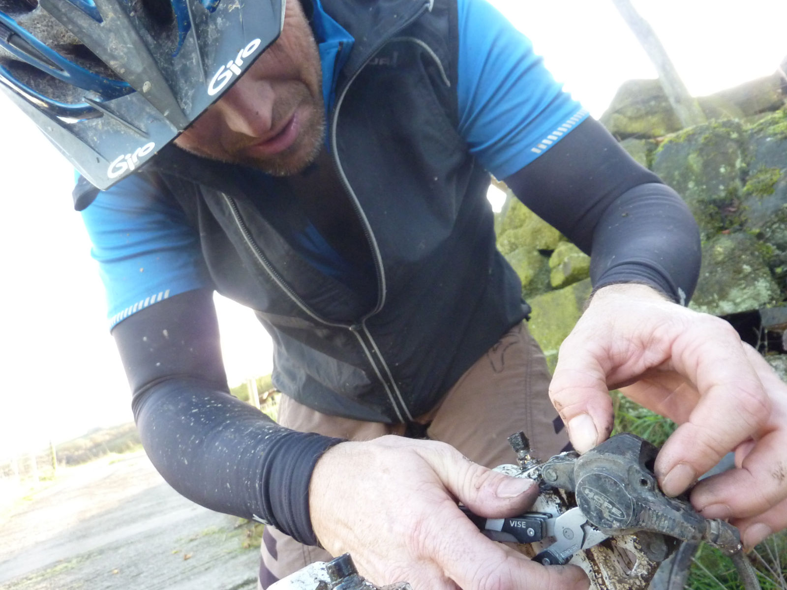
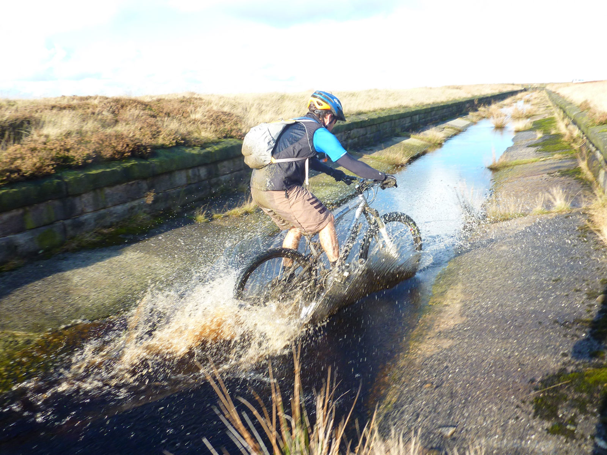
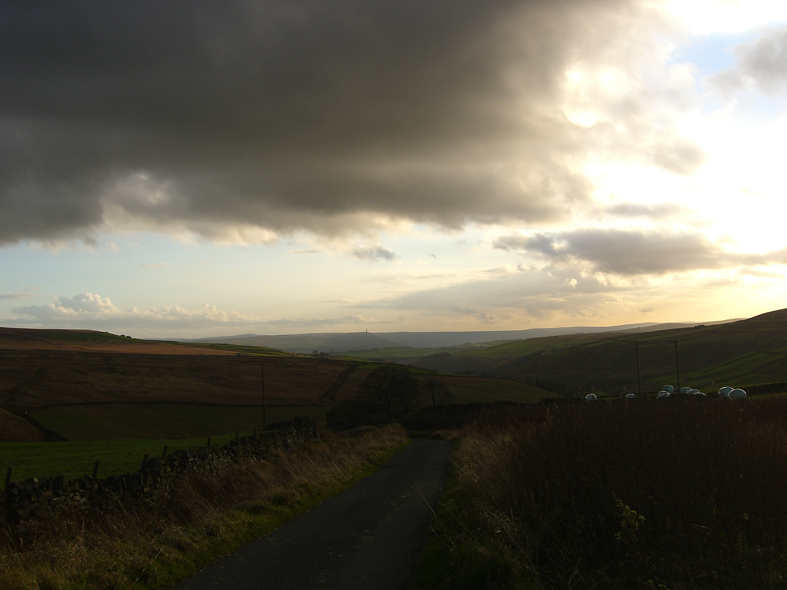

# A ride with Rider
## Or "How to be sandbagged"
### Or "How to ride too far and over too many hills"

<figure style="text-align: center;">
  
  <figcaption><i>The sandbagger himself, Stuart Rider</i></figcaption>
</figure>

[Stuart Rider](http://yorkshirebiking.com/) likes mountain biking. It's just about all he does and when he doesn't do that he works as a bike mechanic, provides cycling tuition, skills coaching and guided rides in the Dales. 

To be fair he does have other interests, chiefly cleaning his bikes. He's got a fair few and they are always spotless. When I came to pick him up on Tuesday morning at 9.15am there were soap suds outside his house from a last minute frantic cleaning session.

The bike he rode for this trip was a 29er hardtail with a rigid front fork that was completely unsuitable for technical downhills and a single chainring gear setup unsuitable for uphills. We would be doing a route around Hebden, known for it's hills and technical trails. Normally this would give me the opportunity to resoundly beat Stuart up and downhill, unfortunately for my ego that didn't happen. I did smile though when I saw his head bouncing around as he trundled down from Stoodley Pike.

We had arranged the ride on Monday night. Stuart had already planned it and told me it was 28 miles. Fine I said, I can manage that at my current fitness level. On Tuesday morning came the admission that he had added a bit on "to make it worthwhile". 

Now it was 38 miles. 

Now I was worried.

<figure style="text-align: center;">
  
  <figcaption><i>Bronte country</i></figcaption>
</figure>

Then he excitedly mentioned that it went up Cragg Vale, according to [Wikipedia](http://en.wikipedia.org/wiki/Cragg_Vale) "claimed to be at the start of the longest continuous gradient in England - 968 feet over 5.5 miles". Stuart was very excited by this. Woo hoo.

The ride turned out to be superb, one of the most enjoyable I've done this year. The weather was good, which always helps. I'm not exactly sure where we went because I refused to look at a map. If Stuart was going to make me ride 38 miles over loads of hills then he could bloody well work for it!

<figure style="text-align: center;">
  
  <figcaption><i>Berated_by_an_angry_walker</i></figcaption>
</figure>
We started in Haworth and rode through Bronte country over flag stones from old mills. Strictly speaking this was a bit cheaky, nudge nudge, wink wink, but the track we started on was hardpack and used by Landrovers and the flag stones could have taken a tank, admittedly a very narrow one. Plus I didn't know where I was as I hadn't looked at a map so it must have been OK.

Luckily the only militant walker we met was the one in the picture, who berated me and firmly wagged his finger.
<figure style="text-align: center;">
  
  <figcaption><i>Not knackered yet</i></figcaption>
</figure>

<figure style="text-align: center;">
  
  <figcaption><i>where's my food?</i></figcaption>
</figure>

By the time we got to Hebden Bridge I was hungry and it was past lunch time. Stuart didn't want to stop and eat, I think he thinks it's for weaklings. Luckily for me he needed to fix his saddle. For some reason he had decided to move it by smashing his testicles against it whilst riding on another sneaky technical trail as we came into Hebden. I had a lovely bacon and egg panini, proving that Hebden is now quite posh. I was enjoying the snack and general ambiance of Hebden immensely but it was slightly spoilt by a couple sat nearby who had two dogs. Both dogs were wearing coats and they had a blanket for them which they put on the floor so their sensitive little bellys didn't come into contact with the cold floor. NO NO NO! THIS IS WRONG. 

Rant over.

<figure style="text-align: center;">
  
  <figcaption><i>Strange Hedge</i></figcaption>
</figure>

From Hebden Bridge we set off for Stuarts highlight of the trip, an ascent of Cragg Vale. Stuart had to take a photo of the sign at the bottom and I insisted on a photo of a hedge disguised as a caterpillar. 

Luckily for me Cragg Vale proved to a fairly easy climb, never too steep. At the top we headed towards Lancashire and to my surprise there was a nice view of the enemy. I wish Stuart had mentioned before the ride that we would enter the enemy's county as I could have brought my passport and a stab proof vest. Because Stuart is an offcumden he doesn't always understand these things.

We were now heading to [Stoodley Pike](http://en.wikipedia.org/wiki/Stoodley_Pike) above Todmorden. What should have been a fast hardpack track along a dam wall turned out to be a muddy pile of poo; contractors were improving the bog fest that followed and their machines were making a mess. It'll be nice when it's finished. Luckily the section after this was the highlight of the trip, lots of technical riding along a path festooned with puddles and lumps of gritstone. Unfortunately Stuart chose to argue with the wrong puddle and gritstone combination and went over the front of his bike and bashed his knee. As with his testicle bashing incident, I very politely didn't mention pilot error. I don't know why because normally I would.

<figure style="text-align: center;">
  
  <figcaption><i>View from Stoodley Pike</i></figcaption>
</figure>

A quick stop at Stoodley Pike for photos and a snack and more saddle fettling from Stuart (it was a severe bashing he gave it) and we set off down the hill that proved that rigid forks on a mountain bike are just plain silly. I'm sure Stuart must have suffered from some severe brain trauma from all the bouncing around his head was doing.

<figure style="text-align: center;">
  
  <figcaption><i></i></figcaption>
</figure>

<figure style="text-align: center;">
  
  <figcaption><i></i></figcaption>
</figure>

I was starting to get tired but luckily the spring in my front disc brake decided to die to so I got the opportunity to have a rest as I fixed it. By about 45km my legs kept letting me know how tired they were. Consequently I let Stuart know, continually, and he regaled me with some Riderisms. His proudest was "**a ride with Rider is like a blank canvas, allow the ride to paint the picture. **" The last hill was a bit too much for me and what should have been a middle chainring effort turned into a granny gear struggle. The view back to Stoodley Pike was worth it though, as at least it made me feel I'd ridden a long way.

<figure style="text-align: center;">
  
  <figcaption><i>I just ridden from Stoodley Pike, the phallic dot on the horizon.</i></figcaption>
</figure>

We finally made it back to the van, I was knackered, Stuart rode off to meet his girlfriend. A good ride and great company.

1st November - 63kms, 5hrs 19mins, one bacon & egg panini and a packet of chocolate digestives.