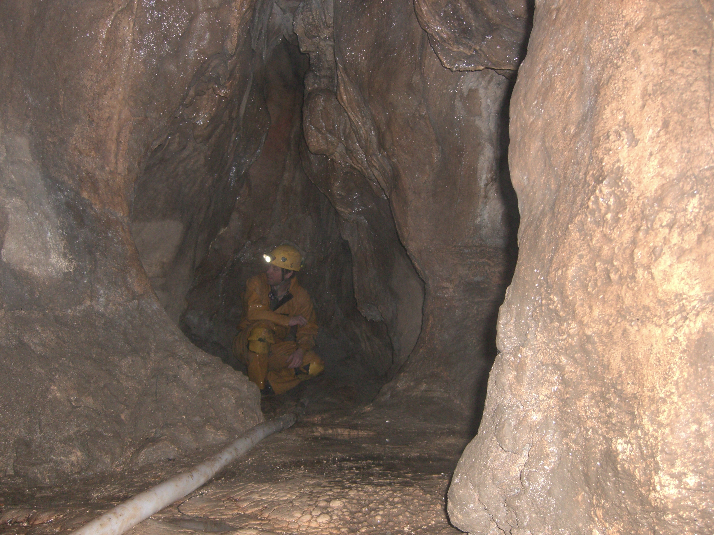
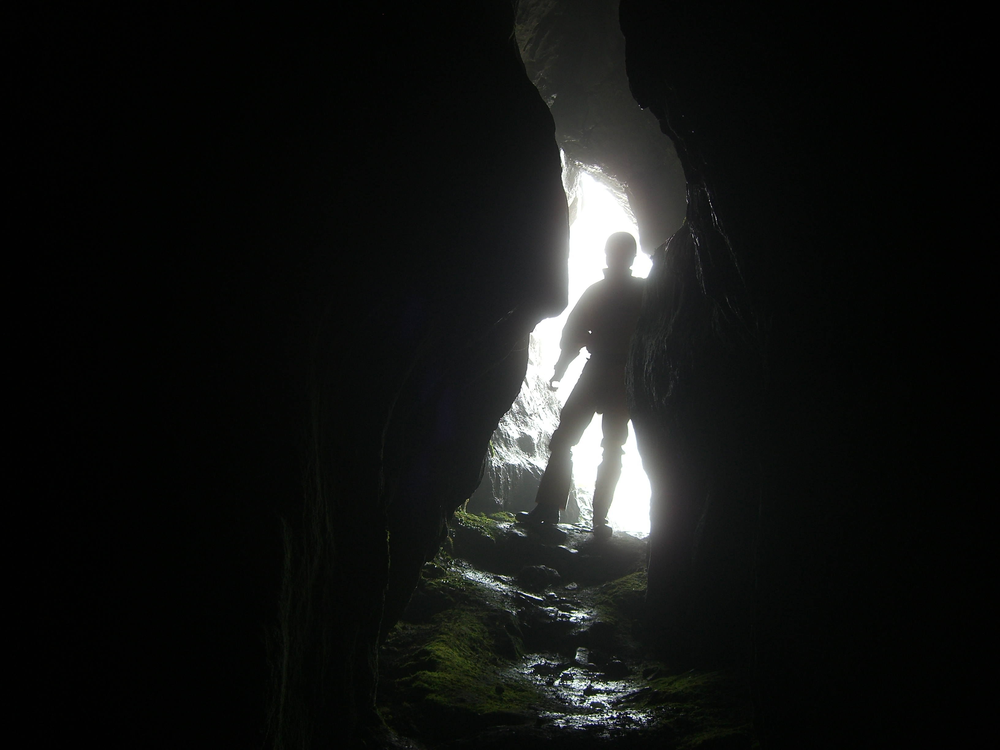
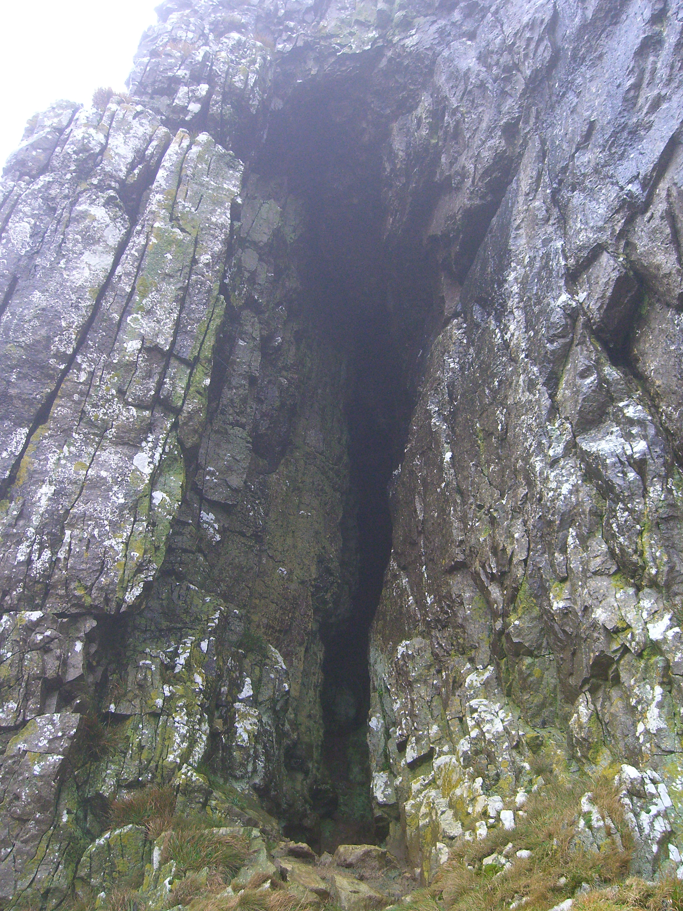
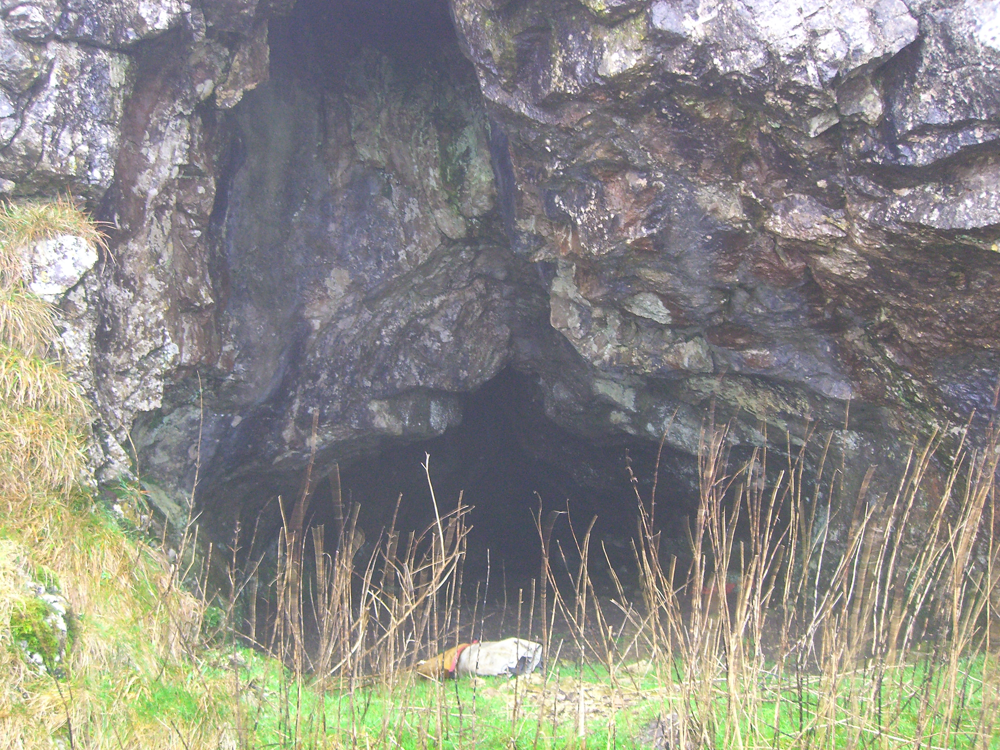

# A Subterranean Tour of Attermire
**Saturday 31 December 2011**

The plan was to wander round [Attermire](http://cavemaps.org/surveys/yss/full/YSS%201%20Attermire%20Area.png) and pop into some of the more interesting caves. There's quite a lot in the area, mostly very short and hardly any vertical development. The guidebook describes it as a fault scarp area and most of the caves are near the top of the scarp. It's worth a visit on a wet day or as an evening trip.

## Attermire Cave
**Grade 2    Length 183m**

[Survey](http://cavemaps.org/cavePages/Attermire__Attermire%20Cave.htm)

Caving wise this is probably the most interesting in the area. The entrance is halfway up the scar and you wander along a grassy ledge to get there. Inside the passage is surprisingly high. The passage soon lowers to a crawl through what looks like a blasted passage past a shothole. There's water in it but it's not deep, deep enough to get wet though. The passage quickly rises in height again at Pool Chamber. It's easy going now, eventually reaching a sudden end at a rock wall. On the left is a drop down and the start of an entertaining, acrobatic crawl. It's basically a small rift passage that has lots of calcite in it, which has created a great obstacle course. At the end there's a low bouldery choked cavern with some abandoned digs. I could hear a wind like noise here and after looking for a draught decided that this point must be near the surface and I could hear the wind outside.

Throughout the whole cave there's some pristine calcite and lots of graffiti, the earliest I saw was dated 1894. 

<figure style="text-align: center;">
  
  <figcaption><i>Attermire</i></figcaption>
</figure>

<figure style="text-align: center;">
  
  <figcaption><i>Attermire exit</i></figcaption>
</figure>

## Horeshoe Cave
**Grade 1    Length 18m**

[Survey](http://cavemaps.org/surveys/yss/full/YSS%201%20Horseshoe%20Cave.png) and [here](http://cavemaps.org/surveys/Independent/full/Ind%20Thorp%20(2007)%20Horseshoe%20Cave%20-%20Attermire.png)

A short, high, slippy rift passage. There's a vocal connection to Attermire Cave.

<figure style="text-align: center;">
  
  <figcaption><i>Horseshoe Cave</i></figcaption>
</figure>

## Rabbit Cave
**Grade 1    Length 11m**

A very short cave but the obscure narrow entrance made it a joy to find. Inside there's a climb up the passage to a down sloping muddy tube.

[Survey](http://cavemaps.org/surveys/yss/full/YSS%201%20Rabbit%20Cave%20-%20Attermire.png) and [here](http://cavemaps.org/surveys/Independent/full/Ind%20Thorp%20(2006)%20Rabbit%20Cave%20-%20Attermire.png)

**Lookout Cave**

Grade 1    Length 24m

[Survey](http://cavemaps.org/surveys/yss/full/YSS%201%20Lookout%20Cave%20-%20Attermire.png) and [here](http://cavemaps.org/surveys/Independent/full/Ind%20Thorp%20Lookout%20Cave%20-%20Attermire.png)

This is above Rabbit Cave and accessed by walking round to the top and along a large grassy ledge. It's an impressive large entrance but soon funnels down to the end. 

<figure style="text-align: center;">
  
  <figcaption><i>Lookout Cave</i></figcaption>
</figure>

## Blackpot Cave
**Grade 2    Length 15m  Depth 8m**

Should be called Litter Cave. The guidebook mentions an excavated 6 metre pitch at the end, this now looks filled in.

## Victoria Cave
**Grade 2    Length 183m**

[Surveys](http://cavemaps.org/cavePages/Attermire__Victoria%20Cave.htm)

An impressively large entrance, 9m high by 12m wide, with an equally impressive scree slope that the Victorians created when they excavated the cave. They found lots of material from the Upper Paleolithic to Romano-Britsh material. Although it has a big entrance, it doesn't really go very far. There are various little loops to do and Pool Passage has some nice formations.

**Wet Cave**

Grade 1    Length 27m 

[Survey](http://cavemaps.org/surveys/Independent/full/Ind%20Thorp%20Wet%20Cave%20-%20Attermire.png)

If you visit Attermire just for this cave then you're an idiot. 

## Albert Cave
**Grade 1    Length 40m**

[Survey](http://cavemaps.org/surveys/Independent/full/Ind%20Thorp%20Albert%20Cave%20-%20Attermire.png)

There's a comedy gate across the front designed to stop anyone who tourists but not cavers. There's lots of mud with some impressive but dirty formations on the roof.