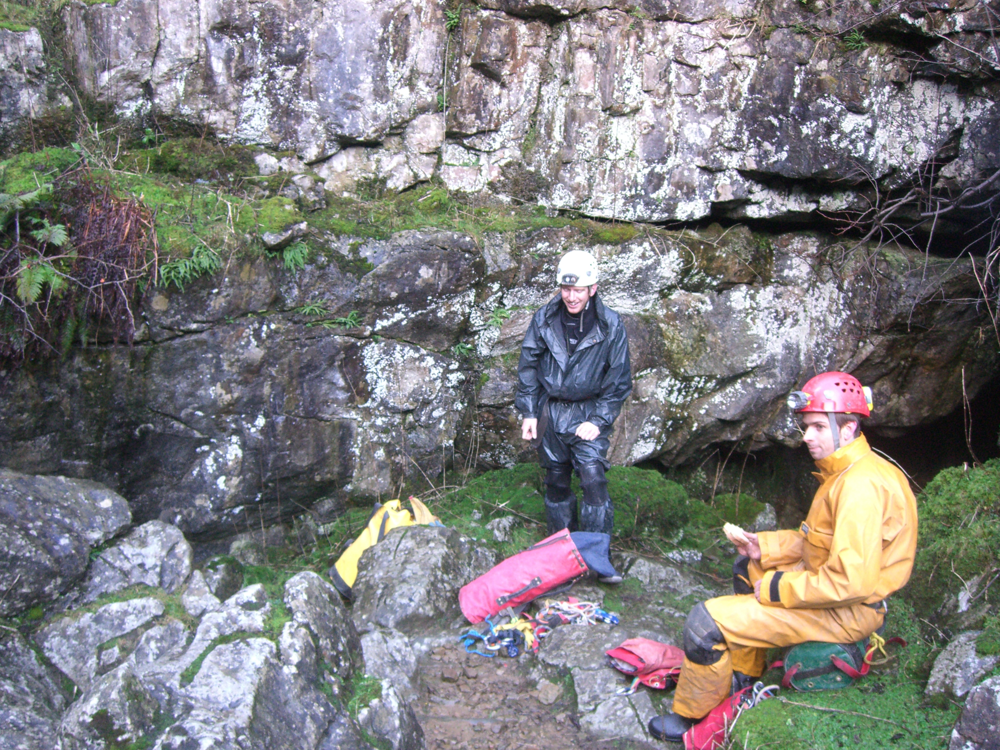
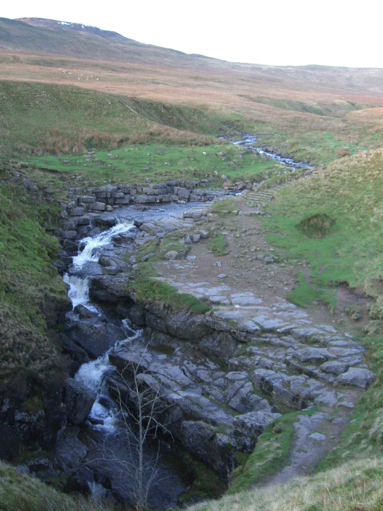

# Bar Pot to Gaping Ghyll main chamber
**Thursday 5th January 2012**
**Grade III    Depth 104m  Length 274**

Jonathan Tompkins, Henry Exxon, Olly Rees

3.5 hours

[Survey](http://cavemaps.org/cavePages/Gaping%20Gill__Bar%20Pot.htm)

<figure style="text-align: center;">
  
  <figcaption><i>Bar Pot entrance</i></figcaption>
</figure>

It's been wet in the Dales, it feels like it hasn't stopped raining for weeks. Our original plan was to do Jean Pot, a narrow rift pot that takes a small stream but is supposedly a wet weather cave. We decided it wasn't. The ground was saturated, there was a stream going down the entrance and none us knew the cave. I'd also read that the last two pitches can get very wet and although the forecast was good, there were some big black clouds around. We'd had our doubts when we were parked in Clapham at 9am with the rain pouring down. So displaying a remarkable amount of foresight (i.e. we knew we would bale out) we also packed enough rope for Bar Pot.

<figure style="text-align: center;">
  
  <figcaption><i>We didn't go that way</i></figcaption>
</figure>

I'd done Bar Pot a few times in the past but Henry and Olly had never been to Gaping Ghyll main chamber. Combined with the fact that it is an all weather option made it a no brainer. Having carried the ridiculously heavy yellow bag up the hill that Mark should always carry, I proceeded to nick all the rigging. The entrance is a low downward  slither over well worn boulders and you quickly arrive at the pitch head. The Y hang is the other side of an egg timer shaped slot. I tried to go over this which proved awkward and caused a lot of huffing, puffing and a bit of swearing. After Henry and Olly had had enough entertainment Henry pointed out that it looked easier to go through the lower part. It was. The pitch is narrow at the top but eventually opens out; it's a lot easier if you extend your abseil device. Henry helped again here. As I was faffing with a bit of spare rope I had in an effort to extend my abseil device, he suggested I just clip the krab on my short cowstail to my central maillon and then clip the abseil device to the rope loop. Simple. Why didn't I think of that? 

To make Henry feel clever, that's why.

At the bottom the way on is down a slippy slab. This is best done using the rope from the first pitch although there is an in situ piece of rope. You could get away with carrying less rope than the guidebook recommends if you rely on this bit of rope. Alternatively carry a 5 metre length of 8mm. A bit more scrambling down over loose boulders leads to a chamber with a rock bridge; on the other side is pitch 2. We rigged over the top of the bridge along a little traverse but after Olly had a look around we realised it was safe for experienced cavers to just crawl underneath, avoiding the hole, and walk over to the pitch head. Again, you could save yourself a bit of rope here.

From the bottom of pitch 2 you follow a rift off to the left to the head of the final pitch. This is actually a downwards traverse and could be free climbed. If you slipped though you'd fall 40 metres down SE Pot so it's better to rig it. After this it's a case of following the draught, when that dissapears, read the guidebook. After lots of annoying passage that is too high to require crawling but too low to easily stoop and you arrive at Gaping Ghyll main chamber. Everything was in flood today and the waterfall was very impressive, pity I don't own a really powerful light! We had a wander around and then set off back, arriving at the surface without incident. The top of pitch 1 was a bit awkward, mostly because there was already a rope on when I rigged and it got in the way a bit.

On the way down we met two ladies who suggested we go to the The Reading Room Cafe and Bar instead of the New Inn. What a great place it was, much better than the name suggests! Really nice friendly room where all the locals go. I got talking to Kevin and failed to noticed what Olly drank this time as I'd be ribbing him about [his last choice of drink](images/6555884395_08048c18ee.jpg). He did buy me a pint though so I can't complain.

Good, all weather trip. The top of pitch 1 could cause problems for some novices. 

Alternative rope lengths for the experienced. Don't quote me!

Pitch 1 - 22 metres, 3 or 4 bolts - miss out the first bolt and carry a 5 metre length of 8mm for the slab

Pitch 2 - 40 metres, 4 or 5 bolts - traverse under the rock bridge (don't fall down the hole) and miss out the first and / or second bolt at the pitch head.

Pitch 3 - 25 metres - just rig it, you don't want to slip here. You don't need any bolts though. You can tie a re-threaded bowline on the bight at the first two bolts and thread and tie off the end bolt.