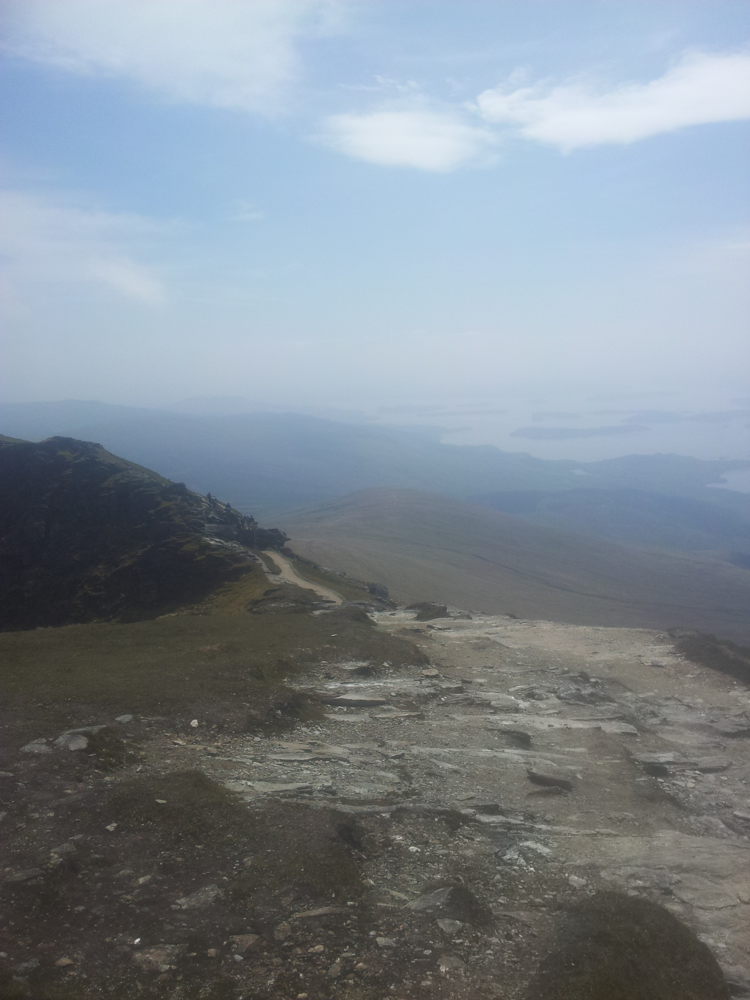

# Ben Lomond

Beautiful day, sunny and hot in May. The trail starts off through a small visitors centre and then climbs through native woodland.

Bit steep this to start with, I haven't warmed up yet. Don't want to push too hard, it's nearly a 1000m climb. Good, it's levelled out.

Good fun this, technical uphill but ridable.

Doh! Spoke too soon, can't ride up that boulder fest!

Pushing. First bit is steep and most of the rest is ridable, or so I read on the web.

Carrying now, pushing is too hard. Too many boulders to negotiate.

Riding now, hopefully that's the last of the steep bit. Through a few gates. Bloody hell, more unrideable bits.

Urgh.

Phew.

Drip, drip, drip. Time to unleash the torrent of sweat from my helmet.

Slurp, thirsty work.

Hard work this, it was my idea as well! Anderson is running up and has already overtaken me.

Oomph. Argh. Drip, drip, drip.

Walkers! Ha! I'm going to catch them up!

Just got to shift the bike on my back a bit, the top tube is compressing a vein on the back of my neck and making me feel light headed. Could it be heat exhaustion? Surely not in May in Scotland?

Drip, drip, drip. Plod, plod, plod. Slurp.

Good, a short ridable section gets me past some walkers. There's no way I'll let them catch up again!

Plod, plod, plod. Drip, drip, drip. Release the sweat Niagra again.

Umph. Plod, plod, plod.

At last, it's levelled out. Ridable, but still needs granny gear. Can't push too hard as it's a big hill and I've got to pace myself. Must remember to rest and disguise it as admiring the view.

Getting funny looks from walkers and the usual comments.

"Well done."

"Is that a good idea?"

"Rather you than me."

I can see a large group of walkers up ahead, I'd love to catch them up. Argh! More pushing.

Anderson! He's on his way down already!

Riding again, I might just catch then before the final steep bit. It's a group of Swedish ladies and they are all watching me ride up to them. Strange. They don't take up my offer of carrying my bike for me.

These rain bars are a pain. They'll be awkward on the way down.

Oomph! Bike on shoulder.

Plod, plod, plod. Drip, drip, drip. Slurp, slurp.

God this is steep, I won't be able to even ride down this. Wish there was a breeze.

Argh. Umph. Plod, plod, plod, plod, drip, plod, drip, drip, plod.

Admire view. Breathe!

Plod, plod, plod. Oomph, argh, breathe, plod, plod, plod. Drip, drip, drip.

It's levelling out! I'm close to the summit ridge. I'm riding again.

Made it!

Fantastic views. It's a bit hazy but I can see a long way. Loch Lomond looks beautiful.

Took 1hr 45mins to get up, only rode or pushed for 54mins. Actual distance is 6.5km, bike computer says 5km which means I carried it for 1.5km! Think I pushed it quite a bit as well.

The Swedish ladies have arrived. They're taking my photo! It's not everyday I get a hug and photo from middle aged Swedish women!

Time to ride back. Pump up tyres, I don't want a puncture on all those rocks. Don't know how I'll get down the first steep bit.

Umph, argh, arse over back wheel, umph, pull up front wheel, unweight back, umph.

Walker! Off the track and on the grass. Umph, god it's bumpy. Where's the track? Don't look at the hole, I'll just ride into it. Oomph, argh.

Found the track and it's levelled out. I've some how missed all of the first steep bit and ended up at the bottom of it. Result.

On the shoulder now, much easier riding then before. Unweighting the wheels for the rain gutters, rear 2.4 Ardent absorbing most of the shock.

Multiple line choices through the rocks, chicken run down the side on the grass. Argh, messed that bit up.

Steeper now.

Argh! Oops. Bloody hell!!!ARRGH! UUMPH!!! AARRRGHH!

In the woods at last, easy riding and soon in the car park. 

Best descent in the UK I've ever done.

<figure style="text-align: center;">
  
  <figcaption><i>Ben Lomond Summit</i></figcaption>
</figure>