# Bikepacking Swansea to Conwy

Having planned to do this trip in summer 2015 but failing due to not booking sufficient time in my diary and then booking bits and bobs in I was determined to do it in 2016. The number of adventures I was having was getting distressingly low so the whole thing took on a heightened importance. 

A friend asked what my plans were for summer and when I told them about this trip they sarcastically asked if I was having a midlife crisis. I wasn't - I'm not! but this was important to me. As I got older I was definitely slowing down, putting other things first whether it was Sue, the dogs, work or whatever. Since I stopped doing the OMM I didn't have a big target every year to train for, consequently I'd skip the odd run or ride here and there and before I knew it I wasn't maintaining my fitness. I needed something like this at least once a year to motivate me to do more stuff. As it turned out I wasn't really fit enough for what I wanted to do but I went anyway, you're usually capable of doing more than you think you can do.

My plan was to bivvy or stay in hostels where ever I ended up each day, avoiding as many towns and villages as possible and visiting all the high blank spaces on the map. I didn't really know how far I'd ride each day, partly because I wasn't sure how fit I was and partly because I didn't know what the terrain was like. That's not quite true, I knew I wasn't really fit enough for the distances I wanted to do but I was ignoring the truth and hoping I was as fit as I used to be. After lots of chopping and changing of the route and some online research I printed out my maps. It needed 17 A4 sheets at 1:50,000. Doubled up and laminated together it was massively smaller than taking OS maps. 

There were lots of bridleways in Wales that only existed on maps, I hoped I hadn't chosen any. I turned out to be wrong.

<figure style="text-align: center;">
  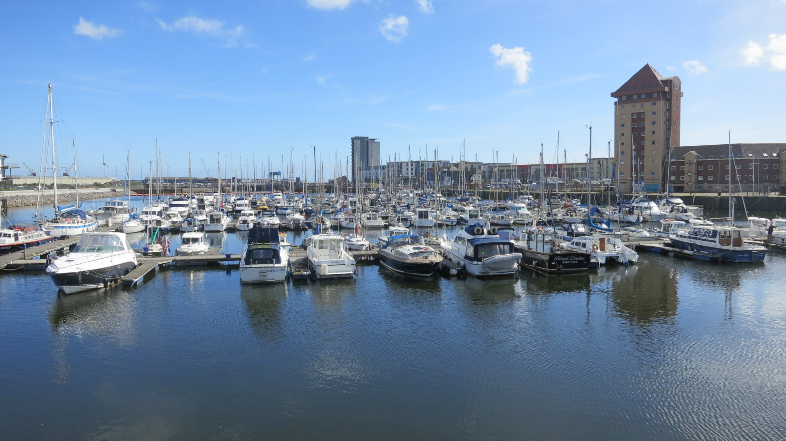
  <figcaption><i>Swansea marina</i></figcaption>
</figure>

## Day One, Wednesday 31st August 2016, Swansea to South Wales Caving Club, Pen-y-cae

**3.43 hrs riding, 4.20 hrs total, 43.21km, 11.5 average**

I was uncharacteristically nervous. I'd been busy the week prior so had packed late and was concerned that I'd taken too much and it was too heavy. I'd actually overloaded on food rather than kit as I wasn't expecting to come across any shops for at least the first two days. I couldn't find my lighter and took ages to find my bike computer. On the Tuesday night we'd gone to Sue's parents for a meal and on the way I remembered stuff I'd forgot to pack but by the time we got there I'd forgot what I'd remembered. It all came back in the middle of the night. On Wednesday Sue gave me a lift to Bingley where I had a last minute repack. I then cycled to the train station, the two minute journey making things worse as the rear saddle bag kept hitting the rear tyre, and that was on easy tarmac! Not a good start and my half plan to repack on the train to Swansea wasn't really practical. So rather than get a quick departure from Swansea train station I cycled to the marina and repacked. Less stuff in the saddle bag, compress the saddle bag straps before packing, more air pressure in the rear shock and ride carefully. It mostly worked.

<figure style="text-align: center;">
  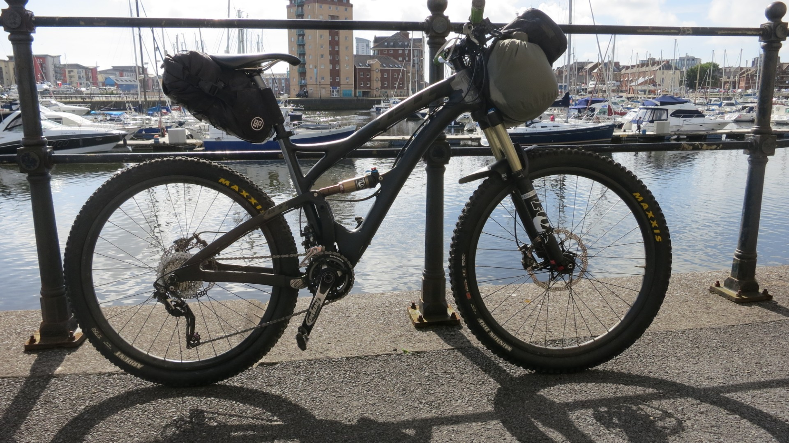
  <figcaption><i>My Yeti SB5c loaded up</i></figcaption>
</figure>

Getting out of Swansea was easier and more pleasant than expected, I followed a canal and when I lost track of it due to some construction works I nipped down the road. My first proper off road was on the Sarn Helen, an old Roman route that runs through Wales, sometimes easy to follow, sometimes not. This first section was easy to follow but the start was steep and rocky and because I wanted to conserve my energy I pushed up the first hill. Awesome start! It was mostly good riding terrain with some great views all round. Thoughts of staying dry for as long as possible soon disappeared with the mid calf deep "canals" on the top caused by enthusiastic 4wd's. It was a nice place to start my off road adventure though, despite temporarily losing the route in a forested section used by rally cars. I met no one except in the village at the end.

I hadn't been bike packing for a while and certainly not with this weight of kit. Bike handling was interesting, with the weight high up manoeuvring the bike over technical terrain was difficult and cornering seemed to produce a delayed reaction, it was almost like a  tandem. Hopping over anything significant was out of the question.

Having not left Swansea till 4ish it was getting dark by the time I got to Pen-y-cae and after resisting the temptations of a hostel I headed up to the SWCC hut where I hoped for an outside tap and a decent bivvy site. Even better, there was someone staying in the hut, maybe they'd let me sleep inside! No, was the answer. They struggled so much to engage me in conversation that I didn't even ask. Still, I got a good nights sleep bivvying under my tarp, setup using a picnic bench.

## Day 2, Thursday, SWCC to Dolgach wilderness YHA

**7hrs ride time, 9.23 hrs total, 85.09km, 12.1 average**

Today I had half hoped to get to a bothy at Moel Prysgau, about 100km away. Too far! Luckily my backup plan was to get to Dolgach YHA which turned out to be the highlight overnight stop of the week.

<figure style="text-align: center;">
  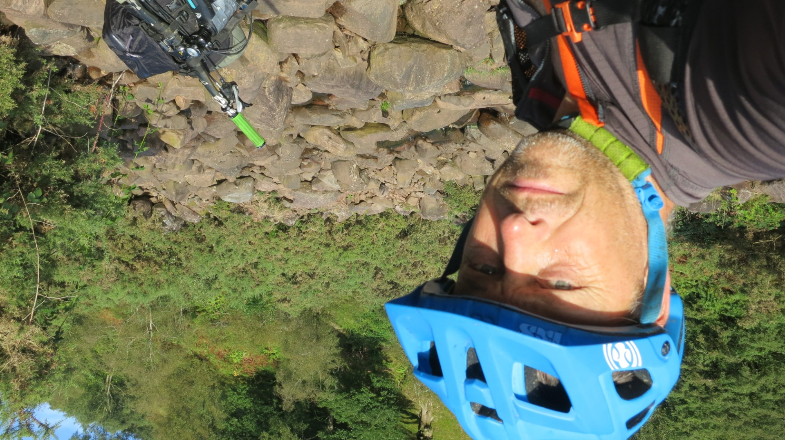
  <figcaption><i>The first Brecon Beacons barrier, this boulder strewn river crossing</i></figcaption>
</figure>

First things first though, get over the Brecon Beacons. 17km in 2 hours, it felt more like one whole day. Lots of pushing and occasionally losing the tiny almost non existent paths. An awesome place, high and bleak and remote, not a place to be in bad weather, the tracks would be extremely slow and navigation would be tricky. Luckily it was great weather.

<figure style="text-align: center;">
  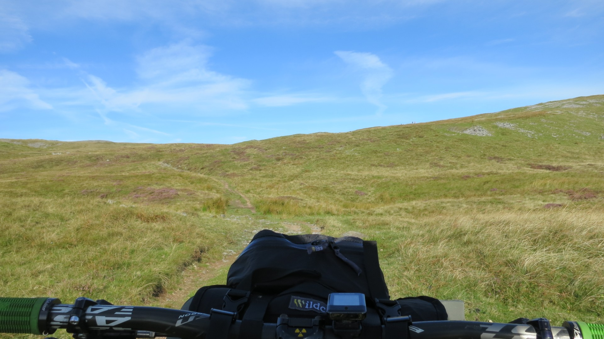
  <figcaption><i>The climb up the Brecon Beacons</i></figcaption>
</figure>

<figure style="text-align: center;">
  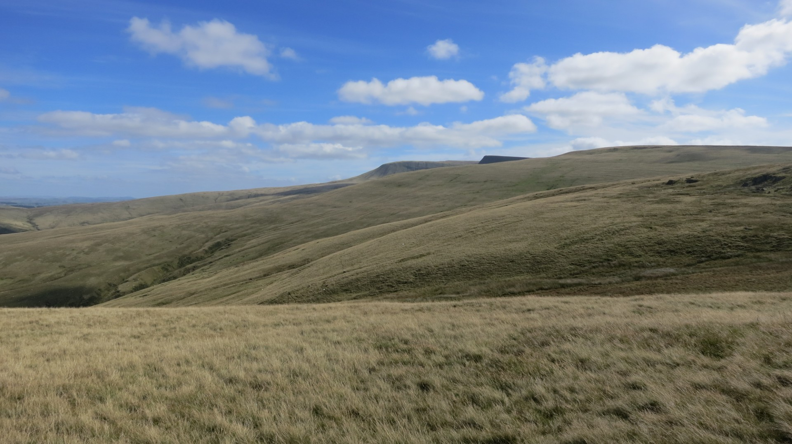
  <figcaption><i>The Brecon Beacons</i></figcaption>
</figure>

By the time I dropped into Llanddeusant I was tired and slightly concerned about getting to my overnight stop  before it got dark. In theory I could bivvy anywhere but in practice unless I was high up I'd get eaten alive by midges. I now took what turned out to be the first of quite a few detours, at least this one stayed on my map. To get to Usk reservoir I swapped an off road section that had a suspiciously straight section straight over a hill for a minor road section. A pootle down the A40 towards Llandovery and then a bridleway that would miss out Llandovery, keeping with my "miss out towns" ethos. It was pants. It was the most overgrown boggy bridleway ever, with blocked or tied up gates and not a single sign. It would have been quicker to go to Llandovery and watch a film than take this short cut.

The A483 took me past the now non existent pub in Cynghordy, another recurring theme. After climbing up the steepest road in the world near Llanerchindda I arrived at an activities / accommodation place. I got chatting to the owner who kindly pointed out that my next high and remote bridleway didn't exist, even the local rights of way officer couldn't find it. Poo, another diversion required past another pub which didn't exist. I refilled with water ( I'd drunk three litres already as it was quite hot) and set off to Llyn Brianne on the road. It was late and I was tired when I got there, another recurring theme, there was no way I'd get to Moel Prysgau tonight so I'd have to stop at Dolgach instead. I took another diversion here and followed the fireroad round the reservoir and then the minor road instead of the bridleway to Dolgach. This turned out to be a good decision as I later learnt that the bridleway was almost all bog. Unfortunately the fireroad missed out the Doethie valley which was one of the best bits of singletrack in the UK and one of the reasons I'd come this way in the first place. Idiot.

Dolgach YHA was brilliant. It was classed as a wilderness youth hostel because it wasn't linked to the mains electricity or water. It did have solar panels which powered the dimmest lights in the world, sort of heated up the shower (when it worked properly) and had a local spring water supply, which wasn't working properly. Basic but dry, warm and atmospheric. Brian was a volunteer warden, loved listening to the cricket on the radio and pointed out more bridleways that didn't exist. Originally I was going to head north east from the Moel Prysgau bothy to Claerwen Reservoir and over to Craig Goch Reservoir but this would entail too much pushing along non existent tracks. Instead I'd follow a cyle route / 4wd track that had seven river crossings on it, which sounded great except non of it was on my map. I wrote some directions down that I worked out from an old map on the wall and went to bed hoping for the best tomorrow.

## Day 3, Friday, Dolgach to Angler's Retreat above Machynlleth

**Ride time 6.24 hrs, total time 9 hrs, 81.59km, 12.7 av**

I had a great nights sleep, warm and comfortable, no light or noise pollution, a shower the previous evening and porridge and coffee in the morning. It was damp with low cloud outside, another reason not to try the high bridleway I'd originally chosen that Brian said didn't exist. It was a pity as my original route took me through some blank areas on the map.

From Dolgach I followed what started as an easy 4wd track north. The first river crossing was easy but the second was too rough to ride through. I fell off just after this on a techy rock step, luckily nothing was damaged. The third crossing was over my knees and the sixth one was like a small pond.

<figure style="text-align: center;">
  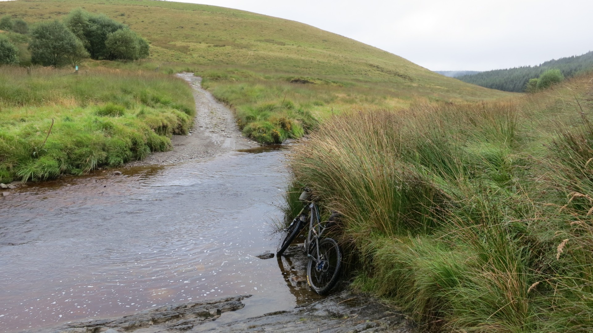
  <figcaption><i>Not deep but too rough to ride</i></figcaption>
</figure>

<figure style="text-align: center;">
  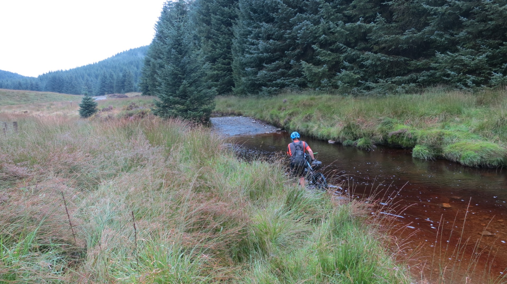
  <figcaption><i>Over my knees in the middle</i></figcaption>
</figure>

<figure style="text-align: center;">
  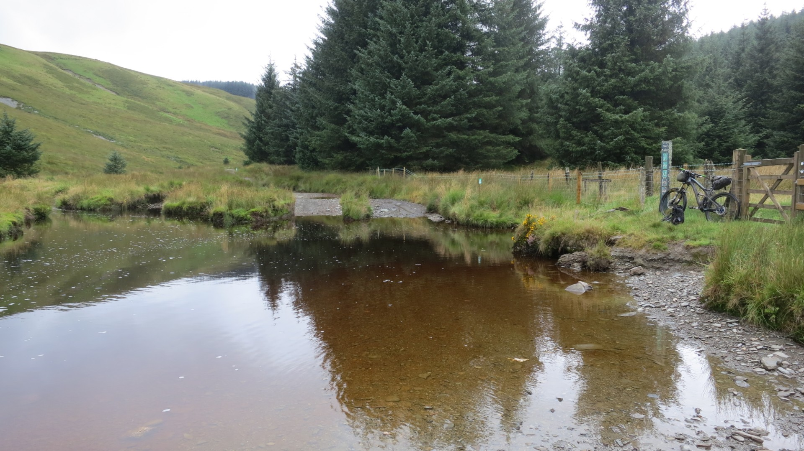
  <figcaption><i>Is it a river or a pond?</i></figcaption>
</figure>

The track to and from Moel Prysgau bothy wasn't really rideable which confirmed what Brian had said. The bothy itself looked great although approaching it feels a bit creepy. I kept looking around the area and looking for faces in the windows. Buildings that have no light and are unlived in always look creepy.

<figure style="text-align: center;">
  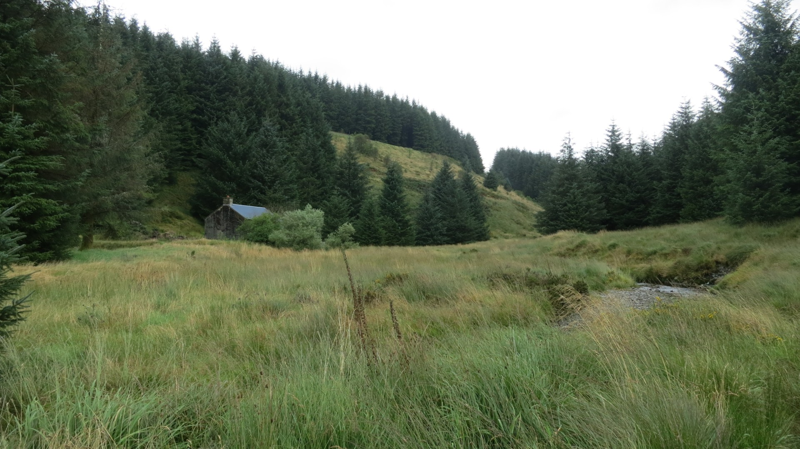
  <figcaption><i>Moel Prysgau bothy</i></figcaption>
</figure>

I was now about to leave my map and follow the directions which I wrote down after looking at the map in Dolgach. I would have taken a picture of the map but it was behind perspex and wouldn't photograph well.

*N - Moel Pryagan*
*NW - Strata Florida*
*NW - road - Pontrhydfendi*
*N - NE - road Ysbyty Ystwyth*
*NNE - road - Pont Rhyd - I - Groes*
*E - B4343 - Cwmystwyth*
*E - Blaenycwm*

The first section was easy as I just had to follow the cycle route / 4wd track. There were no more river crossings but numerous 4wd's had created canals and the motocrossers had created bogs on the diversions round the canals. At least I expected to get wet, I felt really sorry for the Duke of Edinburgh group I met going in the opposite direction to me. That whole section of track from Dolgach north is a real adventure although I'd avoid it like the plague in winter or after heavy rain.

<figure style="text-align: center;">
  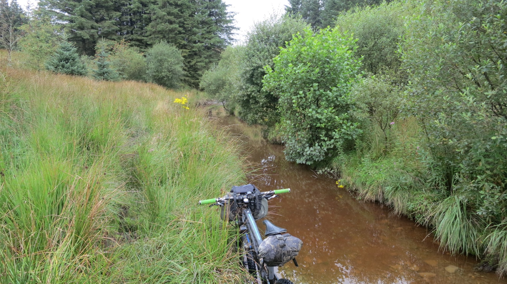
  <figcaption><i>Special Welsh canals surrounded by churned up bogs, what's not to like?</i></figcaption>
</figure>

Somehow I ended back on track although I don't really know how. My directions weren't that good, there was a distinct lack of road signs and place names and if I asked someone where I was I couldn't tally their pronunciation with what I'd written down. There wasn't even a sufficient mobile signal to use my phone mapping software. I got there eventually but I'm sure I went up an extra hill somewhere.

I was back on track and on fireroads now and making progress. I had a quick stop at Nant Rhys bothy which looked luxurious with it's outside long drop loo. A long climb up the A44 brought me to Eisteddfa Gurio and a bridleway through Dyll Faen forest that can't have been ridden on for a long, long time.

 <figure style="text-align: center;">
  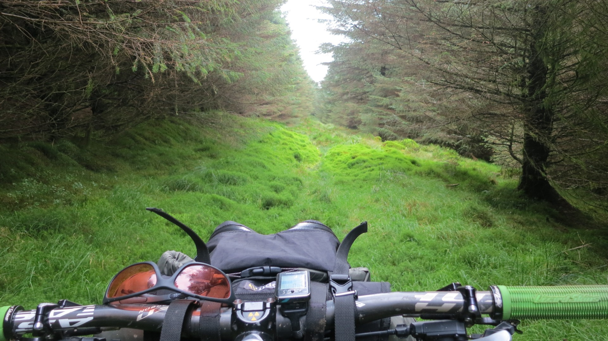
  <figcaption><i>The start of the bridleway through Dyll Faen forest</i></figcaption>
</figure>

<figure style="text-align: center;">
  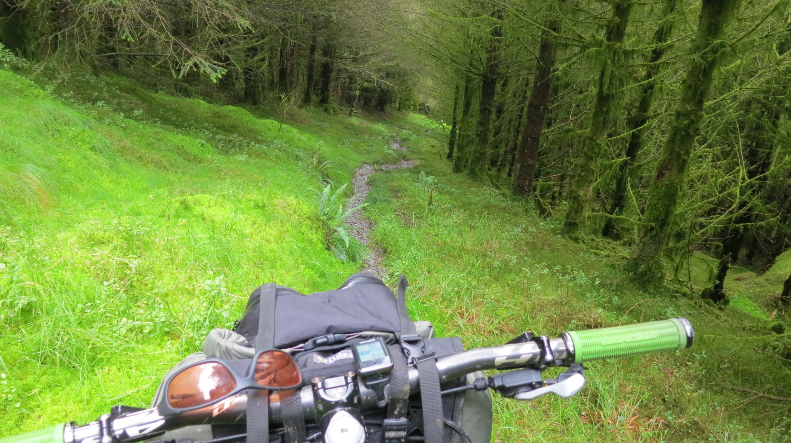
  <figcaption><i>It got better</i></figcaption>
</figure>

I had originally wanted to get to Machynlleth but it was getting late and it looked like it might rain. My original route crossed a fair few hills and had some suspicious straight sections, time for another detour. I found a spot on the map that looked perfect, Angler's Retreat. It was remote, high up, near a lake but with easy access along some tiny back roads around Nant - y moch Reservoir and then fireroads. 

Angler's Retreat was an awesome bivvy spot, remote but luxurious with a great view. It was actually an anglers hut next to a lake. I was half hoping it was unlocked but it wasn't but it didn't matter. At the front was a large patio overlooking the lake. The front door handle provided a perfect high anchor point for my tarp and there were enough gaps in the patio to get my pegs in and I weighted down the edges with some logs which made a perfect weather proof shelter. There was even a seat in the form of the step for the front door. In the end the rain didn't arrive that night  and after a good wash and food I had a great nights sleep.

<figure style="text-align: center;">
  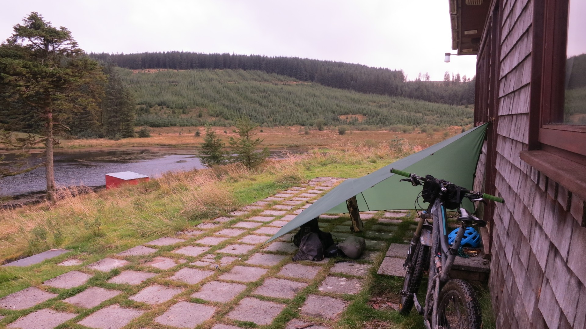
  <figcaption><i>Angler's Retreat, as luxurious as a bivy gets.</i></figcaption>
</figure>

Mid Wales is great mountain biking country, there's hills for as far as you can see and loads it route choices. Because it's generally not as steep or rocky as North Wakes or the Lakes it's more rideable, assuming you choose the tracks that actually exist.

## Day 4, Saturday, Angler's Retreat above Machynlleth to Capel Curig

**ride time 5.34 hrs, 102.81km, 18.4 av**

It was till dry in the morning and I quickly packed up and set off. It only started raining when I had a puncture on the first downhill section. Now for some reason I didn't put extra clothes on and by the time I got to the A487 I was very cold, possibly not far off being hypothermic. I put more clothes on and pedalled into Machynlleth, singing stupid songs, making ridiculous noises and shouting out reasons why I shouldn't be doing this. Does anyone else do this? I was almost warm by then and thought about  getting in a cafe but decided I'd never leave if I did, it was hammering it down and too windy to even think about leaving the cosy confines of a cafe. Unfortunately I deliberated about this for so long that I got cold again. I restocked in the Co-op as I had no food left, still no warmer due to the open fridges in the chilled areas, and finally set off for Barmouth on the coast road. By now it was a full on storm and there was no way I could go off road, it was far to bad. My original reason for riding south to north was to catch the prevailing winds and today it paid dividends. At one point on a hill I'd stopped to read an information sign and the angle of the hill and the direction of the winds aligned perfectly. I took half a pedal stroke to set off and didn't have to pedal again. At the top it levelled off and by the end I was doing 20km/hr, all with out pedalling at all.

<figure style="text-align: center;">
  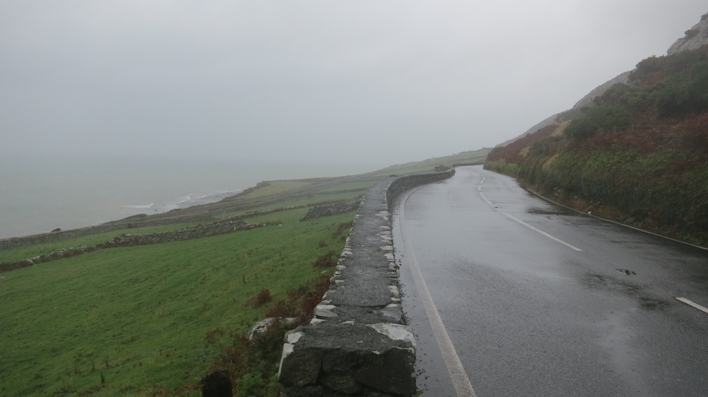
  <figcaption><i>The road to Barmouth</i></figcaption>
</figure>

<figure style="text-align: center;">
  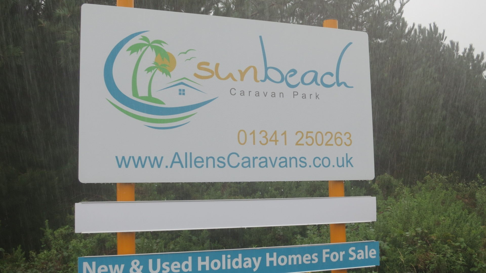
  <figcaption><i>quite simply not true</i></figcaption>
</figure>

Barmouth arrived eventually. I was absolutely soaked and hungry and found a cafe that looked like they wouldn't mind a dripping cyclist. I chose an empty one so that they had less reason to turn me away. Coffee, pizza, milkshake, cake, coffee and more cake made me feel much better. The weather had abated a bit down on the coast but the hills where still covered in cloud. There was a large off road section from Barmouth to Porthmadog but that wasn't going to happen today. After that it was mostly road up to Capel Curig followed by offroad to Conwy. Could I get to Capel Curig by road today leaving a final short day off road to Conwy for Sunday and enough time to get the train home? No, unless I took the cafe owners advice with I'd originally snootily dismissed. I'd talked to the cafe owners about what I was doing and they suggested I take the train to Porthmadog, rightly assuming that I was mad to ride in these conditions. The more I thought about it the more it felt like a good idea so I swallowed my pride and jumped on the train, apologising for the big puddle I'd left on the floor under the table. The ford and rest meant I'd recovered by the time the train pulled in so I hammered it up the road  through Beddgelert to Capel Curig, partly to get there before it was dark but mostly to make myself feel less guilty.

At Capel  I stayed in a hostel described as a "five star premium budget hostel". It sounds like a marketing man's bullshit tautology but it was actually true, it was great. Beautiful building in great condition, large communal kitchen and dining area and mixed bedrooms with individual pods. The only let down was the drying room which was never going to dry the mountains of wet stuff in there. I ate far more food than I needed to  but the end was in site and there was no need to carry much food any more.

## Day 5, Sunday, Capel Curig to Conwy

**ride time 2.48 hrs, 32.2km, 11.4 average**

Yesterday's combination of rain, wind, cold, hypothermia, mileage and time out had definitely taken it's toll. I was knackered. I pushed up to Llyn Cowlyd Reservoir and then followed some delightfully technical singletrack. After a slight diversion round part of the hydroelectric scheme the off road ended and unfortunately all the height loss was on road. 

<figure style="text-align: center;">
  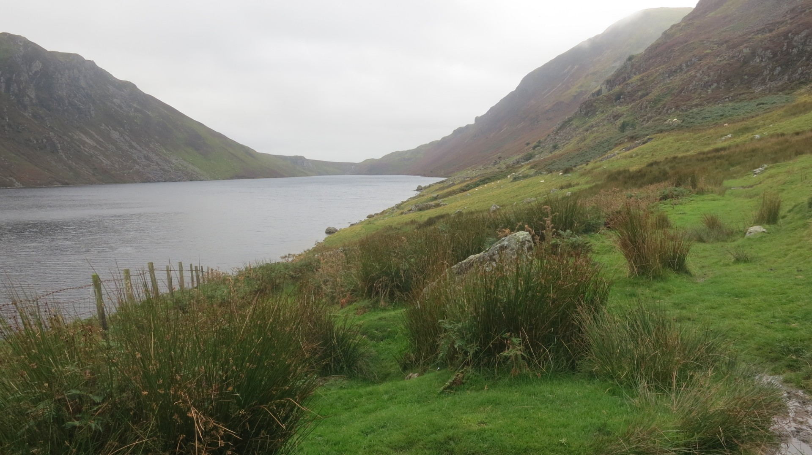
  <figcaption><i>Llyn Cowlyd Reservoir between Capel Curig and Conwy valley</i></figcaption>
</figure>

<figure style="text-align: center;">
  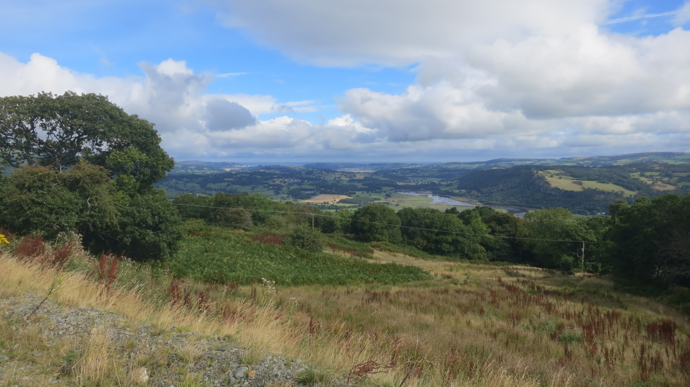
  <figcaption><i>Conwy Valley</i></figcaption>
</figure>

Conwy was fantastic; fish and chips, a beer, a newspaper and people watching in the harbour. Followed by coffee and cake and people watching in a cafe built into the castle walls. The sun even came out to help celebrate. I even changed into a semi clean top to save the nostrils of my fellow train travellers.

If I was to do it again, which I think I will, I'd plan for a few extra days so that I could sit out bad weather so as not to miss out on off road sections. I'd also look at the bridleways in more detail when planning and avoid anything that's just too straight. Or do more internet research.

Highly recommended.