# Bikepacking to Scotland - not quite, Northumberland was far enough

<figure style="text-align: center;">
  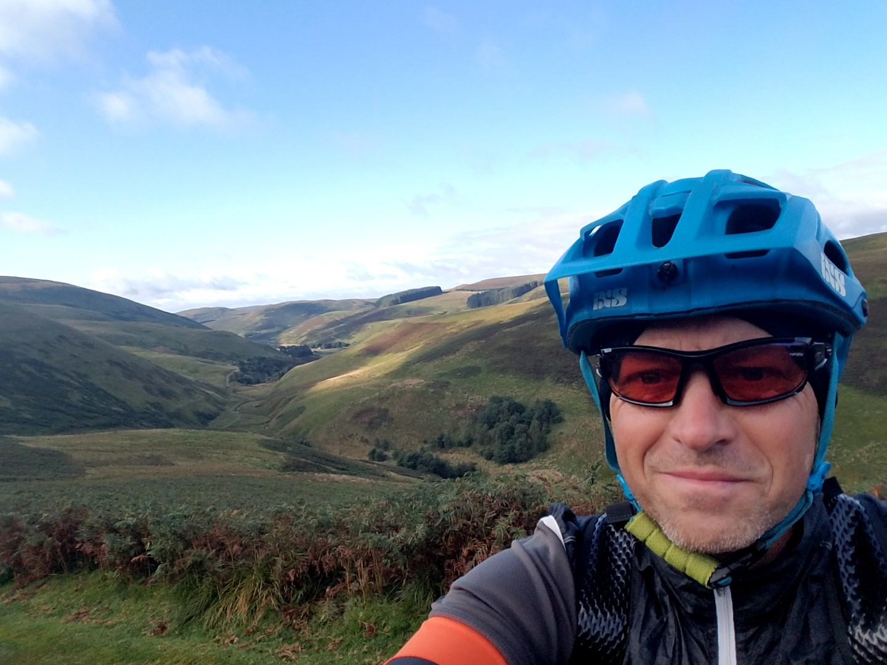
  <figcaption><i>Between Alwinton & Redesdale Forest</i></figcaption>
</figure>

It was time again for my annual big bikepacking trip. I'd planned on doing this for a year and I even booked time off from my work schedule this time but for some reason I only planned the actual route a few days before I set off. It worked out well enough in the end but there was a bit of on the hoof re-planning required.

The basic plan was to ride north from Malhamdale to the Pennine Bridleway, follow this to Kirkby Stephen where I'd then follow minor roads to Murton Fell. Over this to Cow Green Reservoir, then north to pick up the Sandstone Way near Belingham which I'd follow to Alwinton. From here I'd start to head west through Redesdale Forest and Kielder Forest and then south past Carlisle, past Skidaw and down to Windermere. In the end I finished at Carlisle, mostly because I was too tired to do much more and especially because I didn't fancy the push over into Langdale.

I was wild camping all the way or using bothies in Kielder. There was no set plan on where I'd stay each night or where I'd get to although I had a rough plan in my head. Unfortunately it was too rough a plan, hence the daily distances that I'd roughly calculated on the map where actually significantly less than the real distance. It didn't matter though, I had a tarp and could stay anywhere.

<figure style="text-align: center;">
  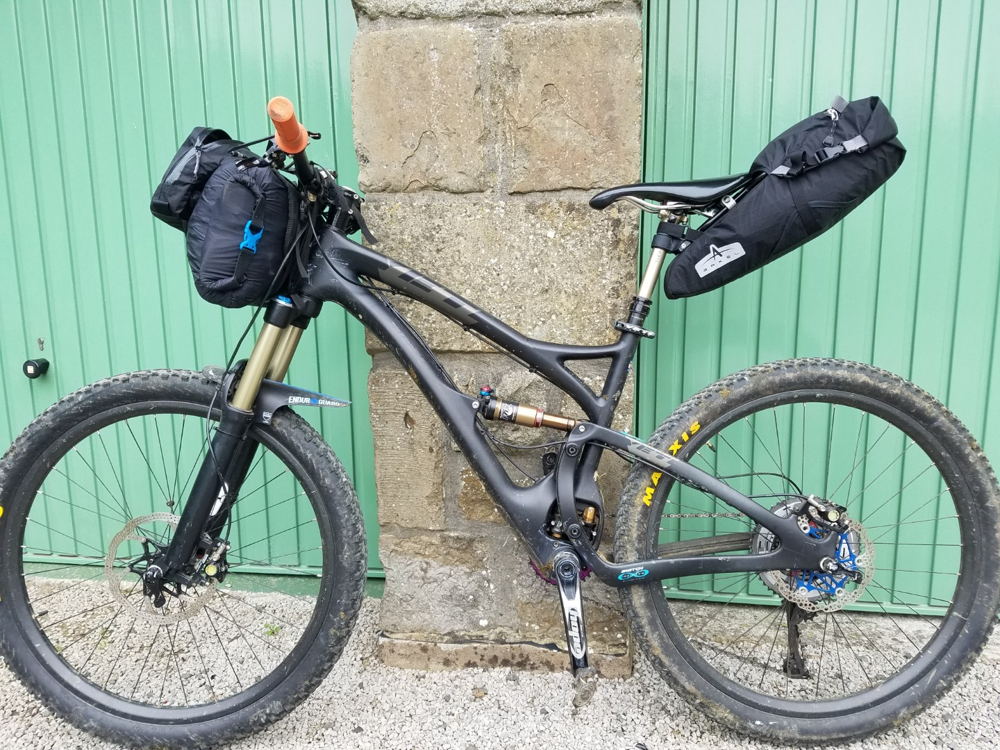
  <figcaption><i>Bike packed.</i></figcaption>
</figure>

I also had an 18l Wingnut rucksack, with daily riding kit and food in.

## Day 1: 3rd September 2017: Airton to Murton 
**97.25km, 6.12hrs riding, 8.21hrs total, av 15.6km/hr**

A perfect start; dry, cool and hardly any mud. I rode further than expected and felt better than expected. It was nothing to do with the strong tailwind, obviously, it was all due to my superhuman fitness. The Pennine Bridleway was as good as ever and after a B road section from Kirkby Stephen I arrived in Murton, This was at the start of my route over to Cow Green Reservoir so it was a good place to stop, plus it was late. There was a handy bench just outside the village to set up my tarp from and even a clean stream nearby. And there were no midges! Even the local dog walkers didn't question what I was doing.

<figure style="text-align: center;">
  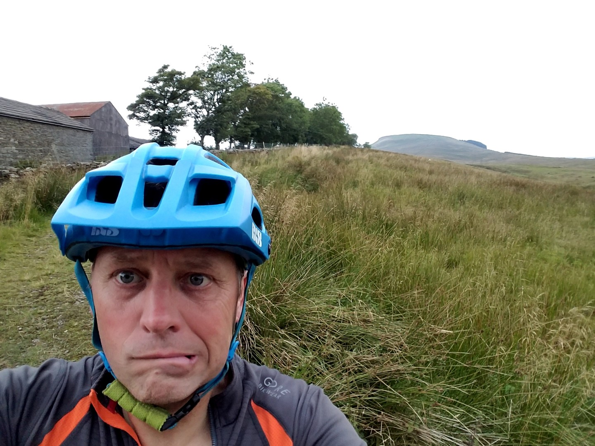
  <figcaption><i>The start of the Mary Anne Clifford Highway</i></figcaption>
</figure>

<figure style="text-align: center;">
  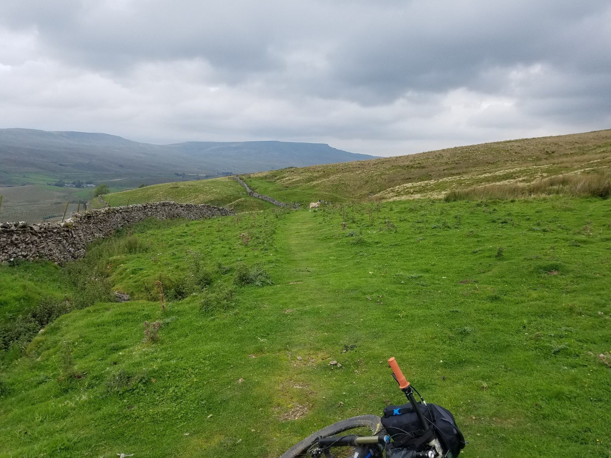
  <figcaption><i>Once you're on the Mary Anne Clifford Highway, it's delightful.</i></figcaption>
</figure>

<figure style="text-align: center;">
  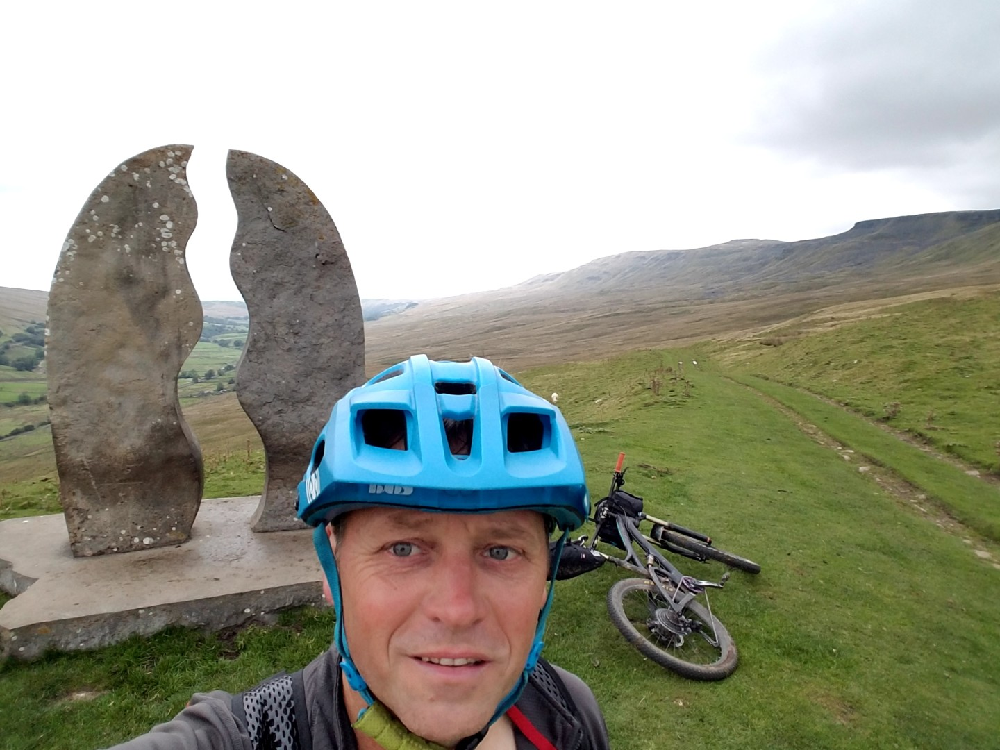
  <figcaption><i>The "thing" at the end of the MAC highway.</i></figcaption>
</figure>

<figure style="text-align: center;">
  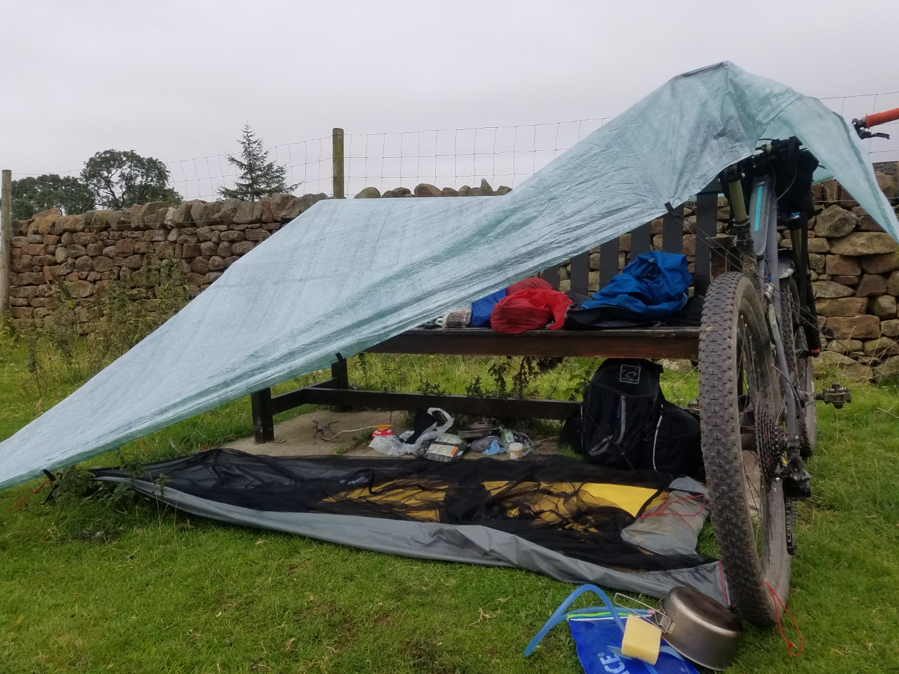
  <figcaption><i>My bivvy at Murton, not remote but comfortable</i></figcaption>
</figure>

** **

## Day 2: Murton to just south of Belingham 
**82.54km, 6hr riding, 10hrs total, 13.7km/hr av**

I had a reasonable nights sleep although I did keep rolling off my sleeping mat. Had a nice chat with a local who looked bemused but didn't say I was an idiot. There was a lot of low cloud and it looked like it might rain but it held off and once again I had a decent tail wind. It's a good track to start with over Murton Fell, much better than trying to climb directly up to High Cup Nick from Dufton. I still pushed it on the steeper parts, I wanted to save my legs in case it was another long day. The wide hardpack track gets you up the worst of the hill, after that it becomes a soft bit of singletrack. In snow or low cloud it would be difficult to follow but today it was easy, just slow going. Eventually the magnificent High Cup Nick comes into view, admittedly it's better from the north side but it's a fantastic place to be. The track is easy to follow now all the way to Cow Green Reservoir with plenty of mildly technical bits to keep you interested. The bridge across Maize Beck would have made a great bivvy spot, the river is deep enough to swim in and get clean and clean enough to drink.

<figure style="text-align: center;">
  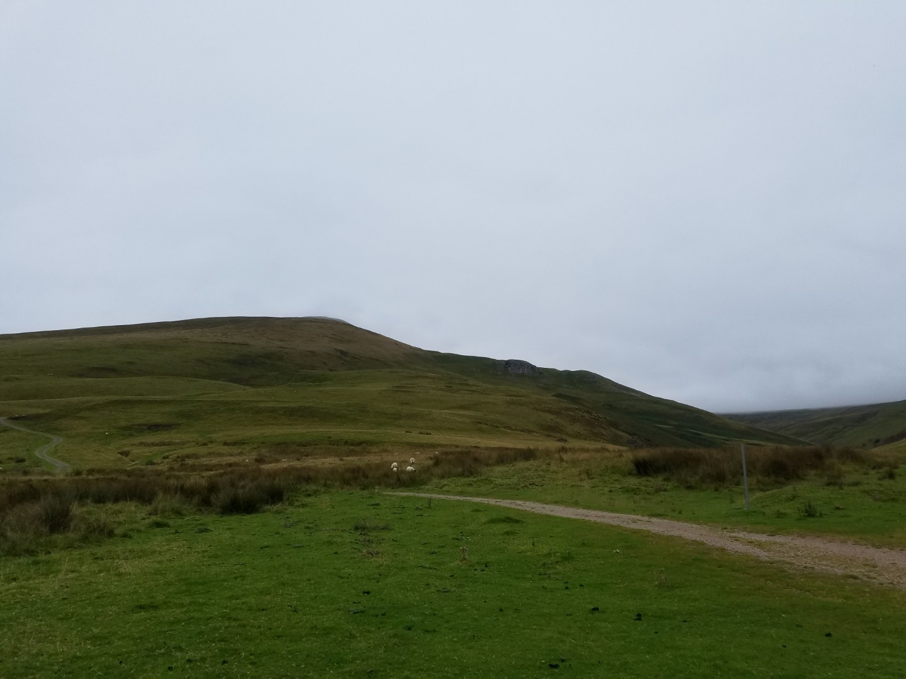
  <figcaption><i>The track from Murton to High Cup Nick</i></figcaption>
</figure>

<figure style="text-align: center;">
  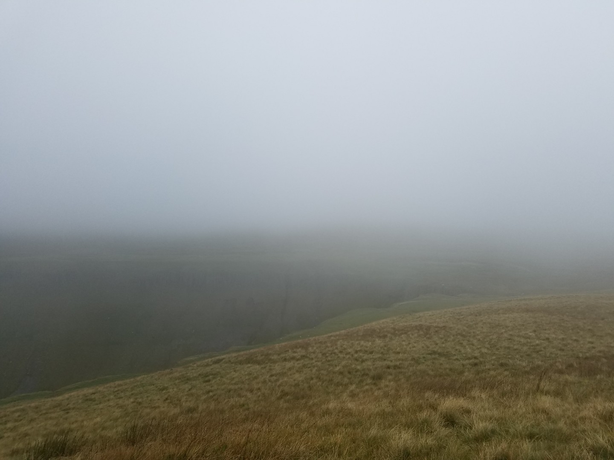
  <figcaption><i>Luckily it never got worse than this and was usually better</i></figcaption>
</figure>

From Cow Green I headed roughly north to Nenthead and planned to get to Allendale Town via Isaac's Tea Trail. This looked promising on the map but on the ground it was horrendous. I gave up on it quite quickly and ended up with quite a bit of road. I hadn't got any where near as far as I thought I would today, partly because it was slow going up and over Murton Fell and partly because of my failed attempts to ride Isaac's Tea trail. I eventually bivvied in the corner of a field near to Hadrian's wall. Not exactly the remote, exciting bivvy I dreamed off but once the inquisitive cows had gone it was great. It actually felt better when it started raining and I was warm and dry under my tarp. There was a lime kiln nearby which would have been a perfect bivvy spot but I couldn't get to it easily enough.

<figure style="text-align: center;">
  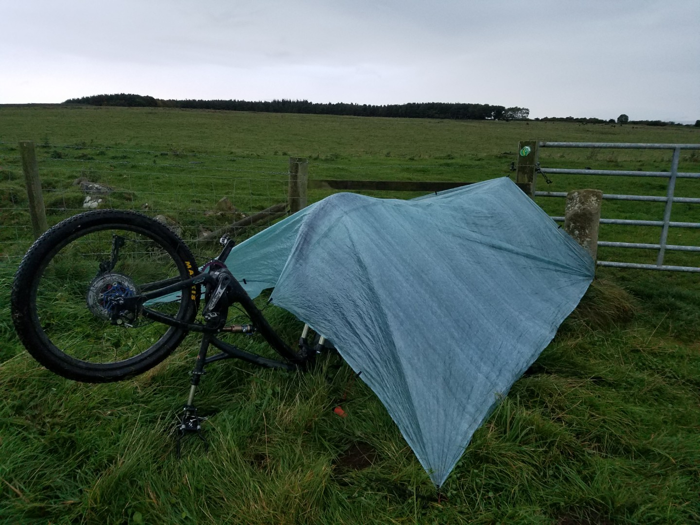
  <figcaption><i>Night two, in the corner of a field. The cows stared at me from the other side of the fence for quite a while.</i></figcaption>
</figure>

## Day 3: Hadrian's Wall to a corrugated iron sheep house just north of Alwinton
**78.23km, 6.13hrs riding, 10hrs total, 12.5km/hr av**

An odd day. The forecast was bad but turned out OK, only light rain in the morning. I was mostly following the Sandstone Way today which would mean good progress because it has lot's of short, quiet road sections interspersed with generally good bridleways. What I'd forgot was that I'd changed parts of the route to take in some "interesting looking" bridleways. Consequently I stopped map reading and just following the Sandstone Way signs. I'd then remember I'd changed the route, get back on track only to find that the interesting bridleway wasn't on the marked route because it was pants, requiring a road detour. Two farmers even told me they'd never seen a human or a horse on one particular section. So what should have been an easy and interesting day wasn't. I seemed to make this same map reading error quite a lot today.

<figure style="text-align: center;">
  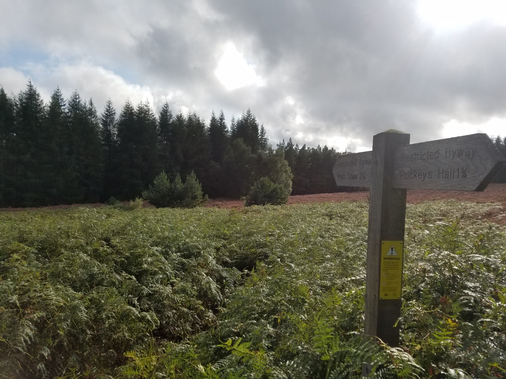
  <figcaption><i>There's a bridleway in there somewhere.</i></figcaption>
</figure>

It's also surprisingly hard to find streams high enough up to give you the confidence to drink from. I ended up buying bottled water. Finally I made it to Alwinton. From here I would be heading north and then west into higher, wilder country and then towards Kielder. I nearly looked for accommodation in Alwinton as it was getting late and I had no chance of getting to Spithope bothy. I'm glad I didn't. Clennell Street, an old Roman Road, was the highlight of the trip. It was a wide grassy track, steep to start but then it became ridable. It was windy but the sun was out and the views were fantastic. I suspect Northumberland is the wildest place in England, it just seems empty.

<figure style="text-align: center;">
  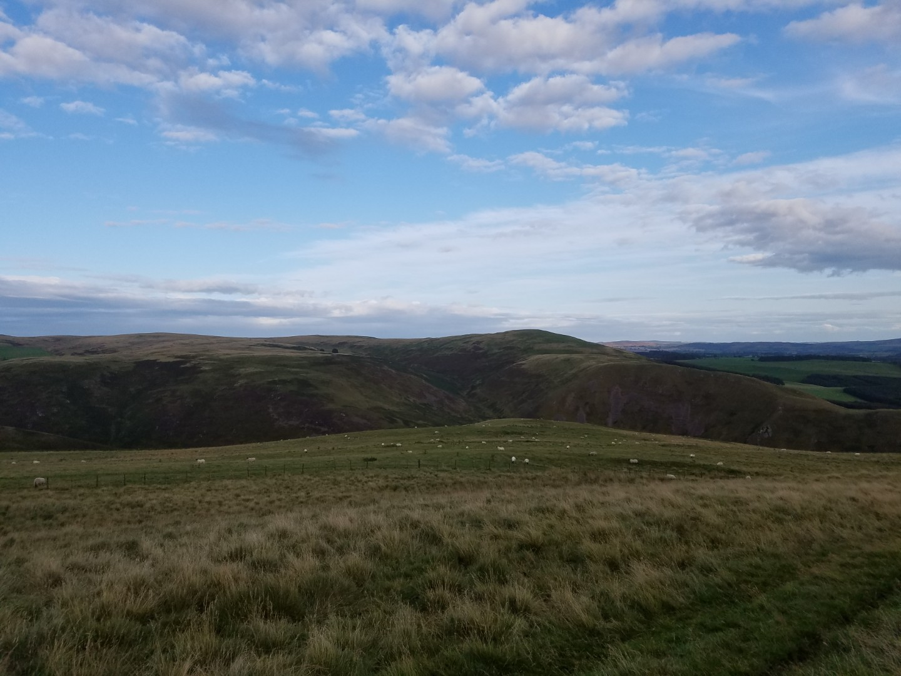
  <figcaption><i>View from Clennell Street</i></figcaption>
</figure>

<figure style="text-align: center;">
  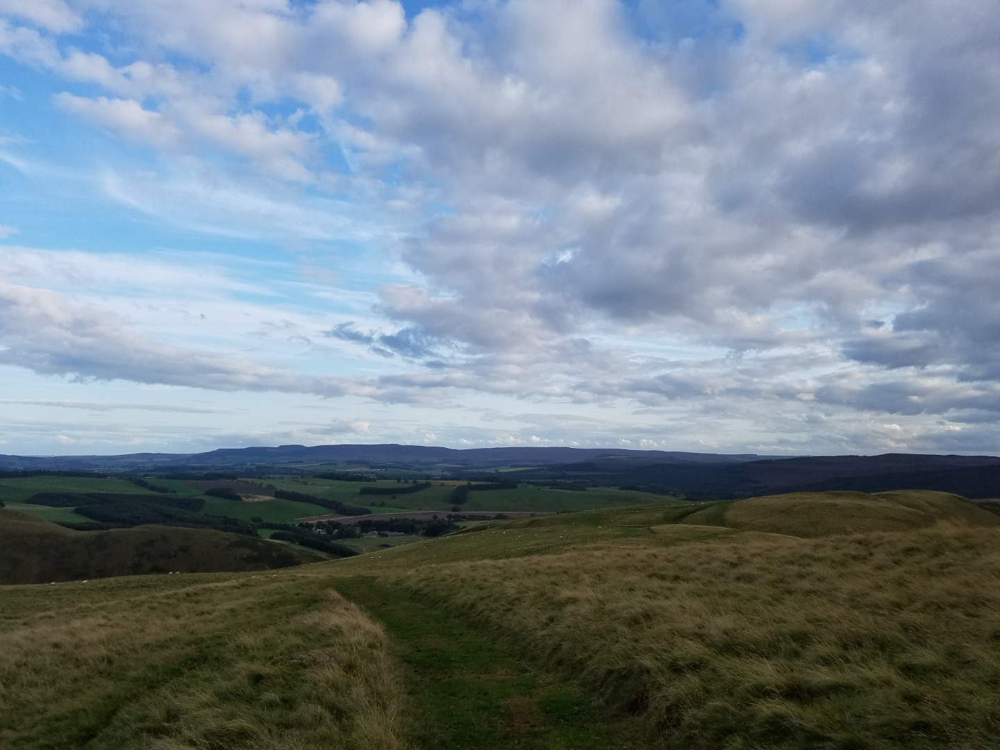
  <figcaption><i>More Clennell Street loveliness</i></figcaption>
</figure>

It was still quite windy and actually quite cold. My half plan to just bivvy out somewhere wasn't looking great but just as I really needed to find somewhere to bivvy a saw a tin hut in the distance. It turned out to be a sheep pen made of corrugated iron, with a roof, albeit with a small gap at the apex. There was straw in the pens, presumably for lambing time. I moved some of the straw into the one pen big enough for me, laid out my groundsheet and set up camp. It was great and probably had the best nights sleep I've had in a long time. Admittedly it did smell of sheep wee a bit. At one point some vehicle headlights appeared on the horizon from the route I'd taken but they never came any closer. The farmer came past in the morning as I was packing up but he didn't acknowledge me, I'm not even sure he saw me.

I definitely need to come back here for some day rides, preferably after reading a guide book.

<figure style="text-align: center;">
  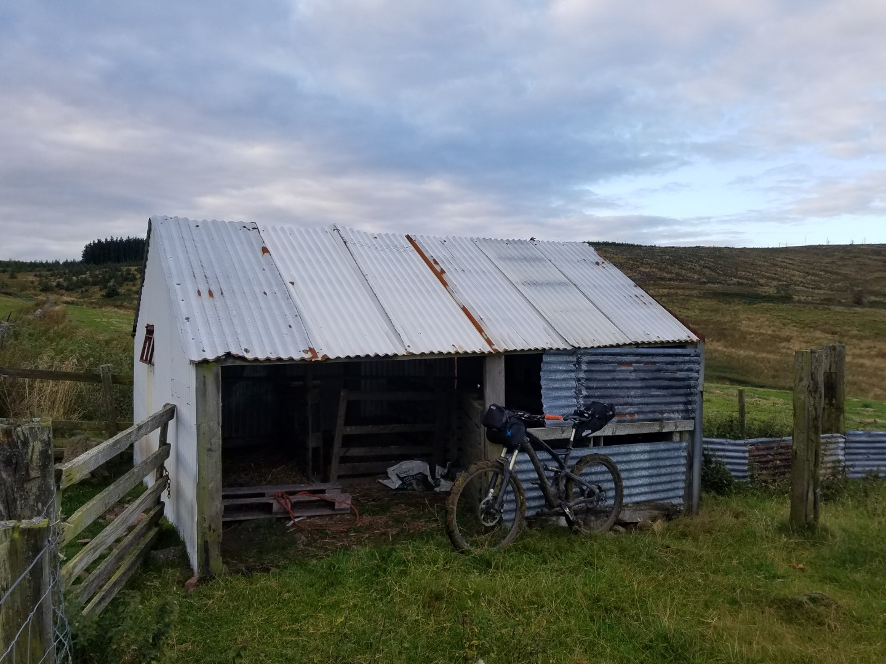
  <figcaption><i>My hotel for night three.</i></figcaption>
</figure>

<figure style="text-align: center;">
  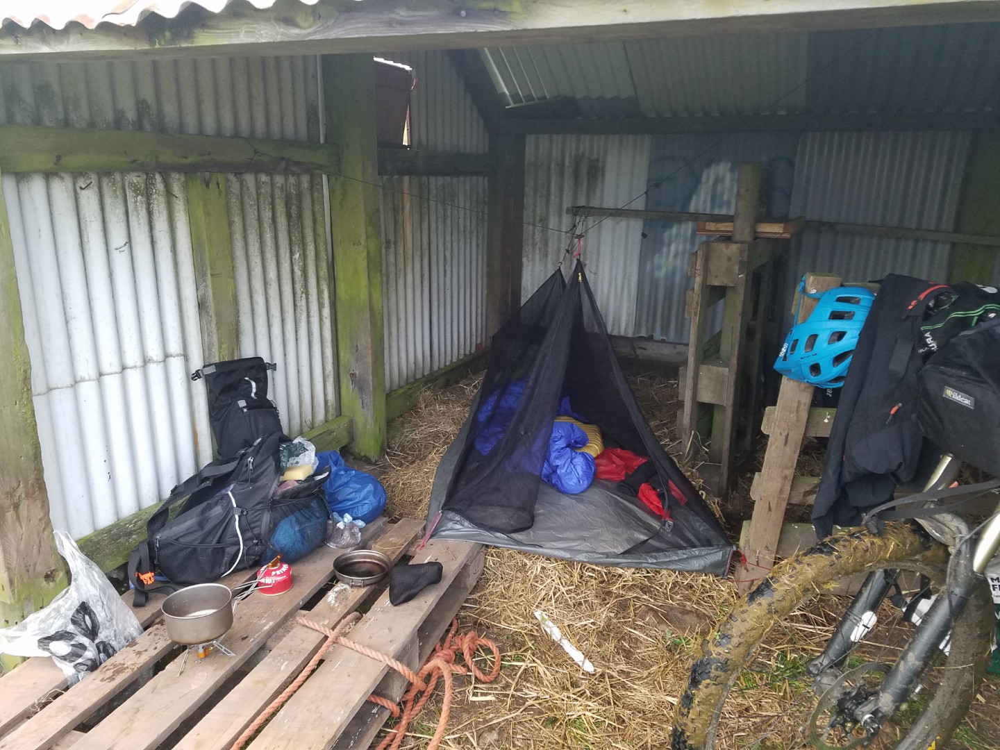
  <figcaption><i>Kitchen, dining room. living room  and bedroom are all easily accessible.</i></figcaption>
</figure>

<figure style="text-align: center;">
  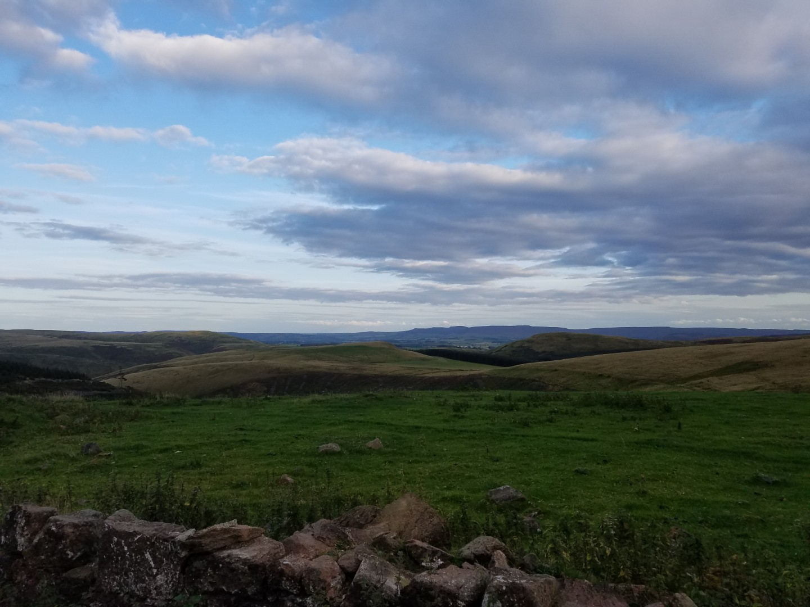
  <figcaption><i>And the view was great.</i></figcaption>
</figure>

## Day 4: Sheep hut heaven to Kershopehead Bothy, Kershopehead Forest
**75.57km, 5.19hrs riding, 10hrs total, 14.1km/hr av**

It was windy and cold in the morning but once the sun came up it was glorious. I wanted to get to Kershopehead bothy today and ahead of me was a straight forward riding day. Or so I thought. It started off easy enough; a bit more grassy track of Clennell Street, some fireroad and then a fast grassy descent to Barrowburn. On the first three days I hardly met anyone whilst riding, at this spot I met four teenagers on a silver DofE, two lads who were out for a walk but also mountain biked in the area and confirmed the Northumberland lost bridleway syndrome, and a DofE assessor. It was nice to have a good natter with them all.

<figure style="text-align: center;">
  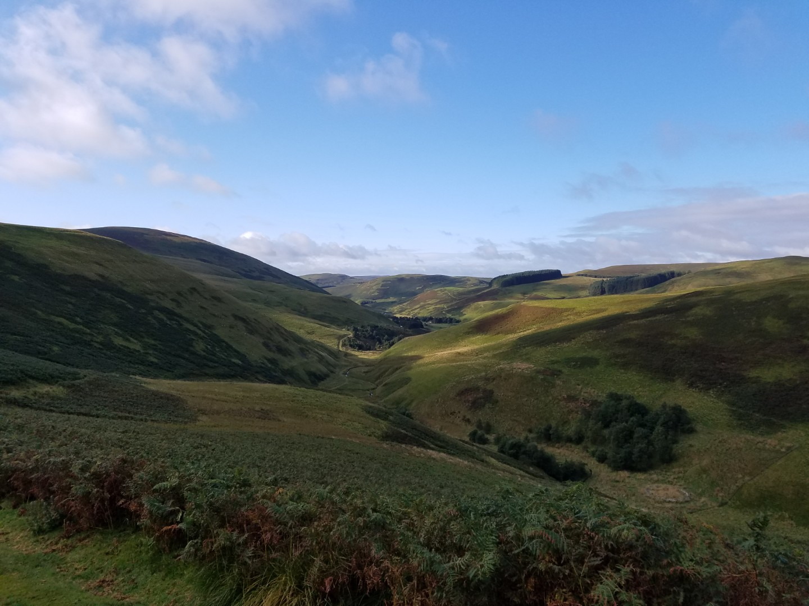
  <figcaption><i>Start of the descent to Barrowburn.</i></figcaption>
</figure>

I was now on a dead end C road that led to a Roman Camp near the Pennine Way at Croquet Head. This road bordered a MOD live firing area to the south and by the looks of the girth of some of the soldiers it must have been the TA. Originally I'd planned to follow some bridleways that climbed up a hill and then ran parallel to this road but the head wind was strong and my enthusiasm was waning. I was feeling more tired today.

The Pennine Way was the other busy part with four walkers all heading north. This section was soft and slow but only a few kilometres long. From here I needed to get into Redesdale Forest. On the map it looked like there was an easy link although possibly no official path. It turned out to be a push along a very indistinct path over bog followed by another push through the forest which had luckily been felled. A quick blast down the fireroad brought me to Spithope bothy. I'd originally wanted to get here last night but now I decided to cook lunch here. It's a small bothy, sleeping four, but it has great views and is in a good location. On the map there's a bridleway running right next to bothy, parallel to the fireroad which is on the other side of a stream. It was another lost bridleway.

After lunch a bit more fireroad brought me to Catcleugh Reservoir where a bridleway headed south west over some impressive country. I never got to see it. Having failed to find the start of the bridleway, or more accurately having found the start but not seen a bridleway, I had a chat with the  farmer who told me about 12 mountain bikers who were rescued from it recently. Another lost Northumberland Bridleway, I'm sure there's a black hole around here that just devours bridleways. Another diversion required, this time down an A road to Cottonshopeburnfoot and then along a fireroad called Forest Drive over to Kielder, which I shared with some cars. It's a relatively easy ride on a good surface over a hill but for some reason I suffered, a lot. I think I basically wasn't eating enough and although I wasn't bonking it was definitely slowing me down. I fixed this in Kielder Castle cafe with a sausage bap and two cakes.

From Kielder there was another fireroad to follow that went past Kershopehead bothy. It was also part of Sustrans route 10 and after a gently climb it flowed downhill right to the bothy, on probably the best fireroad surface of the week. Well, almost right there, the bothy was over a large stream and up a hill.

<figure style="text-align: center;">
  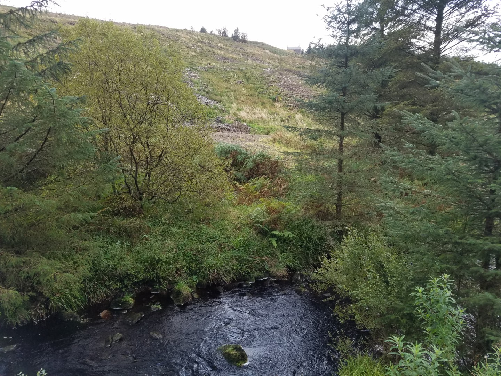
  <figcaption><i>It's up there, I'm down here, but luckily that wasn't deep.</i></figcaption>
</figure>

Kershopehead bothy was great, positively luxurious. Downstairs there was a wood store through one door and through the other door there was the kitchen, stove, "lounge" and a double bed platform. Upstairs was another double bed platform. I chopped some wood, got the fire going and hung my damp socks up to dry. I hoped no one would turn up because the smell from my socks might kill them.

<figure style="text-align: center;">
  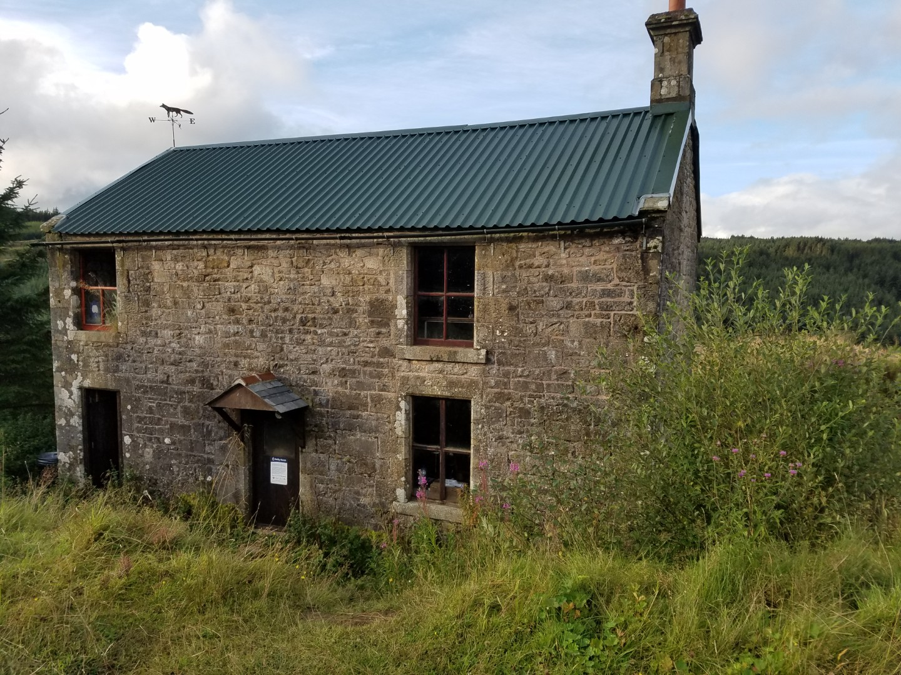
  <figcaption><i>See that window top left? Try not to believe someone lives there.</i></figcaption>
</figure>

<figure style="text-align: center;">
  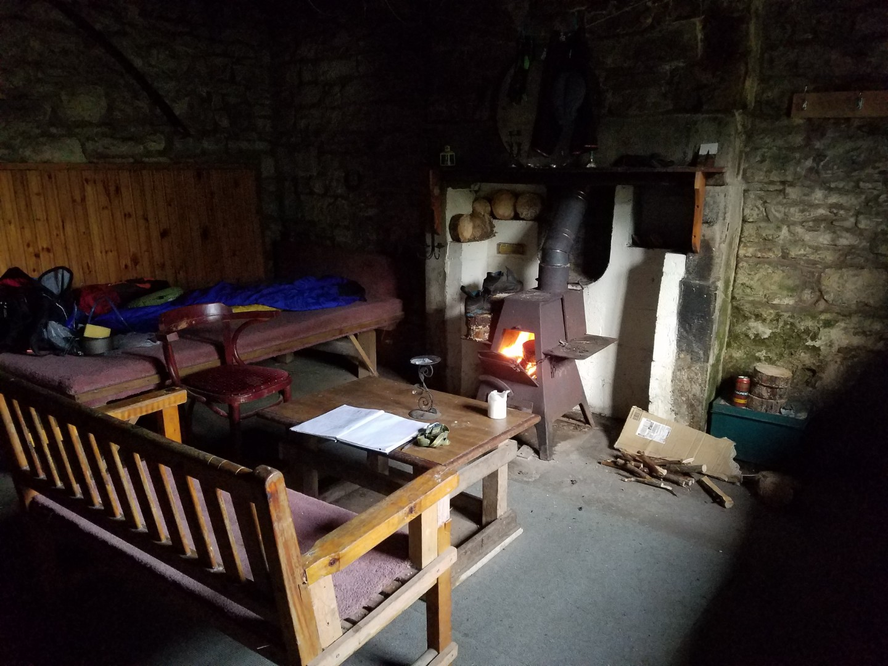
  <figcaption><i>Fire going, kit spread out, no one to share it with. Which was lucky as my socks smelt horrendous.</i></figcaption>
</figure>

Above the wood store was a window with half the glass missing, a picture
 of a plant and an actual plant but no way in. There was no door to this
 room anywhere and no hatch in the ceiling of the wood store. I don't 
know why they'd not used this room bit it did give the whole place a 
rather creepy feeling, especially when it went dark and the house 
started to creak. The murdered spirit in the room with no entry never came down to kill me, although I'm sure I heard it trying to get out.

It was here that I realised I'd forgot to bring a vital item on the trip; my hipflask. Bugger.

## Day 5. To Carlisle 
**50ish km**

My original plan was to carry on to the Lakes, past Skidaw with maybe a stop in Great Lingy Hut, down Borrowdale, over in to Langdale and getting the train back from Windermere. Instead I just went to Carlisle. I'd had enough by now, done some great riding and got tired. Plus I knew that Stakes Pass, between Borrowdale and Langdale, would be a right pain in the arse with a loaded mountain bike. Appropriately the last day also had the worst weather, it rained all the way to the train station.

** **

Although I was no longer in Northumberland, that county had obviously had a word with Cumbria. As I came out of Kershopehead Forest there was an enticing looking bridleway on the map that went in the direction I wanted to go. It wasn't there on the ground.

Would I do anything differently next time to make it better? READ A GUIDE BOOK BEFORE PLANNING MY ROUTE!