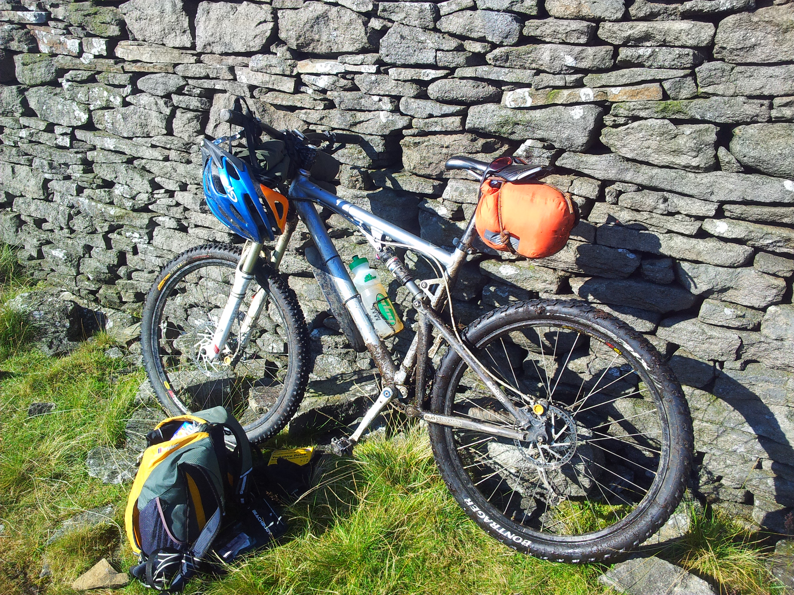
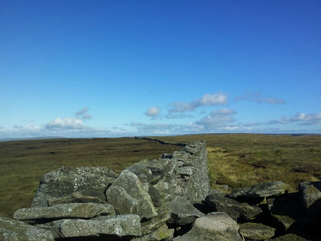
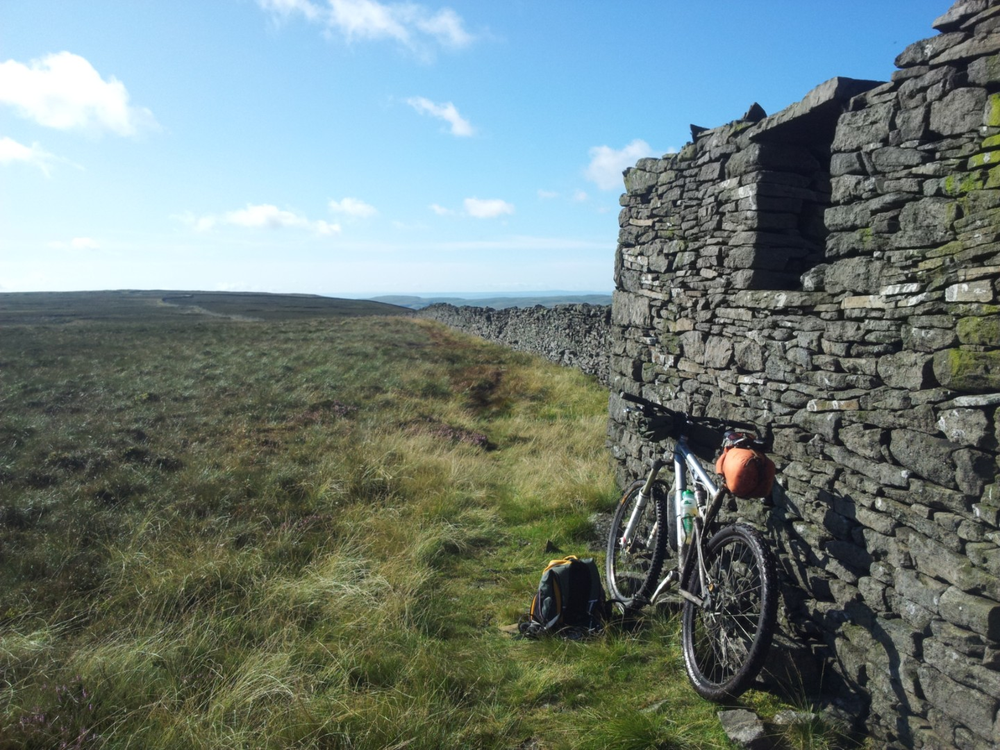
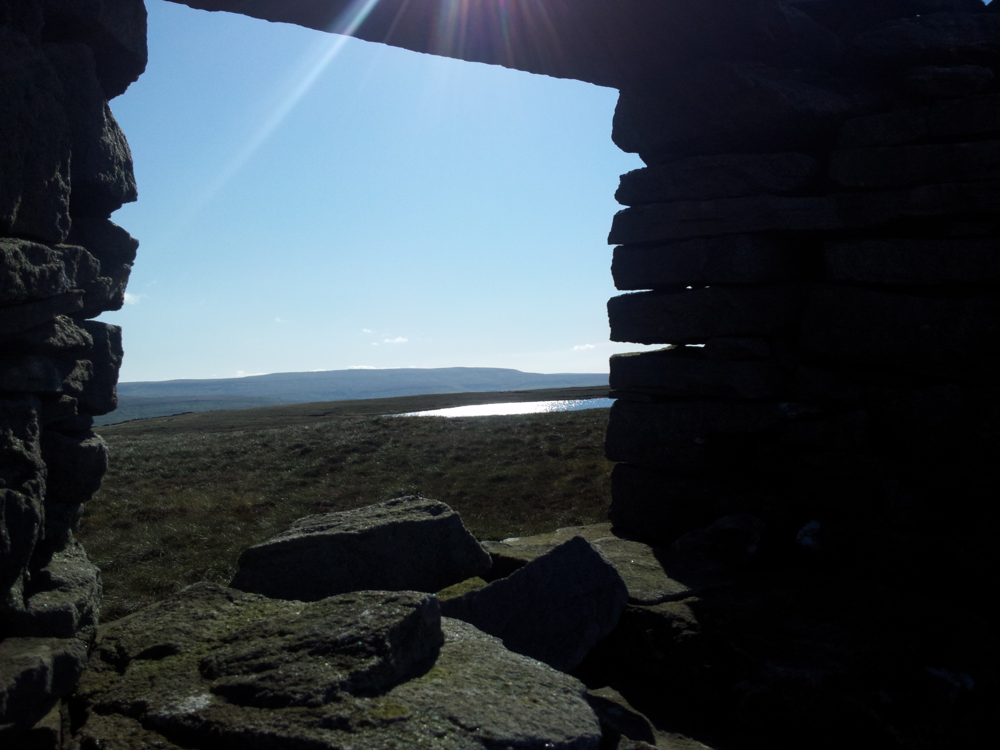
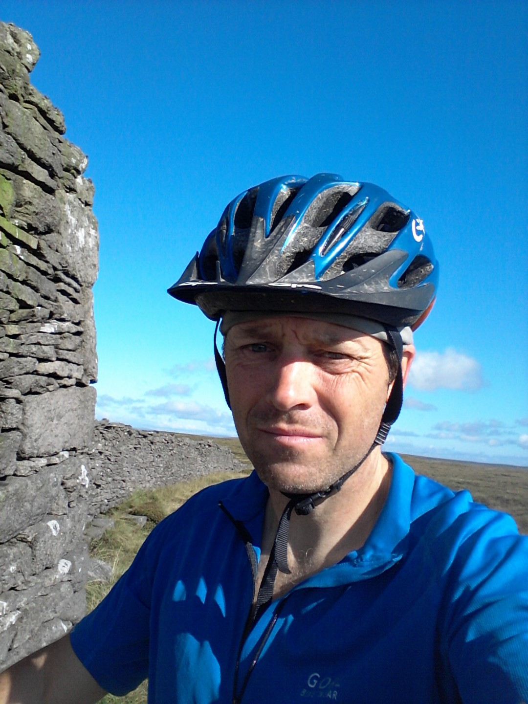

# Bikepacking in Wharfedale and Bishopdale
**August 2011**

In late August [Stuart](http://yorkshirebiking.com/) and I decided to go on a two day bikepacking trip from Malhamdale to Nidderdale where we would bivvy overnight. The next day we would watch a downhill race and then ride back.

We never made it.

The day we set off was fantastic weather but unfortunately we had to set off late. We rode about 18km to Kettlewell where we sat outside a cafe, underneath a big umbrella, watching the heavens open. We then proceeded to try and get each other to admit that they didn't want to carry on riding and bivvying in the rain. We pussy footed around for what seemed like ages, each of us trying not to admit how pathetic we were until we mutually decided to call it a day and ride home, swearing never to tell a sole what had happened.

Ruined that now.

I think Stuart rode to Nidderdale the next day in an epic round trip on his trusty mountain bike that thinks it's a road bike 29er thingy. I decided to go bikepacking to make up for my moment of weakness. The ensuing trip was one of the best rides I've ever done.

<figure style="text-align: center;">
  
  <figcaption><i>Santa Cruz Blur loaded up with a very basic setup</i></figcaption>
</figure>

My rough aim was to ride as far as I comfortably could, bivvy and ride back in a big loop. Earlier in the year, whilst working at Buckden House OEC I'd gone for a run to the southern end of the summit of Buckden Pike and gazed longingly at a trail that disappeared into the distance. I'd never ridden it and immediately that made it more appealing. It helped that in the distance I could see an obvious trail that wasn't on the map which looked like it could be joined to a lost bit of bridleway; it had to be ridden. There was also a bridleway above Bishopdale, from Thoralby over Stake Moss to Cray that I had never done; 11kms without crossing a road and also the ridge between Wharfedale and Littondale. So with the chance to ride four trails that were new to me and bivvy out whilst really sweaty and dirty, I set off full of enthusiasm. Except for the sweaty and dirty bit, I wasn't really keen on that. I was also full of doubt because I wasn't sure how fit I was. Plus I wasn't sure I had enough food and I'd neglected to tell Sue exactly where I was going, making the prospect of having an accident in the middle off the moors a little bit more exciting.
<figure style="text-align: center;">
  
  <figcaption><i></i></figcaption>
</figure>

I made my way to Buckden over trails I'd ridden countless times. From Starbotton I rode up the Walden Road to meet the first of the new trails. This isn't strictly true as it isn't actually a road; it's a rough track, and I didn't do a whole load of riding; there was a lot of pushing. The new trail started off perfectly; gritstone and hardpack peat which I stupidly assumed would go on forever. It soon disappeared, to be replaced by a sheep trail through grass. It should have been really hard work but it turned out to be just enough of a downhill to be able to cruise it, weaving around the lumps and bumps. Perfect. At Walden Moor the bridleway went downhill to meet a road but I followed a well built landrover track, the one I had seen in the distance from the top of Buckden Pike, contouring along the hill to the far northern end. Along here I met the one and only person I would meet on a hill that day and it was a bit of a surprise. He was at least  mid 60's, looked as fit as a fiddle and had recently got into mountain biking. We had a chat about where the trail went and I tried to persuade him that a helmet would be a good idea to protect his aging noggin. It was only when I stopped to talk to him that I realised how lucky I was; he was riding into a strong headwind.

The end of my new track finished before the start of a bridleway. The Wasset Fell Road is one of those strange English bridleways that finish in the middle of nowhere. I had my second bit of good luck here; it was fantastic downhilling but would have been a nightmare uphill push. It was never that fast but because it was so overgrown it didn't matter, it was constant last minute line choice.

When I ride trails like this that are obviously unpopular I always imagine I'm the first to ride them. It's complete rubbish of course, some bloke in a Tweed suit riding a penny farthing 100 years ago will have beaten me to it.

It was starting to get late and I decided to have a pub meal in Thoralby. I love bivvying and cooking but not as much as a pub meal and a pint. Especially when my camp meal was to consist of noodles and soup, a rather hastily arranged meal. Unfortunately the pub didn't open for another few hours and I didn't want to wait. So I set of to Cray and the White Lion, over more trails that were in perfect condition that I hadn't ridden before. I even managed to avoid a massive thunder cloud which I thought would swallow me up.

The White Lion seems to be open all the time, at least it is every time I pass it and I arrived there at last light. I chose a table equidistant from the other patrons, not because I didn't like them but because I didn't smell very nice. Sausages and mash, a pint and a dessert, a warm friendly pub. Ahh, the well earned joys of wild camping!

It soon came time to leave and find somewhere to camp and I had a perfect nights sleep behind a wall in a field under my tarp. I have to admit to being a bit worried about slugs crawling over me but there was no trace in the morning. Phew.
<figure style="text-align: center;">
  
  <figcaption><i>Horse Head Moor near Briks Tarn</i></figcaption>
</figure>

I set off early and rode and pushed up Horse Head Moor. What followed was more good luck. The weather was perfect and the singletrack through the grass should have been slow and tiresome. Instead it was just right and there was only one short section of peat hags to battle. Near Birks Tarn I stopped to bask in the sun, enjoy the view and eat the last of my food. I also have to admit to feeling quite smug about enjoying such a fantastic mid week ride when most people were at work. Sorry.

The ridge ended with a great little downhill into Hawkswick and one final long hill before home.

Initially I wanted to do the ride again but I was so lucky with the good ground conditions and the weather that I think a return trip would just spoil it.
<figure style="text-align: center;">
  
  <figcaption><i>Birks Tarn</i></figcaption>
</figure>

<figure style="text-align: center;">
  
  <figcaption><i>Me looking knackered</i></figcaption>
</figure>