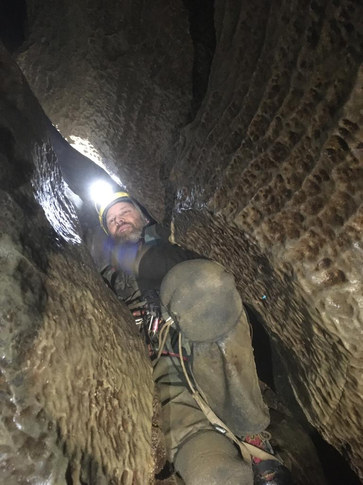
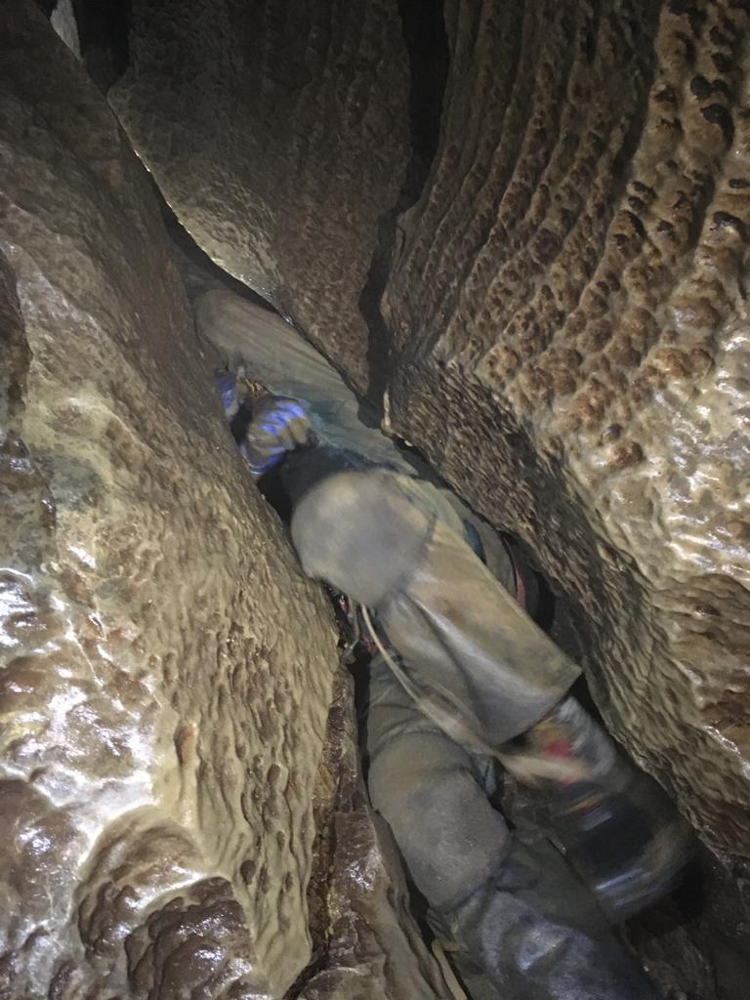
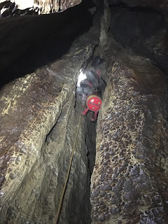
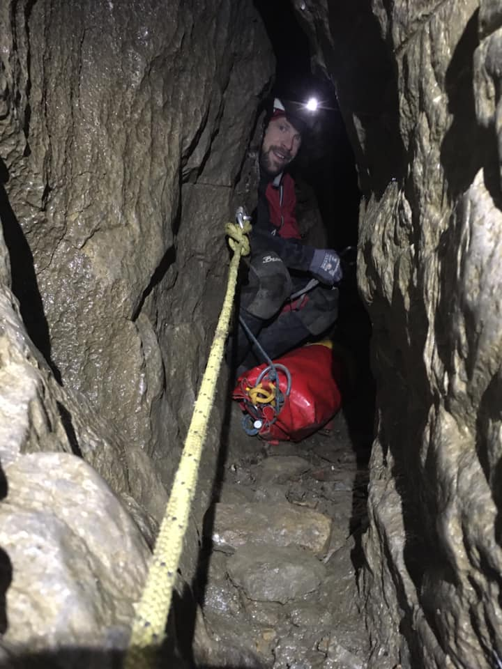
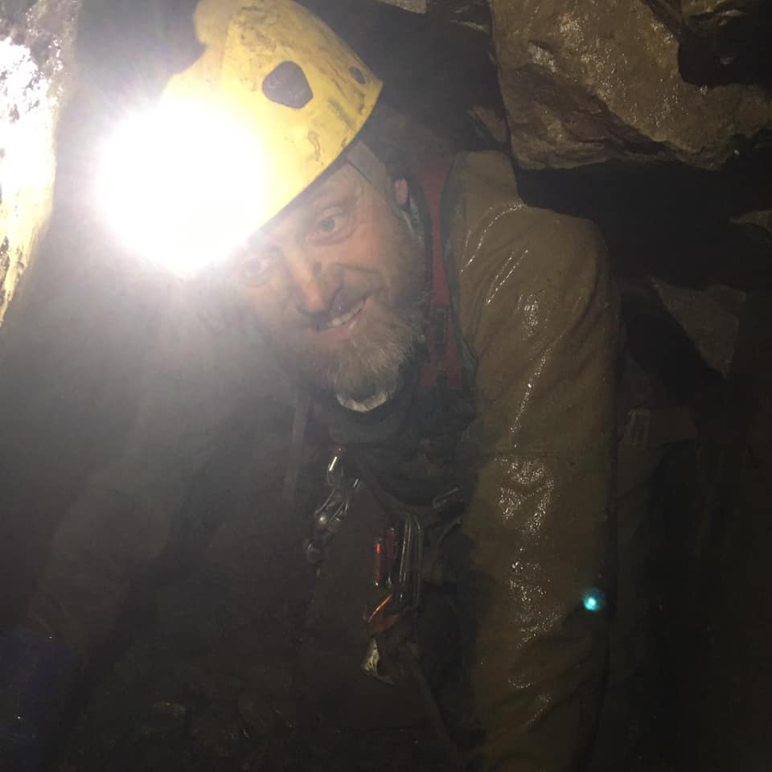

# Boggarts Roaring Holes (2001 extensions)
**23rd December 2020**
**John Martin and Mick Ellerton**

**Grade 4 or 5**

I'd attempted Boggarts previously in December 2008 with Ben Seal, Mark Stoneman and Henry Exon, I think! I remember a dead sheep in one of the entrance pitches which most of us successfully negotiated on the way down and out but Ben managed to partially dislodge on the way out, resulting in bits of dead rotting sheep dropping onto his head. We got as far as Punani passage where time constraints got the better of us. Plus the fact that this low crawl had water flowing down it and I didn't fancy building a dam to divert it.

The 2001 extensions provide the more interesting route; it's in the infamous "[Not For The Feint Hearted](https://www.inglesport.com/product/not-for-the-faint-hearted/)" book. It's a long trip, the books says 6-8 hours are required. Various parts of the description add to the trepidation before the trip; descriptions of awkward passages, descending sideways crawls, thrutchy crawls and flat out crawls ending at pitch heads. Pitches are "narrow and awkward at the top",  pitch heads involve  "rigging and negotiating the pitch involves some awkward manoeuvres"  and some have difficult rigging. There's squeezes, squeezes that require SRT being taken off, squeezes that require SRT kit being taken off and that lead directly over the pitch head. 

I can't find an updated grade, length or depth but it's probably grade 4 - "caves and potholes which present some hazard, difficulty or large underground pitch" and possibly grade 5 - "caves and potholes which include very strenuous sections or large and wet underground pitches". There are 10 pitches requiring 175 metres of rope. I was a bit nervous. The good thing about the trip was that the cave had recently been rebolted with resin anchors so there wouldn't be any faffing about with hangers.

I didn't fancy my chances of successfully transporting some nice food all the way to the bottom of the cave so I thought I'd treat myself before the trip and I had a substantial breakfast instead, supplied by [Ye Old Naked Man](https://yeoldenakedmancafe.com/) cafe in Settle. True to form I panicked a bit about running out of energy so I had a sausage roll ( it was quite big), a meatball slice (very nice) and a corned beef Cornish Pasty (not a great choice, the mashed(?) corned beef oozed out as I bit in to it and felt distinctly slimy). Plus a piece of shortbread. It worked though, I wasn't hungry all day.

In the end it was basically ok. Definitely a difficult trip with lots of awkward sections but no where near as bad as I thought it might be from the description which is, of course, the whole point of the description. It's designed to put people off the more difficult caves!

For me the biggest difficulty was the squeeze above Loose Tooth Pitch. This is a tight squeeze about 2 metres long which exits directly into a small chamber above the pitch. NFTFH recommends that you should probably take your SRT kit off for it. I was rigging this pitch  and after a couple of attempts at the squeeze I managed to get through with my SRT kit on but with most of the hardware carefully arrange so as not to catch on anything. The squeeze is at a bit of an angle so I wanted to go in on my back / left hand side. Unfortunately this means that at the exit, whilst I could just about twist my head and see the bolt that I had to clip on the left hand side I couldn't get my arm round to clip it. From what I could see I didn't fancy trying to drop out head first into the chamber, It looked inevitable that I would then fall down the pitch. Mick took over, took his SRT kit off and eventually slid through on his belly, allowing him to clip the bolt. 

With the safety of the rope I slid through the same way I tried before but just popped out head first over the pitch head. It was actually quite easy to control the exit and not fall down the pitch, I never weighted the rope. Having got through with my SRT kit on I was confident that getting back would be ok, even if entering the squeeze looked awkward. 

After bottoming the cave we got back to the squeeze and I found out that I was wrong, getting back through involved a lot of faffing and aborted attempts. In the end I took my SRT kit and oversuit off even though I'm sure that the thickness of the oversuit made no difference what so ever. Mick and John did it first go, of course. 

All the crawls seemed just a bit more awkward on the way out as well. Pitch 4 is a rift with some stacked deads in it and needs a 5 metre handline. On the way out I found this really awkward as the rift was just the right width to get the tackle sack jammed in.

It was a five and a half hour trip in the end, probably would have been 5 hours or a bit less if I'd committed to the squeeze above Loose Tooth pitch first time. Strangely, even though it is a tiring trip I didn't come out feeling that tired really. Even more impressively I hadn't required a pee throughout the trip, something any man over 50 will appreciate as a major result.

[CNCC description and rigging topo](https://cncc.org.uk/cave/boggarts-roaring-holes)

[surveys at cavemaps.org](http://cavemaps.org/cavePages/White%20Scar__Boggarts%20Roaring%20Holes.htm)

Thanks to Mick Ellerton for the pictures.

<figure style="text-align: center;">
  
  <figcaption><i>Squeeze before Loose Tooth pitch</i></figcaption>
</figure>

<figure style="text-align: center;">
  
  <figcaption><i></i></figcaption>
</figure>

<figure style="text-align: center;">
  
  <figcaption><i></i></figcaption>
</figure>

<figure style="text-align: center;">
  
  <figcaption><i></i></figcaption>
</figure>

<figure style="text-align: center;">
  
  <figcaption><i></i></figcaption>
</figure>