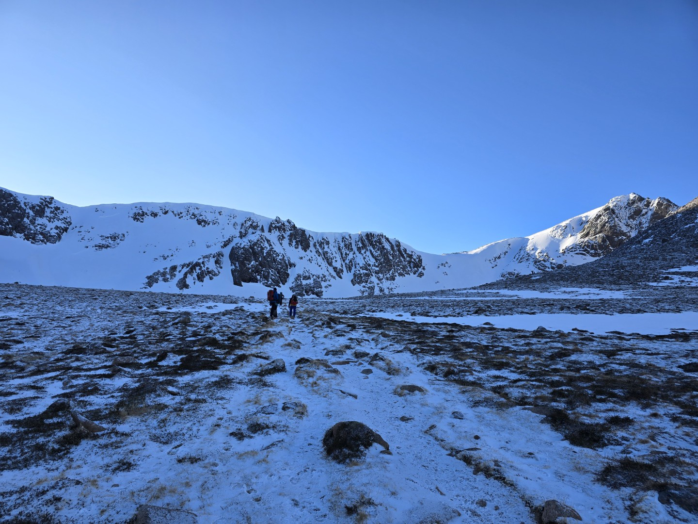
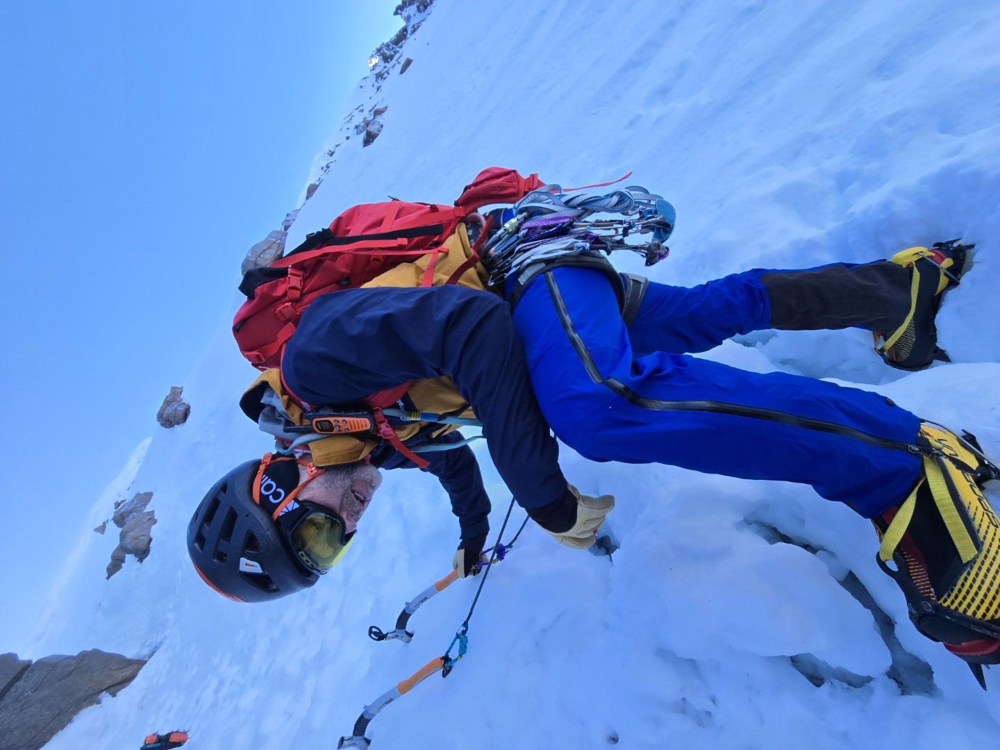
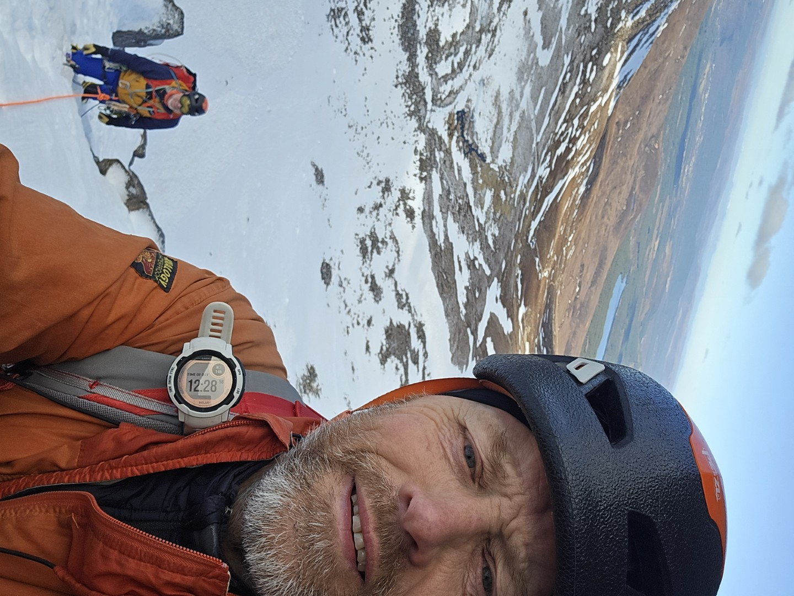
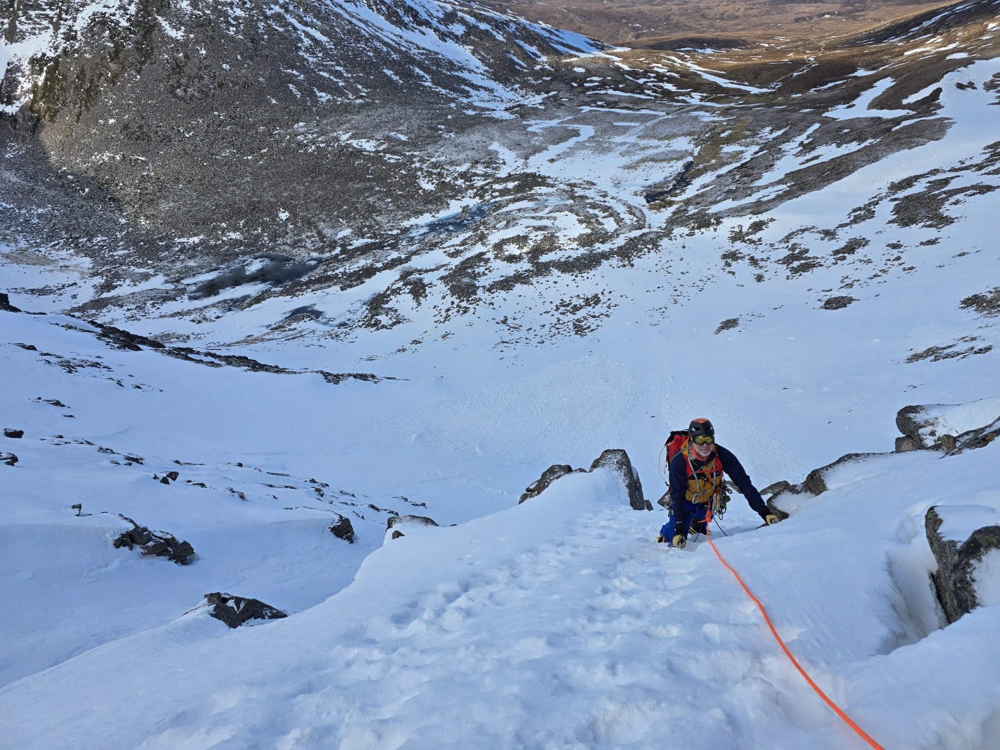
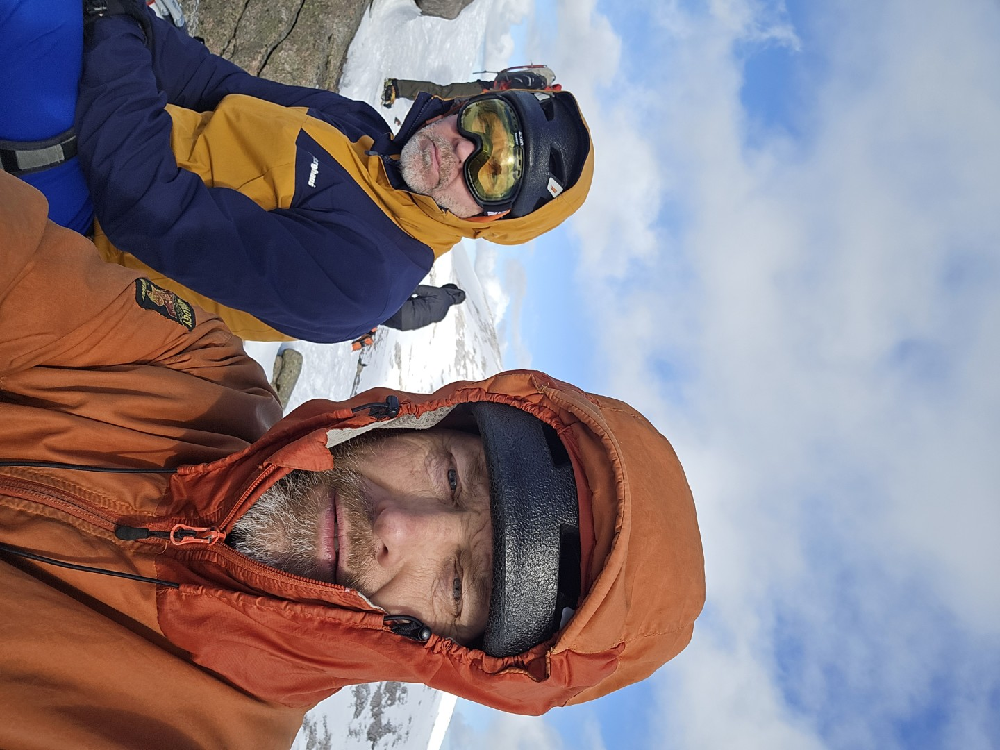
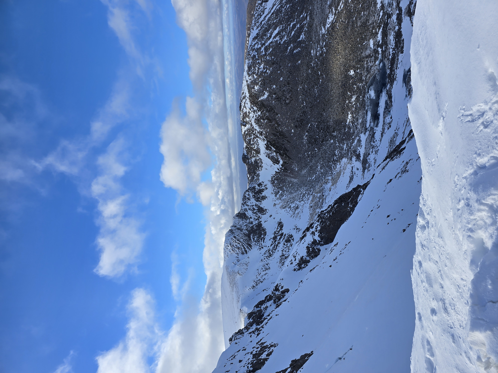
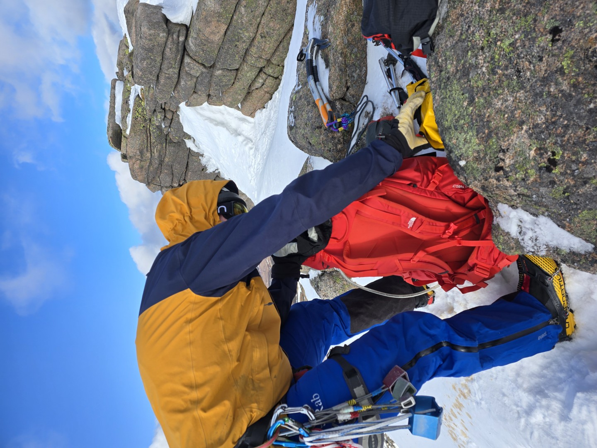
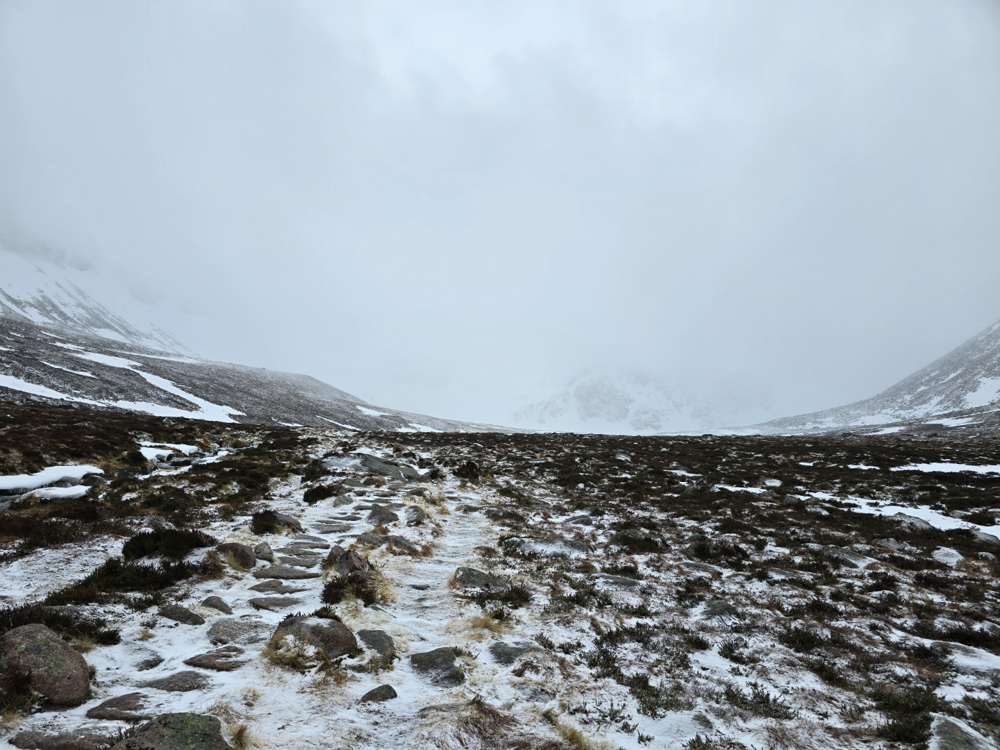

# Cairngorms Winter Climbing

**28th February 2026**
Hmm, winter climbing in Scotland. It's great, rubbish and scary. Great because it's such an adventure, rubbish because the conditions are so fickle and scary because there's generally less protection, or it needs digging out to start with, or the rock you put a sling around is only frozen in rather than physically attached to the rest of the hillside.

I'd first climbed in winter with Stuart decades ago but only recall one trip and never really did anything else. After covid and lockdown for some reason I decided to go again. Simon Gannon was keen and luckily [Olly Roberts](https://www.ollyrobertsoutdoors.co.uk) ) and later Simon Brocklebank were doing their [Winter Mountain Climbing Instructor award](https://www.mountain-training.org/qualifications/climbing/winter-mountaineering-and-climbing-instructor/) so we got free coaching and experience from people who knew what they were doing.

Last year the conditions weren't quite as good and they never quite aligned with our free time. We'd got to the age where we had to drive up one day, climb for four days at the most (although realistically three days on a Scottish winter hill was enough) and then drive back on another day. Driving and climbing on the same day was too much and seeing how Simon did all the driving and didn't want to double up, we didn't do it. We'd also had a few trips where we had one good day, one average day and then soft slushy conditions or rain.

This year we booked off the time but left booking the accommodation till the a week before when conditions were good. Obviously over that week it warmed up, big loose cornices formed and of our three climbing days the last one looked rubbish. By the time we drive up the first half of the first day looked good, after that it was forecast to either be too warm or raining. Bugger.

**Saturday 28th February 2026**
The forecast was subzero until midday then maybe getting up to 2°C, light winds and loads of sunshine. The plan was to get to the Cairngorm Coire Cas carpark by sun up at 7am and climb in Coire an t-Sneachda. It's a friendly crag and we knew it reasonably well which helps when you don't do a lot of winter climbing, or climbing in general over the past year. There were reports of big loose cornices and [Olly](https://www.ollyrobertsoutdoors.co.uk/) confirmed it with recent photo. Jacob's Edge (110m II 1 star) looked like a safe bet though so that was our target. 

<figure style="text-align: center;">  <figcaption><i>Coire an t-Sneachda</i></figcaption> </figure>

In the end the weather was fantastic, cold, dry and not windy. Simon did his normal level of faffing at the bottom - putting on waterproof trousers, getting cold hands etc. He had two radios to use which makes communication on the pitches much easier. I'd put mine in my pocket as I thought it wouldn't stay on the my rucksack shoulder strap, Simon thought otherwise. By the time we'd soloed up the easy snow slope to the start of the first pitch there were two groups ahead of us, one was just slow.  At this point a raising of the arm by Simon launched his radio down the slope, it did some impressive cartwheels and various bits disappeared in different directions.  Then it was our turn; Simon set off to lead and his left crampon fell off. After that it was plain sailing, there was no cornice at the top and the weather stayed fantastic. Stroll off the top and down to Tiso's for coffee and cake.

<figure style="text-align: center;">
  
  <figcaption><i>Not yet inspecting his crampon. This was just before Simon set off on the first roped pitch - after he'd launched his brand new radio down the slope but before his left crampon fell off. oops!</i></figcaption>
</figure>

<figure style="text-align: center;">
  
  <figcaption><i>Looking back down Jacob's Edge</i></figcaption>
</figure>

<figure style="text-align: center;">
  
  <figcaption><i>Last pitch of Jacob's Edge</i></figcaption>
</figure>

<figure style="text-align: center;">
  
  <figcaption><i>Top of Jacob's Edge. I don't know why Simon has a man fastened to his ear.</i></figcaption>
</figure>

<figure style="text-align: center;">
  
  <figcaption><i>Fiacaill Ridge</i></figcaption>
</figure>

<figure style="text-align: center;">
  
  <figcaption><i>Faffing at the top</i></figcaption>
</figure>

Tomorrow's plan: up at six, check the forecast, climb in Fiaciall buttress of the weather was good enough, walk up Fiacaill ridge if it wasn't. Olly reckoned it would be OK tomorrow, despite the mixed forecast.

**1st March 2026**
Walked up.
Got wet.
Talked to some people who had turned around.
Got blown about.
Turned round. Found the best climbing conditions in the area - [The Ledge](https://www.theledgeclimbing.com/)

<figure style="text-align: center;">
  
  <figcaption><i>Sub optimal conditions. Rain, snow & howling gale not pictured.</i></figcaption>
</figure>

**2nd March 2026**
The forecasted rain never arrived but it was still forecast to be too warm. Instead we went up Fiacaill ridge and back round to the carpark, had a good look at the conditions to see what had disappeared. Not many people were climbing although it seemed that conditions were OK and the melt hadn't started. 

I think in future if it's a marginal forecast we should always get up early, walk in to the base with climbing kit and then decide. You never quite know until you get there. Or just go to Norway.

