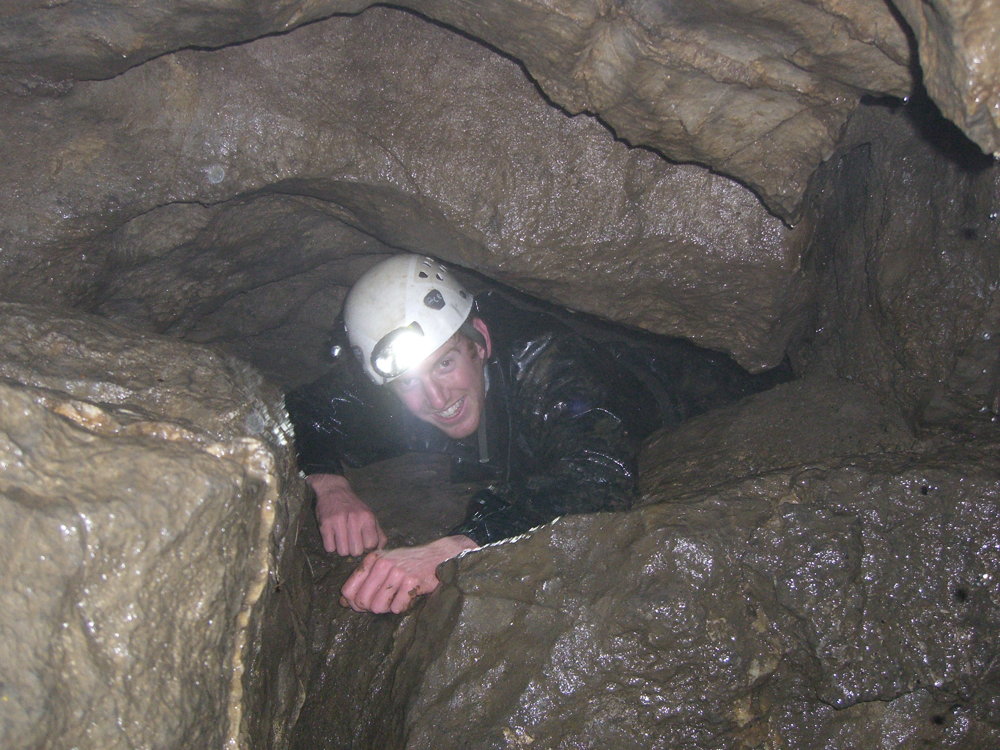

# Cherry Tree Hole, Darnbrook
**Monday 12 December 2011**

Grade 4    Length 1200m  Depth 41m  

Jonathan Tompkins, Henry Exon

[Surveys](http://cavemaps.org/cavePages/Darnbrook%20and%20Cowside__Cherry%20Tree%20Hole.htm)

A quick evening trip down a cave, what could possibly go wrong?

Nothing serious as it happened, although the trip certainly could have been made easier and a bit more successful. Cherry Tree Hole joins the ever growing list of "caves I need to revisit to get to the bottom of". I blame Henry, obviously.

It's been wet in the Dales for a few weeks and there was rain forecast for Monday night. It was also cold. Very cold and with horizontal rain, to be precise. Some bloke on [UKcaving.com](http://ukcaving.com/board/index.php?topic=12111.msg156773#msg156773) who I've never met and don't know in the slightest said that Cherry Tree Hole doesn't flood. That's good enough for me. It's also described as difficult to find until you're on top of it, not ideal when you've never been before, it's pitch black and there's a gale blowing.

I visited Darnbrook House to ask for permission which was readily given. The lady expressed some bemusement as to why I'd want to walk up a hill in this weather but she didn't go as far as to say I was an idiot. I then drove back to the parking spot to meet Henry. It was properly raining by now but there wasn't a river flowing down the road, always a good sign. We kitted up and then I told Henry of my crafty plan to use my phone's GPS and Google Maps to navigate to the cave, thereby saving us the embarrassment of getting lost on a bleak moor in a storm. This plan was too good to be true as it failed as soon as I bragged about it to Henry and showed him my phone. No data connection, no Google Maps navigation. Bugger.

We had a real map and I had a compass so we set off, luckily with the wind at our backs. The farm was easy to find, as was the track up the hill. We completely missed the first footpath off to the right but located a higher fence we could follow. We followed it and found nothing so we turned around, went back to the wall fence junction, measured the distance from the map and paced it. Success! It would have been almost boring to do it right first time.

Cherry Tree Hole is well named. It's a hole with a cherry tree in it. We climbed down into the hole and at last got out of the wind. It was actually dry at the bottom of the hole because the wind was blowing most of the rain over the top of the hole. I wasn't dry though, specifically my crotch wasn't dry. It seems I have a few holes in my waterproof caving suit.

The description says to "climb down the shakehole with care finding the way on between boulders on the N side. Ladder the first 4m pitch." It's changed a bit since then, now you climb down a scaffolded wide chimney. Where the scaffold stops there is an awkward climb down which Henry managed unaided. I didn't like the look of it so tied  a rope to the scaffolding to use as a handline. At the bottom we investigated a few holes looking for the ladder pitch but nothing matched the description. Turns out that we'd just free climbed the ladder pitch! One hole we looked at appeared to have a slightly loose climb down. I kicked a big boulder to show Henry it was safe but he said he could feel the vibrations. I didn't think it was that bad but when Henry doesn't want to climb something then I don't contradict him as he's a far better climber than me. Later on he'd obviously changed his mind about dodgy looking loose climbs as he ambled across a horrendously loose scree slope that was perched above a drop.

We soon located the correct route and I ditched the now useless ladder I'd brought. The next section was about 5 metres long and involved crawling in a passage that was just bigger than body shaped above a narrow rift that was about the size of my knee. Luckily I got to the other side with my knees intact and didn't manage to jam them down the rift. After a quick look up North Stream Passage we set off down the dry Crossover Passage which involved a lot of thrutching, crawling and squirming, with bits of walking thrown in. Most of this was a long abandoned part of the cave as rather than smooth water washed rocks all we saw were squared sided blocks. It was almost like being in a mine, albeit a very small one that had been mined by children. Small children. A lot of it also looked loose. 

At Main Junction we met the streamway and headed downstream along South Stream Passage. This was mostly walking with bits of climbing, and more loose rock. We soon got to the cascades where the height of the water levels meant we wouldn't be going any further. Originally we had wanted to get to the terminal sump. Before we'd entered the cave we'd had a discussion as to whether we should take ropes and SRT kit for the final, second pitch. The description says "leads to a pitch and final sump". I wasn't keen on lugging a rope and SRT kit all the way to the end of a cave just to abseil down a pitch to look at a pool of muddy water. Henry persuaded me that we'd only have to come back later to finish it off if we didn't do it now. So through all this crawling and thrutching and squirming we'd both carried a bag. Turns out we shouldn't have bothered, a few small waterfalls and some fast flowing water meant we couldn't get any where near the final pitch. We ditched the bags and investigated a crawl that looked like it might bypass the cascades. It didn't, although it did allow Henry the opportunity to show he'd overcome his fear of loose stuff by ambling across the loosest scree slope I've ever seen in a cave. I followed, thinking that if Henry did it then it must be OK. It wasn't and I don't intend going back.

<figure style="text-align: center;">
  
  <figcaption><i></i></figcaption>
</figure>

So we turned around, picked up our bags and headed back to Main junction. We now went upstream along Far Stream Passage. This also soon turned into a dead end in a large chamber. I think we had to follow the water but this would have involved getting stuck in a very narrow passage with enough froth in it to make me think it was flooded. There was a dodgy looking climb over it but neither of us had the enthusiasm for that. The only other way on was a crawl in a stream through a decidedly insecure looking boulder choke. If there's one thing I really like about Henry it's that he's not afraid to back off. 

We decided to turn round and headed out. We still had to walk off the hill in a storm and I didn't want to miss our call out time. It wasn't long before we arrived at the entrance chimney where I was very glad of the rope I'd put in place. I think I'd still be there without it. At the top Henry pointed out the three big shiny bolts that we could have tied the ladder to! The walk back to the vehicles was far worse than the walk up, the wind and rain was in our faces and we both fell over. Back at the road there was now a small stream flowing past my van. Hmmm. 

I actually quite like Cherry Tree Hole and will definitely be back to finish it off. Might wait for better weather though.