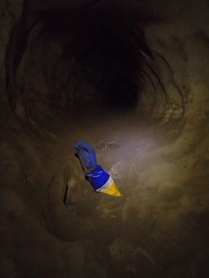

# Cow Pot
**26th February 2013**

Me and Olly Rees

Armed with a permit I was looking forward to striding confidently through the throngs of pirate cavers, waving the permit and adopting a superior, condescending tone as I admonished them for their selfish behaviour and lack of respect for THE RULES.

Unfortunately there was no one there except the farmer who wasn't at all interested in permits.

We kitted up at Bull Pot where I realised that taking my Petzl Stop to work for use on a charity abseil was not a good idea as I'd left it behind. Luckily Olly had a spare fig 8 I could use that was, I'm sure, the worlds smallest, skinniest fig 8.

Rigging the first pitch on smooth 9mm and a tiny fig 8 reminded me how useful a Stop is. Locking off the fig 8 wasn't easy and I ended up using two extra friction krabs just to make the descent comfortable. The top of the entrance pitch has two P bolts on the top of the initial rock platform followed by a single bolt rebelay a few metres down the wall. A rope protector for the edge would enable you to relax your sphincter!

At the base of the pitch a short slope to the south leads to a constricted slope and then a constricted drop / climb, both currently with insitu handlines.  Lying down on my side I slid into the first constriction and promptly started to get my Croll jammed. After all my faffing in Large Pot I couldn't face the prospect of another failure so off came the harness and I promptly slid through the gap like a well oiled potatoe. The second squeeze was also problem free without a harness.

We hadn't brought the CNCC rigging guide and couldn't remember if the next 30 metre rope was for a traverse or had a vertical pitch as well. Either way I wasn't keen on rigging it on a fig 8 so handed over to Olly. The traverse starts easy enough but the as the stream drops away it also widens but the bolts stay high in a narrow rift. It's awkward to say the least; you either lie horizontal underneath the rift and hope your arms are long enough or stand up in it. There are multiple Y hangs available but by the end of the first hole we were no where near the end of the rope so assumed it must carry on to the next hole. Olly descended this and decided the constriction at the bottom didn't look inviting so came back up. Turns out this is Sneaky route and the first hole is Direct route. A Y hang at the start of the first hole is Devious route which is the gulley ladder route.

The descent into Fall Pot is impressive and very interesting on the worlds skinniest fig 8.

The plan for the day was a general mooch around. We headed over to the impressive Montagu East before looking for Lancaster Hole via Kath's Way. Navigation through Montagu Cavern using the survey is not straight forward but once you've found the key points it's actually quite easy. After finding Lancaster Hole we headed south east from Bridge Hall towards the Graveyard. A 7 metre pitch was negotiated with two lengths of 8mm cord that we had in our bags. The Graveyard is worth a trip just to see the stalagmites festooned on the mud banks. The survey seemed to show a circular route back to Bridge Hall but it ended in a choke. Reading the Red Rose description later on describes a loose choke that connects to a dug hole below the Colonnades climb in Bridge Hall. Very loose I think as it's collapsed.

It was getting late now so we headed out. Ascending Fall Pot was tiring as I'd been ill the week before so wasn't fit. Derigging the pitch head was a faff and the two constrictions proved interesting. Olly nipped out at this stage to cancel the callout. I couldn't climb the first constriction and had to prussik up one of the knotted, partially frayed handlines that constantly pinged over a sharp edge. The last constriction was easy, once I'd taken off my harness and arranged the bags that Olly had left.

All in all a great way into Ease Gill. Highly recommended.

<figure style="text-align: center;">  <figcaption><i>Will it go?</i></figcaption> </figure>