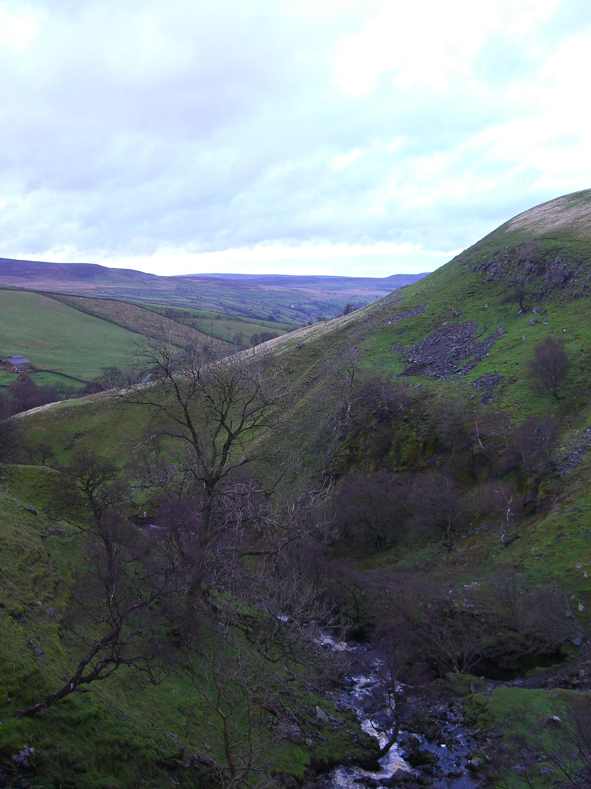
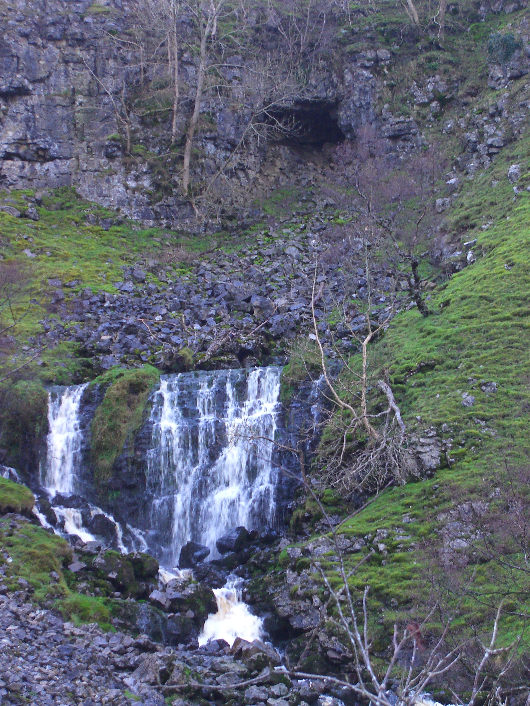
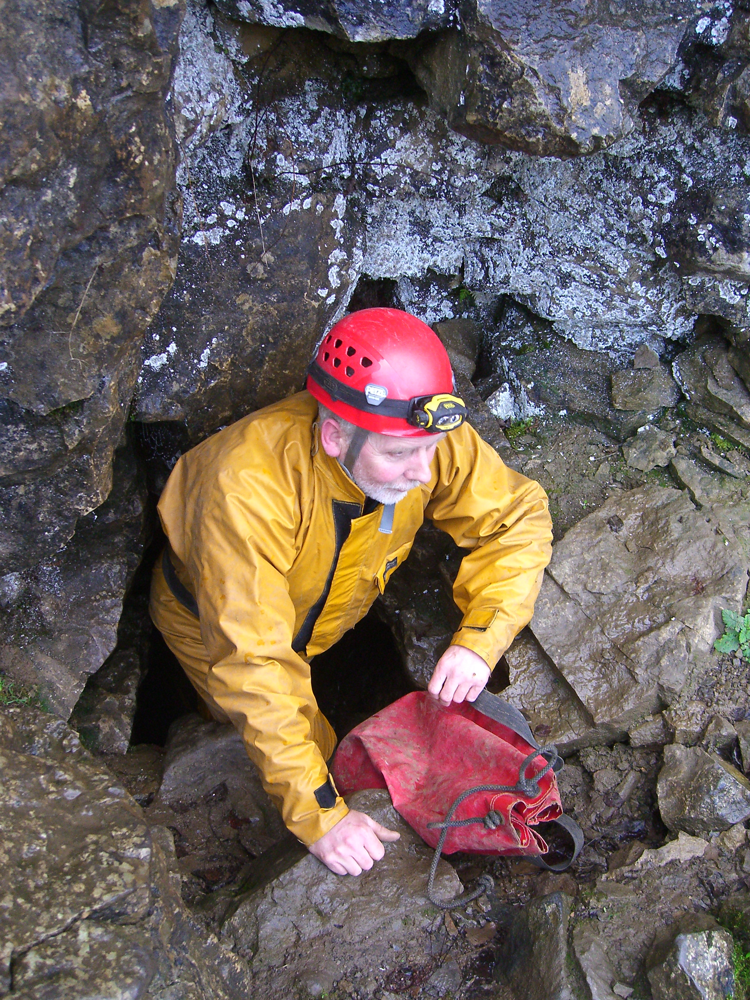
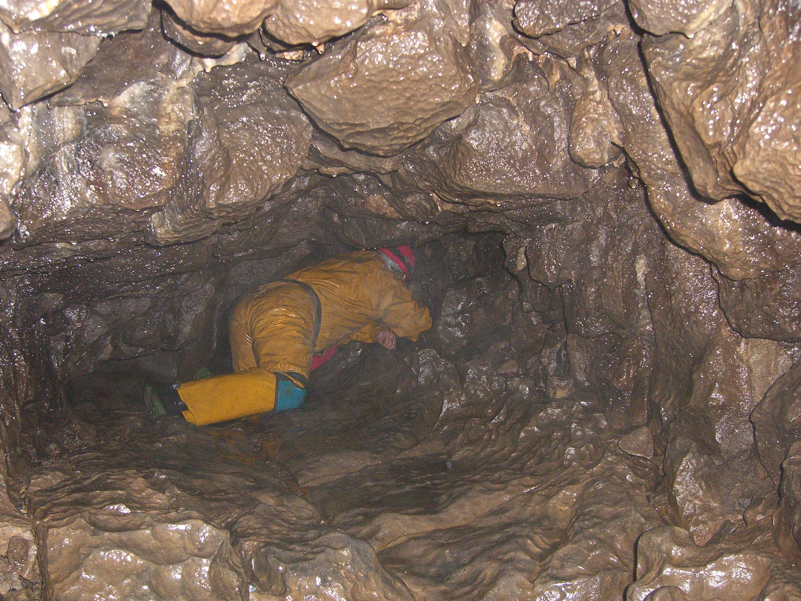
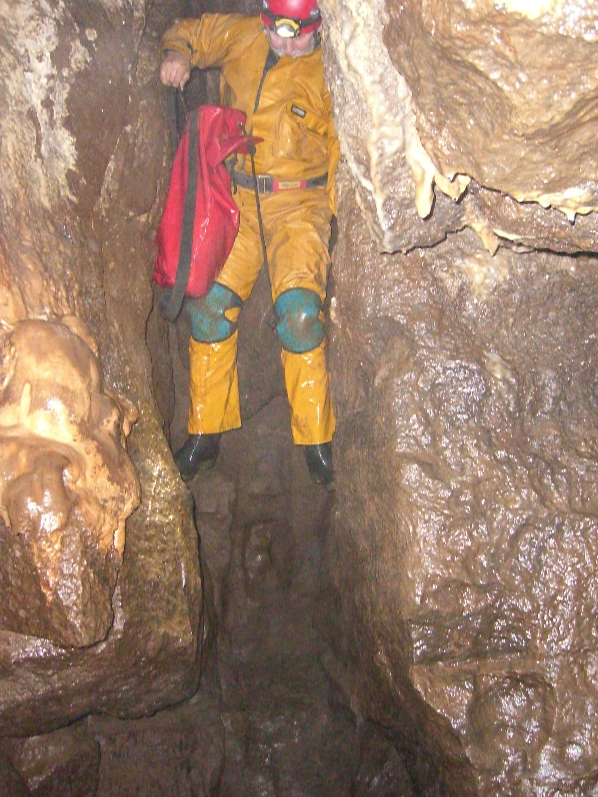
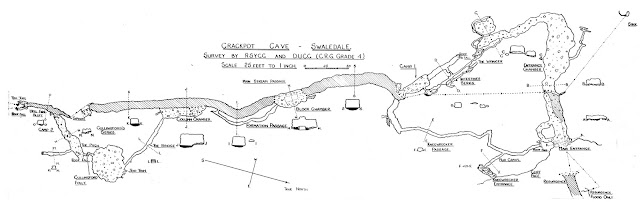


# Crackpot Cave, Swaledale
**Friday 02 December 2011**

Grade 2    Length 550m     

Jonathan Tompkins, Mike Hirst

[Surveys](http://cavemaps.org/cavePages/Swaledale%20and%20Arkengarthdale__Crackpot%20Cave.htm)

<figure style="text-align: center;">  <figcaption><i>View from the cave entrance</i></figcaption> </figure>

I usually charge my batteries in my van either on the way to or from a caving trip. Recently the charger stopped working so replaced the fuse, feeling quite smug that I'd fixed something electrical. Stupidly I didn't test it. I set off to Hawes to pick up Mike, plugged in my charger and realised my error. No problem, I'd buy some batteries in Hawes.

I didn't.

I had a set of charged batteries and Mike had a spare set and it was only a short cave so surely I wouldn't need them?

We drove over past the Butter Tubs to Swaledale and along to Crackpot. A nice lady at Summer Lodge Farm gave us permission to enter the cave and let us park near the house. She told us there were two ways to the cave, either up the track and along the top or up the valley. The latter option looked nicer and we had a beautiful walk along Summer Lodge Beck.

<figure style="text-align: center;">  <figcaption><i>Entrance</i></figcaption> </figure>

Crackpot Cave is obvious; a large opening at the foot of a limestone scar with an impressive waterfall below it. We were going in via Kneewrecker entrance, mostly because the main entrance description said things like "boulder choke", " series of crawls" and "too tight". Mike had been here before, long ago in the mists of time as far as I could gather. Certainly he regularly said "I don't remember this bit" during the trip.

<figure style="text-align: center;">  <figcaption><i>Mike just fits in the entrance</i></figcaption> </figure>

Kneewrecker entrance is a short feet first squeeze to a small chamber; immediately I realised that my charged batteries weren't charged much. Out they came and in went Mike's spares. I really must fix that charger. You soon arrive at a junction, right quickly arrives at a dead end and left is more hands and knees crawling. As always at the start of a trip I tried to stay dry when ever I met a puddle. In a low crawl this involves doing some sort of Pilates style core exercise; body held rigid with only my feet and hands touching the ground. So I stayed dry by was knackered. 

<figure style="text-align: center;">  <figcaption><i>Kneewrecker passage</i></figcaption> </figure>

After what seemed like ages the crawl ended and we were in the suprisingly well decorated main streamway. There were some very nice straws and stall, not what I was expecting at all. Turning downstream soon came to a choke. There are crawls through this but we didn't bother. Instead we headed upstream past more formations, ignoring the oxbows, and soon arrived at Column Chamber, which, unsurprisingly contains a column. This has been cleaned up and looks impressive. The main passage continues to another boulder choke but just before it there is a side passage that leads to a chamber. The roof is covered in pristine straws and on the floor, on top of the jumble of rocks, there are lots of muddy dumpy stalagmites. There are some crawls off this chamber that lead to the other side of the previously mentioned boulder choke.

<figure style="text-align: center;">  <figcaption><i>Mike displaying his vast repertoire of climbing skills</i></figcaption> </figure>

 After a chat about various caving things we headed out and crawled down all the oxbows to complete the trip. Throughout the whole trip we were constantly discussing exactly how certain features had formed. By the end we both concluded that were weren't exactly sure! Emerging outside we were greated by darkness, rain and a temperature a lot colder than inside. We took the high route back via the track, much easier than the valley route.

A short cave suitable for an evening trip but well worth a look.
<figure style="text-align: center;">  <figcaption><i></i></figcaption> </figure>
