# Rescue practice and scrambling in North Wales
**25th March 2026**

So [[Dave Clark]] ([Instagram](https://www.instagram.com/lakedistrictdave/)) has booked his [MCI](https://www.mountain-training.org/qualifications/climbing/mountaineering-and-climbing-instructor/) assessment and being the organised soul he is he's got loads of mates to be bodies as he practises. I planned to join him for three days in March but a broken van and bad weather changed that to two days. The weather, as always, wasn't super helpful so the first day we went to the [Beacon Climbing Centre](https://www.beaconclimbing.com) and practised various rescues and ropework techniques:
- using a belay device in guide mode and how to release it. We tried using my [Edelrid Gigajul](https://edelrid.com/gb-en/sport/belay-devices/giga-jul?variant=571567) in assisted braking mode combined with guide mode but it doesn't seem to work.
- escaping the system by building a second anchor. A lot of this is avoided using slings or a cordelette instead of the ropes when building the anchor.

The next day we went scrambling on Tryfan with Andy, another MCI aspirant. Between them they practiced lots of short roping, fast belay building and correct rope stacking scramble and snowy, slippy descent down one of the gullies. Thanks to Dave for the photos and video.

<figure style="text-align: center;">
  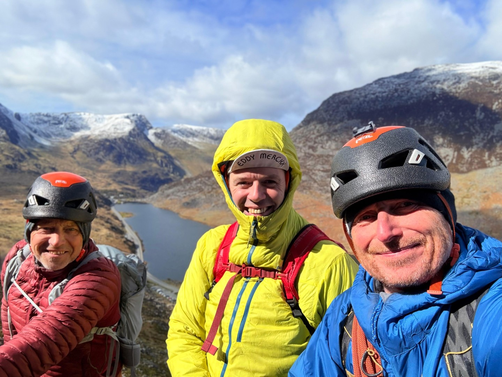
  <figcaption><i>The team</i></figcaption>
</figure>

<figure style="text-align: center;">
  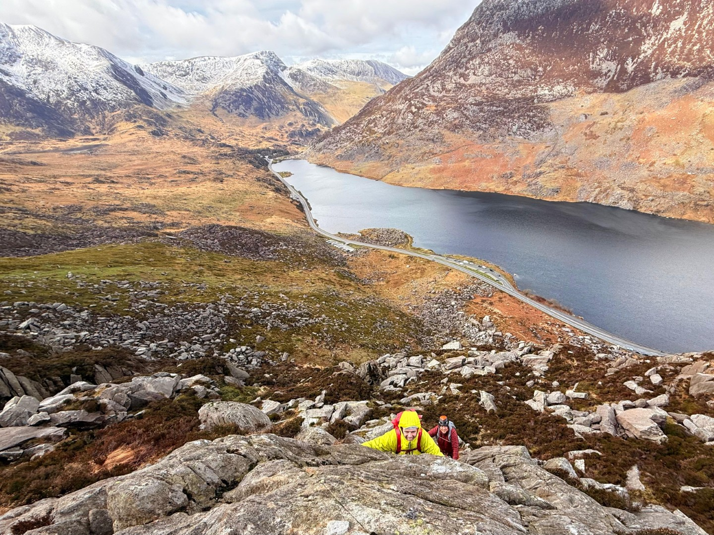
  <figcaption><i>On the Scramble</i></figcaption>
</figure>

<figure style="text-align: center;">
  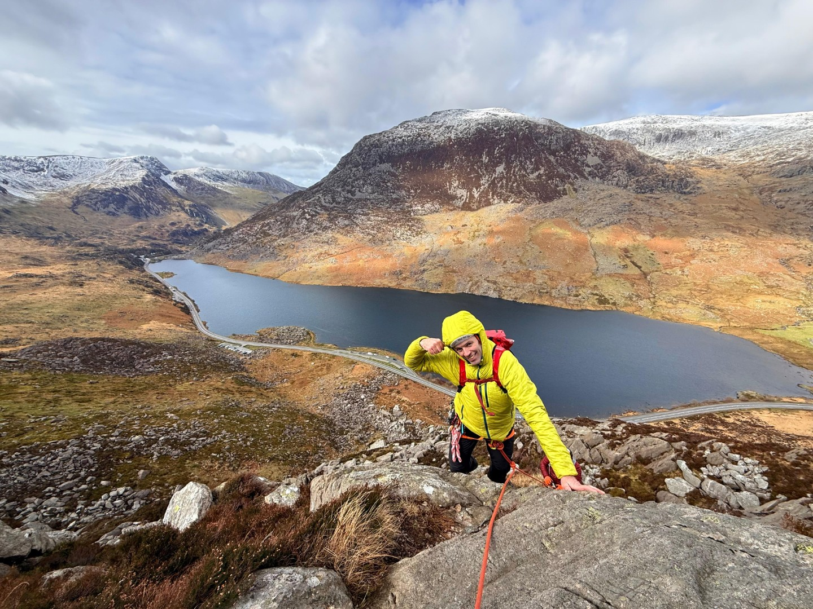
  <figcaption><i>On the Scramble</i></figcaption>
</figure>

<figure style="text-align: center;">
  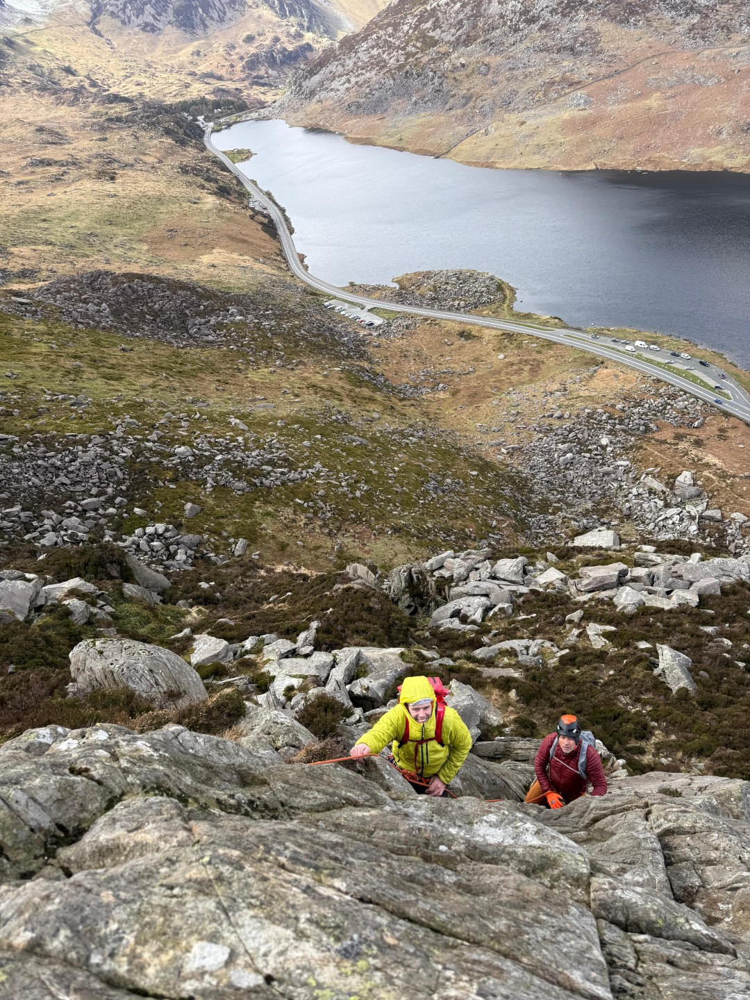
  <figcaption><i>On the Scramble</i></figcaption>
</figure>

<figure style="text-align: center;">
  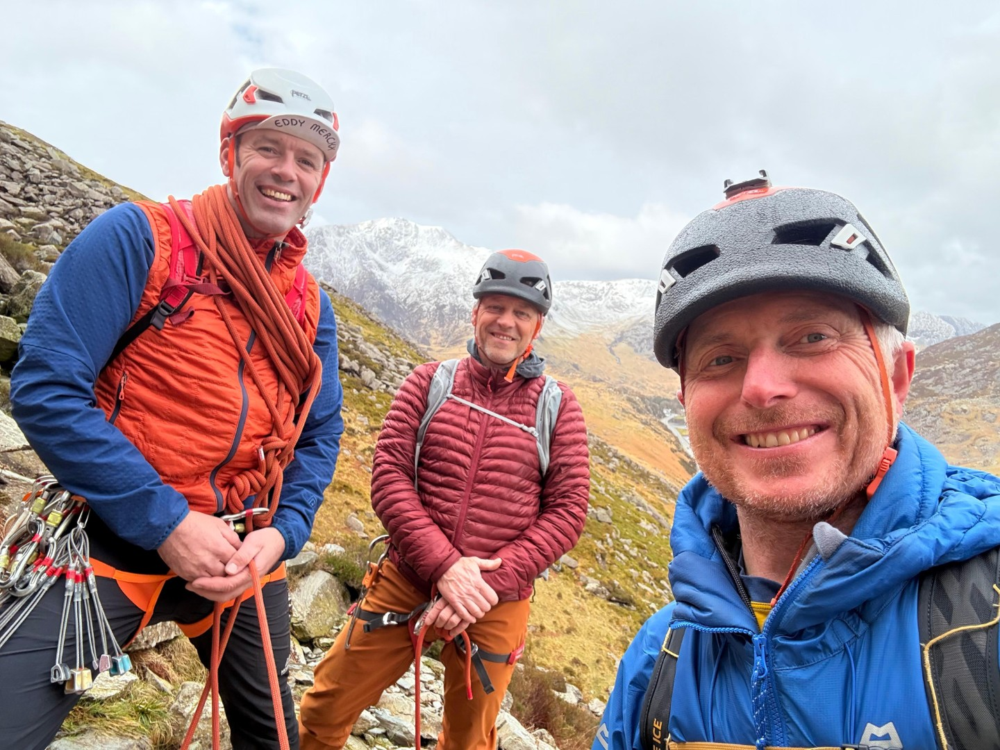
  <figcaption><i></i></figcaption>
</figure>

<figure style="text-align: center;">
  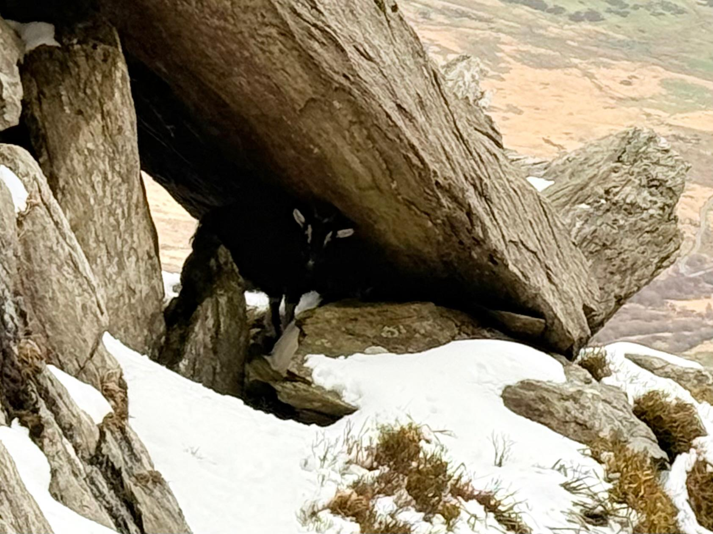
  <figcaption><i>A goat keeping out of our way.</i></figcaption>
</figure>

<figure style="text-align: center;">
  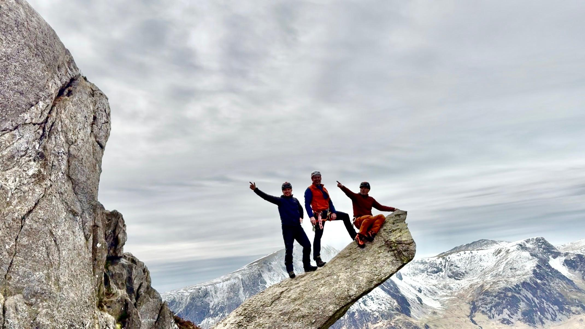
  <figcaption><i>Attempting not to slip off the canon</i></figcaption>
</figure>

<figure style="text-align: center;">
  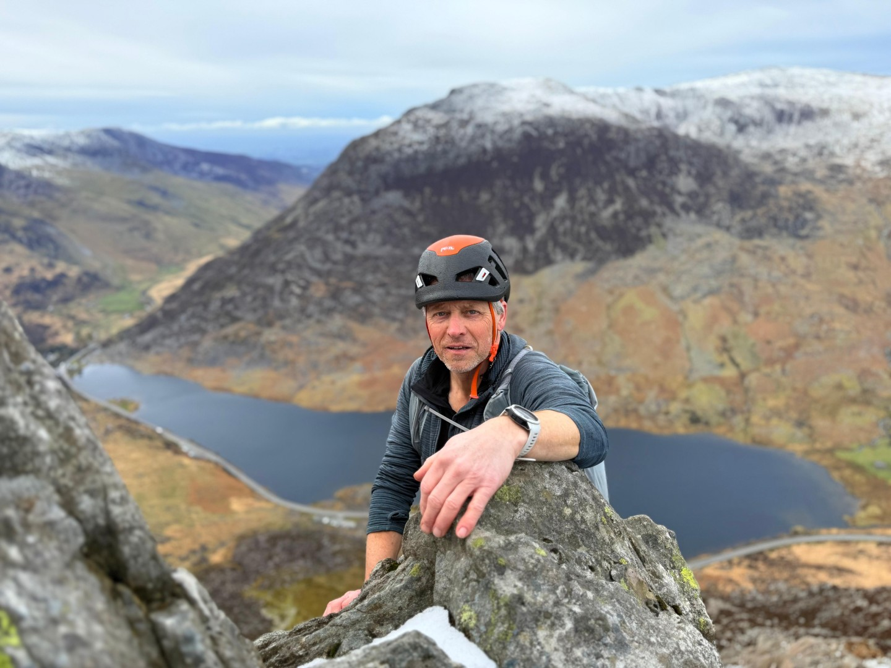
  <figcaption><i>Contemplating how much longer I can last without gloves.</i></figcaption>
</figure>

<figure style="text-align: center;">
  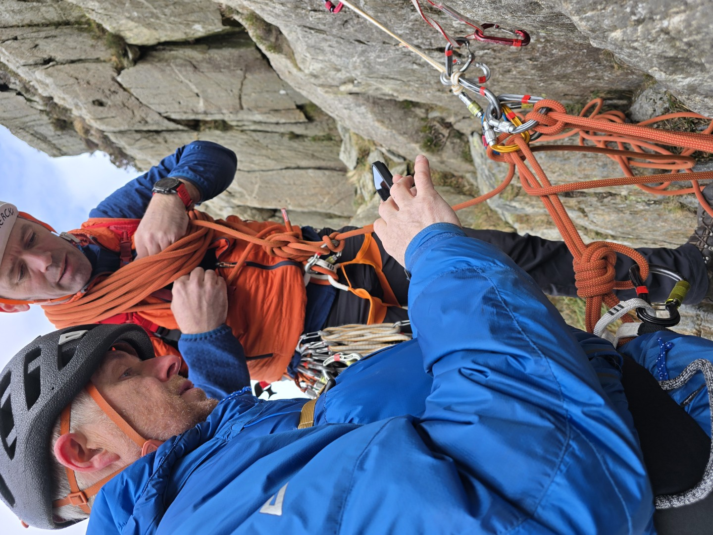
  <figcaption><i>Hmm, which way now</i></figcaption>
</figure>

<figure style="text-align: center;">
  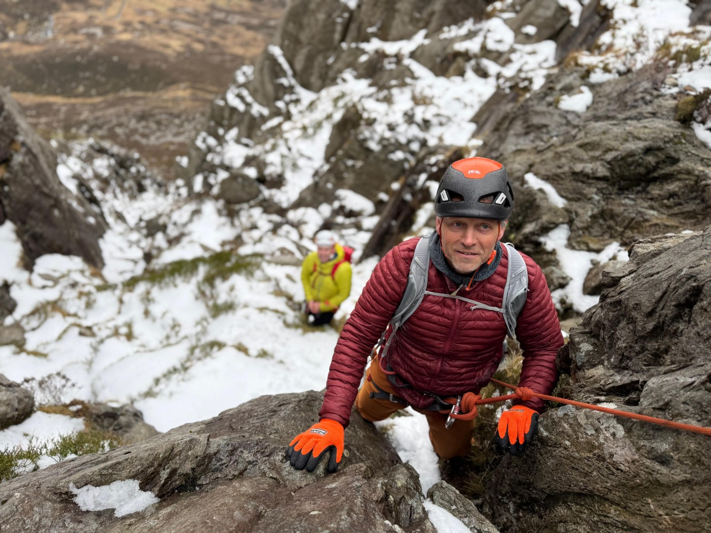
  <figcaption><i>The descent</i></figcaption>
</figure>

<figure style="text-align: center;">
  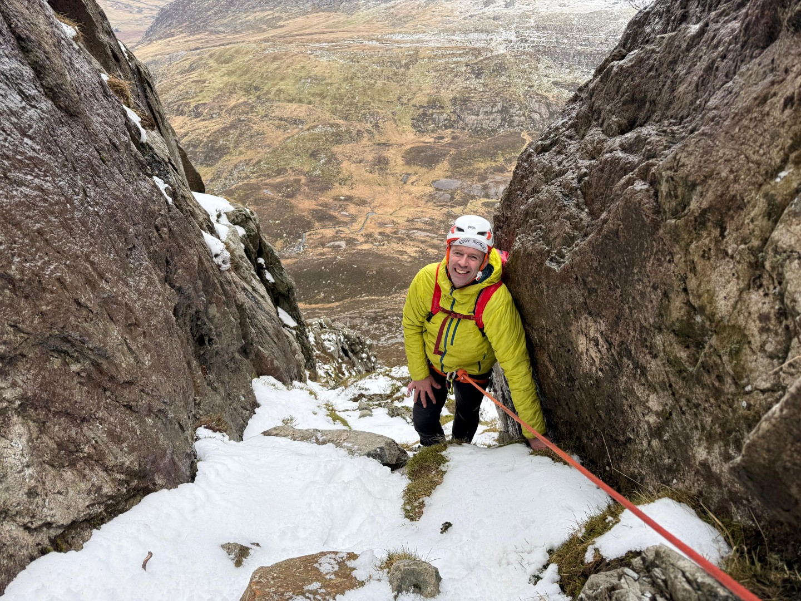
  <figcaption><i>The descent</i></figcaption>
</figure>

<figure style="text-align: center;">
  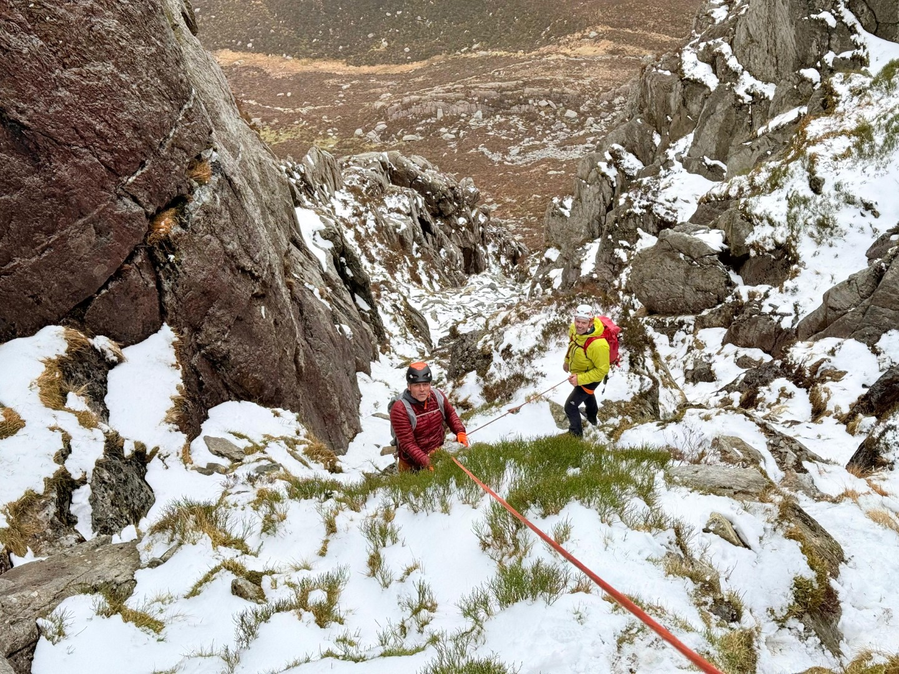
  <figcaption><i>The descent</i></figcaption>
</figure>

Eight hours later, just as it got dark, we were back at the road. Perfect timing apparently. A really good, quality day out. Thanks to Dave and Andy for keeping my alive on that descent.

