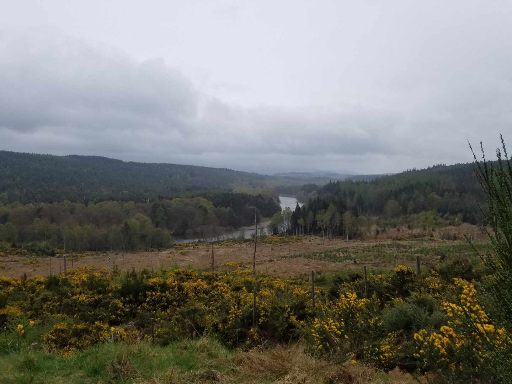
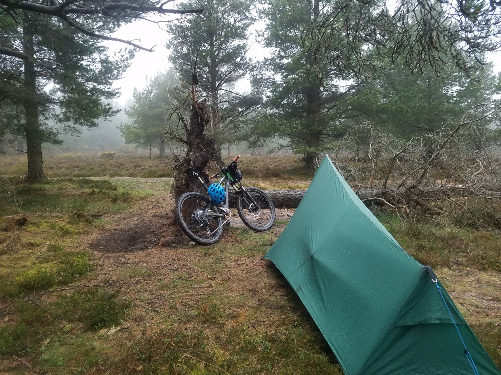
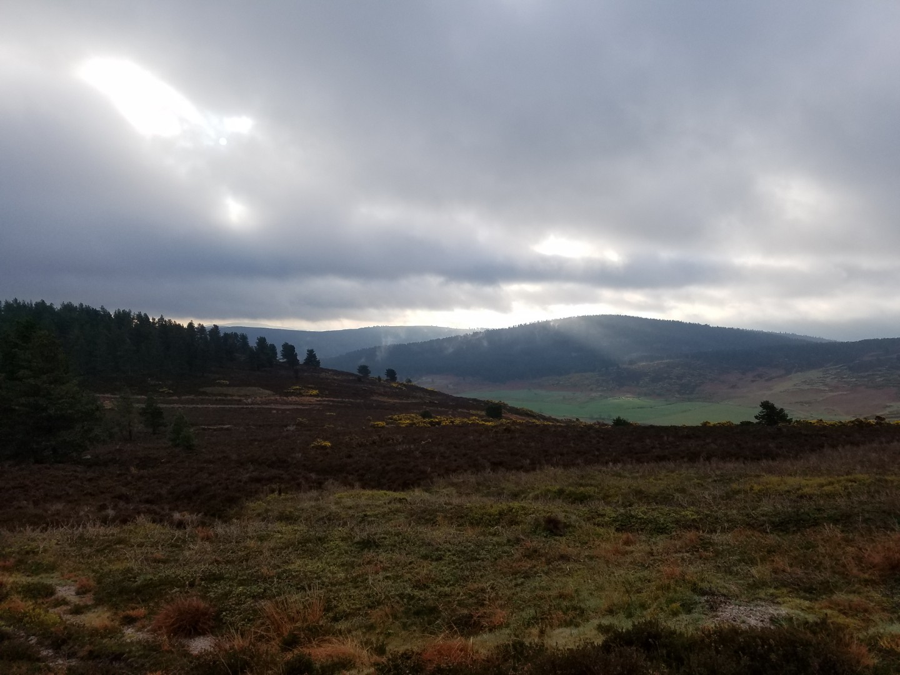

# Day 1 - Banchory to Lamawhillis Hill

My original plan was either the Highland 550 or the Cairngorms Inner and Outer loop. I was put off by potential snow problems blocking the route although as it turned out I needn't have worried, we'd had a heatwave recently and I suspect I could ride anywhere.

Anyway, to avoid snow I linked the Deeside Trail to the Cairngorms Outer loop, 350km from Banchory south of the river Dee to Aviemore and then back to Banchory on the north side. I had 6 or 7 days which should make it quite leisurely, I had no intention of riding as far as possible every day.

**Thursday 25th April**

My first day was a delayed start. I drove up to Aberdeen on Wednesday evening, stayed in the van and watched a film on Thursday morning. After I'd picked up some last minute bike supplies I didn't start riding till about 3pm, not that it mattered.

Whilst at home I'd had a last minute bike emergency. My rear wheel was cracked and needed replacing but luckily Sue had a spare one that I could use. Not that she knew she did - thanks Mr Hargreaves! Being a bit pleased with myself at having averted a potential rim failure in the middle of nowhere I decided to check my chain. Turned out it was quite worn so I replaced that as well. Great, two problems fixed.

After 5km I realised that my memory of when I last replaced my cassette was probably wrong. The first two gears were slipping slightly when pedalling hard on steeper sections. Going back to Banchory to try to replace it would probably mean starting on Friday so I ploughed on. 

I did 33km in 2hr 23 minutes. It was a mixture of forest roads and nice singletrack through woodland, very pleasant although not many views. A bit drizzly towards the end but tomorrow looks dry. The small hole in the flysheet of my tent that I bodged a repair to seemed to be working. I hope it does as it's directly above my head.

My wild camp was on the edge of woodland near Lamawhillis Hill over looking a cloudy valley. Should have a nice view tomorrow. I hadn't passed any streams today which I didn't think was possible in Scotland. To save water I didn't cook, instead I finished my sourdough loaf with squid in olive oil. I should pass a stream tomorrow.

About 20km, 2hrs 710vm 

<figure style="text-align: center;">
  
  <figcaption><i>River Dee near Banchory</i></figcaption>
</figure>

<figure style="text-align: center;">
  
  <figcaption><i>Lamawhillis wildcamp.</i></figcaption>
</figure>

<figure style="text-align: center;">
  
  <figcaption><i></i></figcaption>
</figure>
