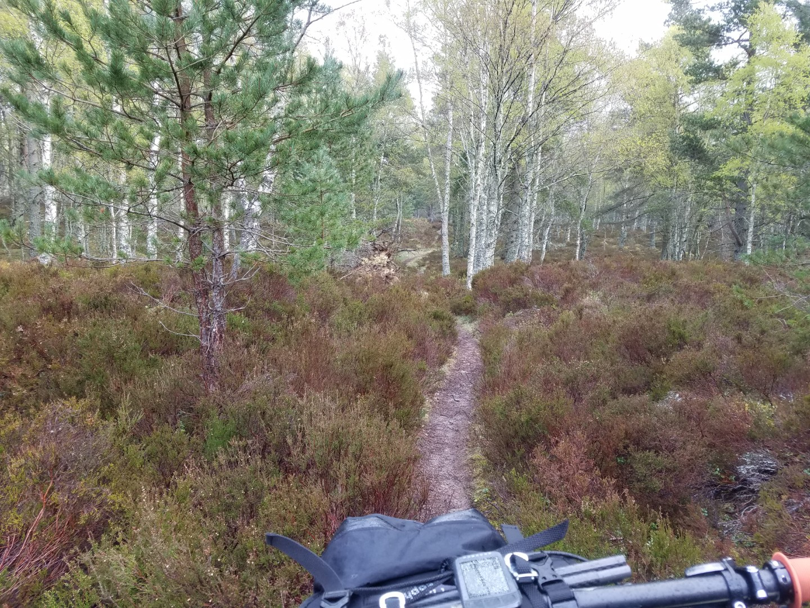
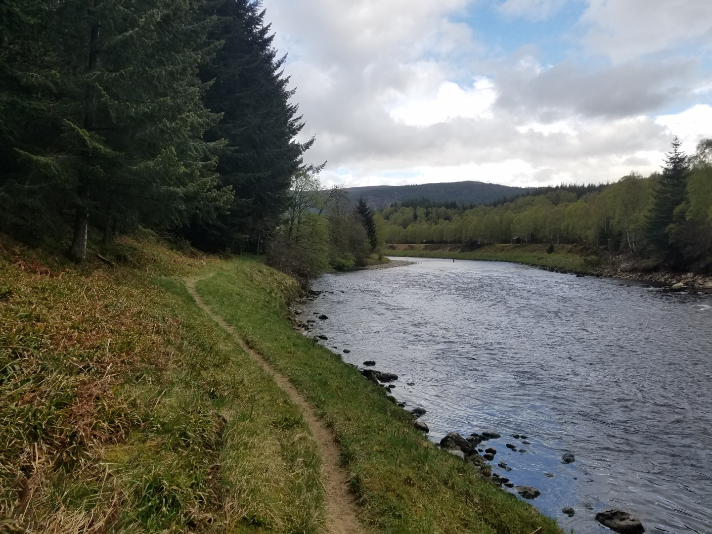
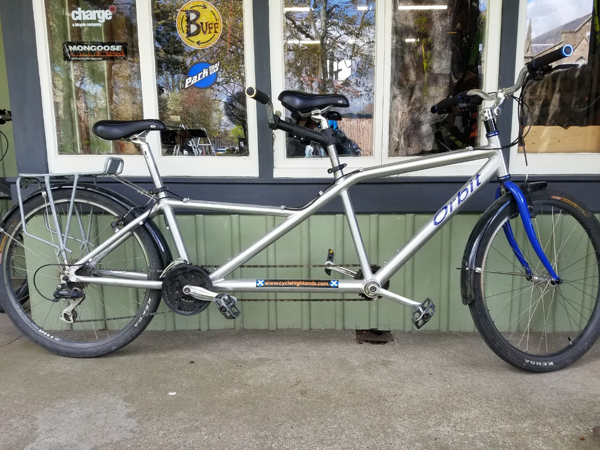
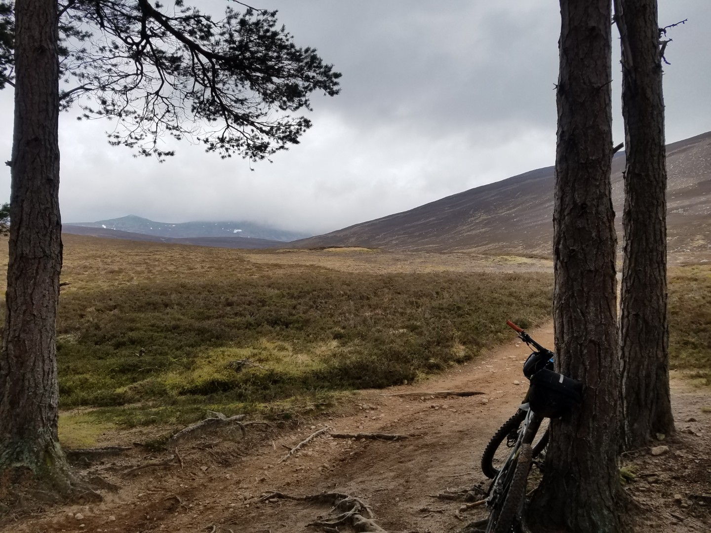
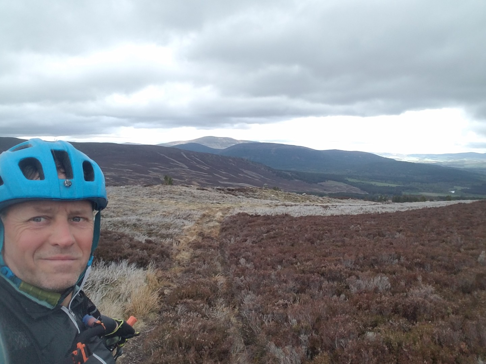
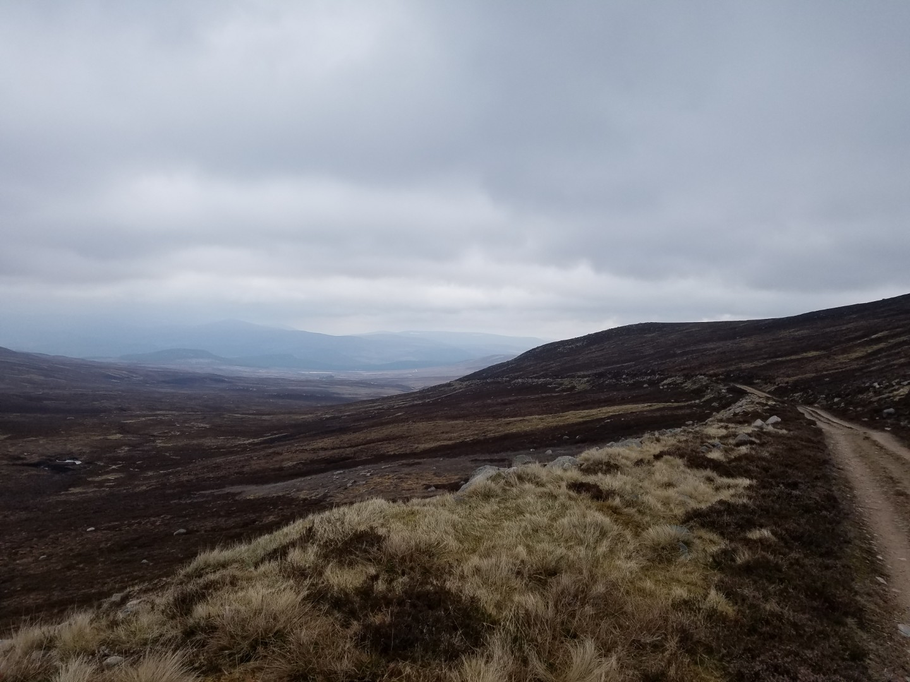
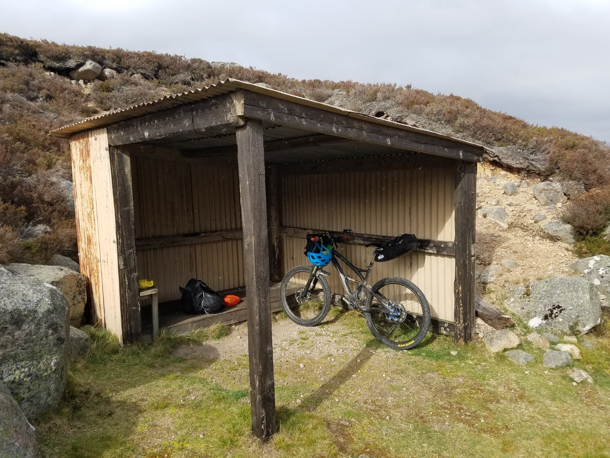
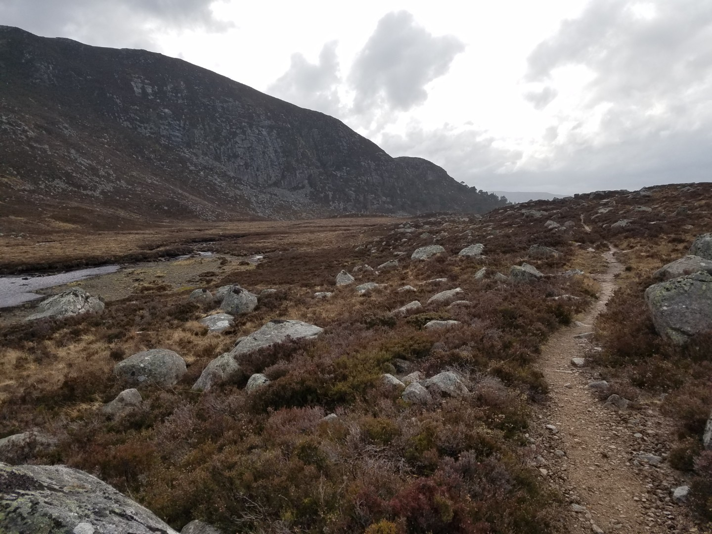
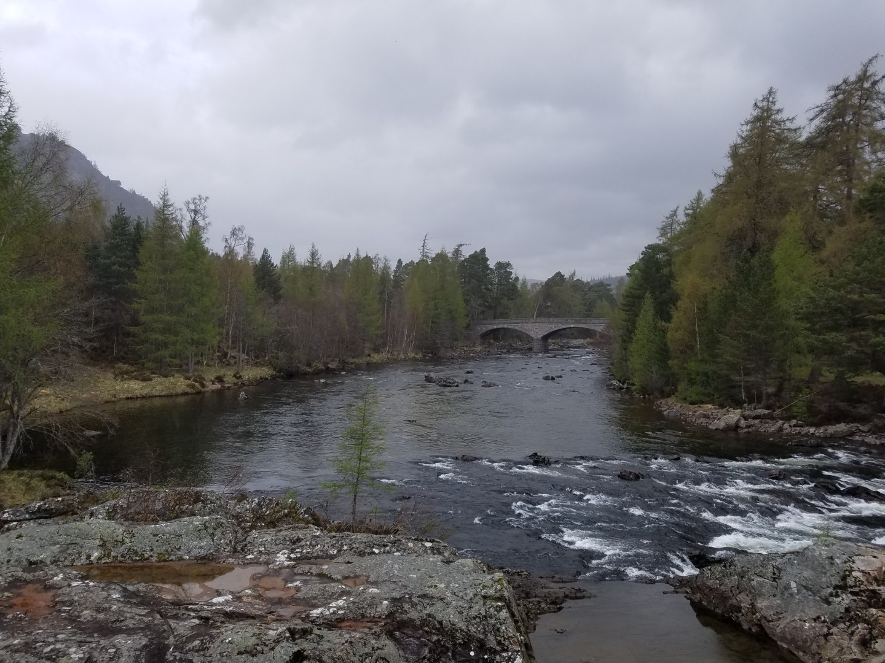
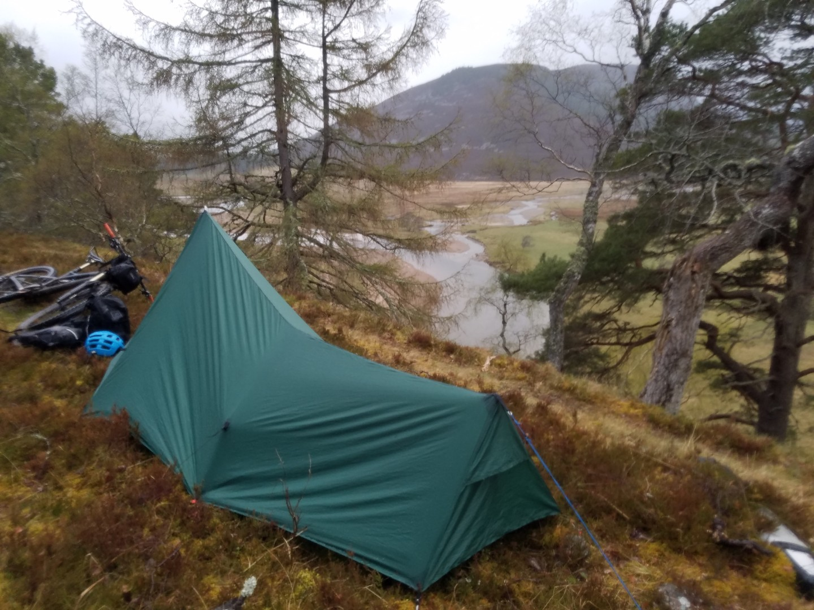

---
tags:
  - Scotland
  - bikepacking
  - mtb
  - wildcamping
title: Deeside Trail & Cairngorms Outer Loop, day 2 Lamawhillis Hill to Braemar
description: A mountain bike bikepacking trip on a self made Deeside Cairngorms Outer loop route
draft: false
date: 2019-04-27
author: Tompkins Jonathan
---
# Day 2 - Lamawhillis Hill to Braemar
**Friday 26th April 2019**

I was a bit cold last night, my lightweight spring to autumn bag doesn't seem to include Scotland. I was also a bit cold in the morning, putting on wet gloves didn't help. I warmed them up by putting them in my lycra shorts. It felt nice at first but they were soon cold again after 30 seconds of downhill.

Some great riding today. A bit of singletrack and plenty of forest road before Ballater. I popped into a bike shop here to buy a new cassette, thinking that the slipping in the first two gears was due to worn sprockets. Turns out it just needed every so slightly adjusting. 

Ballater is next to the river Dee. My route went down an adjacent valley, the River Muick, and then climbed up the Lochnagar track over the Cairngorms and back down into the Dee valley at Braemar. This was the highlight of the trip so far. The tops of the hills where covered in cloud, there was still some patches of snow higher up and the were little granite outcrops and boulders everywhere. I'd ridden into a headwind down the valley but this turned into a tailwind on the climb out of the Muick valley. It started with a push on rocky singletrack which had me worried as there was a lot of up to do. It soon turned into a rideable path through woodland and then turned into doubletrack as the trees ended. This doubletrack then turned into a steep bolder fest; more pushing. As the track became more rideable and then leveled out I was flying. Then it went downhill and I was doing at least 40km/hr. 

After a brief stop in a shelter as it started to rain the track turned into a techy singletrack across the hillside and then downhill into Braemar. Great riding and awesome scenary. 

Fish and chips in Braemar followed by a odd wild camp just off a road overlooking the river Dee.

89km 6hrs30 1555vm 

<figure style="text-align: center;">
  
  <figcaption><i>Singletrack near night_ 1 camp.</i></figcaption>
</figure>

<figure style="text-align: center;">
  
  <figcaption><i>Singletrack along the River Dee</i></figcaption>
</figure>

<figure style="text-align: center;">
  
  <figcaption><i>An Orbit Libre in Ballater</i></figcaption>
</figure>

<figure style="text-align: center;">
  
  <figcaption><i>The Lochnagar path</i></figcaption>
</figure>

<figure style="text-align: center;">
  
  <figcaption><i>Not all fantastic tracks.</i></figcaption>
</figure>

<figure style="text-align: center;">
  
  <figcaption><i>Descent to Braemar</i></figcaption>
</figure>

<figure style="text-align: center;">
  
  <figcaption><i>Cairngorms shelter.</i></figcaption>
</figure>

<figure style="text-align: center;">
  
  <figcaption><i>Final awesome singletrack to Braemar</i></figcaption>
</figure>

<figure style="text-align: center;">
  
  <figcaption><i>Bridge of Dee.</i></figcaption>
</figure>

<figure style="text-align: center;">
  
  <figcaption><i>Night 2 camp near Braemar, just off the road but sort of hidden.</i></figcaption>
</figure>
