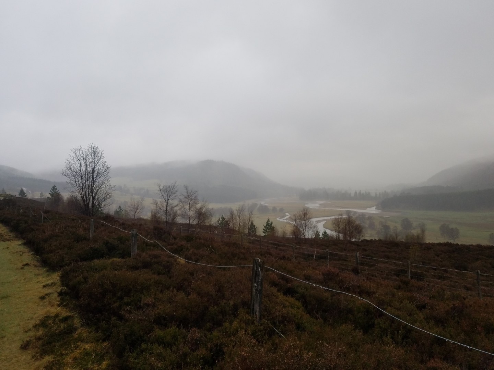
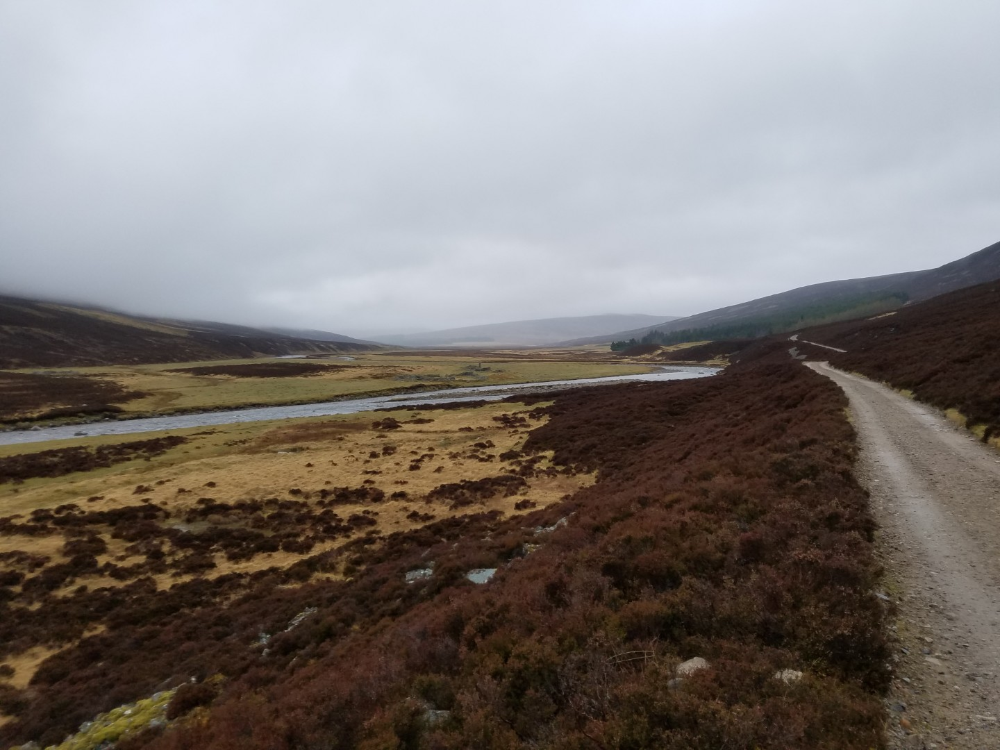
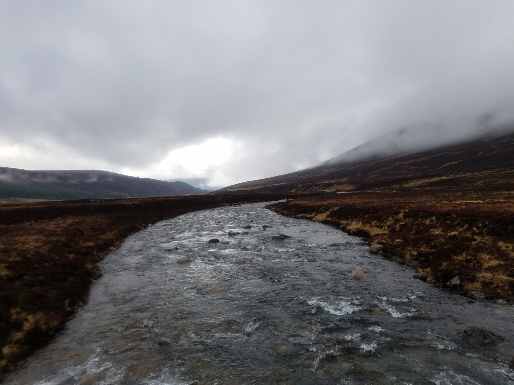
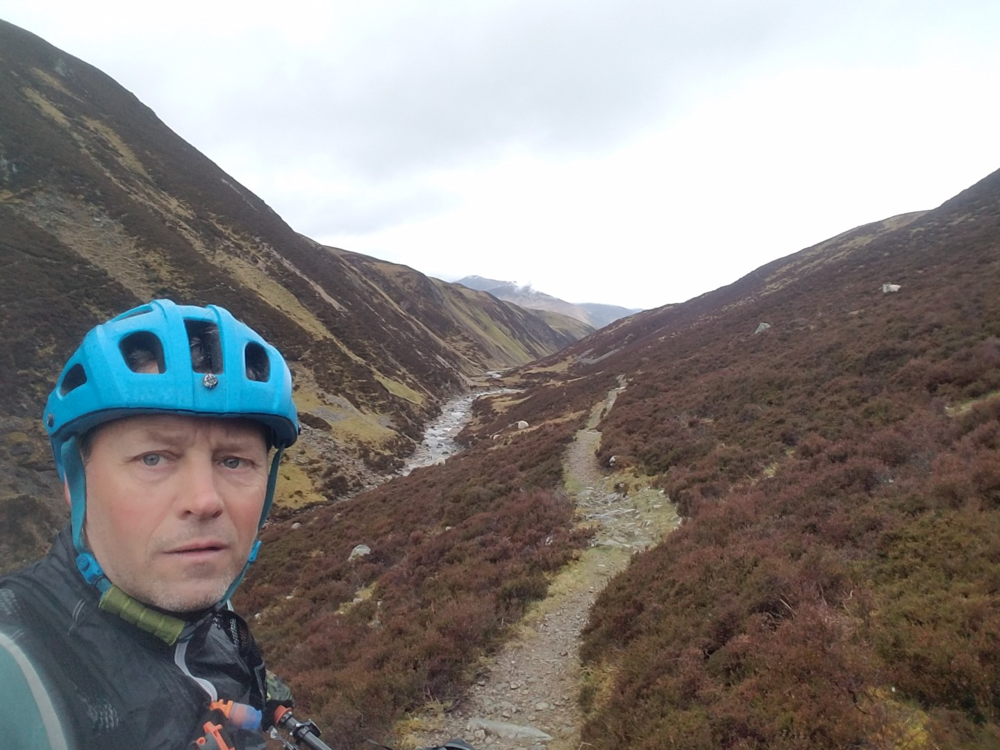
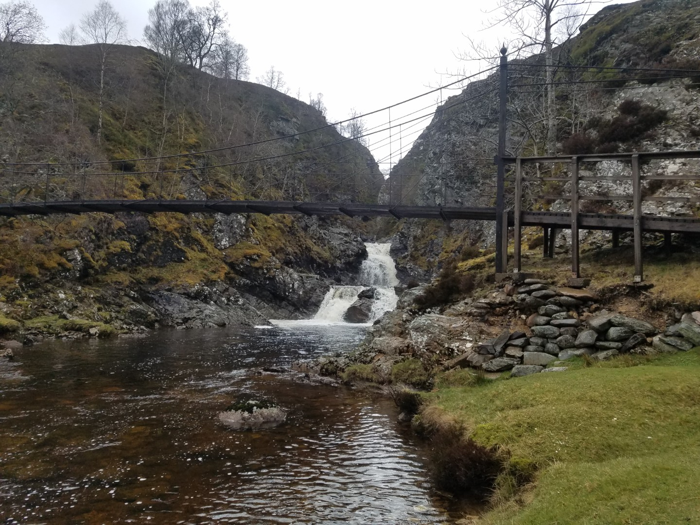
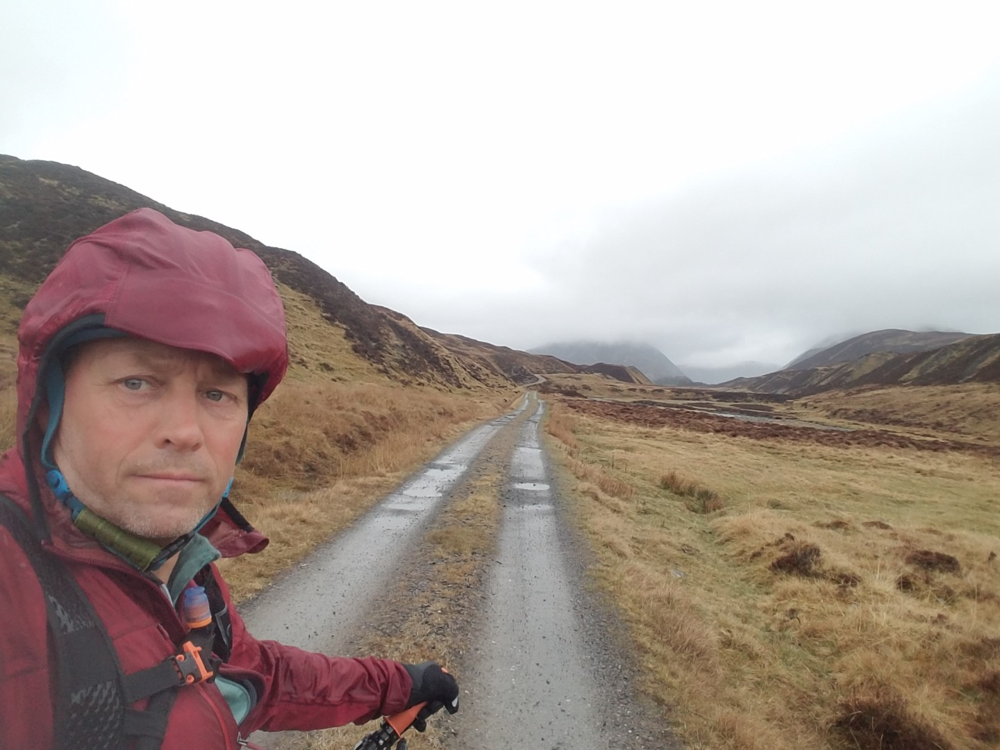
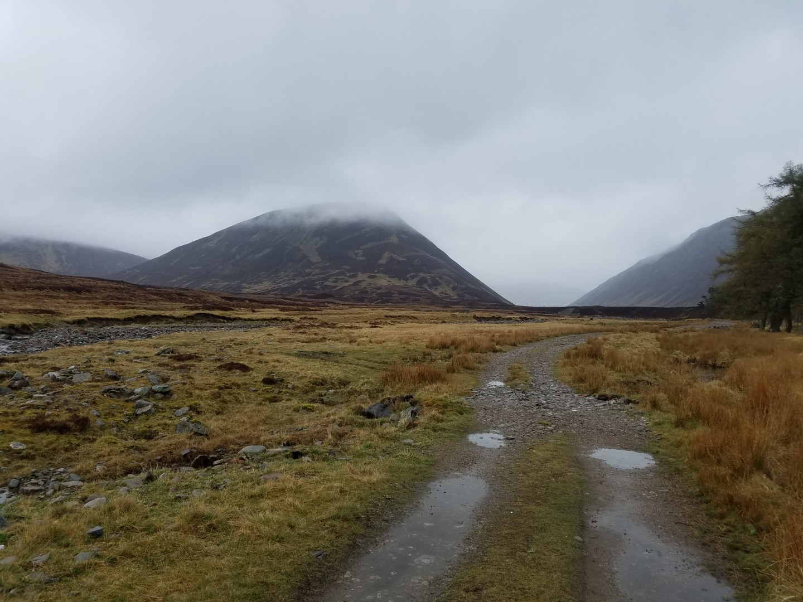
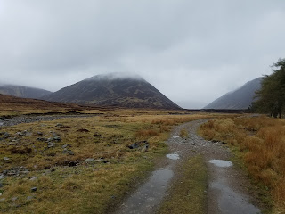

---
tags:
  - Scotland
  - mtb
  - wildcamping
  - bikepacking
title: Deeside Trail & Cairngorms Outer Loop, Day 3 Braemar to Aviemore
description: A mountain bike bikepacking trip on a self made Deeside Cairngorms Outer loop route
draft: false
date: 2019-04-27
author: Tompkins Jonathan
---
# Day 3 - Braemar to Aviemore

<figure style="text-align: center;">
  
  <figcaption><i>A misty start over the River Dee</i></figcaption>
</figure>

**Saturday 27th April**

I recommend you skip this paragraph and go straight to the next one. I hadn't had a poo yesterday which is very unusual for me but my god did I make up for it this morning.

A biggish day today, not particularly in distance but there's two mountain passes and rain forecast all day. Good news was that it wasn't raining much when I woke up at 5.30.

The climb up the Dee and over to Glen Tilt was perfect riding. Easy double track with a seemingly negligible incline up the Dee with three river crossings. I rode past someone wild camping near the river crossings but there were no signs of life, it was only 8.30 though. The singletrack over the top of the pass was awesome and virtually all rideable. Down into Glen Tilt it got a bit too technical in places, especially considering the big drop down to the river on my left. I was also still sort of dry.

Bedford Bridge at the Falls of Tarl was a welcome surprise as fording the tributary here would have involved waist deep wading. It had started drizzling now and it basically wouldn't let up for the rest of the day. The track turned into double track soon after the bridge and it wasn't long before I was having a bacon and egg bun, two scones and two coffees in the Watermill Cafe in Blair Atholl. As is the way with these things, it was raining when I went in the cafe and absolutely hooning it down when I came out.

The riding up the Edendon Water valley was also on easily graded doubletrack, which was good as this crossing was about 30km and the weather was bad. Just past Sronhadruig Lodge I left the track and started pushing through bogs. This wasn't looking good. It was raining, the clouds were low and it wasn't particularly warm. By Loch an Duin it turned into some great singletrack and by the end of that it was doubletrack again. There was some fantastic scenery here. I was surrounded by towering mountains covered in clouds, everywhere just looked awesome.

I was still warm at this point but as the track went downhill I started to get cold, especially since I was drenched. By the time it turned to road I couldn't feel my hands and when the numbness reached my elbows I had to stop. Ten minutes of jogging on the spot waving my arms around gave me some temporary relief. I'd given up on camping tonight; 25km later I was still cold but booked into the youth hostel at Aviemore.

My gps said I'd done 159km but seeing how it also said my maximum speed was 156km/hr, I didn't really believe it. I think it was closer to 125km. 8hrs, 1104vm

<figure style="text-align: center;">
  
  <figcaption><i>The climb along the river Dee.</i></figcaption>
</figure>

<figure style="text-align: center;">
  
  <figcaption><i>The Geldie Burn.</i></figcaption>
</figure>

<figure style="text-align: center;">
  
  <figcaption><i>Singletrack at Allt Gharb Buidhe 1</i></figcaption>
</figure>

<figure style="text-align: center;">
  
  <figcaption><i>Bedford Bridge at the Falls of Tarl</i></figcaption>
</figure>

<figure style="text-align: center;">
  
  <figcaption><i>Climb up Edendon Water.</i></figcaption>
</figure>

<figure style="text-align: center;">
  
  <figcaption><i>CAPTION</i></figcaption>
</figure>

<figure style="text-align: center;">
  
  <figcaption><i>Top of Edendon Water crossing to Glen Tromie</i></figcaption>
</figure>
