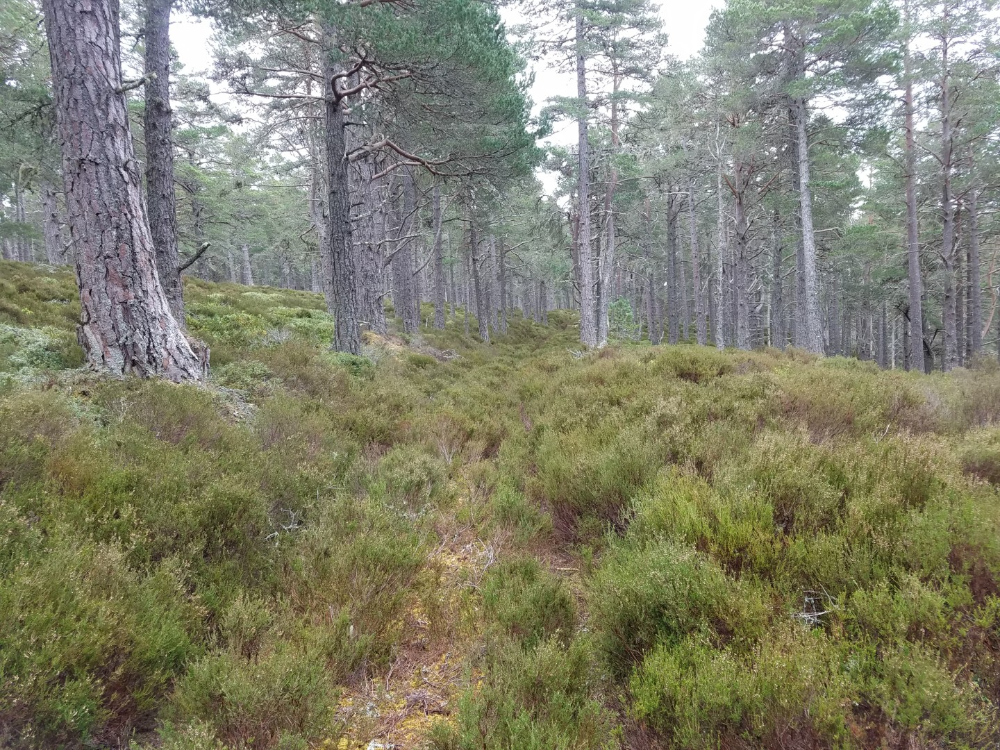
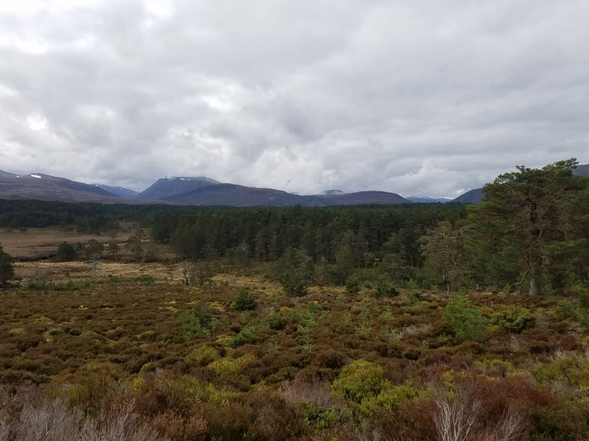
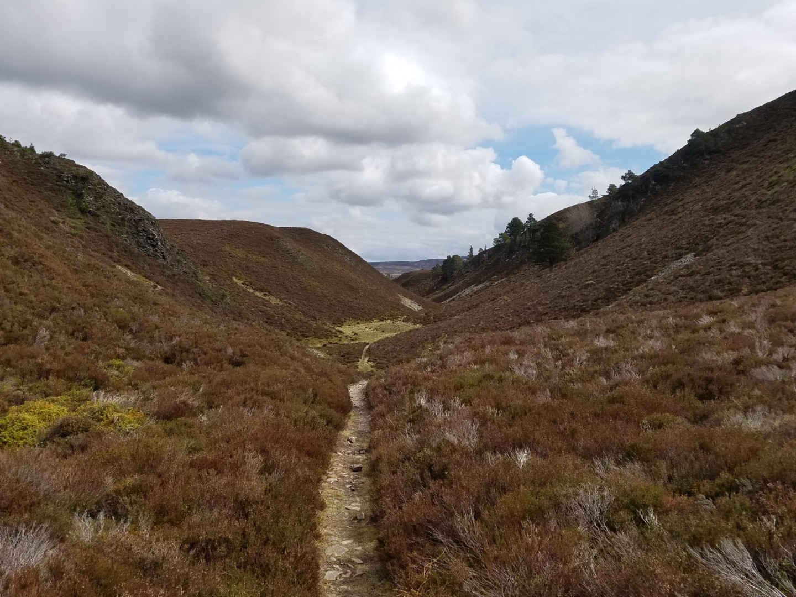
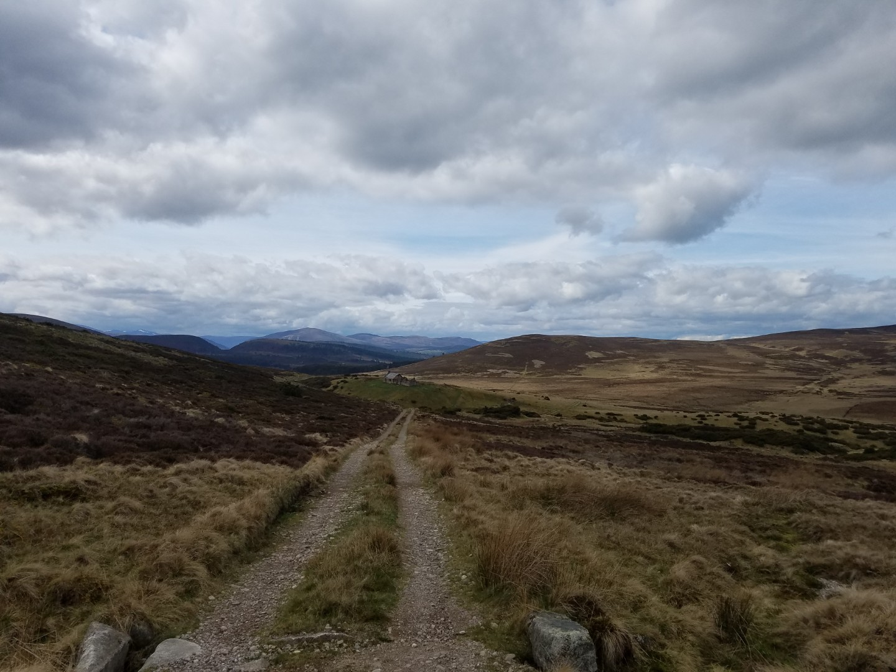
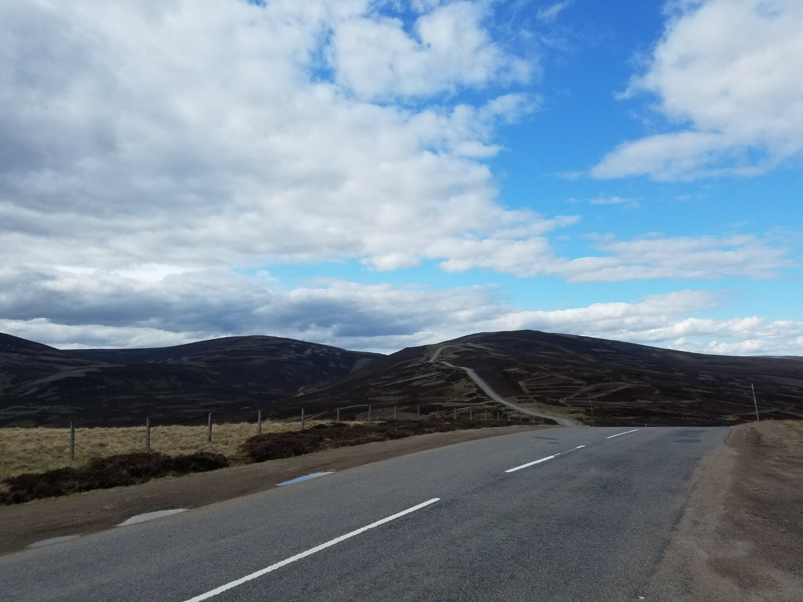
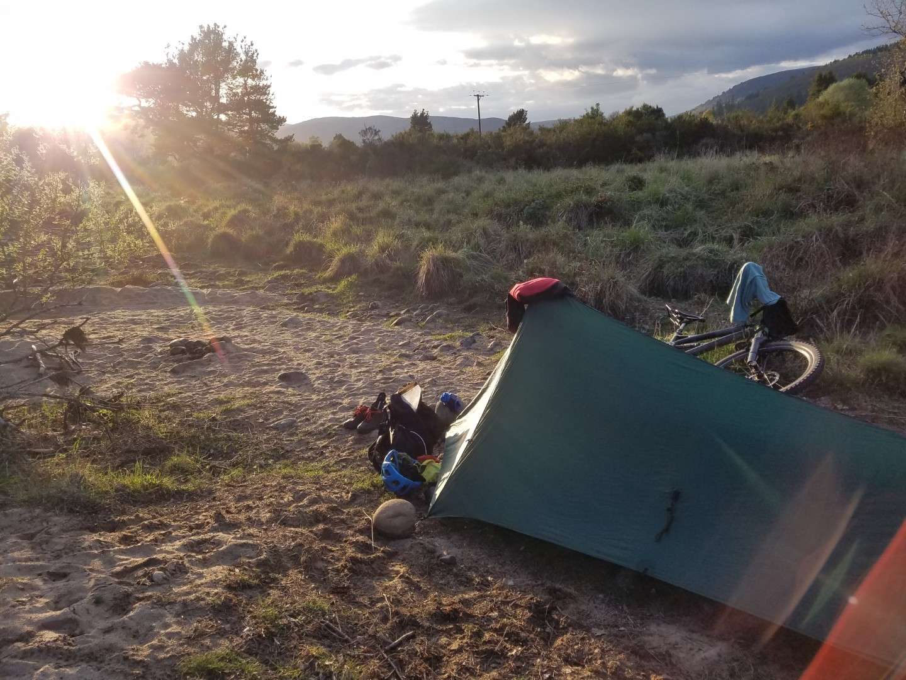

---
tags:
  - Scotland
  - bikepacking
  - mtb
  - wildcamping
title: Deeside Trail & Cairngorms Outer Loop, Day 4 Aviemore to Tomintoul and Ballater
description: A mountain bike bikepacking trip on a self made Deeside Cairngorms Outer loop route
draft: false
date: 2019-04-28
author: Tompkins Jonathan
---
# Day 4 - Aviemore to Tomintoul & Ballater

**Sunday 28th April**

Warm, dry, clean and I could sit down to go to the loo. A good start. The forecast was good and I had an easy start to the day, gentle back roads and forest tracks. I had no intention of riding far today.

Abernethy Forest is close to Aviemore. They are trying to regenerate the original Caledonian Forest by limiting deer numbers and I assume also removing sheep. Because it consists of native trees like the Scots pine it's a quite open, light, friendly woodland. A notice board said that the Caledonian Forest was now 1% of what it used to be, let's hope that these projects are a success and that more happen. There were other similar reforestation areas on the route that I'd seen.

Once out of the woods the route was mostly singletrack grass paths or old Landrover tracks now almost lost. One section got lost along a river and after crossing it a million times I finally found the way on. Just before Tomintoul in a beautiful little valley I stopped to check my rear bag and found that my rear wheel was wobbly. It wasn't something I could fix so I gently made my way to Tomintoul and had some food at the Old Firestation Cafe whilst I decided what to do.

There was a trail centre nearby that hired bikes, maybe they could fix it. They didn't answer the phone and it turned out that the contract was up for renewal so it was temporarily closed.

Ballater was 44km away, roughly in the direction I was going. Grantown on Spey was only 23km away but in completely the opposite direction, it was back towards Aviemore. They were closed on Sundays so I couldn't find out if they could look at it tomorrow whereas the Bikestation in Ballater made no promises but could at least look at it. Plus, if they couldn't fix it at least Ballater was considerably closer to my van and in the same valley. I set off, not looking at the map and thinking it would only take two and a half hours or so.

I should have looked at the map. There were some humongous 20% mountains in the way which would have been bad on a road bike. The Lecht Road, 20% in places up to 650m - utter bastard

The A939 over into Glen Gairn -  bastard

I limped into Ballater considerably later than I thought I would be. On the plus side I found a lovely wild camp on the edge of town, near the river. 

If they can fix my wheel I'd like to go back to Tomintoul and do the off road route, which looks considerably easier than the road. However, I don't want to ride back to Tomintoul on the road. The shop opens at 10am tomorrow.

 83km 5hrs38 1298vm

<figure style="text-align: center;">
  
  <figcaption><i>There's a track in Abernethy Forest somewhere</i></figcaption>
</figure>

<figure style="text-align: center;">
  
  <figcaption><i>Abernethy Forest</i></figcaption>
</figure>

<figure style="text-align: center;">
  
  <figcaption><i>Final climb out of Aviemore</i></figcaption>
</figure>

<figure style="text-align: center;">
  
  <figcaption><i>On the way to Tomintoul</i></figcaption>
</figure>

<figure style="text-align: center;">
  
  <figcaption><i>Look at that bastard of a hill, and that's only a third of it. Luckily I came down that, the other side was worse.</i></figcaption>
</figure>

<figure style="text-align: center;">
  
  <figcaption><i>Great wild camp near Ballater</i></figcaption>
</figure>
