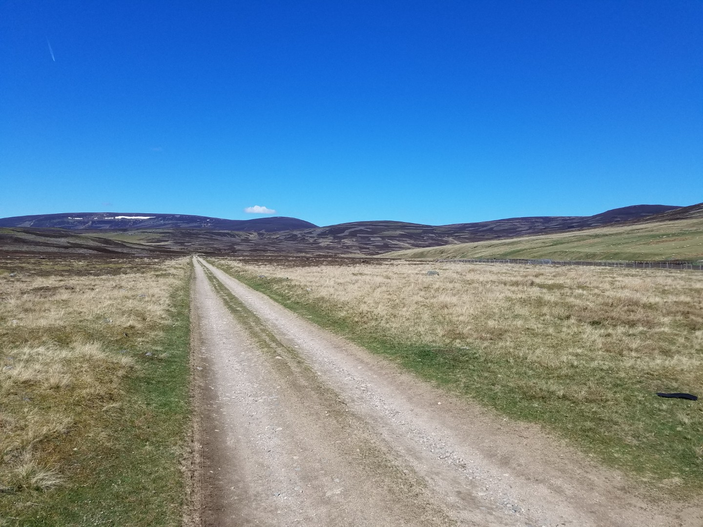
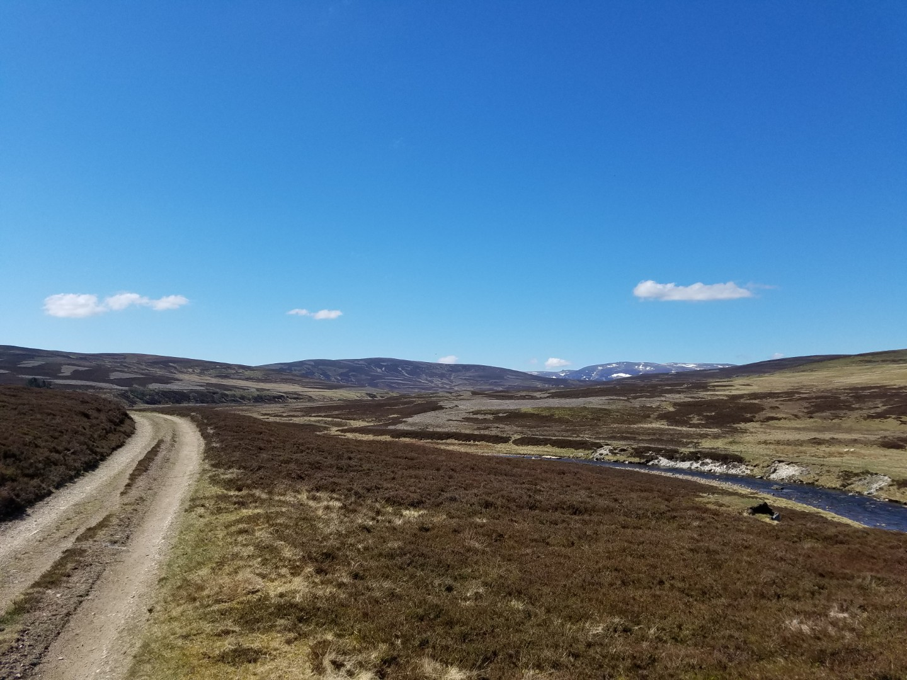
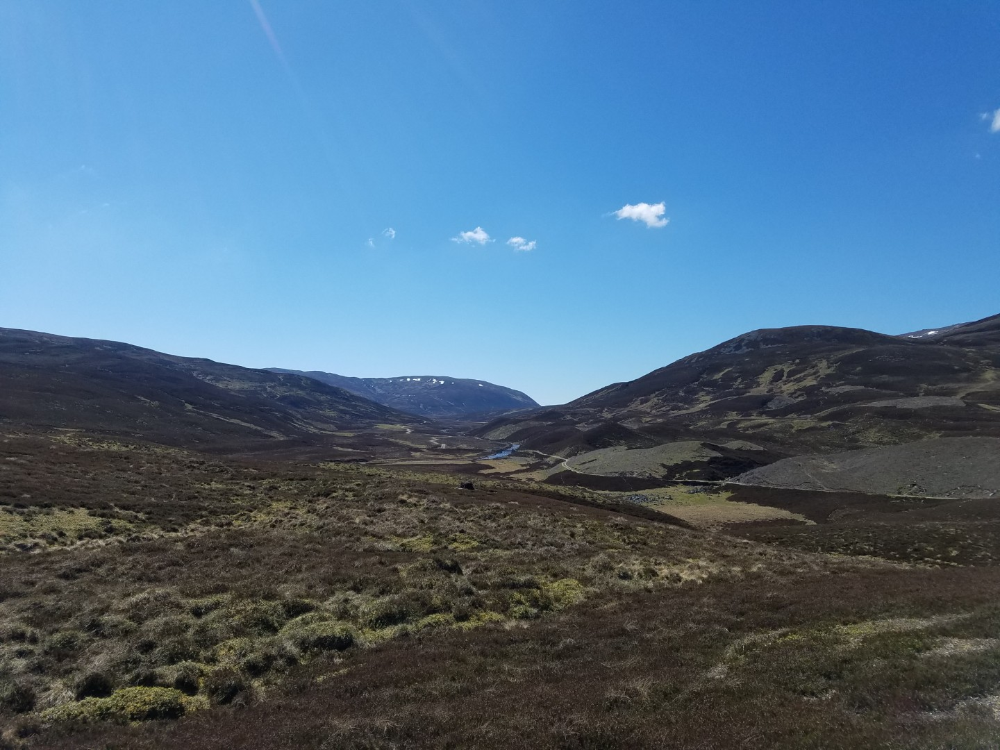
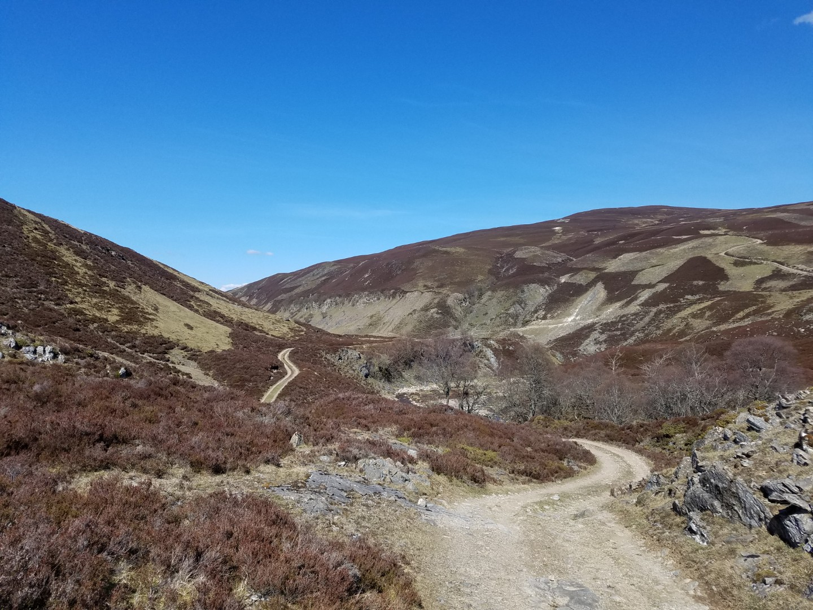
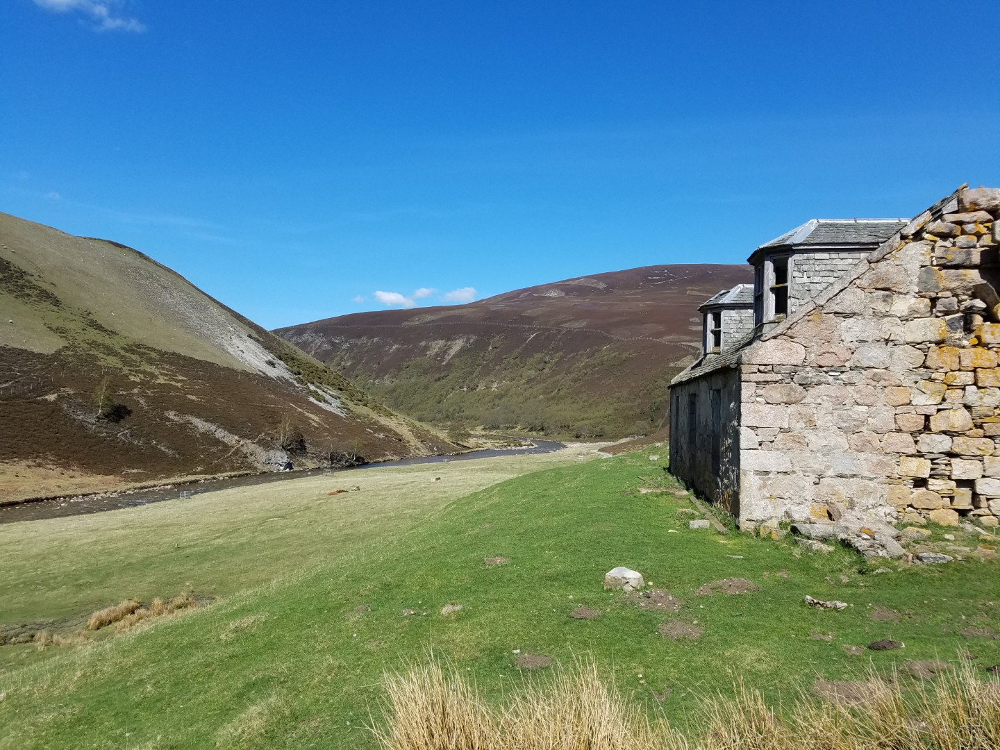
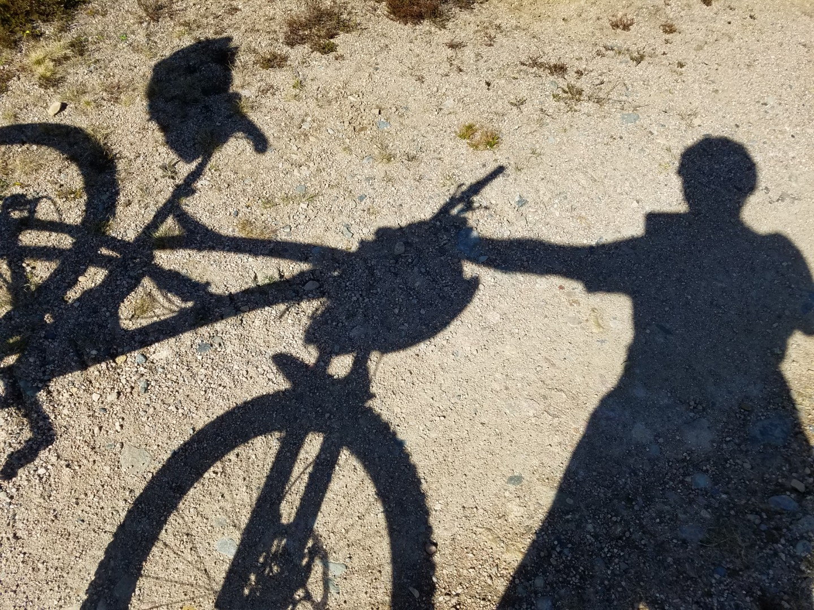
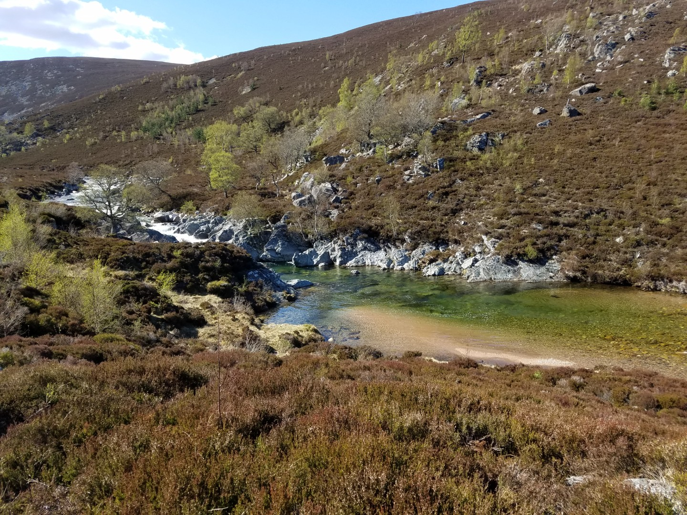
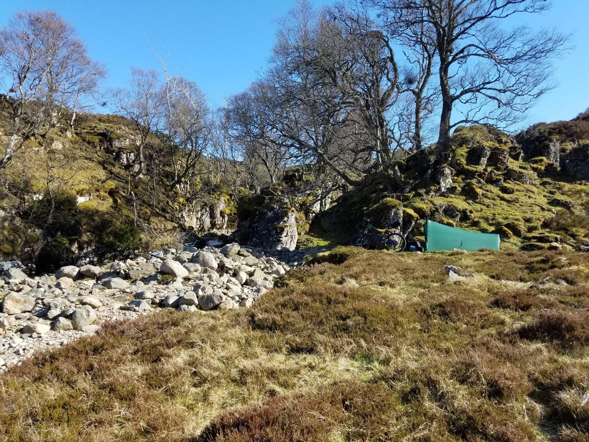

---
tags:
  - Scotland
  - bikepacking
  - mtb
  - wildcamping
title: Deeside Trail & Cairngorms Outer Loop, Day 5 Ballater to Tomintoul to Loch Builg
description: A mountain bike bikepacking trip on a self made Deeside Cairngorms Outer loop route
draft: false
date: 2019-05-01
author: Tompkins Jonathan
---
# Day 5 - Ballater to Tomintoul to Loch Builg

**Monday 29th May**

The [Bike Station at Ballater](bikestationballater.co.uk) saved me again. Rear wheel fixed although it needs new bearings. 

Turns out it's easier off road to Tomintoul than on the road so the plan is to ride off road to Tomintoul, turn around and come back. It's not quite my idea of a continuous journey but I'd hate to miss a bit out plus it was sunny, shorts and t-shirt weather.

The off-road up Glen Gairn starts off as all the others have done, well graded, easy angled double track, probably because it goes to a lodge. I thought I'd found a suitable bothy spot on the way up but when I went to investigate the floor was covered in shit to a considerable depth.

Nearly ran over an adder. It was sunning itself on the track, at first I thought it was a heather twig until it scurried off (wriggled off? Slithered? Or is that slower?). Makes a change from the ubiquitous deer, buzzards and sole red squirrel that I've seen. 

Glen Gairn is quite an open valley with low hills either side. There's small areas of new tree being planted close to the river here in an effort to add nutrients such at leaves and wood to the river, plus providing shade which keeps the water cooler, which then increases biodiversity and improves conditions for salmon.

I left the river Gairn at Loch Builg and followed some great singletrack above the Loch. This drains towards Tomintoul and soon joins the much larger River Avon (pronounced An, apparently). The hills are bigger on this side, it's much more dramatic, and there's some larger scale forest regeneration going on, it's much prettier than the other side.

Soon after Inchrory Lodge in Glen Avon the track turned to road and the appeal of riding to Tomintoul for 8km and then turning around faded. After lunch I headed back up towards the pass, into a headwind of course. I'd seen a great camping spot near the top of the pass. Flat grass near a small gorge, sheltered from the wind, in a sun trap and warm enough to swim in the pool. Perfect.

46km 3hrs riding, 5hrs13m total,  637vm

<figure style="text-align: center;">
  
  <figcaption><i>Glen Gairn</i></figcaption>
</figure>

<figure style="text-align: center;">
  
  <figcaption><i>More Glen Gairn</i></figcaption>
</figure>

<figure style="text-align: center;">
  
  <figcaption><i>If you guessed Glen Gairn, give yourself a little pat on the back.</i></figcaption>
</figure>

<figure style="text-align: center;">
  
  <figcaption><i>Top of Glen Builg</i></figcaption>
</figure>

<figure style="text-align: center;">
  
  <figcaption><i>Abondoned Dalestie building in Glen Avon</i></figcaption>
</figure>

<figure style="text-align: center;">
  
  <figcaption><i></i></figcaption>
</figure>

<figure style="text-align: center;">
  
  <figcaption><i>Linn Avon</i></figcaption>
</figure>

<figure style="text-align: center;">
  
  <figcaption><i>Swimming pool just out of sight.</i></figcaption>
</figure>
