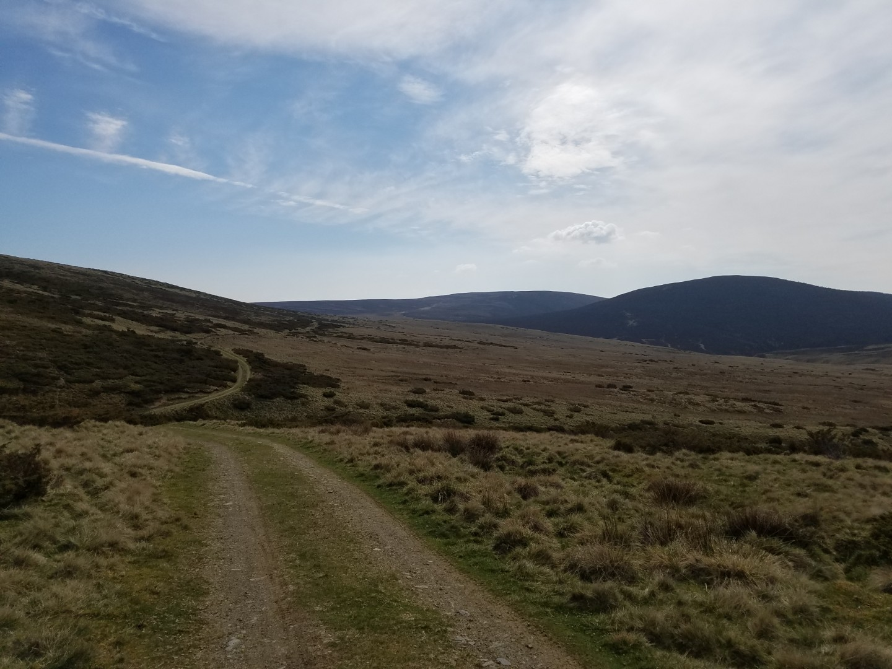
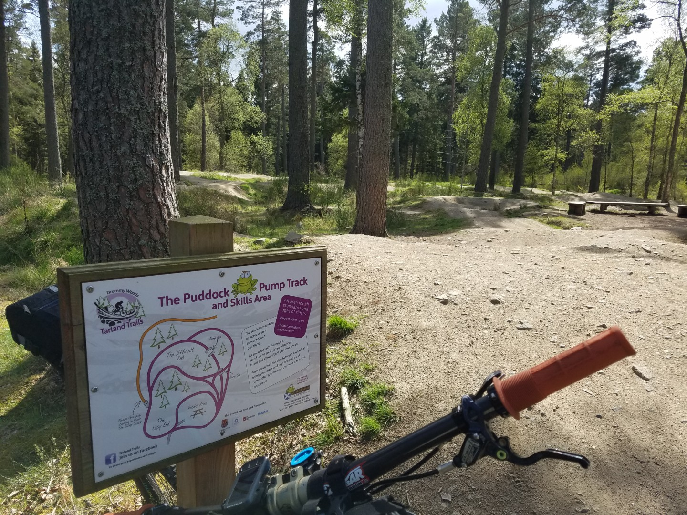

---
tags:
  - Scotland
  - bikepacking
  - mtb
  - wildcamping
title: Deeside Trail & Cairngorms Outer Loop, day 6 Loch Builg to Banchory
description: A mountain bike bikepacking trip on a self made Deeside Cairngorms Outer loop route
draft: false
date: 2019-05-12
author: Tompkins Jonathan
---
# Day 6 - Loch Builg to Banchory

**Tuesday 30th April 2019**

Another dry sunny day ahead and about 90km to Banchory. The first 20km flew by, once I'd done the short climb from camp to the pass and then gone past the Loch on the singletrack it was downhill on good doubletrack and then road along the valley bottom. The hills were not as big now although I was climbing up more hills today than other days.

One particular doubletrack, the final climb up Roar Hill that leads to the route round Morven, was horrible, large rocks barely compacted into a track. The downhill on the other side to Bridgefoot looked great but wasn't, it was just a bit too techy for a loaded bike.

A quick blast round the Tarland Trails and then another climb up to Broom Hill. I was getting a bit knackered now, the last few days had caught up with me. Easy gradients were reduced to crawling in my granny great.  Broom Hill stated with a grassy climb through woodland, got steeper and then turned into very narrow singletrack through heather. I was pushing a lot more, especially on the summit ridge which was too steep to ride. It didn't help that the route weaved about a lot just to find off-road sections. By the end of Broom Hill I'd had enough, most of the other off-road sections looked like they had very steep pushing sections. I followed the road back to Banchory, picking up some of the easier off-road sections.

95km, 1118vm, 6hrs22 riding, 9hrs28 total 

Overall it's a great route although the last section isn't up to the high quality of the others. The vast majority is rideable, there's a good mix of double track and singletrack, the scenery is awesome and there's easily enough food shops along the route so you don't have to carry too much food.

<figure style="text-align: center;">  <figcaption><i>Track around Morgen Munroe</i></figcaption> </figure>

<figure style="text-align: center;">  <figcaption><i>Tarland Trails</i></figcaption> </figure>