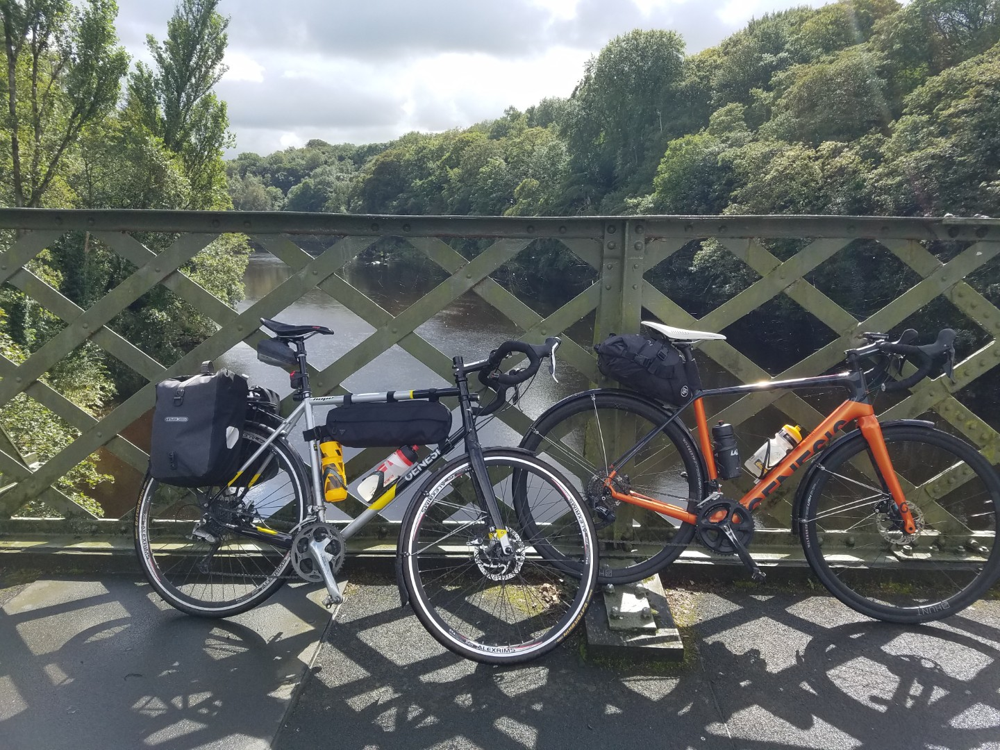
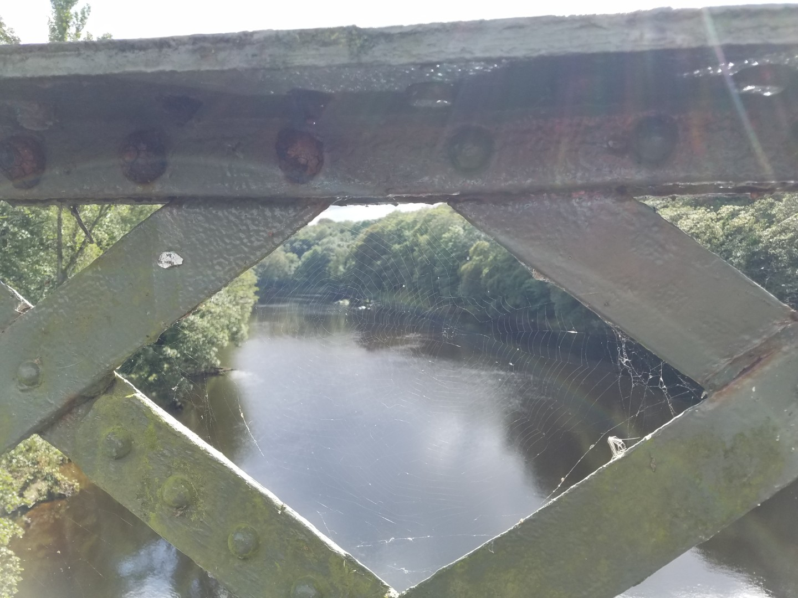
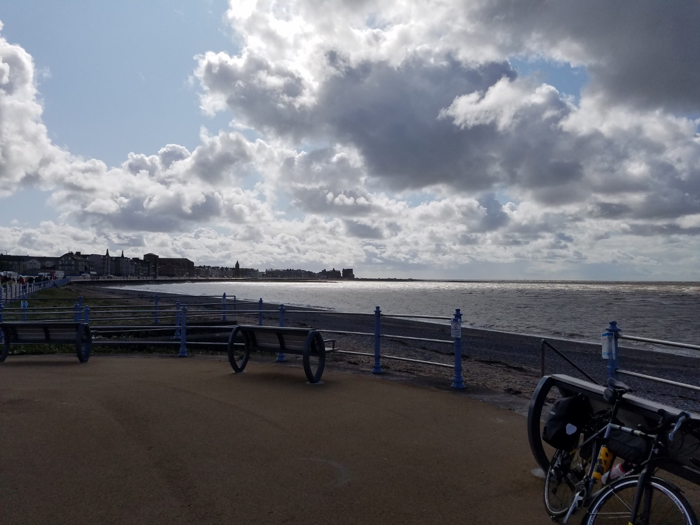
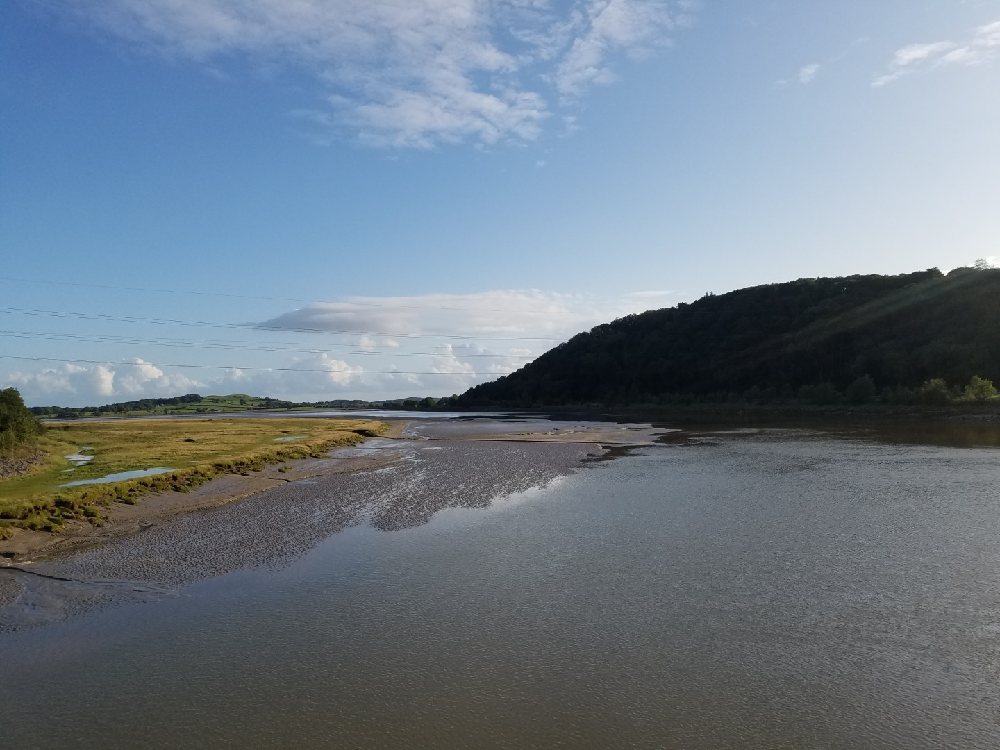
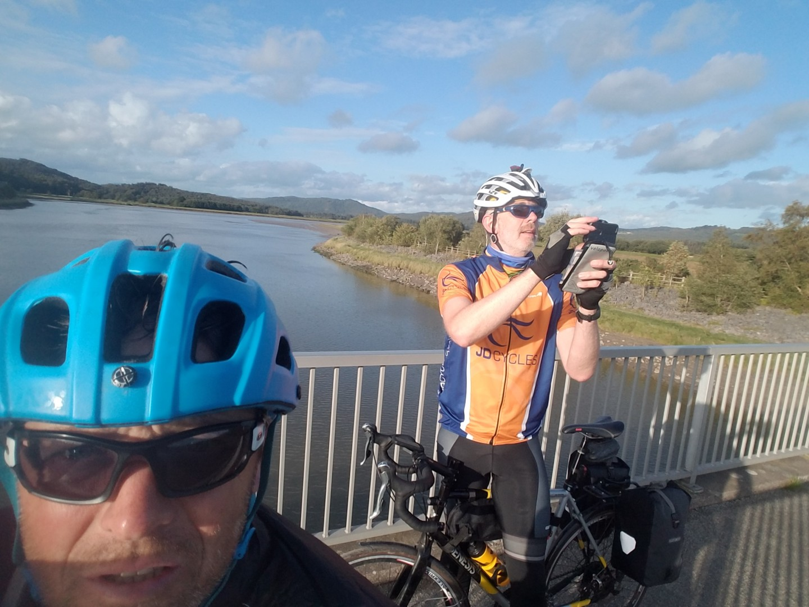
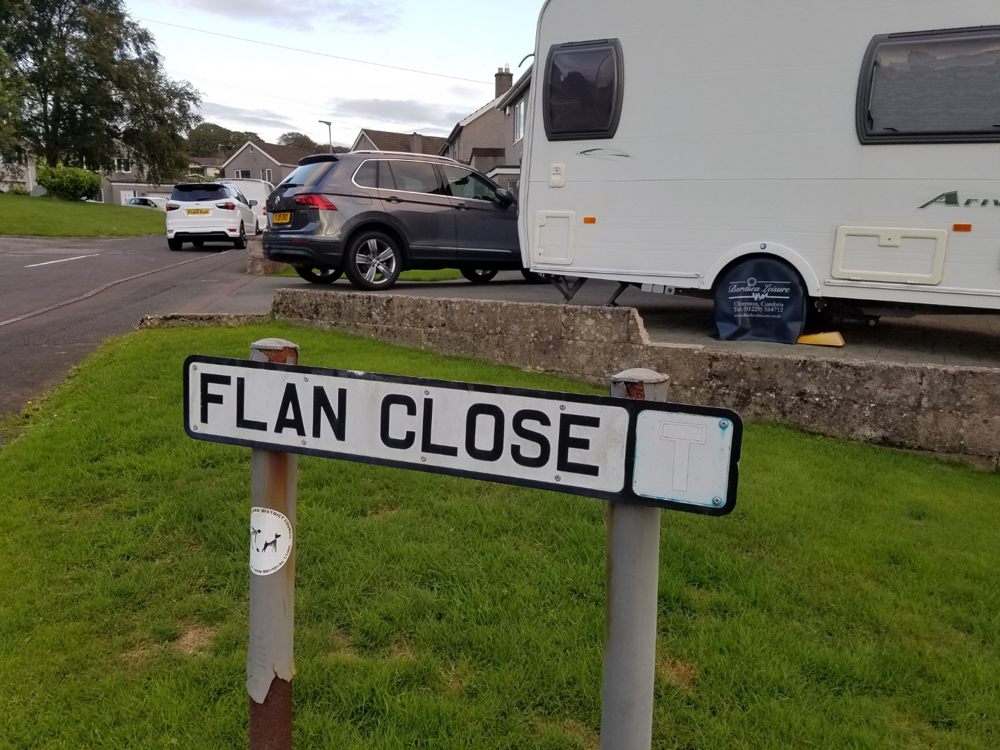

# Double Coast to Coast

Another ride with Jim but this time shorter and with less travelling to get to. We were going to do a double coast to coast and it went through multiple iterations before arriving at the final plan, which was actually my first plan. If I was 100% fair and unbiased towards Jim I'd say it was all his fault. 

The plan was to do the Way of the Roses and a coast to coast further north. We'd start in Airton and followed the WotR to Morecambe and then make our way to Ulverston. From there we head north round the Lake District coast before heading east through Keswick, Askham and Richmond to Whitby. Then south along the east coast to Bridlington where we would follow the WotR west back to Airton. Seven hundred and something kilometres, six days. Originally we aimed for 125km days but due to accommodation issues we had a 95km and 160km day, plus a 94km day on the last day, primarily so that I had time to get ready for work the next day. Jim agreed to the 160km day but I'm not convinced he listened to me that closely when I mentioned it.

## Day 1 Airton to Ulverston via Morecambe

**132km 7hr13m  1998vm**

I didn't really look at the forecast that closely in the morning but Sue had and she told us we'd have a tailwind to Morecambe. Turned out to be slightly different, ie the complete opposite.

At least it started dry. After averaging about 18kmh for the first 2 hours due to the 25kmh headwind we stopped at the café in Wray for lunch. We'd had our first rain shower just before this stop and of course it didn't rain whilst we stopped.  As soon as we set off the heavens opened, really opened. It was so bad that I was soon shivering and at the sight of a bus stop shelter we stopped to put all our cycling kit on. This was all the signal needed for the weather to change and stop raining.

<figure style="text-align: center;">
  
  <figcaption><i>Admittedly Jim didn't bring the kitchen sink bit he did bring everything else.</i></figcaption>
</figure>

<figure style="text-align: center;">
  
  <figcaption><i>A supposedly arty shot of the River Lune crossing near Halton.</i></figcaption>
</figure>

Morecambe was heaving with people. It was so windy on the sea front that I couldn't lean my bike against the railings without it being blown over.  After an ice cream and a quick look round a vintage car show  we left for Ulverston. It was still occasionally showery but this time the wind was in our favour, it was blowing us out of Lancashire into Cumbria. No complaints about that.

<figure style="text-align: center;">
  
  <figcaption><i>Morecambe. Small child being lifted off their feet by the wind not pictured.</i></figcaption>
</figure>

When making the route I'd tried to use Sustrans routes as much as possible but because Jim was concerned about the distances I'd taken shortcuts where possible.   Unfortunately one of these shortcuts was a 20% wall of a climb, somewhere between Witherslack and High Newton I think. Luckily I rode it faster than Jim and couldn't hear him swearing at me.

<figure style="text-align: center;">
  
  <figcaption><i>River Leven estuary</i></figcaption>
</figure>

<figure style="text-align: center;">
  
  <figcaption><i>How not to take a selfie</i></figcaption>
</figure>

We were staying in the top floor of a three storey townhouse in Ulverston with Amanda, Simon, their young son and a mad three year old black Patterdale terrier called Dennis. I'd never really been to Ulverston before but it looks nice. Narrow streets and a thriving high street surrounded by hills. Because it's near the sea we had to have fish and chips, so we did. And a fish cake and two bread rolls. And two small tiramisu and a packet of shortbread. And a pint of milk. To be honest it was too much. We got back to the house in time for the last half of Dragons Den, Peaky Blinders and the Vuelta.

<figure style="text-align: center;">
  
  <figcaption><i>They don't sell flan unfortunately</i></figcaption>
</figure>

Tomorrow looks wet with more climbing than today, although we should have a tailwind.