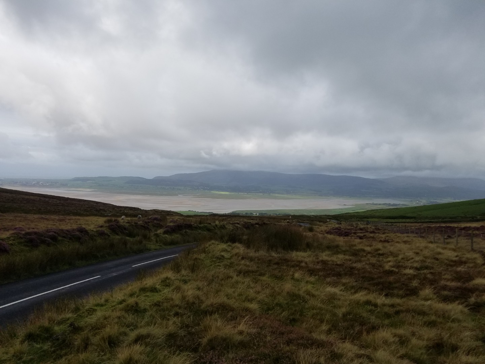
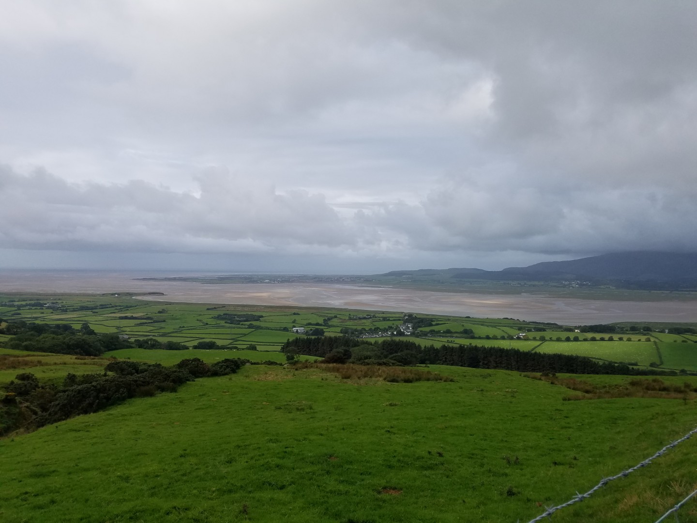
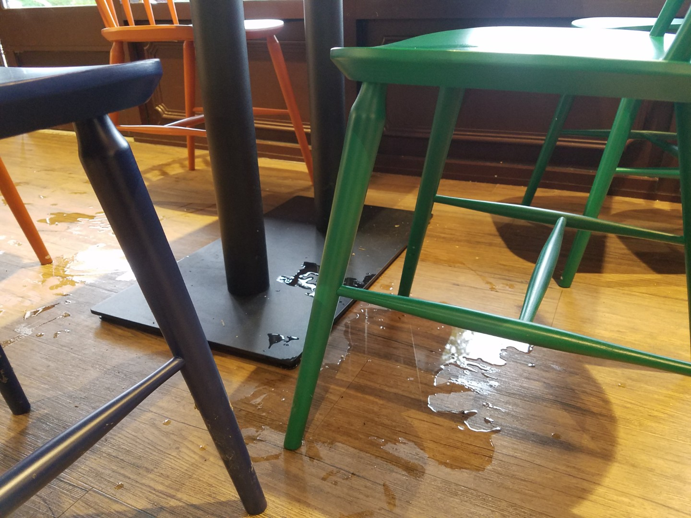
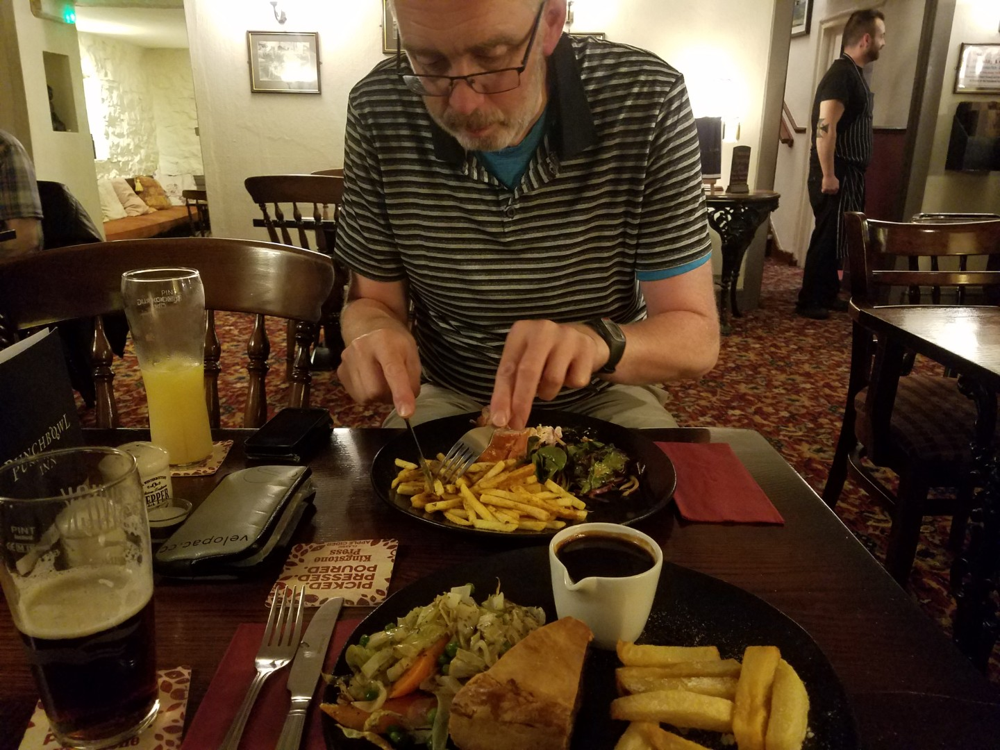

# Double Coast to Coast - Peak Absorbancy

<figure style="text-align: center;">
  
  <figcaption><i>Duddon Sands - almost our only view of the day</i></figcaption>
</figure>

<figure style="text-align: center;">
  
  <figcaption><i></i></figcaption>
</figure>

## Day 2 - Ulverston to Askham via Keswick 

**128km,  2800vm 7hr40m 16.7kph av!**

Undercarriage Fatigue Factor - 0 
Jim's Methane Emissions - 1 (low activity levels in a well ventilated area)

We left the accommodation with Jim saying good bye to Chris who was actually called Simon. I was in a bit of a rush when I made this route, hence I didn't really look at the contours that much, hence two steep climbs out of Ulverston. 

An hour later we were in Broughton in Furness, still dry but with rain looming.  Luckily we were directed to a great bakery cafe on the high street just as it started to rain. Breakfast. We both had a sandwich with bacon, eggs and sausages which really is complete overkill. It was great though.  We might also have had an almond slice and an egg custard, each. 

It was raining when we left and it carried on raining. Then it rained a bit more, followed by rain. We left the coast at Dunnerdale and climbed forever over Thwaites Fell into a 40kph headwind. I soon reached peak absorbancy.  It's probably quite a nice climb on a summers day but today it was shite, or a bit worse. 

I was beginning to think that my shortcuts weren't such a good idea; they seemed to involve either big hills or rough tracks. Maybe we should have just gone the long way round.  We were only averaging about 15kph at this point.

The rain eased up sightly in the valley but soon resumed bucketing it down as we turned away from Seascale towards Loweswater and then climbed over  Whinlatter Pass. At least we had a tailwind now. I would have taken some pictures of the supposed fantastic views over the Lakeland fells but if you imagine the inside of a full bath you'd get the general idea.

In Keswick we stopped at the Booths cafe for some hot food (sorry for the puddle I left behind).  It wasn't overly hot in the café and before leaving I decided to put on my arm warmers and hat. The act of doing this somehow made me cold, so much so that I was shivering as I rode through Keswick. I was shivering so much that it made steering quite difficult.

<figure style="text-align: center;">
  
  <figcaption><i>That's my puddle, I made it.</i></figcaption>
</figure>

 From Keswick my route tried to avoid the A66 but we decided to just follow it to the Pooley Bridge turn off in the hope that it would be faster. However, as soon as we saw the speed of the traffic we stuck to my original route. It still rained every so often.

Askham looked nice, a proper little farming village. Our static caravan was great, an awesome shower, big TV and a washing machine! And the Punchbowl Inn served a great steak and ale pie.

We've got a much shorter day tomorrow. I'm not looking at the weather forecast.

<figure style="text-align: center;">
  
  <figcaption><i>Food, lots of it.</i></figcaption>
</figure>
