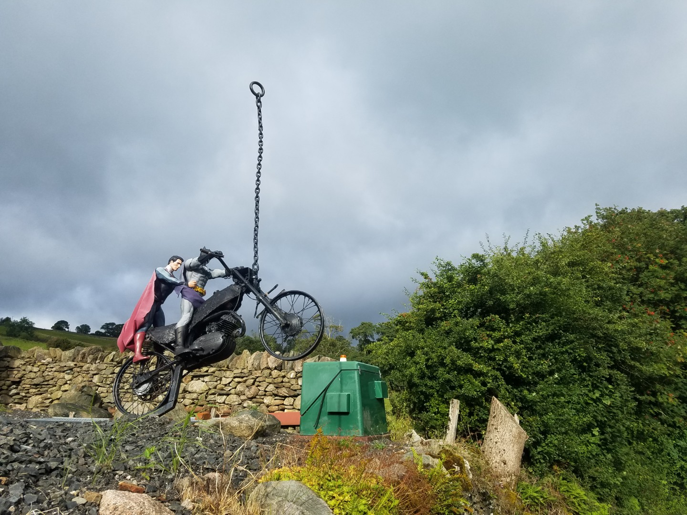
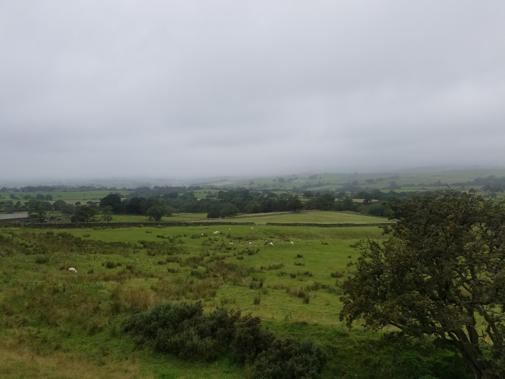
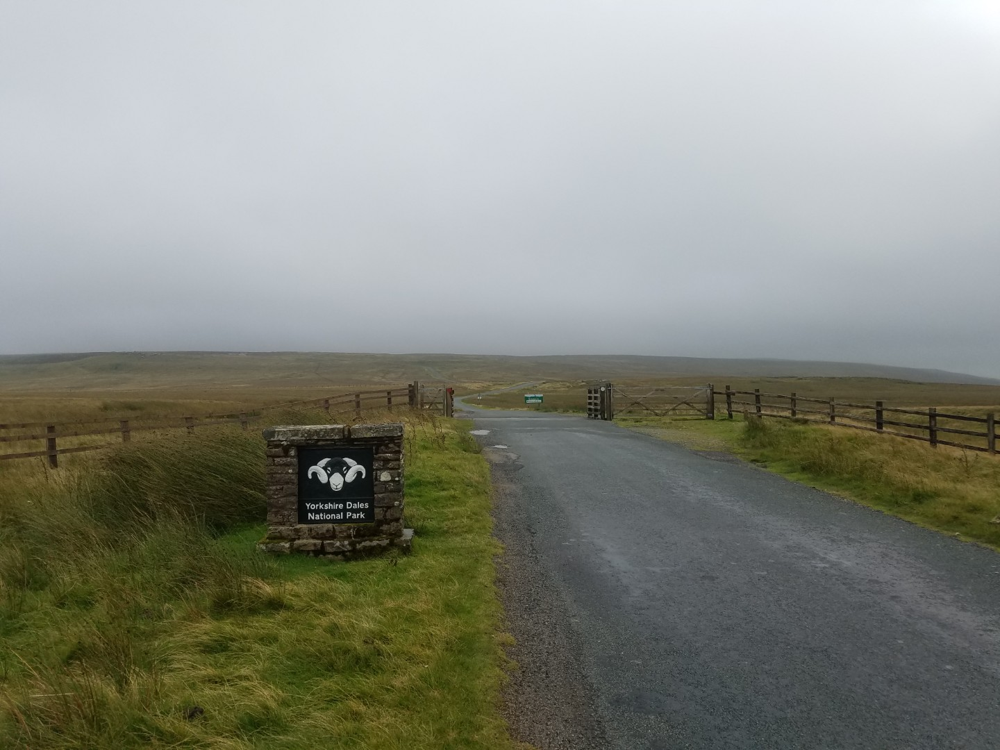
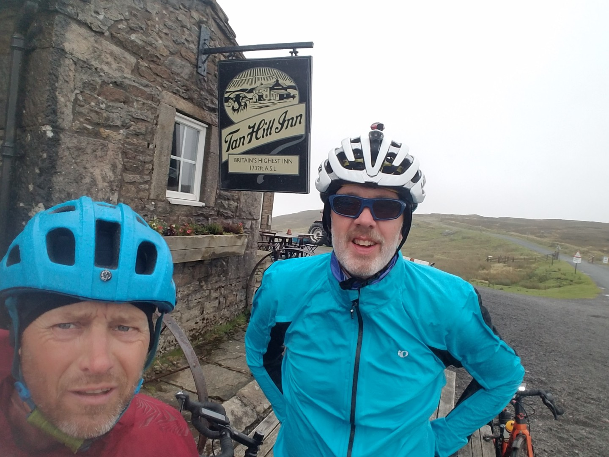
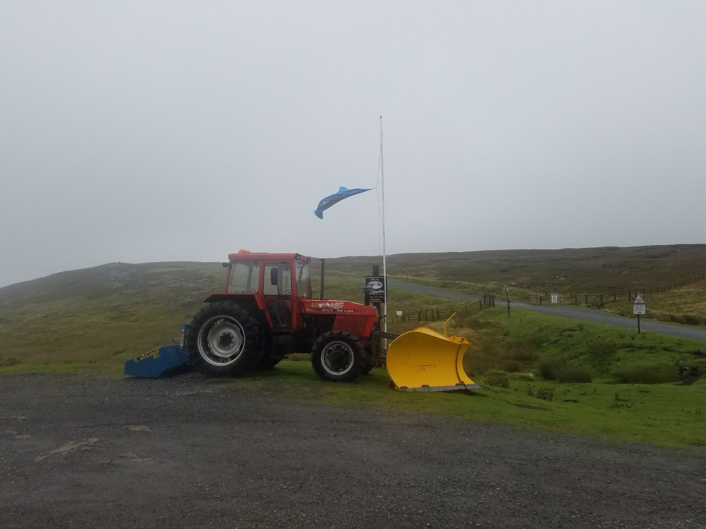
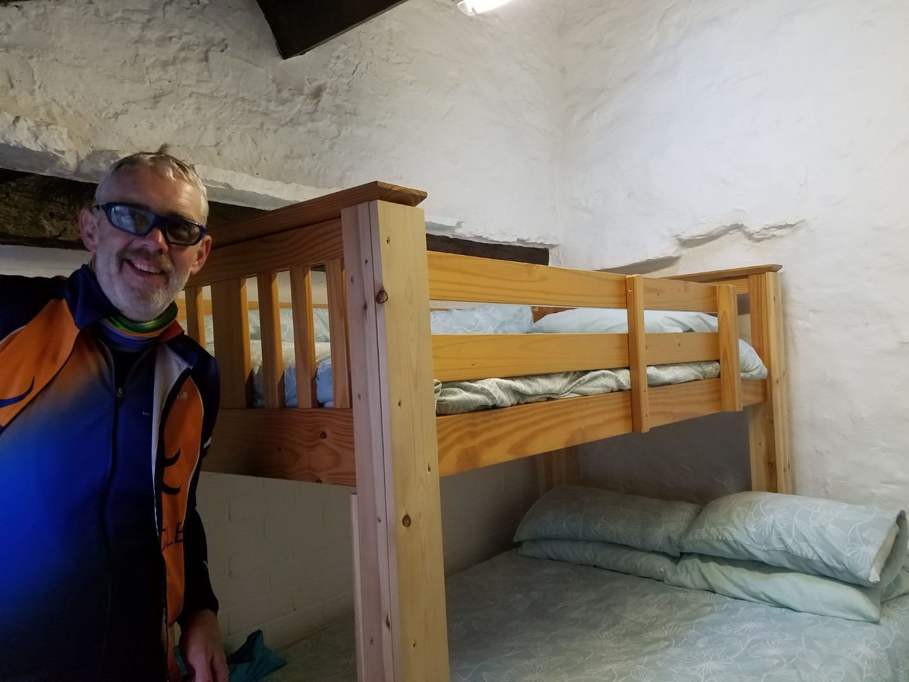
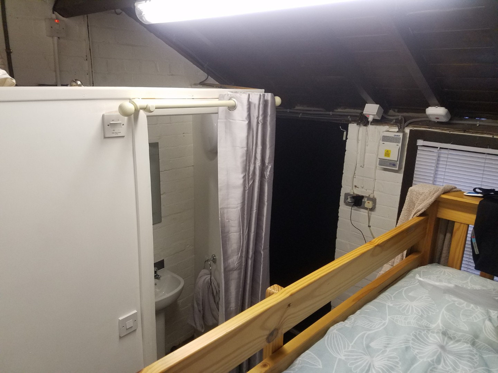
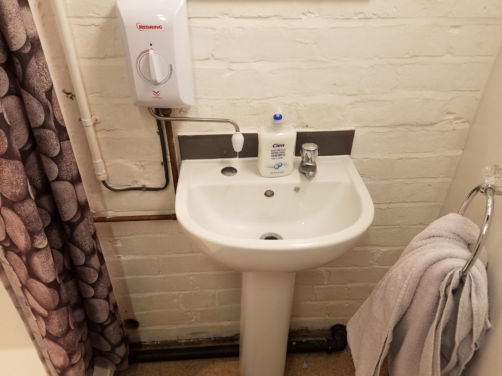

---
tags:
  - England
  - bikepacking
  - road-cycling
  - Yorkshire-Dales
title: Double C2C - Day 3
description: A bikepacking road trip on 2 Coast to Coast routes across Lancashire, Yorkshire and Cumbria.
draft: false
date: 2019-09-03
author: Tompkins Jonathan
---
# Double Coast to Coast
## Day 3 - Askham to Richmond

<figure style="text-align: center;">
  
  <figcaption><i>I wish I'd washed the cow slurry off my bike last night.</i></figcaption>
</figure>

**Askham to Richmond via the Tan Hill Inn**

**99.6km 1815vm 5hr19m*

A much easier day, it even started dry. Breakfast wasn't up to the usual standard as the café in Shap had closed down so we had to make do with eating outside the co-op.

There were only a couple of stiff short climbs in the morning. Crosby Ravenscroft, Maulds Meaburn and Great Asby were all beautiful villages, sort of Midsummers Murders territory but in the north.  Well worth a future visit.

<figure style="text-align: center;">
  
  <figcaption><i>I thought we would avoid that cloud.</i></figcaption>
</figure>

We could see low cloud and rain to our right and of course that meant that our route would turn right. We were now headed to Kirkby Stephen and as we reached the cloud it never really rained, it was more of a general spray and I had visions of it lasting all day. We could see the North Pennines, which we had to cross, and they were capped by a low, grey cloud.

We had a snack in Kirkby Stephen in the Mad about Mountains cafe. Luckily by the time we left it had stopped raining and we began the climb up to the Tan Hill Inn. It got damp again as we reached the cloud level and we even overtook some other cyclists, admittedly they were quite a bit older than us. I then had a puncture and they overtook us. They had a support vehicle which I'm sure was Jim's department.

We'd had a tailwind up the hill which was welcome on the 20% bits but at the top it was mostly from the right hand side, gusting really strongly and raining. The wind was so strong that I had to lean the bike into the wind to stay upright. Downhills were bad as the wind would catch the front wheel and move you all over the place. It felt like someone was holding the front wheel and gently waggling it about.

<figure style="text-align: center;">
  
  <figcaption><i>A Cumbrian cloud invading Yorkshire.</i></figcaption>
</figure>

<figure style="text-align: center;">
  
  <figcaption><i>A pity it doesn't look wet and windy</i></figcaption>
</figure>

<figure style="text-align: center;">
  
  <figcaption><i>One is standard issue at the Tan Hill Inn, the other is a very sorry looking flag.</i></figcaption>
</figure>

A brief stop at the Tan Hill Inn for a picture and we set off down before we got cold.  It was a seemingly endless hill, less gusty on this side and the wind was more behind us. A glorious descent.

After a coffee in the Dales Bike Centre in Grinton (good to see they're back to normal after the recent flood) we took the main road to Richmond which was a beautiful fast finish to the day.

We were staying in a "bunkhouse" at the back of a pub in the main square. On Airbnb the main picture that they used was of the sink! It basically consisted of a double bed with a single bed bunk above it (with no ladder, it wasn't easy getting up there) and an ensuite shower. The loo was outside. It was actually quite quirky, and at least it was warm and dry.

<figure style="text-align: center;">
  
  <figcaption><i>I wasn't allowed to get up for a wee in the night.</i></figcaption>
</figure>

<figure style="text-align: center;">
  
  <figcaption><i>Roomy.</i></figcaption>
</figure>

<figure style="text-align: center;">
  
  <figcaption><i>The money shot, the chief selling point.</i></figcaption>
</figure>

Tomorrow also looks like a reasonably easy day, not too long, not too much climbing and we should have a light tailwind to the coast