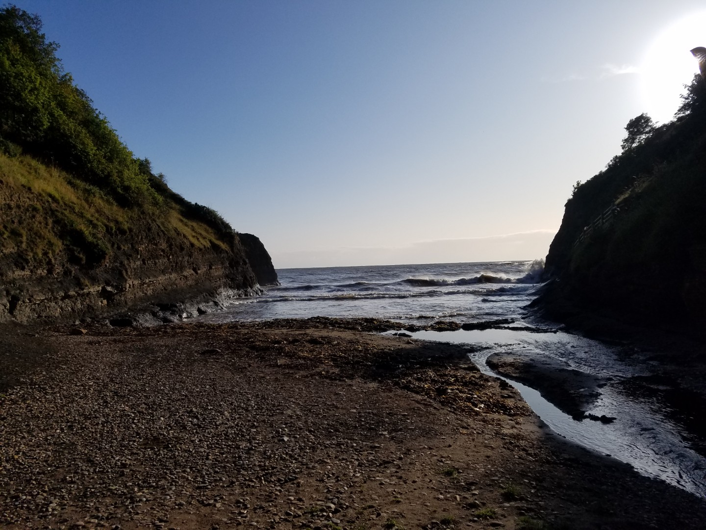
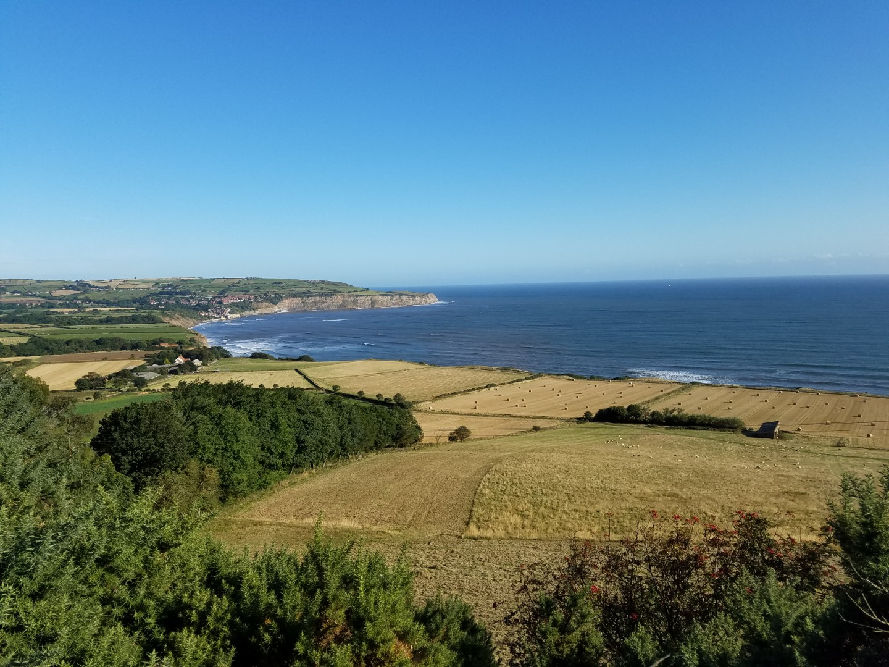
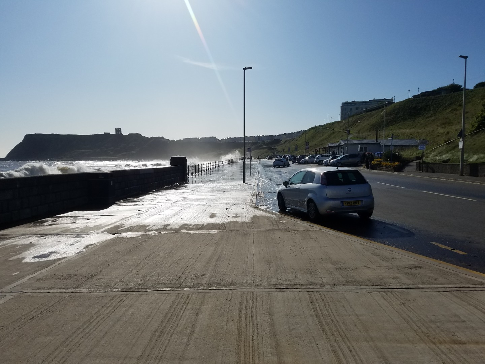
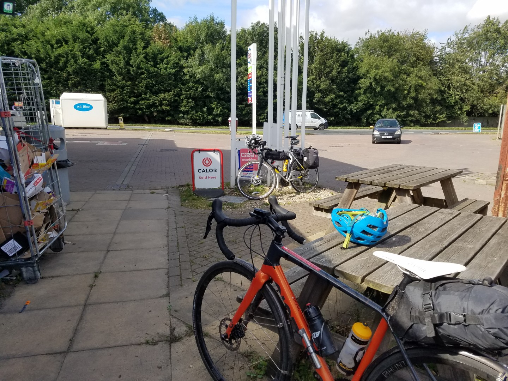

# Double Coast to Coast
## Day 5 Boggle Hole to York via Bridlington

<figure style="text-align: center;">
  
  <figcaption><i>Boggle Hole.</i></figcaption>
</figure>

**154.6km 7hr 42m 1406vm*

The cinder track that led to Scarborough turned out to be a bit rough and slow so we diverted to the road.  Sunny, with a  tailwind and great views of the coast, a really enjoyable morning's ride. The Scarborough sea front was impressive, waves were being blown over the sea wall.

<figure style="text-align: center;">
  
  <figcaption><i>Robin Hood's Bay.</i></figcaption>
</figure>

<figure style="text-align: center;">
  
  <figcaption><i>Scarborough sea front.</i></figcaption>
</figure>

We were soon in Bridlington and then turned west along the Way of the Roses. The route weaves about from here and with the large hedges the headwind wasn't that bad. It's pleasant round here, if gently rolling farm land is your thing. Personally I found it a bit dull. We'd modified the route a bit last night to make it a bit shorter, consequently we didn't pass any nice cafes after Bridlington, in fact we didn't pass any food stops at all until we got to a garage with a Londis. Not the nicest place for a rest.

<figure style="text-align: center;">
  
  <figcaption><i>Such nice surroundings.</i></figcaption>
</figure>

Up ahead there was an enormous brooding black cloud hanging over Millington Dale. It would have been quite nice here; a narrow little chalk valley winding it's way towards York, except it was hammering it down. It stopped raining when we got back to the flat boring bit.

Eventually, after an unexpected bit of off-road single-track, we arrived in York. I would have liked to have a look round but the thought of sitting down and doing nothing was more enticing