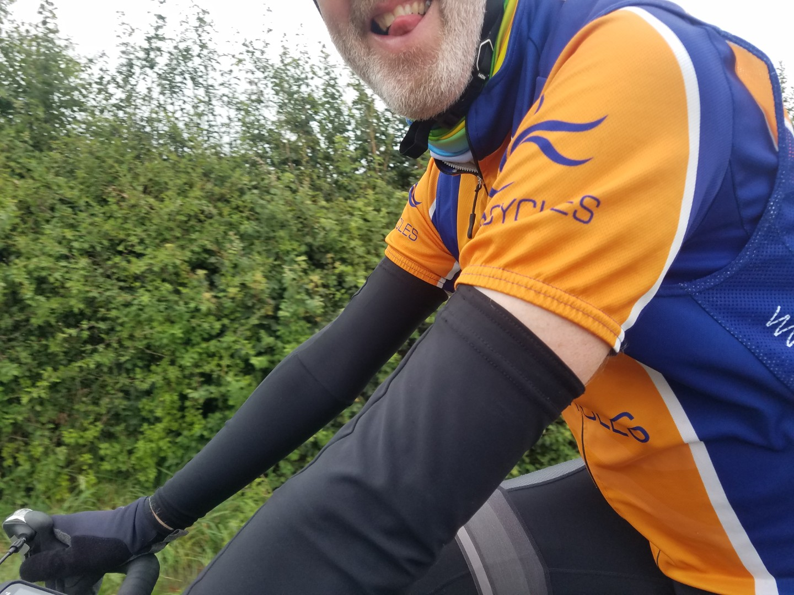
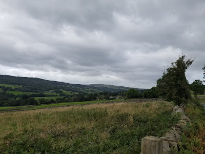
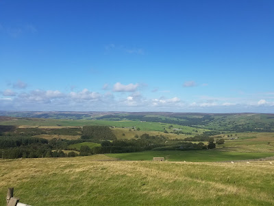
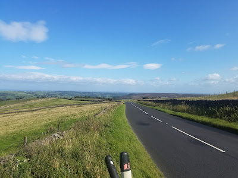

---
tags:
  - bikepacking
  - England
  - road-cycling
  - Yorkshire-Dales
title: Double C2C - Day 6
description: A bikepacking road trip on 2 Coast to Coast routes across Lancashire, Yorkshire and Cumbria.
draft: false
date: 2019-09-06
author: Tompkins Jonathan
---
# Double Coast to Coast
## Day 6 York to Airton

**101km 5hr26m 1495vm**

Jim final admitted that he needed to pack less kit and this gave me the excuse to launch into a patronising speech about kit choices. My one bag was a bit smaller than one of his panniers, and he had two panniers and a top bar bag. I suspect that the cause of his overpacking was due to Helen packing his bags - tell me it's true Helen!?

I hadn't had a great nights sleep, partly because I'd eaten so much food that I was still digesting it. Doing multiday rides gives me an excuse to eat some richer food but living on fryups, pizzas, hot dogs and fish and chips is great at first but it's bloody hard work on the body! I was actually looking forward to not eating breakfast and going back to two meals a day.

What also spoilt my nights sleep was the heat in the room and it wasn't from the radiator. It was my shoes. They'd been damp almost every day and never quite dried out and they'd become a fertile breeding ground for bacteria. They stank to high heaven and I'm sure that all the bio activity was causing some significant bio thermogenesis. The reduced oxygen levels in the room due to the stench didn't help either. I can't even blame Jim's normal high methane production because he seemed to be saving that for the hills, presumably to help him try and keep up.

It was an easy start from York, flat and traffic free. We stopped in Boroughbridge for a coffee and were surprised to find that the café owner didn't know that the world champs road race was coming through, despite the sign opposite. I was too full from breakfast to eat here but as soon as we left I felt hungry. Odd.

It was flat all the way to Bishop Monkton and then it started to get mildly lumpy. We  bypassed Ripon because, well, we couldn't be bothered doing extra distance just to go to Ripon. Sorry Ripon. 

My legs felt fine yesterday when we got to the YHA but as soon as I'd sat down and then had a shower they started to ache. Walking down the stairs to the café was murder. A similar thing happened on LEJOG, they started to hurt each day but never really got much worse. Today they felt better riding but the hills from here onwards would be the real test. They were fine over Brimham Rocks and we'd planned to have some food in Summerbridge so that at least we had a warm up before getting to the monster climb out of Pateley Bridge. It's a pity the route doesn't go through Summerbridge! Instead we stopped in Pateley and immediately had a 16% hill to tackle. My legs were basically ok but they were definitely tired, good job it was a short day. There was a brutal headwind all the way from Pateley to Grassington, it was really hard, slow going.

Overall a really enjoyable route despite the weather in the first half. If I did it again I'd look closely at some of the Sustrans sections, they often go up a hill when there's an easier valley option. From Whitby south I'd probably try and follow the coast a bit more, going through Filey and down to the harbour in Bridlington. This coastal area was some of the best riding, maybe because I'd not been here before?

<figure style="text-align: center;">
  
  <figcaption><i>A completely unacceptable arm warmer / cycling top interface.</i></figcaption>
</figure>

<figure style="text-align: center;">
  
  <figcaption><i></i></figcaption>
</figure>

<figure style="text-align: center;">
  
  <figcaption><i></i></figcaption>
</figure>

<figure style="text-align: center;">
  
  <figcaption><i>Brutal headwind not shown.</i></figcaption>
</figure>

