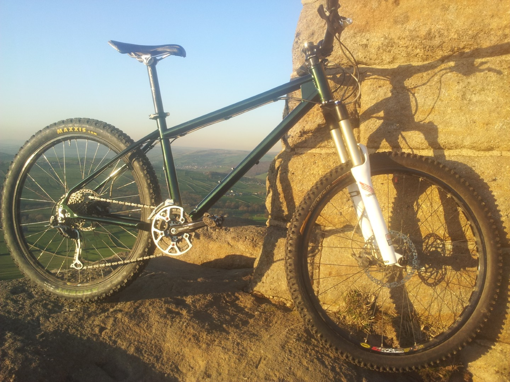
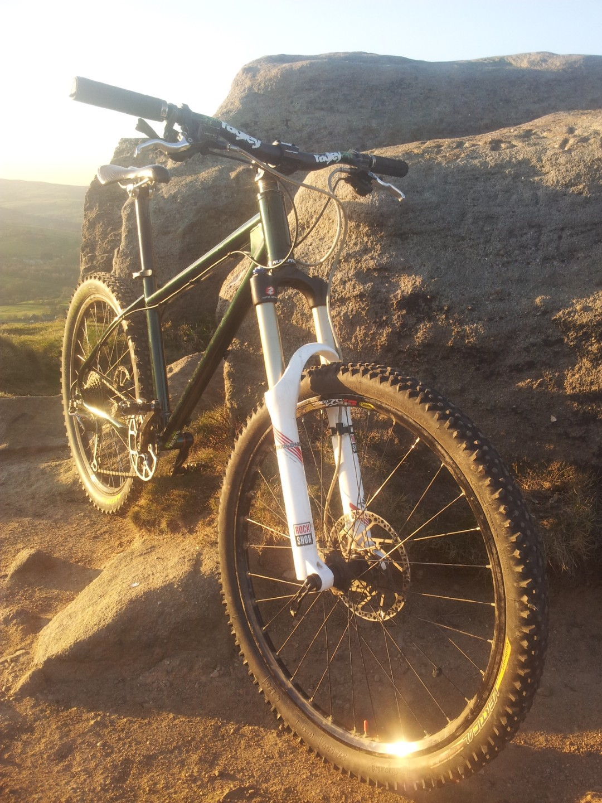
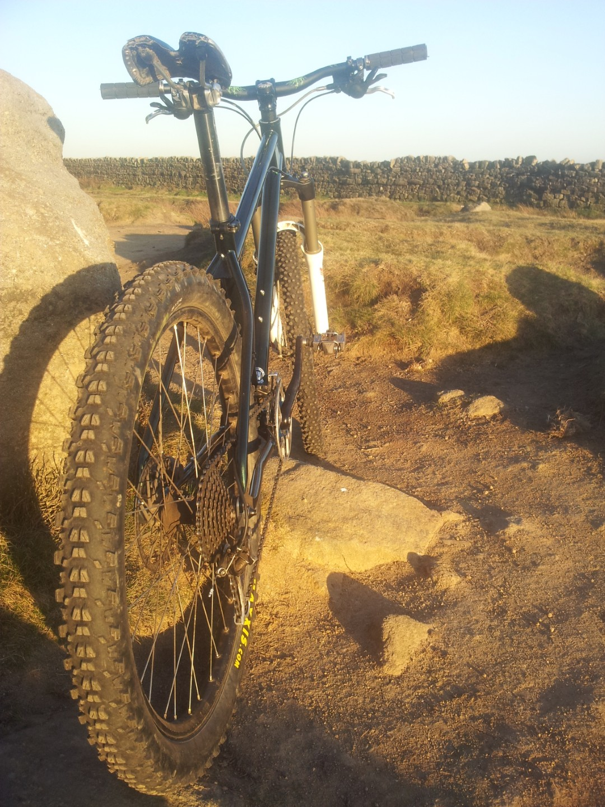
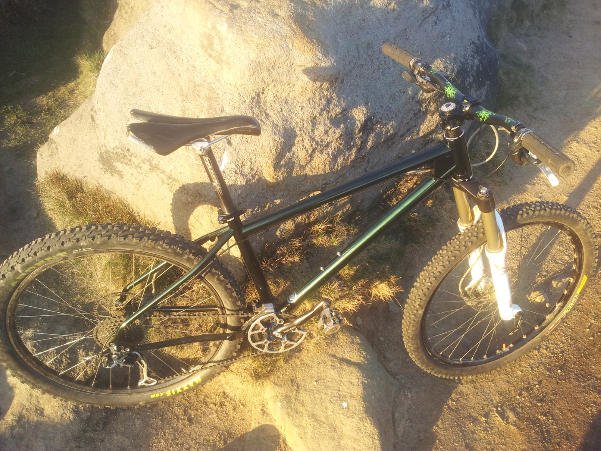

# Finally ready

<figure style="text-align: center;">
  
  <figcaption><i>Too busy to write much. Stuart at [RCC](http://riderscyclecentre.com/) built it, I rode it and now I'm having a beer.</i></figcaption>
</figure>

Thanks Stuart, it would have taken me ages to build it myself and I would never have got the dremel out!

<figure style="text-align: center;">
  
  <figcaption><i></i></figcaption>
</figure>

<figure style="text-align: center;">
  
  <figcaption><i></i></figcaption>
</figure>

<figure style="text-align: center;">
  
  <figcaption><i></i></figcaption>
</figure>

[RCC build MrT's Ragley Bluepig X mountainbike.](http://vimeo.com/39289746) from [yorkshirebiking & RCC](http://vimeo.com/yorkshirebiking) on [Vimeo](http://vimeo.com/).