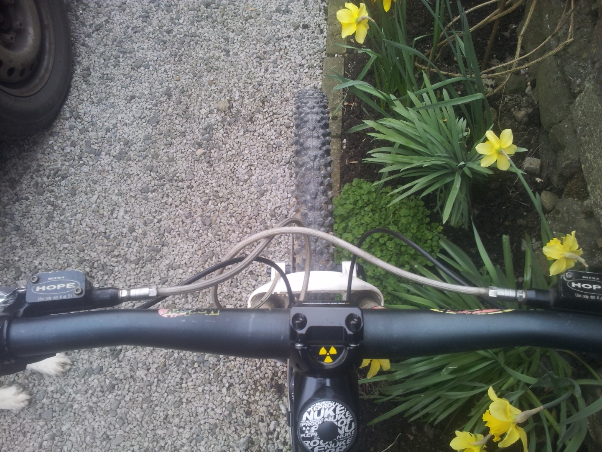
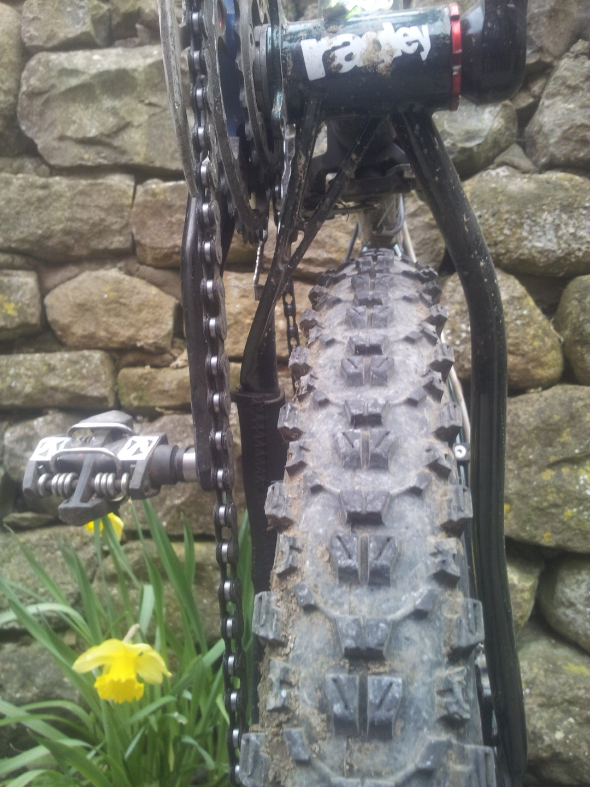
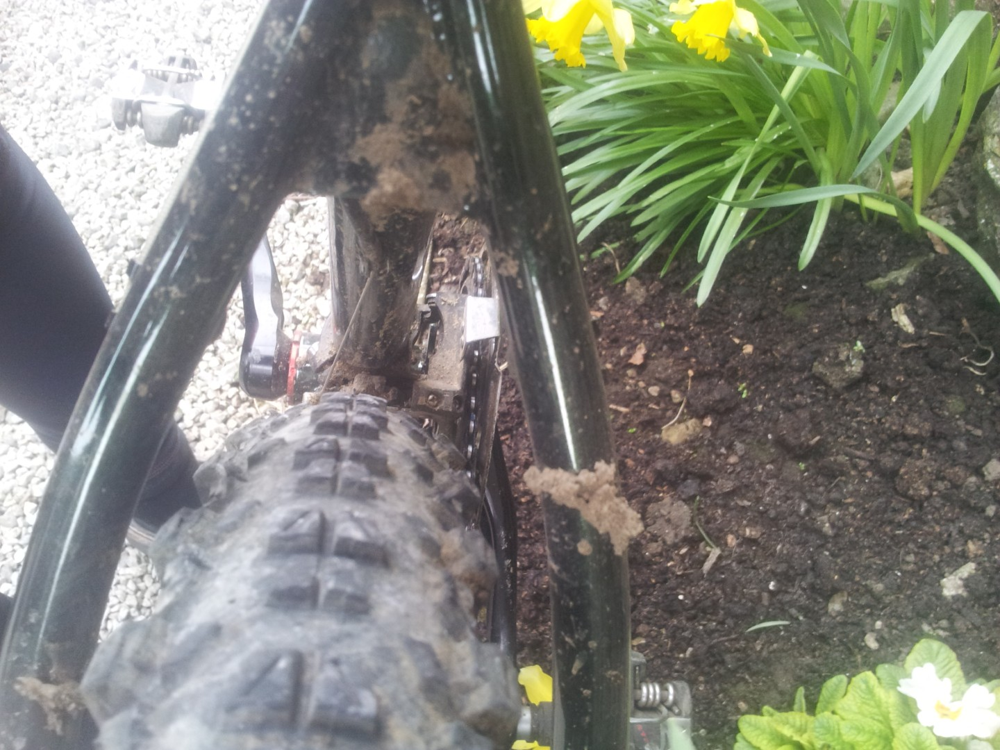
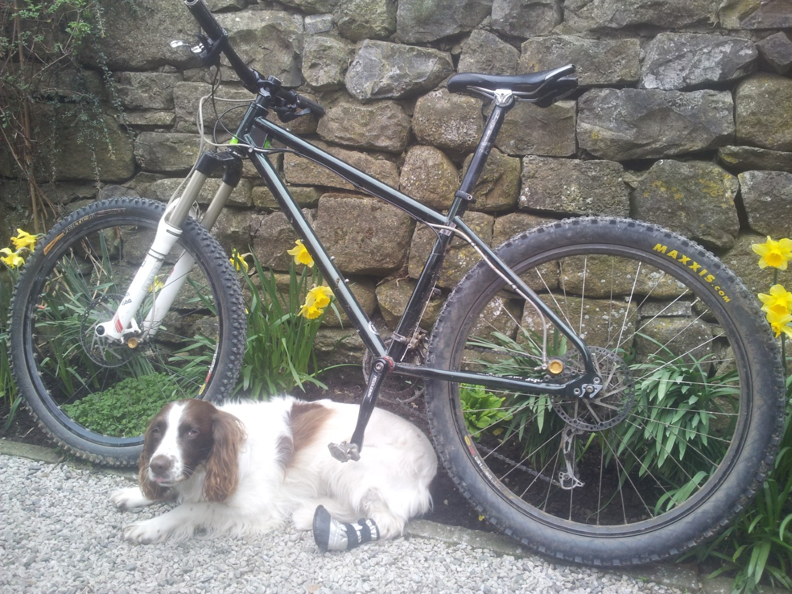

---
tags:
  - mtb
  - kit
  - Yorkshire-Dales
title: First rides on the Blue Pig X
description: Testing a Ragley Blue Pig X
draft: false
date: 2012-04-02
author: Tompkins Jonathan
---
# Testing the Ragley Blue Pig X
**29th March 2012 **

<figure style="text-align: center;">
  
  <figcaption><i>I love the fact that the front axle is ahead of the handlebars.</i></figcaption>
</figure>

Dan was visiting and testing a Ragley Piglet courtesy of [Stuart](http://riderscyclecentre.com/), I desperately wanted to test my new Ragley Blue Pig X and Dan's friend, Rich, was also visiting with his museum piece Rocky Mountain **SLAYER** (this must be shouted for full effect). The forecast was superb, sunny and warm, and it had been dry for more than a week so every trail would be in condition. In the end I decided on a tour and then ascent of Pen-y-Ghent. Some of it would be a bit cheeky but hard pack trails midweek, ridden by sensible people, are fair game. Total distance was 40km with about a kilometre of ascent. 

<figure style="text-align: center;">
  
  <figcaption><i>The 3 finger bridge.</i></figcaption>
</figure>

Whenever I get a new bike there's always a bit of apprehension as to whether I made the right choice. The Dawson Close track and the loose downhill to Litton didn't put me off but it was the first climb of the day that started to convince me. From Foxup we climbed a brutal grass track up the flanks of Pen-y-Ghent to join Foxup road (really a track that contours the hill). I'd never ridden the whole thing without pushing and today was no different. What was different was how little I had to push, only about 20 metres instead of the usual 100's of metres. Partly it was down to the bone dry conditions but I'm sure there was a bit of a hardtail advantage there. The track then contours along a beautiful mix of grass and limestone track before dropping down to Hull Pot and then joining the Pennine Way to Horton in Ribblesdale. I thought a section of this track, where it turns from hard pack to rough exposed limestone with large rocks scattered around, would have me wishing for a full sus. It didn't. In fact I didn't remotely miss the Blur. 

<figure style="text-align: center;">
  
  <figcaption><i>Seatstay tyre clearance, sufficient, as Rolls Royce would say.</i></figcaption>
</figure>

From Horton we headed to the Helwith Bridge pub only to find it closed. We climbed Long Lane Track to Churn Milk Hole and then carried our bikes to the summit. We'd passed a few walkers and after asking them to berate Rich who was lagging behind we started to feel guilty. Dan and I had reached the summit and there was no sign of Rich. Two walkers appeared who we recognised from the start of the climb and they joined in with our Rich bashing. Where were all the red socked militants today? Eventually an extremely large chap appeared who we'd also passed. If he had got here before Rich then maybe he was in serious trouble! He proceeded to tell us tales about how Rich was going really slow and had fallen off. Just as I started to get really worried he appeared, complaining of cramp and not having ridden his bike since 1750, BC. Because he was an ex Marine we tried not to show much sympathy.

<figure style="text-align: center;">
  
  <figcaption><i>I didn't like the curved seatstays at first but they are growing on me now. I really like the fact that they are functional, allowing the brake to mount to the chainstay.</i></figcaption>
</figure>

The descent back towards Hull Pot was superb. Steep enough to be fast with slabs of gritstone all over the place. Then it drops to the limestone layer and turns into a built hard pack track with rocks randomly sticking out. By the bottom my hands where numb and I was surprised I didn't have a pinch flat. Definitely need more powerful brakes and to go tubeless.

We then repeated our route to Horton, Helwith Bridge, Long Lane and back to the van. We left Rich at the Helwith Bridge as his cramp wasn't getting better. A great first ride on the Blue Pig. Dan was very happy with his Piglet test, I think he's tempted to get one and Rich texted me a few days later asking about various hardtails!

**02nd April 2012**

It was forecast snow on Tuesday so I had to get a quick ride in before the perfect trail conditions turned to mush. I decided on my local loop - road to Otterburn, non technical bridleway to the technical climb of Stockdale Lane, across to Malham Tarn, along Mastiles Lane and then down Weets Top. Stockdale Lane is mostly easyish going on a limestone track, sometimes loose, sometimes rocky. In 3 or 4 sections it gets steep and starts loose and turns to limestone cobbles. You have to get your line right and you have to have a bit of speed, which obviously requires fitness when going up hill! I'd only ever cleaned it a few times, usually when I was fit. I was convinced that my full sus Blur would be an advantage here because you could sit down and hopefully float over the rocks. 

Today I cleaned it on the Blue Pig. I know I'm not particularly fit and the Blue Pig has the same forks and tyres as my Blur so it must be down to the slack head angle and power transfer of a hardtail. I was a bit gob smacked at the top. I'd sort of hoped I'd clean it as a justification for buying the bike but I didn't actually think I'd do it.

<figure style="text-align: center;">
  
  <figcaption><i>I love the fact that there's so much room between the front tyre and the down tube. So much room in fact that you can fit a Spaniel in there.</i></figcaption>
</figure>

