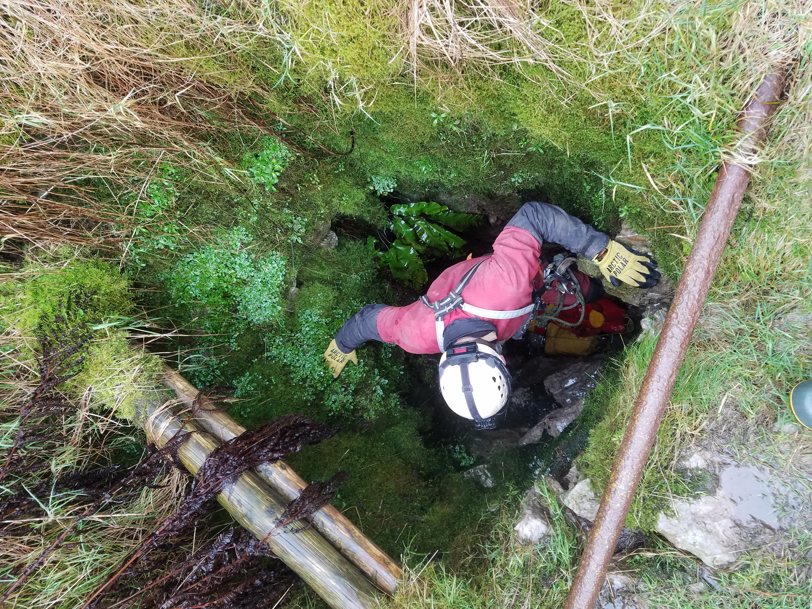
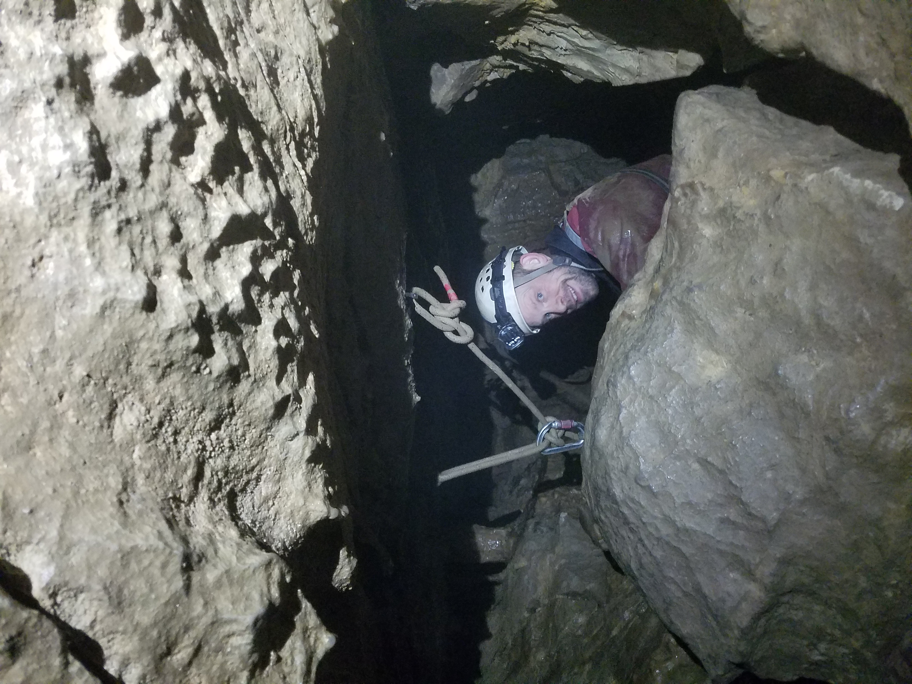
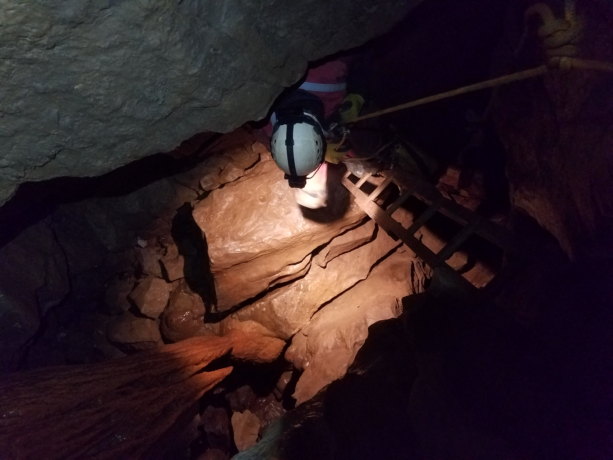
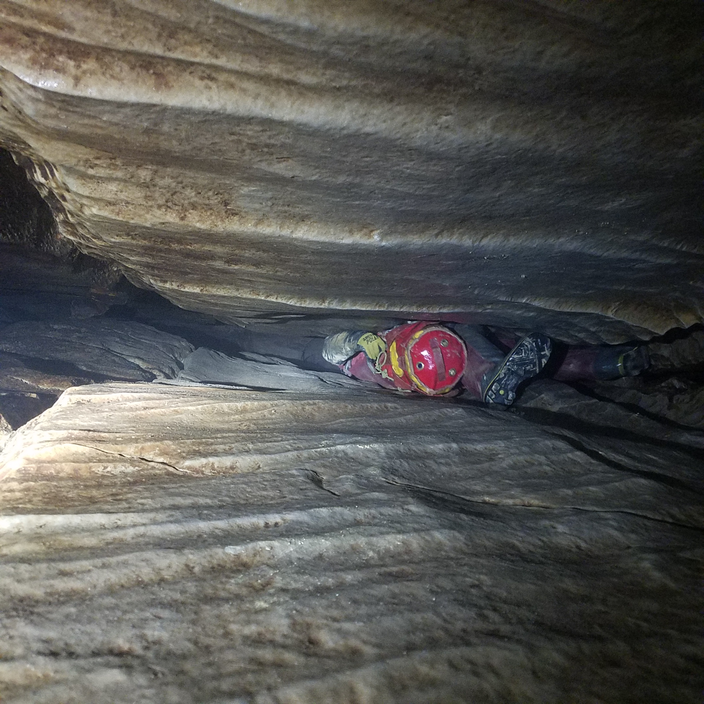
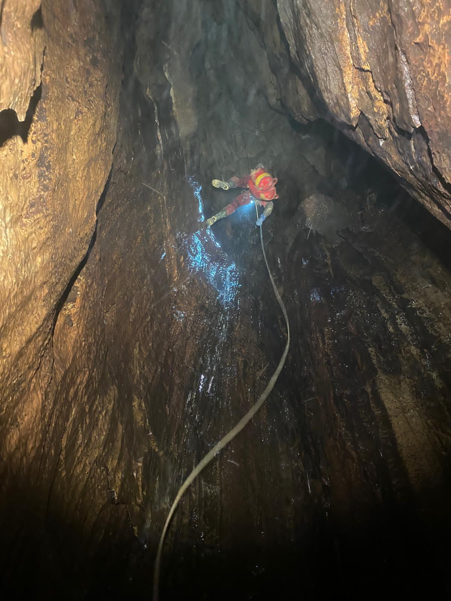
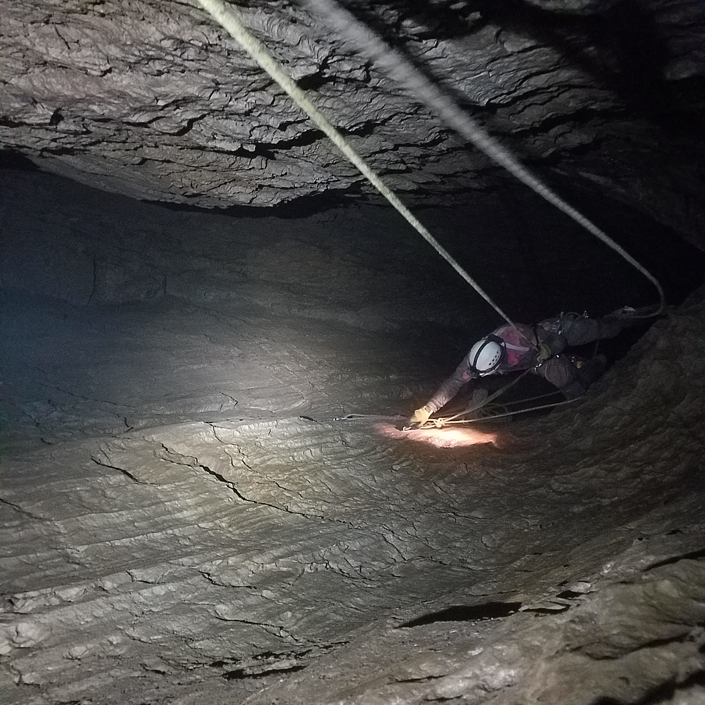

#what/blog #topic/caving #status/ready_to_publish #where/England/Yorkshire_Dales 

---
# F.O.U.L. POT
 **Tuesday 10th February 2026**

Jonathan Tompkins & [[John Martin]]

TL; DR - F. O. U. L. Pot, good, hard trip, I don't feel the need to go back.

Awkward crawls and squeezes, an interesting bastard of a narrow rift in two parts, loose in places, flood prone, a magnificent big pitch, some impressive formations, a squalid final sump and well worth the trip. [As long as you don't get stuck in the rift and need to cut your trouser leg off](https://www.tsgcaving.co.uk/content/Trip-Reports/foul-pot-ben-wrightsteph-dwyer)

*[From the CNCC website: "Unlike many deep Fountains Fell pots, FOUL Pot isn’t quite as tough. There is a rather low crawl just inside the entrance, and a tight rift below the second pitch, but these are very short. In return, FOUL offers an excellent adventure, splendid pitches and good formations. FOUL Pot can be visited in moderately wet weather although in very wet conditions some of the pitches can become hazardous, and the sump rises ~30m to the top of the final pitch!"](https://cncc.org.uk/cave/foul-pot)*

The entrance down climb is fine, the entrance crawl is wet and low but OK, the following squirms are all easier than they look and the first two pitches are easy. After the second pitch comes **THE RIFT**.

Tania cleverly read the description and then produced an excuse not to come, John had no other option. I suggested the cave but I don't know why because I'd read the description - ["*At the bottom of the second pitch is a very narrow rift. This looks worse than it is, although SRT kit removal will help above-average sized cavers to fit. The rift is only 4m long and it is easy to pass bags through with teamwork. A short climb down (not all the way to the floor) reaches a further 3m narrow section."*](https://cncc.org.uk/caving/download-guide/?uid=e6b5e889-62eb-05a2-9cfa-f2249f75985d) I can confirm that it **is** as bad as it looks, removing SRT kit is more than helpful and teamwork only helps if the other caver is a stoat. I ummed and aahed a lot at the first section, starting to squirm in and backing out, contemplating being stuck in there. I didn't quite have a breakdown but I did think I wouldn't fit and should turn back. John encouraged me, either through generosity of spirit or because he didn't want to do the rest of the cave by himself.

Looking at it makes you think you'll slide through vertically but reality soon forces you to slither horizontally. On the way in I kept my left leg and arm in the bottom of the rift, the right leg out horizontal behind me and my right arm vertically up pulling on an edge like [Adam Ondra](https://www.planetmountain.com/uploads/img/1/70057.jpg). I found it difficult. On the way out I kept both legs out horizontal in the rift and one arm down. This was much easier, probably because my poor flexibility stopped me from flattening my hips enough with one leg down. If my arms had been one inch shorter I'm not sure how I would have got through. John, of course, slid through like it didn't exist.

I found the second section even harder to start due to some awkward blocks, it took me ages to work out how to get my lower leg over the blocks (very slowly, if you're wondering). It was much easier on the way back; slightly downhill at the tight bit.

The rest of the cave is perfectly acceptable, awkward but straightforward. There are two down climbs which on the way out are a climb with an insitu rope which isn't needed at all and a climb without a rope that is definitely needed. I had to help John up this climb which is a first and something I'll never let him forget. It's irrelevant that he had to help me as well.

After so many narrow squirmy passages it's odd to get to the big main pitch, Man O' War, which is very impressive. 

The sump is, as ever, a delightful, squalid muddy spot. There's digging kit and a long pipe, someone is (or was) trying to lower the sump pool as F. O. U. L. Pot is one of the feeders to the [Gingling master cave.](https://cncc.org.uk/cave/gingling-hole)

Six and a half hours in the end, including walking up and finding the entrance and walking back. Not sure how long I spent prevaricating / preparing / being pathetic at the rift but it was significant. A tiring trip but well worth it. Still can't think of a reason to go back.

[CNCC F. O. U. L. Pot description & rigging topo](https://cncc.org.uk/cave/foul-pot)

<figure style="text-align: center;">  <figcaption><i>F.O.U.L. Pot entrance</i></figcaption> </figure>

<figure style="text-align: center;">  <figcaption><i></i></figcaption> </figure>

<figure style="text-align: center;">  <figcaption><i>this ladder is far better than the description implies</i></figcaption> </figure>

<figure style="text-align: center;">  <figcaption><i>First rift section</i></figcaption> </figure>

<figure style="text-align: center;">  <figcaption><i>the big pitch</i></figcaption> </figure>

<figure style="text-align: center;">  <figcaption><i>big pitch rebelay</i></figcaption> </figure>

<figure style="text-align: center;">
  <video src="foul_pot_rift_1.mp4" style="max-width: 100%; height: auto;" controls>
    Your browser does not support the video tag.
  </video>
  <figcaption><i>The rift on the way out</i></figcaption>
</figure>

  
  
<i>The Rift, as bad as it looks.</i>

