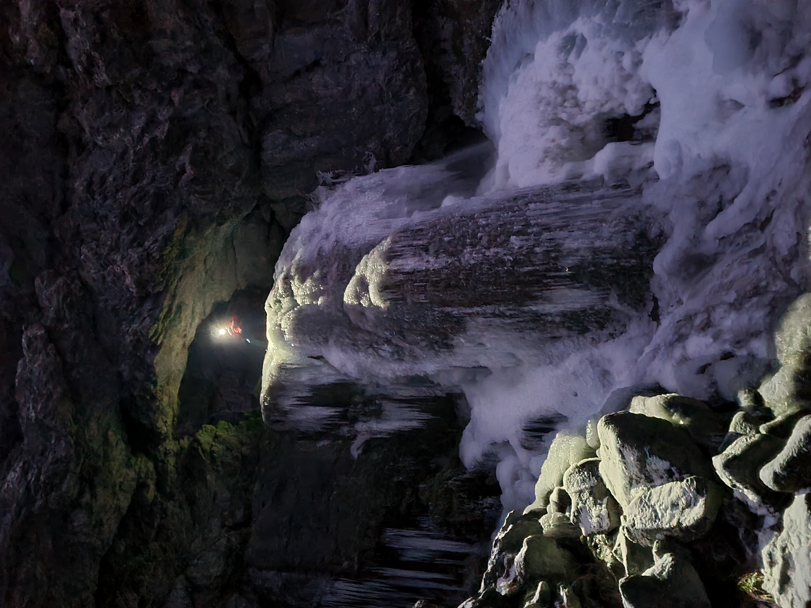

# Gordale ice climbing
**17th December 2022**

It was cold but it had not occurred to me that Gordale Scar would be frozen. [Olly Roberts](https://www.ollyrobertsoutdoors.co.uk "Olly Roberts Mountaineering") however knew differently so we met up early and wandered up the Scar. It was toffee like ice, which apparently is good, but it also had water flowing underneath it, which apparently is not good.

<figure style="text-align: center;">  <figcaption><i>The sound of water flowing underneath the ice not pictured</i></figcaption> </figure>
