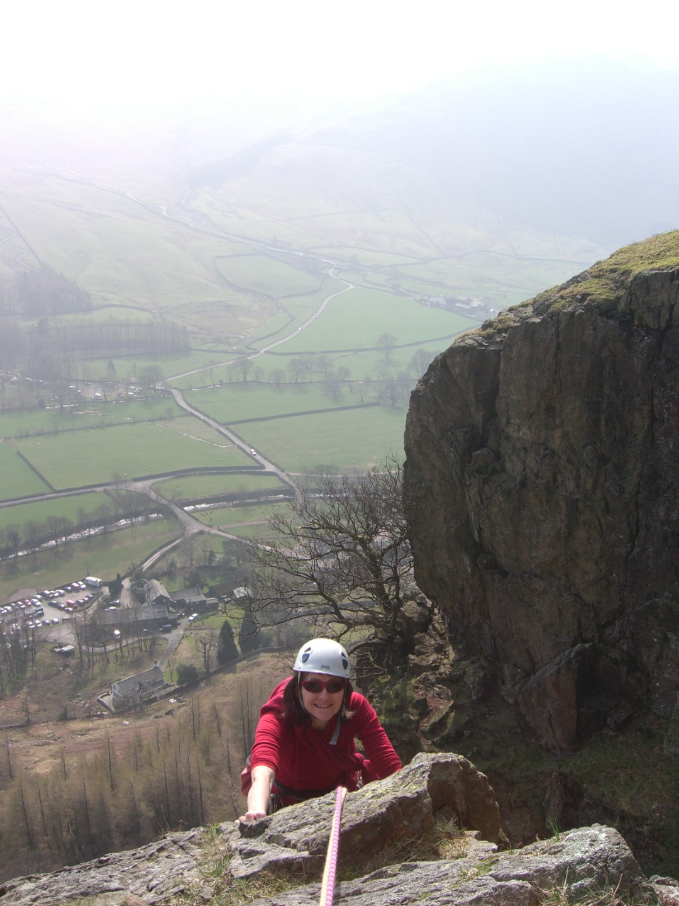
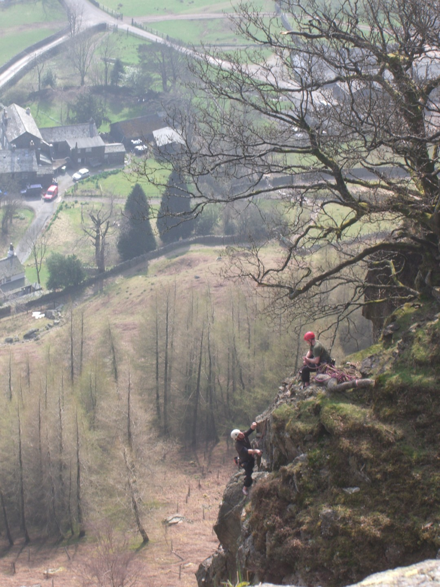
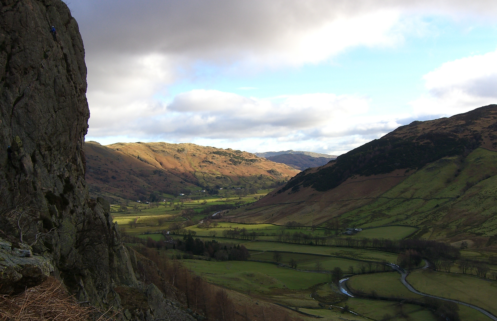

---
tags:
  - climbing
  - Lake-District
title: Grumpy when scared.
description: A low grade climbing trip in the Lake District
draft: false
date: 2012-03-26
lastmod:
author: Tompkins Jonathan
---
# Grumpy when scared.
**26th March 2012**

Glorious warm, sunny weather, Sue's desperate to climb and I need to check some crags in the Lakes for group use for work. It wasn't a good start on Friday as it was foggy but by the time we got to Langdale it was sunny and stayed that way for both days. I think this may be our summer in spring, again!

We checked out Lower Scout Crag first and surprisingly met Sarah, an instructor I used worked with in Sheffield. Lower Scout is known as a group crag but the easier routes are surprisingly good, although they all finish up the same corner so as to avoid an overhang. Sue led them all, she was looking far to keen to deny her.

Cub's Groove VD 13m * Pleasant and straightforward. The finish, which is common to all three routes, is steep but on monster holds.

Cub's Wall VD 13m * Hmm, not sure it's VD! Easy except for two moves which feel a bit out there for the grade.

Cub's Crack S 13m * Steep and a bit awkward at the bottom

We then moved on to Upper Scout and repeated Route 1.5 (VD 43m 3 pitches). Easy first and last pitch which I led (reluctantly given to me by Sue who wanted them all) with an interesting second pitch.

I then went to look at Copt Howe, not worth a visit unless you have to go with a group, and then we went to Tilberthwaite quarry. We didn't climb here but we will return, there's just enough interesting easy routes for a morning.

So far so good.   

<figure style="text-align: center;">
  
  <figcaption><i>Top of P3, Centipede</i></figcaption>
</figure>

On Saturday we almost went to White Ghyll but as the dog had a gammy foot we went to Raven instead where, unusually, the first route we did we hadn't done before. Centipede (S 90m 4 pitches) is sandwiched between lots of vegetation but is actually a good route and after Sue tried to bag all the best pitches she eventually gave me 1 and 3. Pitch 1 wasn't difficult but there wasn't much gear and a recently fallen block that left soil stuck to the face gave me the willies. Cue tantrum. The lack of gear doesn't really bother me; I'd basically soloed the first pitch of Route 1.5 yesterday quite happily. The missing block did worry me; every crack on the wall now had me peering at it and tapping it, suspicious that it was dodgy. The climbing wasn't difficult but it wasn't exactly straightforward and all this produced a fair amount of swearing. Mostly it was bad old climbing memories automatically reappearing, partly it was my annoyance at not being able to cruise up it. I have a bit of an odd problem climbing. I want to climb stuff that feels hard but I want to be able to cruise it. Sue tried to encourage me and I think that secretly, she finds my climbing tantrums amusing. 

By the time Sue joined me on the delightfully large belay platform I was a lot happier. Across the gulley, perched above a Holly Tree in a dead Oak tree was a Peregrine. I t was a fantastic sight and the closest I've been to a wild bird of prey. Every so often it would turn to look at us and then turn back to gazing over Langdale. Sue had some strange ideas about the bird attacking lambs and therefore Molly; she was worried that because Molly was tied up she wouldn't be able to escape the Peregrine! 

I don't remember much about pitch 2 except that the belay did it's best to avoid a vegetated gulley. Pitch 3 was superb; a rising crack running diagonally up the face. Unlike Raven crag, the descent was easy, a nice pleasant footpath rather than the accident inviting down climb of Raven.

<figure style="text-align: center;">
  
  <figcaption><i></i></figcaption>
</figure>

After lunch with Molly, who, as expected, was delighted to see us, we did Original route (S 61m 4 pitches). I'd done this before but had a question mark against the last two pitches and I couldn't remember why. Pitch 1 was ok although Sue chose the most awkward of the 2 options that the guidebook describes. The crack on the right is described as awkward and it was, go left next time Sue! Pitch 2 was easy and mostly involved me walking dragging the rope behind me. At the start of pitch 3 I realised why there was a question mark in my guidebook, it wasn't obvious where it went. To be precise it was obvious if you read the guidebook but it looked improbable at the grade which is why when I first did it I finished up a different route altogether; Oak Tree Wall I think which is the same grade but looks easier. I find it hard to believe that this is the original route of the crag, it's not where I would have chosen to go as an initial exploration of the crag! Sue seemed quite happy leading it though,

The belay wasn't the great big ledge I wanted, instead Sue was somehow sat on what felt like a near vertical wall, not belayed to the normal enormous block. I was not happy! I set off as soon as possible, put some gear in and was soon over the difficulties. It's a bit ambiguous where the pitch ends and the belay I found consisted of 1 poor nut and my bulk. Sufficient, Sue will point out. Instead of the usual horrible down climb we used an insitu cord to abseil off. Unfortunately this is preceded by a horrible down slither which I think is still better than the usual down climb.

All in all a great two days climbing in fantastic weather and somehow I wasn't sunburnt.

<figure style="text-align: center;">
  
  <figcaption><i>Langdale from Raven Crag</i></figcaption>
</figure>