# A failed attempt on the Highland 550
**2nd May 2022**

I came across the [Highland 550](https://bikepacking.com/routes/highland-trail-550/) fairly recently and really fancied it, it was just my type of bikepacking trip; remote and it goes to loads of great places in Scotland. I definitely wasn't interested in the [race](https://highlandtrail550.weebly.com).

The plan was to start in early May which hopefully would have good weather and no midges. 
Unfortunately about 300km in, in Glen Cassley on a very gently undulating road, my knee started to hurt and progressively got worse. Eventually I had to abandon, I just couldn't ride properly. I limped along, often pedalling one legged, to some accommodation and then the next day got a train home. It took a while to settle down and recover.

Highlights were the Ben Alder singletrack over the pass, great singletrack that was rideable on a fully loaded bike. Also, finding the Badger Hide, a hobbit like building, that provided a cheeky overnight stop. And just about every view around every corner.

<figure style="text-align: center;">
  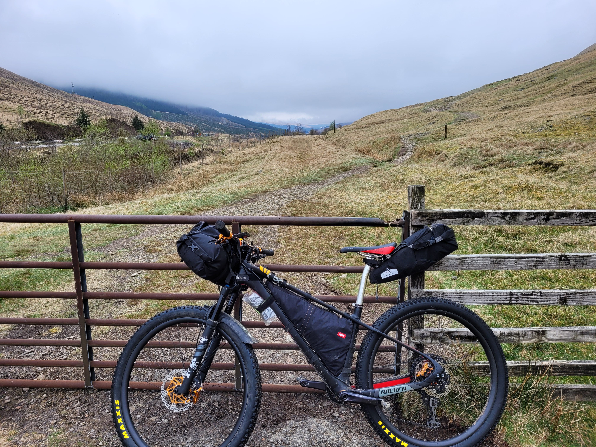
  <figcaption><i>The internal metal frame in the Arkle rear bag would break on a subsequent trip requiring some inventive running repairs.</i></figcaption>
</figure>

<figure style="text-align: center;">
  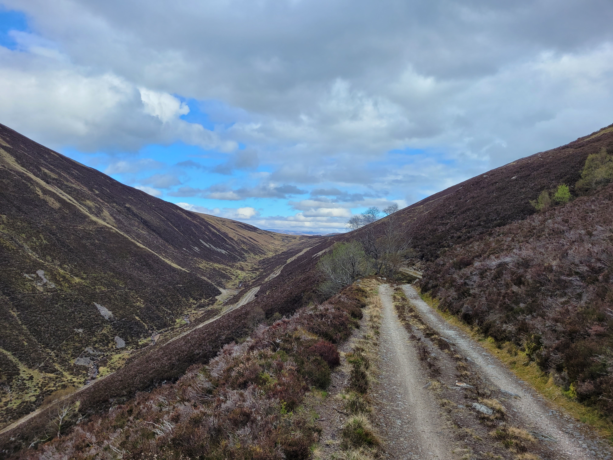
   <figcaption><i>Lairig Ghallabhaich</i></figcaption>
</figure>

<figure style="text-align: center;">
  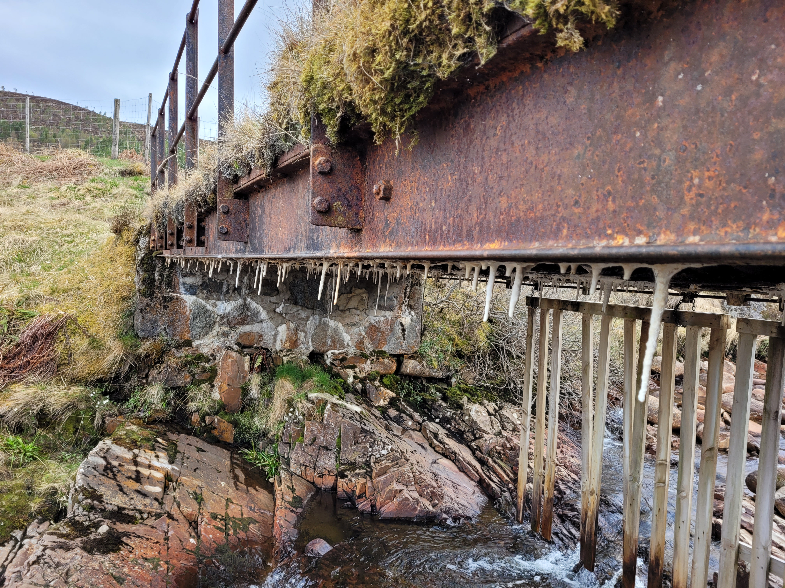
  <figcaption><i></i></figcaption>
</figure>

<figure style="text-align: center;">
  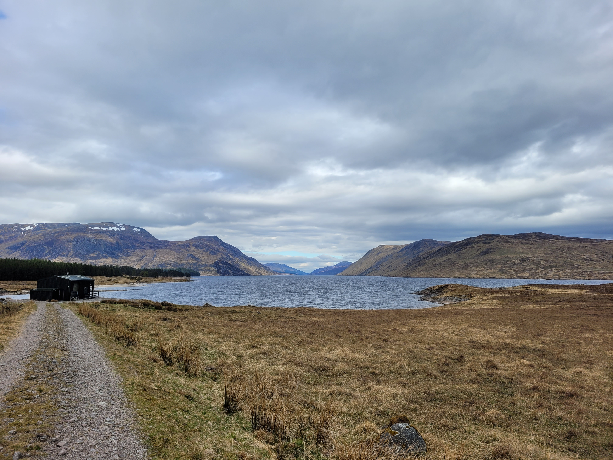
  <figcaption><i>Loch Ericht from the south</i></figcaption>
</figure>

<figure style="text-align: center;">
  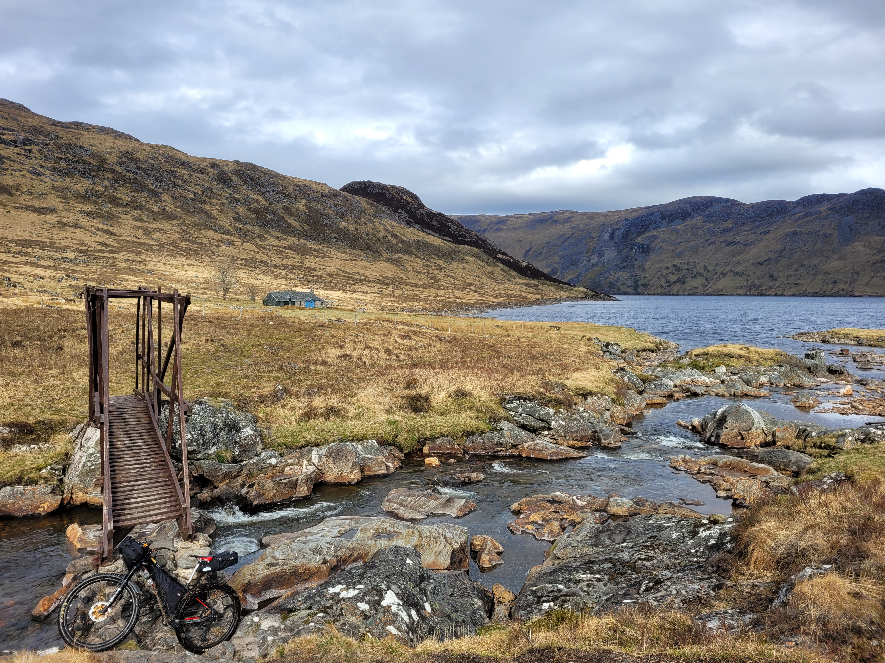
  <figcaption><i>Ben Alder bothy</i></figcaption>
</figure>

<figure style="text-align: center;">
  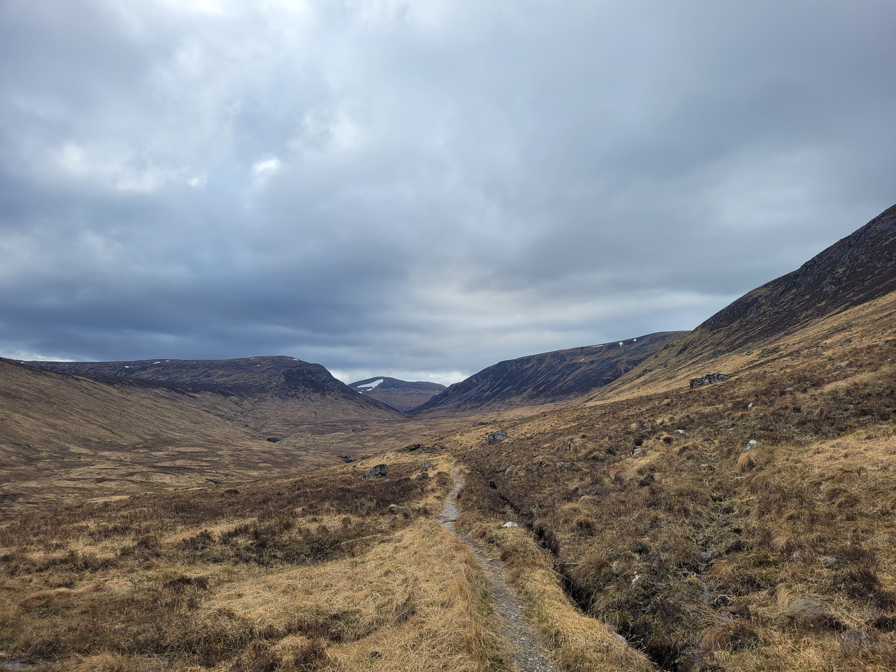
  <figcaption><i>Ben Alder Pass</i></figcaption>
</figure>

<figure style="text-align: center;">
  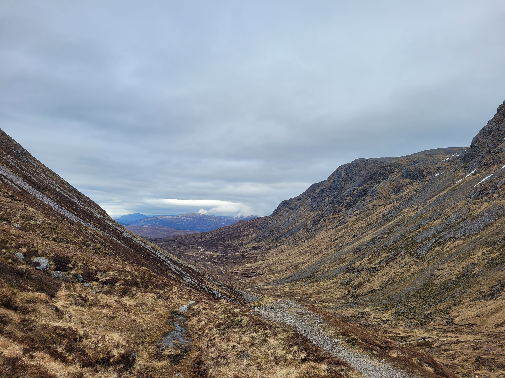
  <figcaption><i>Bealach Dubh above Ben Alder bothy</i></figcaption>
</figure>

<figure style="text-align: center;">
  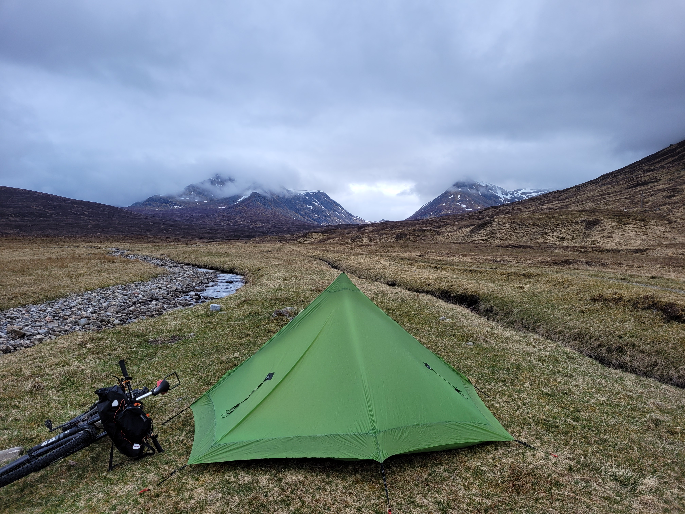
  <figcaption><i>Day 1 campsite near the condemned Culra Bothy.</i></figcaption>
</figure>

<figure style="text-align: center;">
  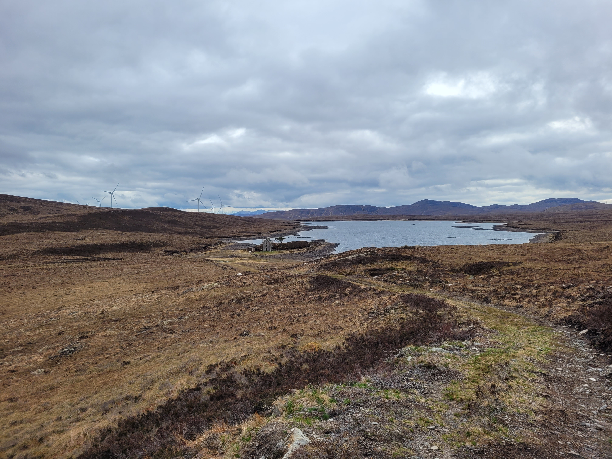
  <figcaption><i>Loch ma Stac on day 2</i></figcaption>
</figure>

<figure style="text-align: center;">
  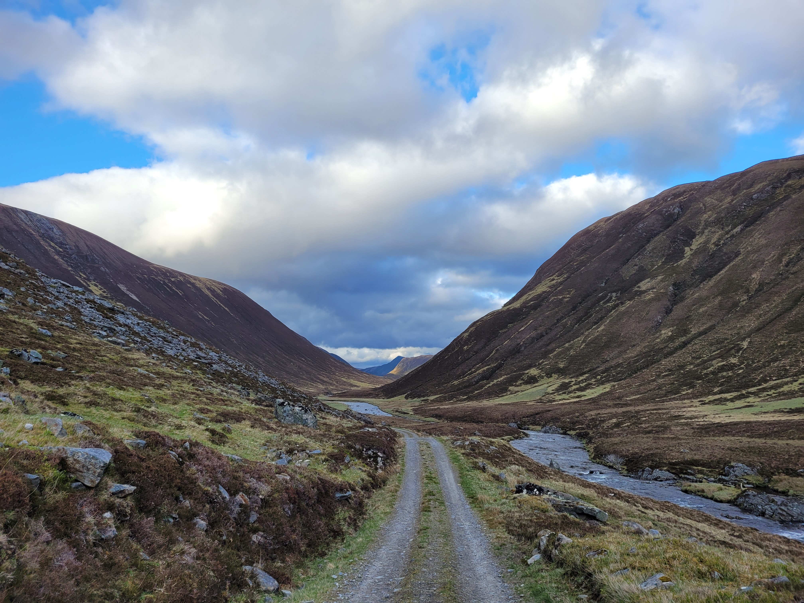
  <figcaption><i>Looking down Glean Moi on day 3</i></figcaption>
</figure>

<figure style="text-align: center;">
  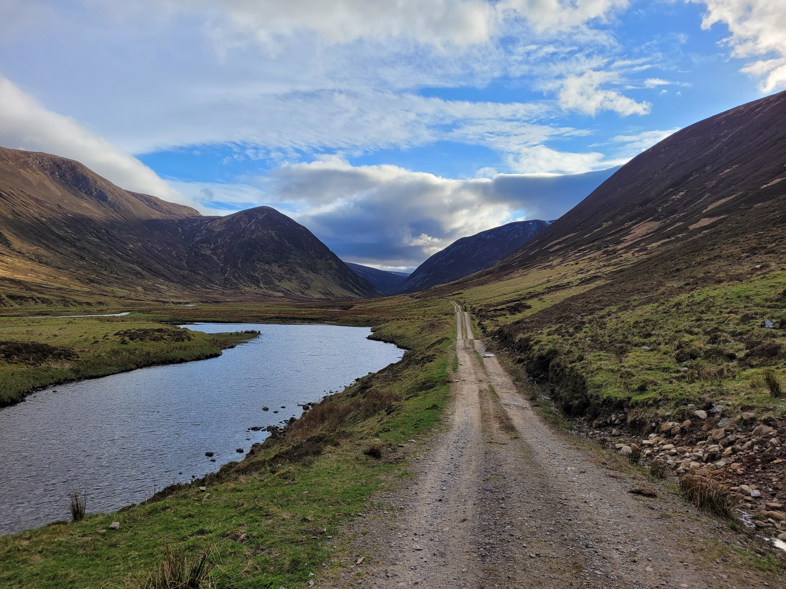
  <figcaption><i>Looking up Glean Moi on day 3</i></figcaption>
</figure>

<figure style="text-align: center;">
  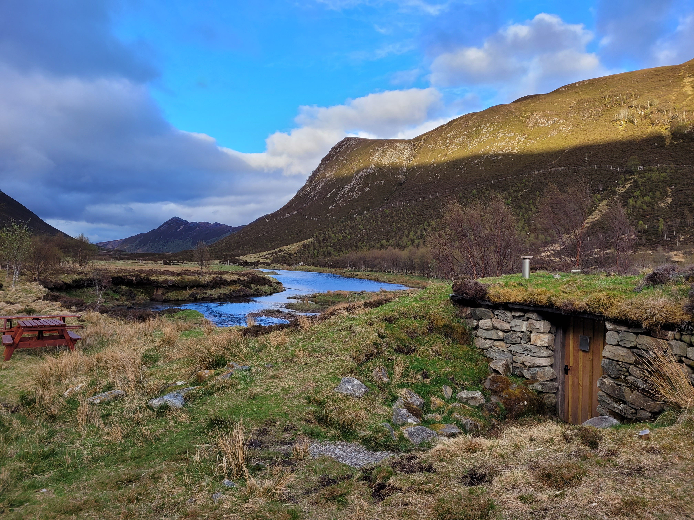
  <figcaption><i>Day 3's campsite - Badger Hide</i></figcaption>
</figure>

<figure style="text-align: center;">
  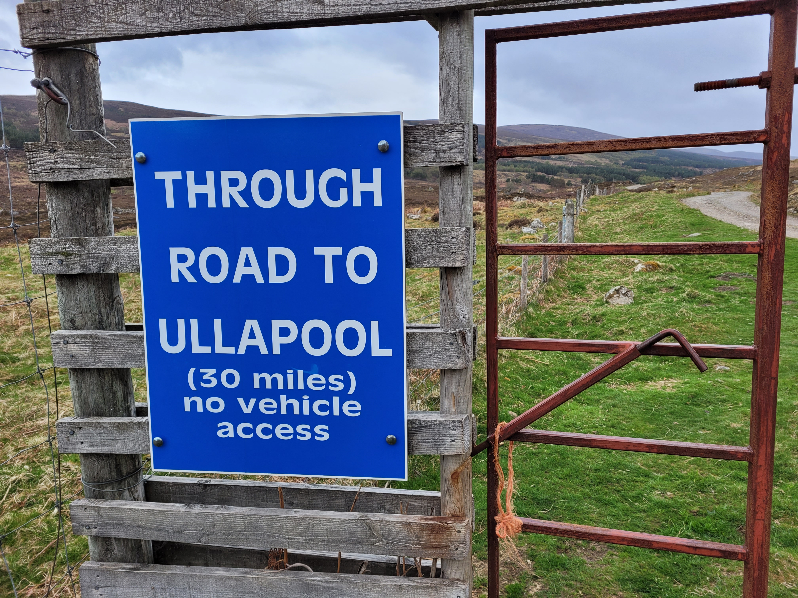
  <figcaption><i>Day 4</i></figcaption>
</figure>

