# Highland 550 2023

I was really keen to complete the [Highland 550](https://bikepacking.com/routes/highland-trail-550/), [last year](../h550_2022/index.md) (https://blog.roughedges.co.uk/posts/h550_2022/) my left knee played up and I had to abandon a few days in and before that I overtrained and didn't have much motivation so I did a shorter ride instead. I was getting a bit fed up of the H550, I wanted to do it and move onto other things. This year I took loads of time off prior to the start and felt keen and ready to go. I still had plenty of doubts if I could do it though, it was generally hyped up as a hard challenge.

I decided to ditch the cooker this year. Porridge for breakfast is usually good but the evening meal is generally rubbish and I never seem to make decent coffee. Most days I'd pass a cafe and could get a hot meal and I don't mind eating cold food for the majority of the time. It worked out just fine; less to carry, less faff in the morning and evening, less meal planning in the supermarkets.

I took my [Spot Rocker](https://spotbikes.com/collections/bikes/products/rocker-geared), carbon hardtail with 120mm travel, 2.35 Maxxis Icon on the rear and Forecaster on the front. I started out
with a very slow puncture on the back tyre and couldn't fix it. I resolved myself to pumping it up every morning but after a few days it fixed itself. I was using inserts and running about 25psi; harder than required but I didn't want to start faffing around with fixing punctures. 

Just before I left home I bought some cheap handlebars with a lot of back sweep as these seem to be all the rage but I thought they were awful, I just stuck with my flat bars. I used an [Ortliebhandlebar pack](https://www.ortlieb.com/en_us/handlebar-pack+F9922) which works perfectly, and [Ortlieb Seat Pack QR](https://www.ortlieb.com/en_us/seat-pack-qr+F9903) which
is pretty good. It doesn't sway but it does rattle slightly due to the rail clamps being slightly bigger than the rails. I temporarily fixed this by wrapping some plaster tape on the rail but it only worked for a few days. I had a custom made Alpkit frame bag and an [18L Wingnut rucksack](https://www.wingnutgear.com/shop). This was never full and was bigger than I needed but I like carrying water in a bladder and it was useful for the days I bought two days worth of food and particularly for when I didn't buy "compact" food, tomatoes and other veg for example.

I navigated with a Wahoo Roam and had backup maps on my phone so I needed a battery pack to recharge. I charged this with a Son hub dynamo on the front but also carried a second battery pack as a backup. This setup worked fine although on a few of the slow days I didn't fully recharge the battery pack. The odd stay in a campsite or hotel fixed this though.

The only noteworthy clothing choice was to only take one pair of cycling shorts. I used chamois cream at the start of every day and if I couldn't have a shower or a wash I'd use it at the end of the day when I got changed. It seemed to work fine and I had no issues at all.

## Day 1 Tyndrum to Glen Lyon
**15th May 2023**
**32km 2hr 37m**

I didn't get to Tyndrum until about 5pm but wanted to get a few hours in over what I knew was easy riding. In the end I cycled till quite late as I kept looking for the perfect campsite, I probably should have camped earlier. I was also a bit chilly that night and I was worried I'd brought a quilt that was too light.

<figure style="text-align: center;">
  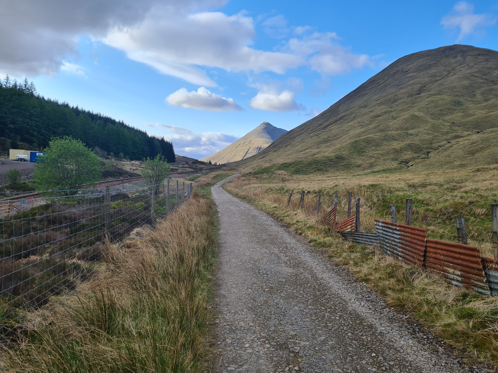
  <figcaption><i>Riding away from Tyndrum</i></figcaption>
</figure>

<figure style="text-align: center;">
  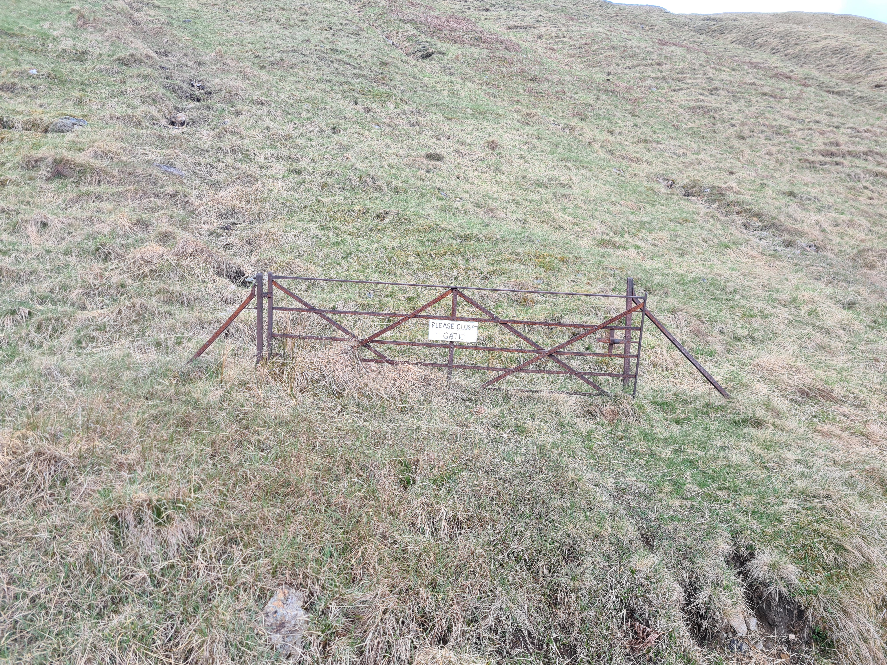
  <figcaption><i>A useful gate.</i></figcaption>
</figure>

## Day 2 Glen Lyon to Melgarve Bothy
**99km 8hr 4m**

There were some light showers today and what seemed like a headwind all day! The singletrack round Ben Alder was an absolute highlight, it's so well maintained that's it's all rideable as it climbs to 650m. I met the guy who the estate pays to maintain it, he was doing a great job. I met lots of walkers on the TGO challenge, they all seemed to be wild camping in the same spot next to a road, which didn't seem very wild. I pushed on to Melgarve Bothy because I didn't want another cold night, luckily for me it was empty although two RSPB bird watching surveyors (?) did camp outside. The previous cold night and this long day had taken their toll, I was in bed by 9pm and didn't wake up till 6.20am.

 <figure style="text-align: center;">
  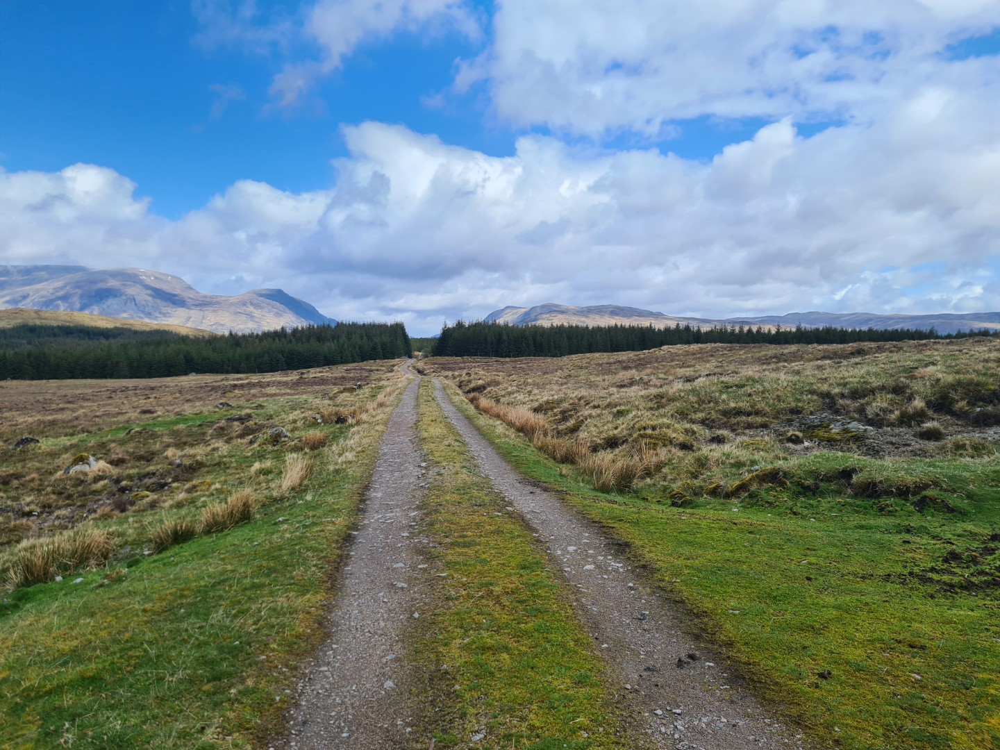
  <figcaption><i>Glen Ericht</i></figcaption>
</figure>

 <figure style="text-align: center;">
  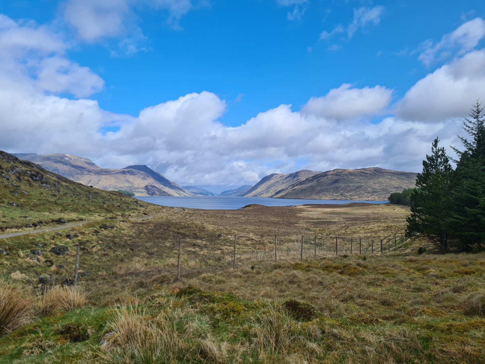
  <figcaption><i>Glen Ericht</i></figcaption>
</figure>

 

<figure style="text-align: center;">
  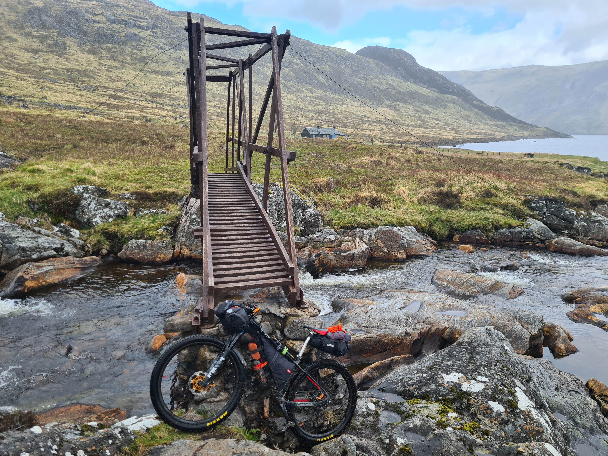
  <figcaption><i>Bridge near Ben Alder bothy</i></figcaption>
</figure>

<figure style="text-align: center;">
  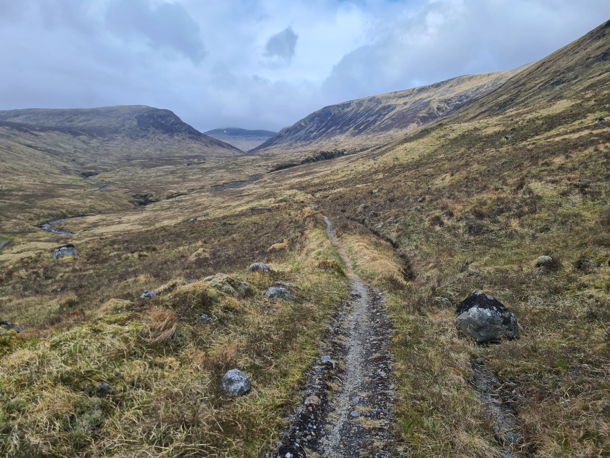
  <figcaption><i>Ben Alder pass singletrack</i></figcaption>
</figure>

<figure style="text-align: center;">
  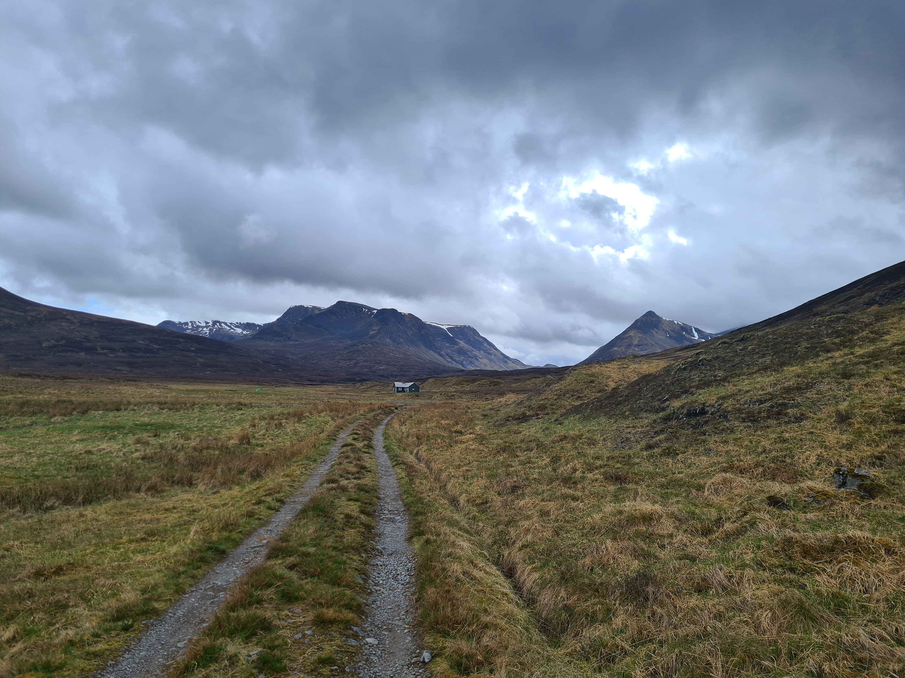
  <figcaption><i>Ben Alder</i></figcaption>
</figure>

<figure style="text-align: center;">
  
  <figcaption><i>Ben Alder</i></figcaption>
</figure>
 

## Day 3 Melgarve Bothy to Marybank near Contin
**112km 8hr 38m**

I had a great nights sleep, warm and quiet. The Corrieyairack Pass is a very pleasant ride along an estate track followed by a tough push up a steep track covered in loose rocks. The descent feels like it's a lot longer and steeper than the side I came up. I felt a bit sorry for all the eight gravel bike riders I saw going the opposite way to me. They were doing the Badger Divide and must have all stayed in Fort Augustus overnight. They had a long uphill followed by a downhill that starts unrideable on a gravel bike. It's definitely much better south to north.

I'd probably overcooked it a bit yesterday, I wasn't pacing myself very well and I rode too far. I had lunch in Fort Augustus and stayed for 2 hours in the cafe, slightly reluctant to leave. I had an interesting chat with an American tourist from LA about Trump, Johnson, Brexit and all sorts of stuff.

The hill over to Cannich is easy enough, except for the push / ride along the shores of Loch Stac past the permanently being renovated building at the far end of Loch Stac. I stocked with food up at Cannich stores because I seemed to remember than Contin stores weren't that good. I bought dinner at Cannich as well which consisted of mackerel in tomatoes sauce, Pringles, mushrooms and a pint of whole milk. That tells you how good the shop is!

The sensible decision would have been to stay at the campsite at Cannich although I didn't consider it far enough along. I'd also stayed here on my previous attempt on day 2, if I stayed here it felt like I'd wasted my half day at the start. So I told myself I'd ride over the hill towards Contin and camp somewhere suitable along the way, knowing full well that there wasn't much up on the hill and that it would be windy and cold up there. It's a great ride over the Corrie Hallie Forest, it doesn't fell like there's loads of height gain, there's only a little bit of pushing and then a long amble across the top on good tracks. I also had a tailwind which was encouraging me to continue. It was getting late by the time I got to the descent but there was no point in camping high up at the start of a descent.

I couldn't find anywhere to camp lower down and by now I was on a road in the valley bottom going towards Marybank. Then I saw the perfect site, flat mown grass next to the river in a fisherman's club site. Perfect, it was going dark, no one will see me and I'll be off early before anyone can complain. Right at that point an eagle eyed fish bailiff, or something like that, pulled up and very nicely told me I couldn't stay there. Bugger. He suggested a place in Marybank which turned out not to be suitable but I did notice that the roof of the village hall overhung the walls by quite a margin and that if I walked round the back I was out of sight. So that's where I stayed. I didn't get to sleep till 11pm and I was up at 5.50am, so much for riding a sensible distance each day and getting a good nights sleep.

 <figure style="text-align: center;">
  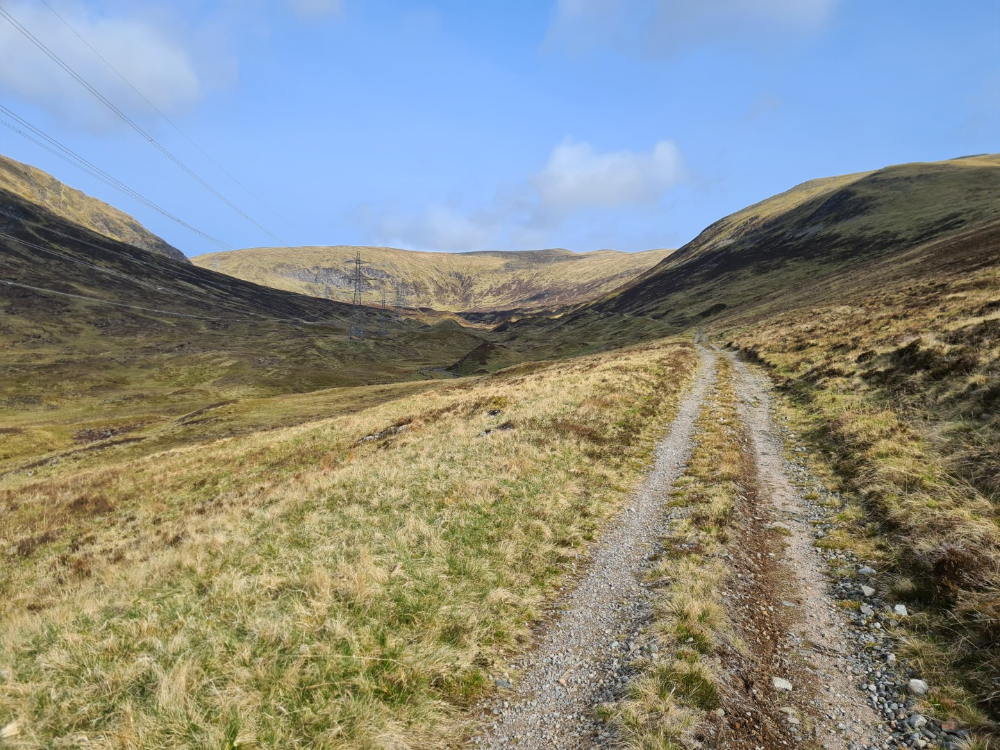
  <figcaption><i>Correiyairach Pass</i></figcaption>
</figure>

 <figure style="text-align: center;">
  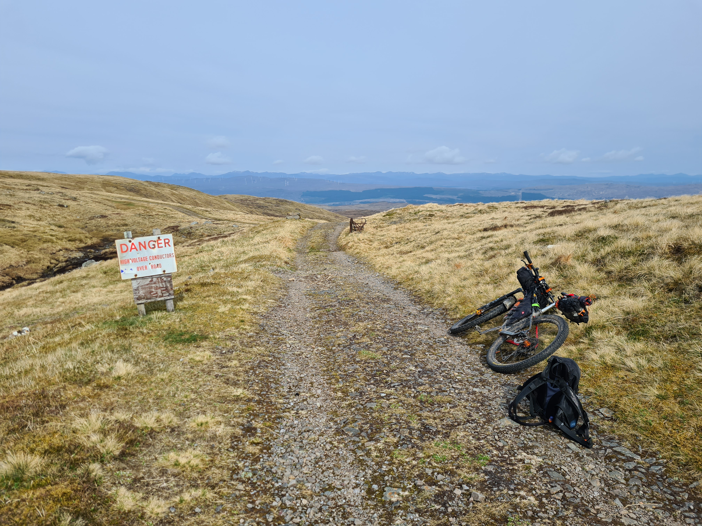
  <figcaption><i>Correiyairach Pass</i></figcaption>
</figure>

 
<figure style="text-align: center;">
  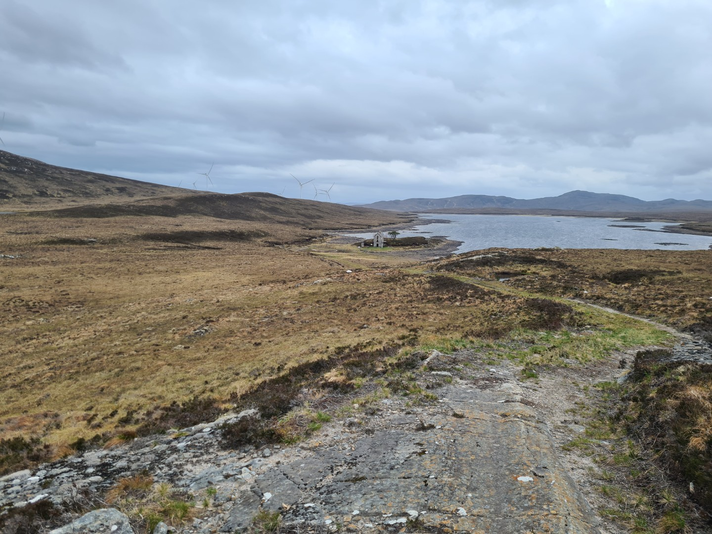
  <figcaption><i>Loch ma Stac bothy</i></figcaption>
</figure>

<figure style="text-align: center;">
  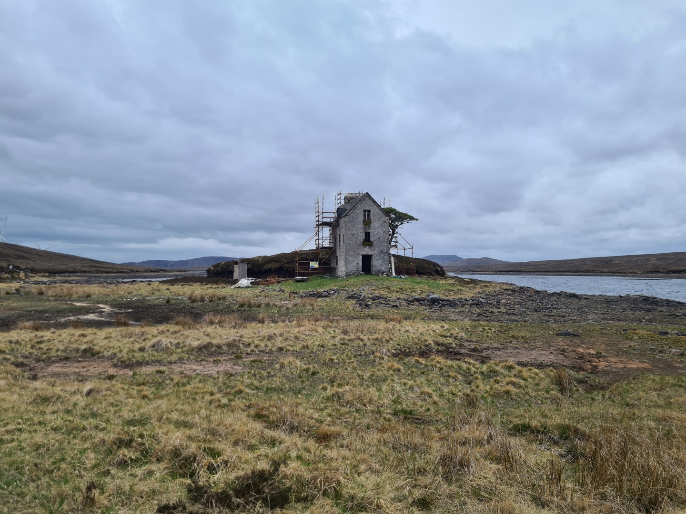
  <figcaption><i>Loch ma Stac bothy</i></figcaption>
</figure>
 

<figure style="text-align: center;">
  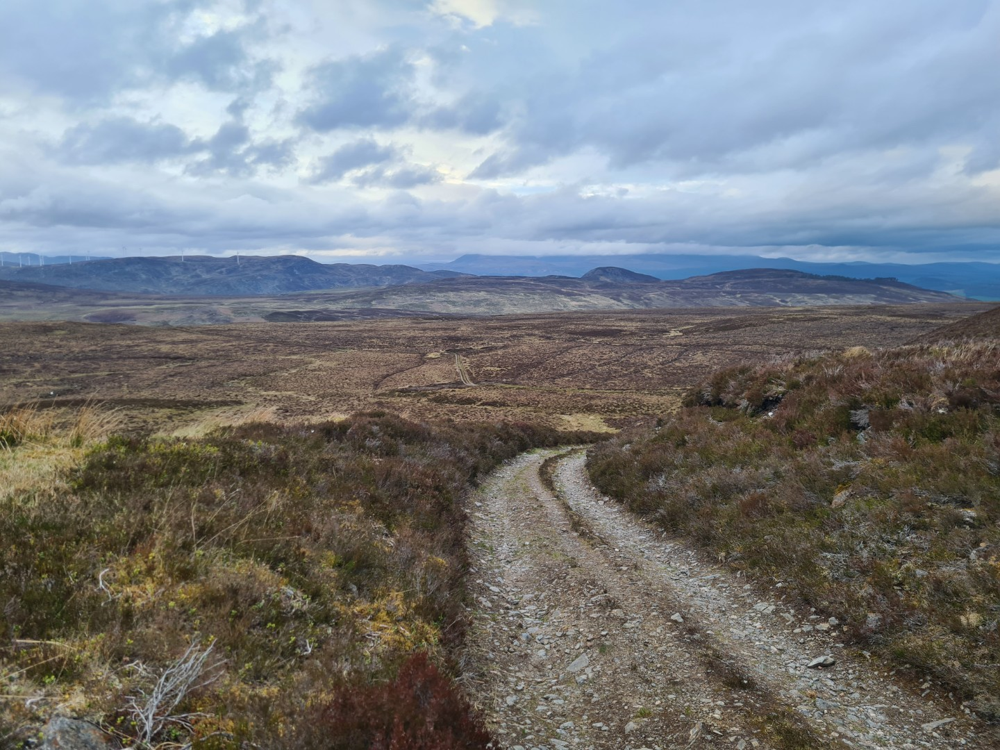
  <figcaption><i>Cnoc Elie Mor</i></figcaption>
</figure>
 

## Day 4 Marybank to Achness Hotel
**86.4km 5hr 55m**

Too much riding yesterday and not enough sleep. My legs felt OK but my very leisurely breakfast at Contin Stores told a different story. I needed an early finish today and Achness Hotel was just in the right place. On the way I saw two Sea Eagles in Glen Vaich waiting on the ground to pick up a dead lamb. The local farmer / gamekeeper said they were protected and they weren't persecuted in this area, it wouldn't be the same in North Yorkshire. I had a tailwind up and over Glean Moir and the descent on good estate tracks was fast. I passed the Badger Hide, a hobbit like building that I stayed in last year. This year there was a group of kids camped next to it, I was lucky last year. It was slightly slower riding up Strath Cuileannach but overall an easier day and comfortable accommodation. I was tired though and was having serious doubts about my ability to finish the ride.

 <figure style="text-align: center;">
  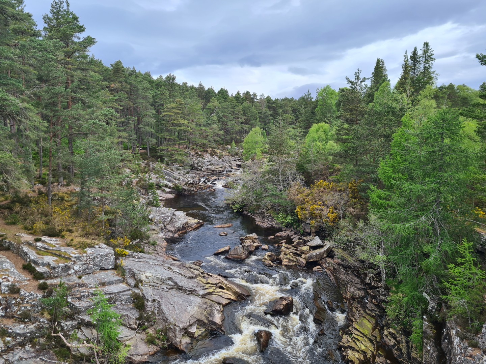
  <figcaption><i>Little Garve bridge</i></figcaption>
</figure>

<figure style="text-align: center;">
  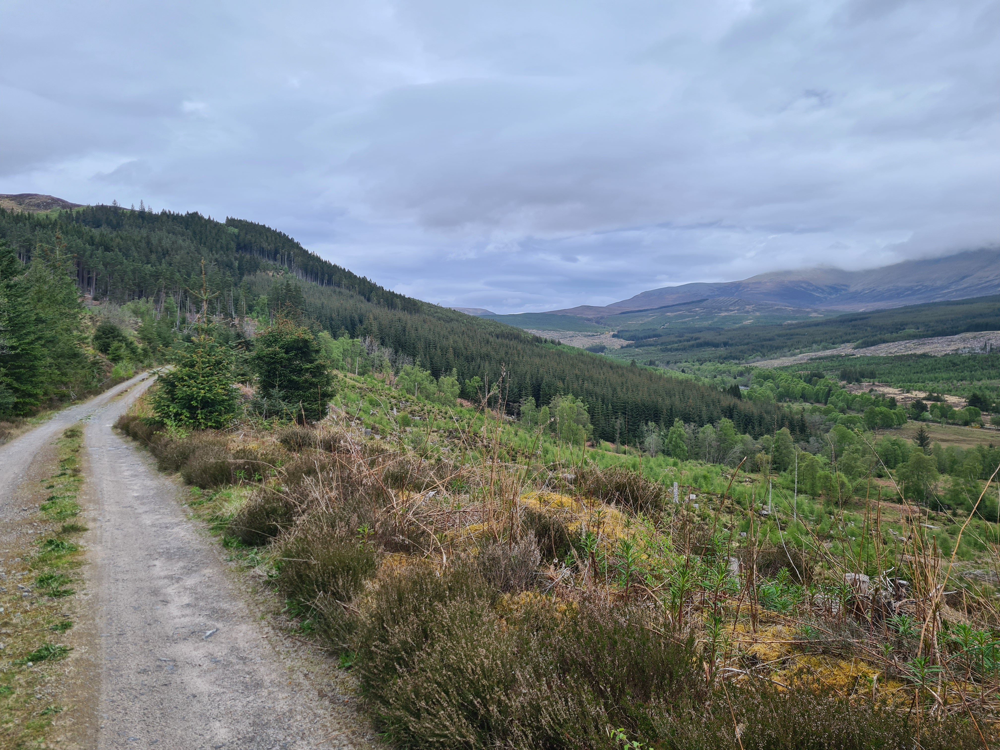
  <figcaption><i>Black Water Valley</i></figcaption>
</figure>

<figure style="text-align: center;">
  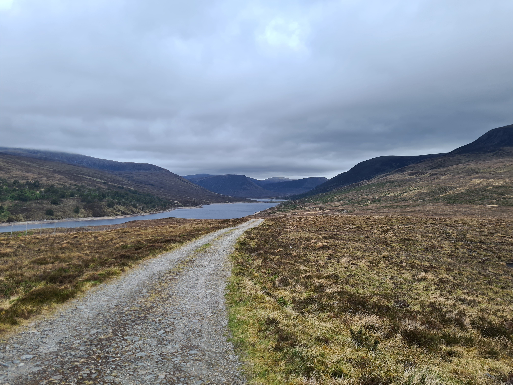
  <figcaption><i>Loch Vaich</i></figcaption>
</figure>

<figure style="text-align: center;">
  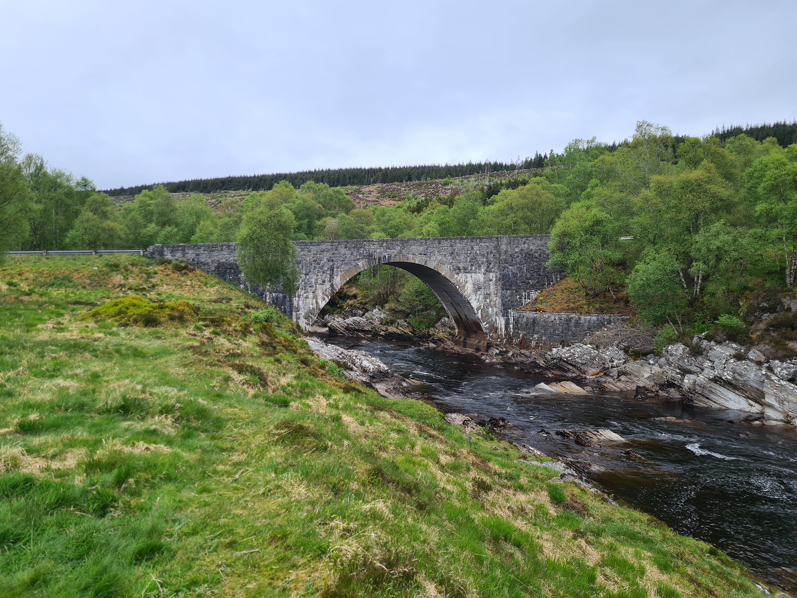
  <figcaption><i>Oykel Bridge</i></figcaption>
</figure>

## Day 5 Achness Hotel to near Loch Stack and Arkle
**72.1km 6hr 37m**

I slept for 10 hours last night. My legs ached and I felt like I needed an easy day, maybe a couple. The day started great, the sun was shining and the ride up Glen Cassley was on a very gently undulating road, the same valley where my knee finally gave up last year, although it looked like there was a steep track over Maovally hill at the end. There was a small hydro electric scheme at the end of the valley and it was accessed from the next valley over, hence the track over Maovally actually being a road, a pleasant surprise.

Getting through the side gate at the Duchally Power Station was a real battle, my bike only fitted when stood on it's back wheel with the bars turned to a particular angle. More road followed along Lock Merkland, then a really good track along the beautiful Bealach nam Meirleach to Gobernuisgach Lodge. It was looking like my easy day was going to happen, right until I turned off this track and went up Glen Golly. The track was a bit rougher and turned to two strips of singletrack with grass down the middle but still rideable, except for some of the short steep climbs. It was good riding though up a beautiful, remote valley. Up ahead I could see a push up Creag Dubh which was really loose and then things got serious. The track turned to just singletrack and then it started getting boggy and occasionally disappearing. This was slow going, constantly getting on and off to go round the boggy bits or push over the technical bits. It was windy, cold and I hadn't seen anyone here.

The drop down to An Dubh Loch involved pushing the bike downhill, dropping down peat hags. It was getting a bit late but I definitely didn't want to stop round here, too windy, too cold. The rocky mass of Creagan Meall Horn was up to my left and after a final push up a very steep track, which I wouldn't have been able to ride fresh, I finally got onto some rideable track and then the loose descent to Lock Stack. There was a stunning view of Arkle from this col, a beautiful, rocky, white mountain. I camped at the first sheltered flat spot I found at Eas Allt Horn, at the base of Arkle.

The day had started easy and finished hard but the loop round Creagan Meall Horn was stunning, the first day that really felt like a mountain bike ride. A day requiring a road bike, gravel bike, something easy to push and a mountain bike.

I realised later that this was the infamous northern loop that I'd read a bit about. Strangely I had a good phone signal at camp, even though there was no habitation in the area. The midges made an appearance this evening.

<figure style="text-align: center;">
  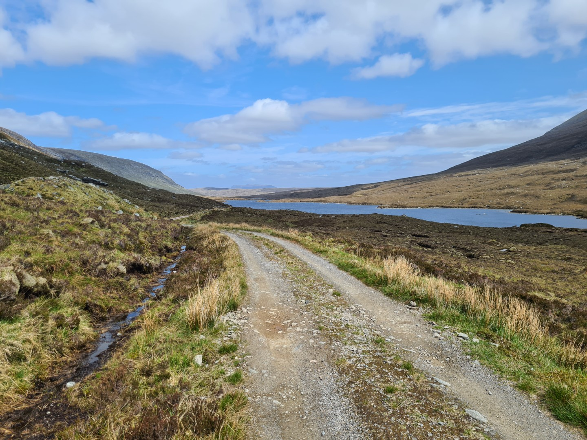
  <figcaption><i>Bearlach nam Meirleach</i></figcaption>
</figure>

<figure style="text-align: center;">
  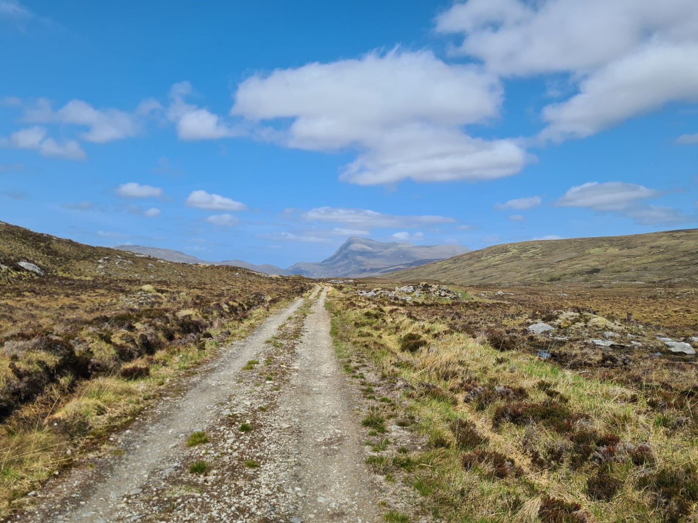
  <figcaption><i>Ben Hope</i></figcaption>
</figure>

 
<figure style="text-align: center;">
  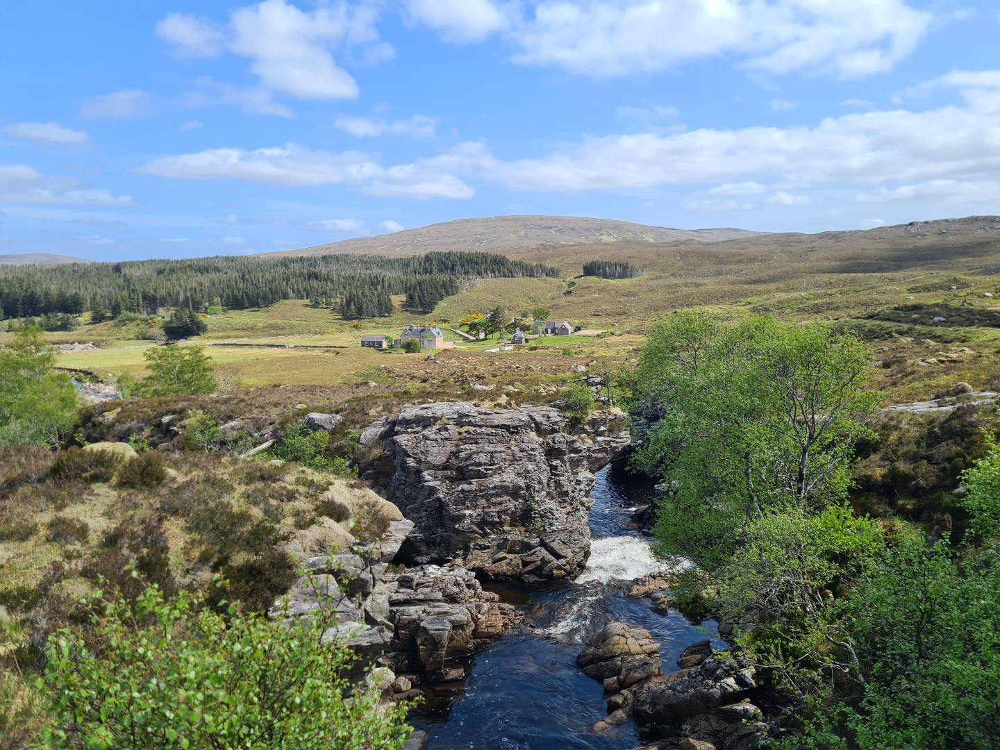
  <figcaption><i>Gobernuisgach Lodge</i></figcaption>
</figure>

 
<figure style="text-align: center;">
  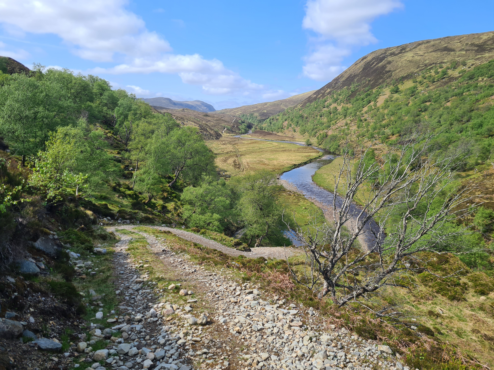
  <figcaption><i>Glen Golly</i></figcaption>
</figure>

<figure style="text-align: center;">
  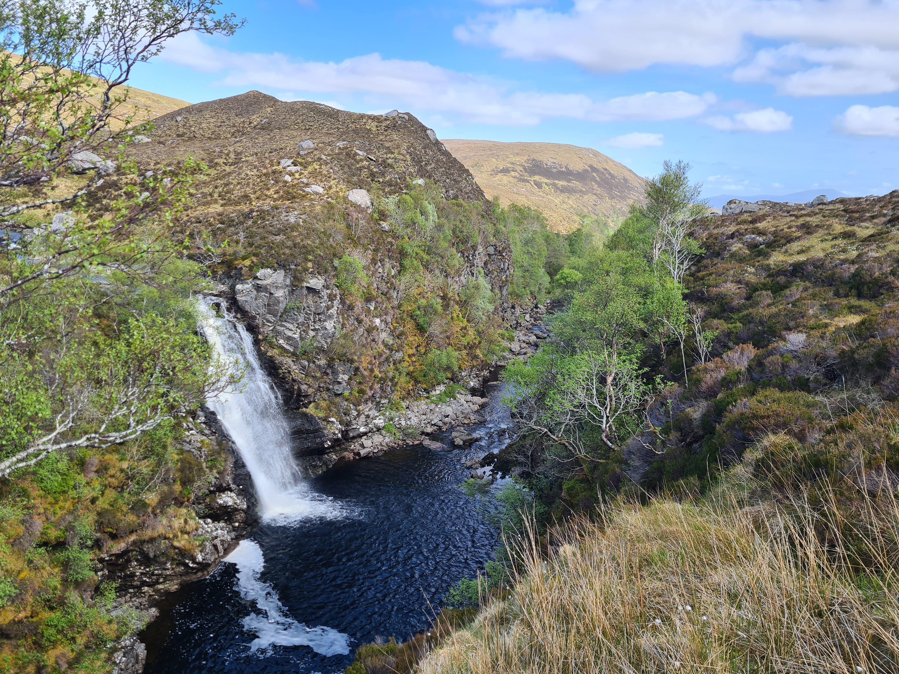
  <figcaption><i>Easan Choinees in Glen Golly</i></figcaption>
</figure>

<figure style="text-align: center;">
  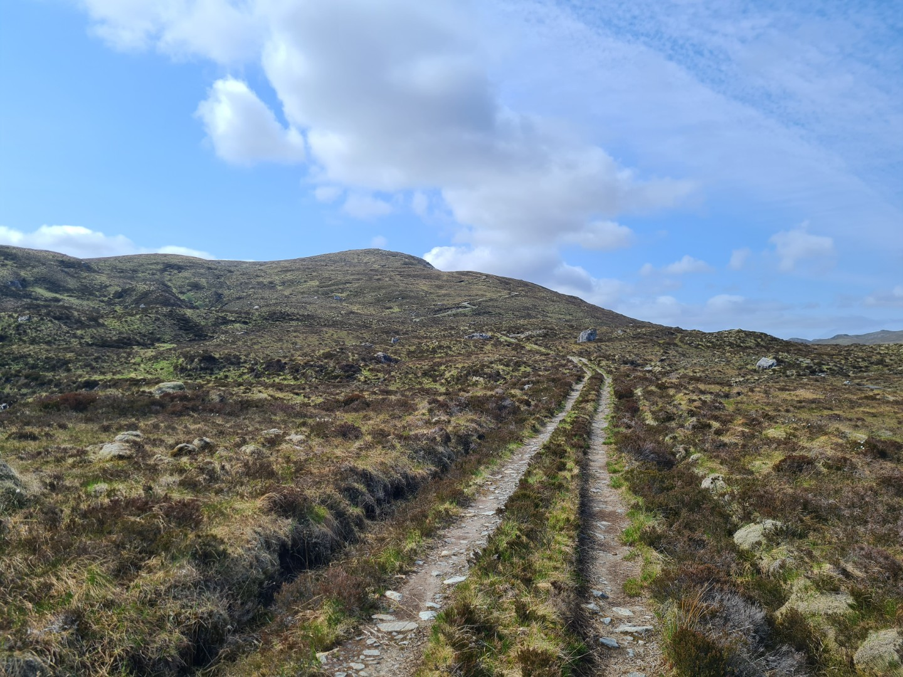
  <figcaption><i>Climb out of Glen Golly</i></figcaption>
</figure>
 

<figure style="text-align: center;">
  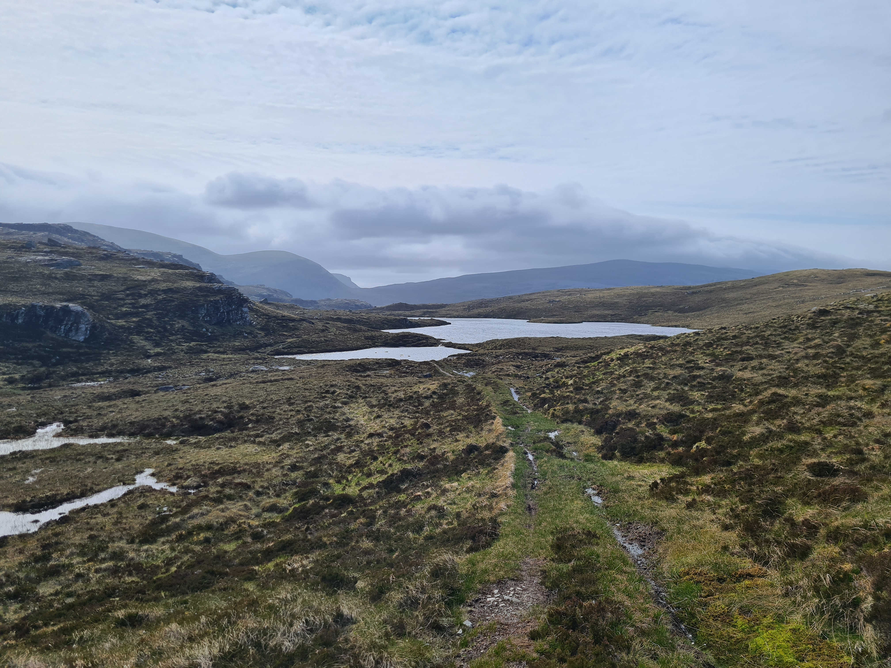
  <figcaption><i>Looking towards Creagan Meal Horn</i></figcaption>
</figure>

<figure style="text-align: center;">
  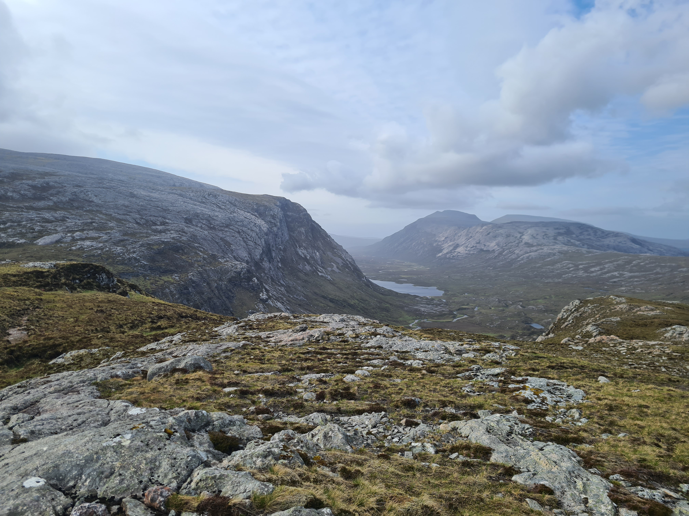
  <figcaption><i>Loch Dionard</i></figcaption>
</figure>

 
<figure style="text-align: center;">
  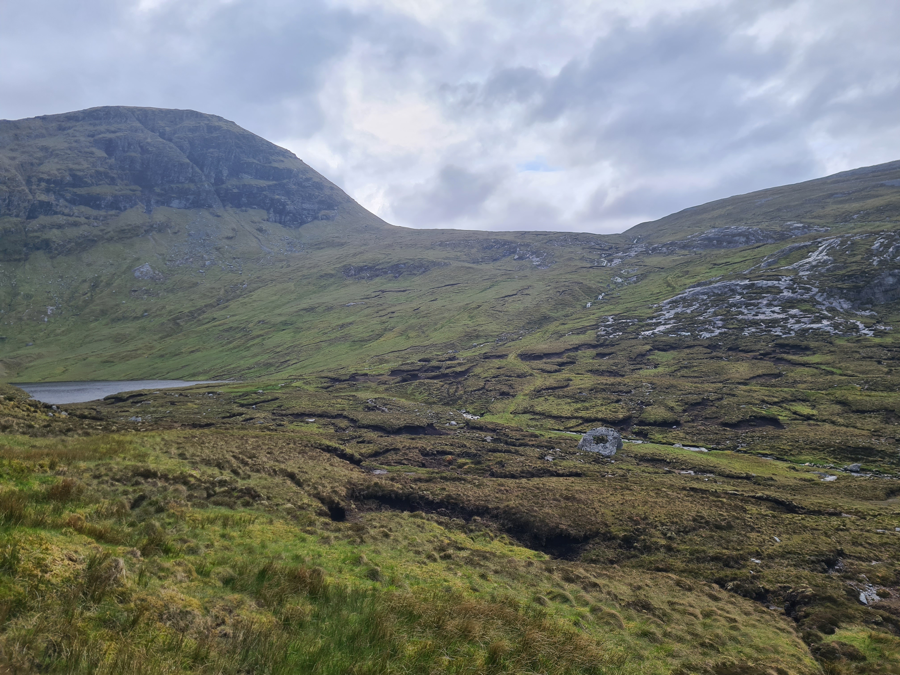
  <figcaption><i>Final ascent round Creagan Meall Horn</i></figcaption>
</figure>

<figure style="text-align: center;">
  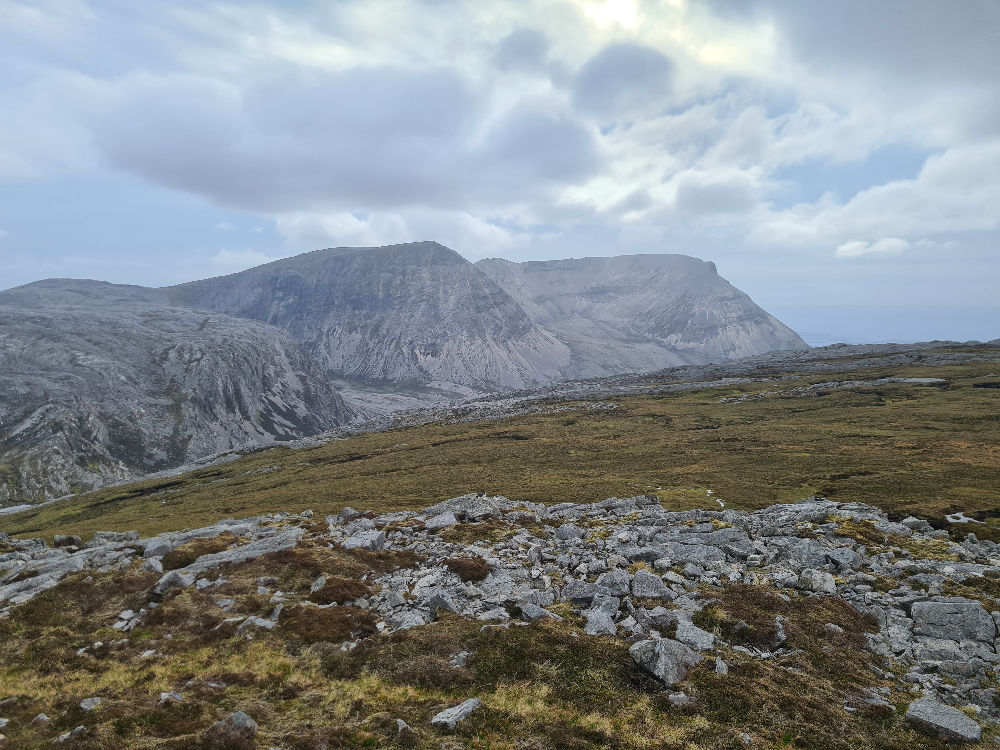
  <figcaption><i>Arkle</i></figcaption>
</figure>
 

<figure style="text-align: center;">
  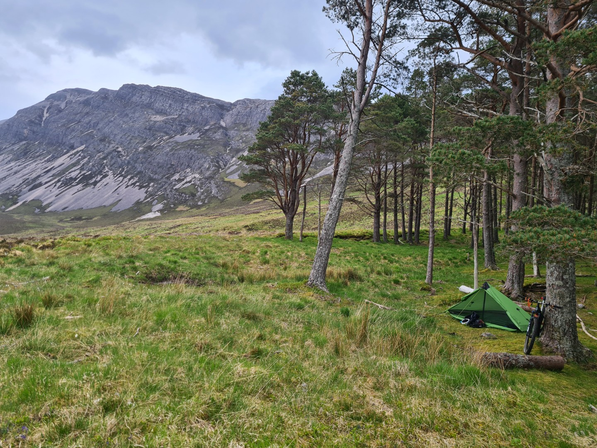
  <figcaption><i>Campsite near Loch Stack and Arkle</i></figcaption>
</figure>

## Day 6 Lock Stack to Suilvan Bothy
**66.9km 5hr 39m**

<figure style="text-align: center;">
  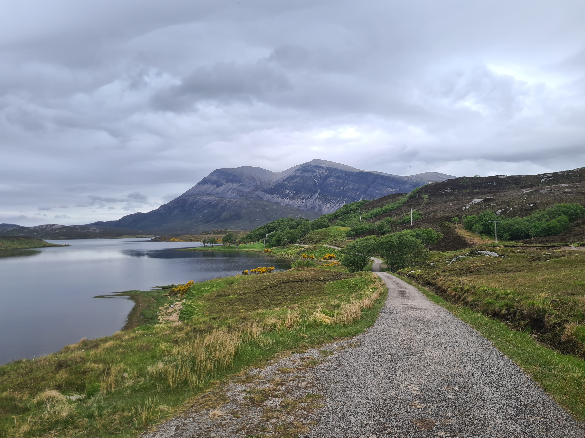
  <figcaption><i>Arkle</i></figcaption>
</figure>

This was one of the most beautiful days. After a push up to the Shieling bivvy spot ( I was tired) there was good riding with awesome views of Assynt. Near Kylesku I had a venison hot dog and chips with a great view of Quinag. I met three Italians from San Marino who were on a 3000 mile motorbike trip, from San Marino up through France, up to John O Groats, down to Hull, across to Rotterdam, through Germany and home.

A quick glance at the map showed a lot of road past Drumbeg to Lochinver, with a bit of offroad towards the end. This turned out to be quite slow, partly because the coast road was up and down all the time but mostly because I kept stopping to take so many photos, mostly of Suilvan which I seemed to be able to see most of the day. The short offroad sections were mostly rubbish, I should have stayed on the road.

The Lochinver Pie Shop was as good as reported, the pies, cheesecake and coffee were great. There was rain forecast for about 6pm so I wanted to get to Suilvan bothy and if I hadn't stopped to take a picture of the bothy I would have stayed dry but it was pretty good timing.

The bothy wasn't empty, there was a Brit and a German staying there. The Brit had quit work and was travelling around, he seemed obsessed with ultralight kit. The German was the opposite, he had a 15kg bag full of two weeks worth of food, most of which he brought from Germany. Neither could quite understand the others attitude. Later two Dutch guys turned up. They'd stayed the night before but decided to camp closer to Suilvan ready for their ascent the next day. They came back completely drenched after their tent blew down. There was also a full rucksack hung up and a sleeping bag rolled up. I'd seen a rescue helicopter making repeated trips to
Suilvan and we wondered if the two things were connected. It was a good evening chatting, spoilt only by a mouse getting into my rucksack and eating part of my remaining pie.

I was a bit concerned that I was getting too tired, maybe I needed a YHA stop in Ullapool tomorrow, followed by a half day the next day. I could do a short ride into the Fisherfield Forest and stay at a bothy. Tomorrow looked relatively easy; there was 14km more on the good track I'd ridden in on to get to a road and then estate track over to Ullapool. There's a coast to coast route in this area that goes to Ullapool so I assumed it'd be fairly easy riding.

 
<figure style="text-align: center;">
  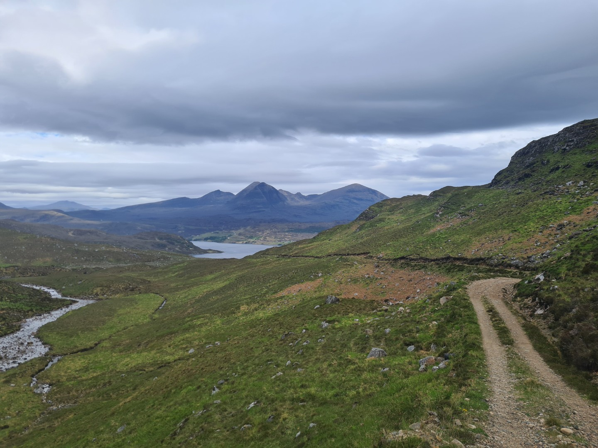
  <figcaption><i>Loch Glendhu</i></figcaption>
</figure>

<figure style="text-align: center;">
  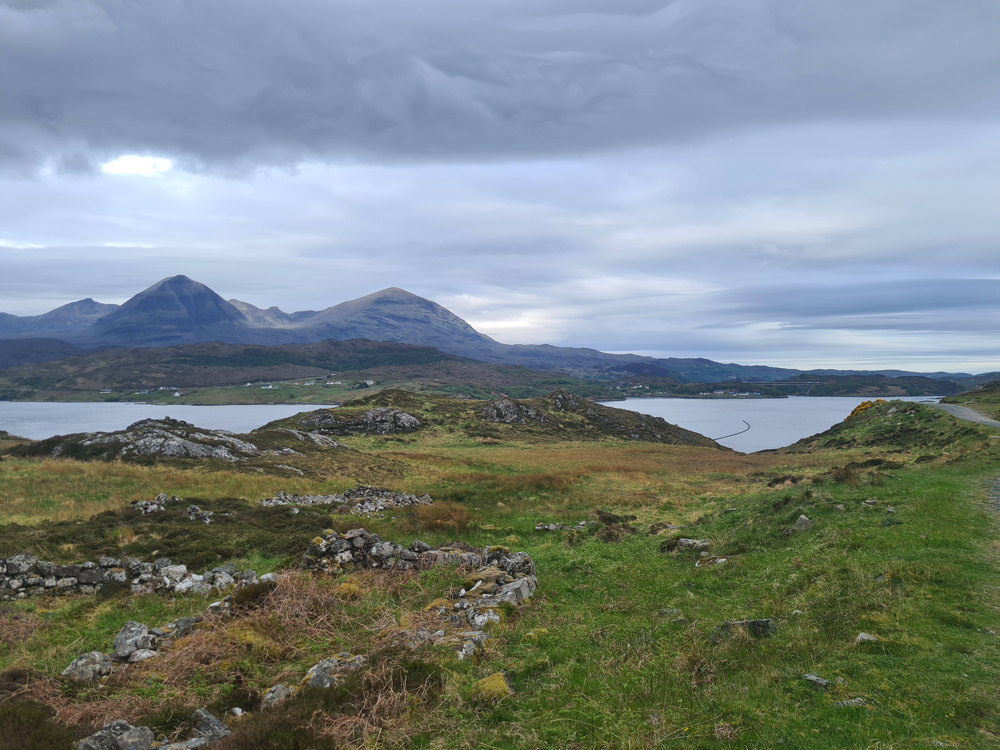
  <figcaption><i>Quinag in the Assynt</i></figcaption>
</figure>
 

 <figure style="text-align: center;">
  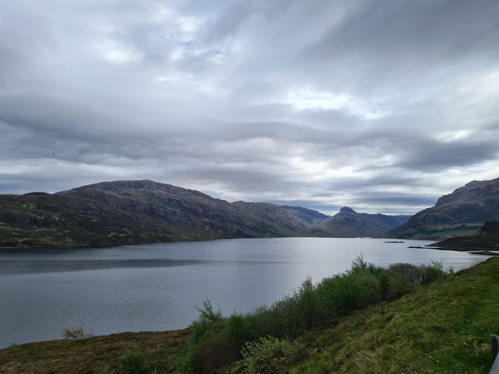
  <figcaption><i>Assynt</i></figcaption>
</figure>

<figure style="text-align: center;">
  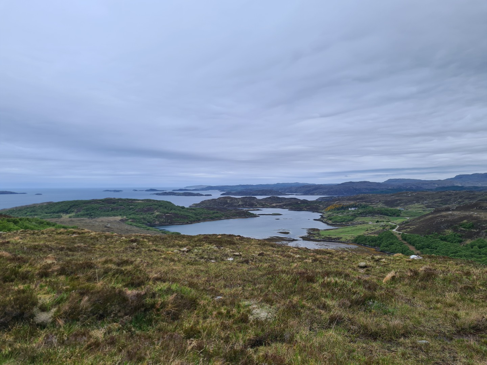
  <figcaption><i>Drumbeg coast</i></figcaption>
</figure>

<figure style="text-align: center;">
  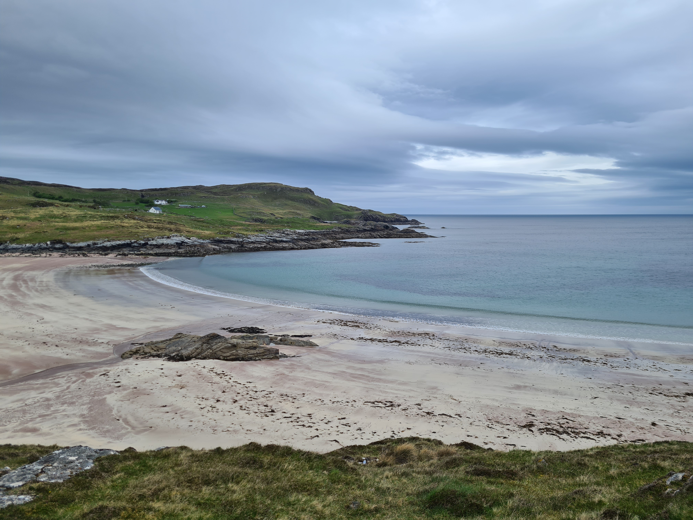
  <figcaption><i>Clashnessie</i></figcaption>
</figure>

 
<figure style="text-align: center;">
  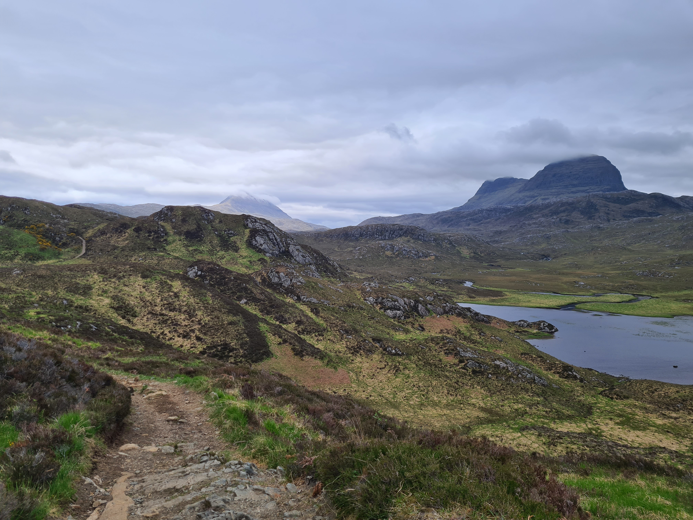
  <figcaption><i>Suilven path before it turns to poo</i></figcaption>
</figure>

<figure style="text-align: center;">
  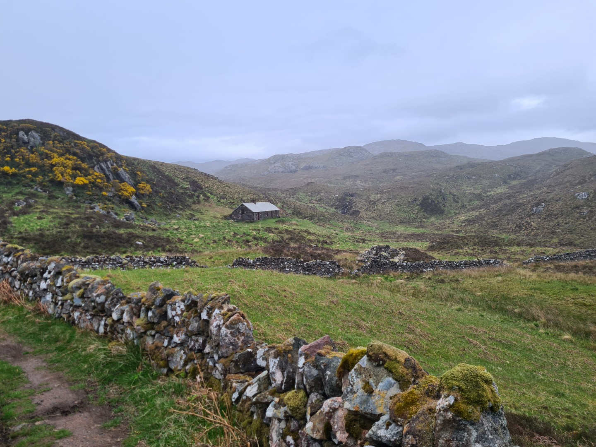
  <figcaption><i>Suilven bothy</i></figcaption>
</figure>

 

## Day 7 Suilvan Bothy to Ullapool campsite
**71.3km 7hr 23m**

I was wrong. The track from Suilvan bothy started off great but soon deteriorated to an horrible push over a really rough footpath. I'd try to ride every so often but it was pointless, in the end I must have pushed 13km and it took three hours. It was completely shit, I kept wishing I'd gone the long way round on the road. At least I had a tailwind on the road back to Oykel Bridge.

There was some good estate track after this, past the Schoolhouse Bothy followed by some good riding over the top. The route left the good track and turned into a path, there was some good riding here with a short crappy section before finally emerging in Glen Achall on a good track. I was tired by Ullapool and really annoyed by the Suilvan path section. I seemed to be able to see Suilvan most of the day, it was a beautiful hill but I was fed up of it by now.

A fish from the chippy slightly made up for it, followed by a shower at the campsite. Of course I didn't have a towel so had to drip dry. Tomorrow would be into the Fisherfield Forest, supposedly the most remote area in Scotland and involving at least two big pushes and two river crossings. I wasn't sure if I'd go through in one go or stay at a bothy to have an easy day.

 <figure style="text-align: center;">
  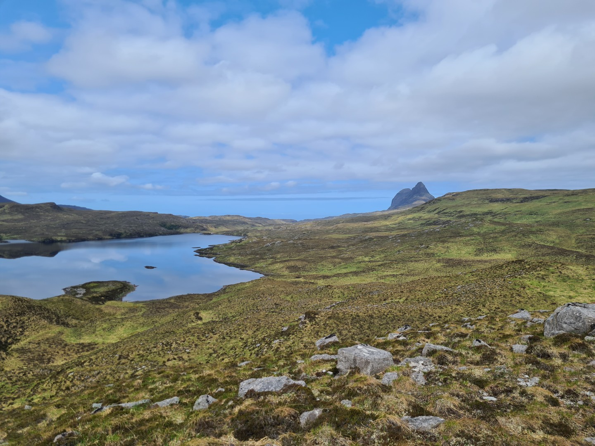
  <figcaption><i>Suilven from the worlds worst path</i></figcaption>
</figure>

 
<figure style="text-align: center;">
  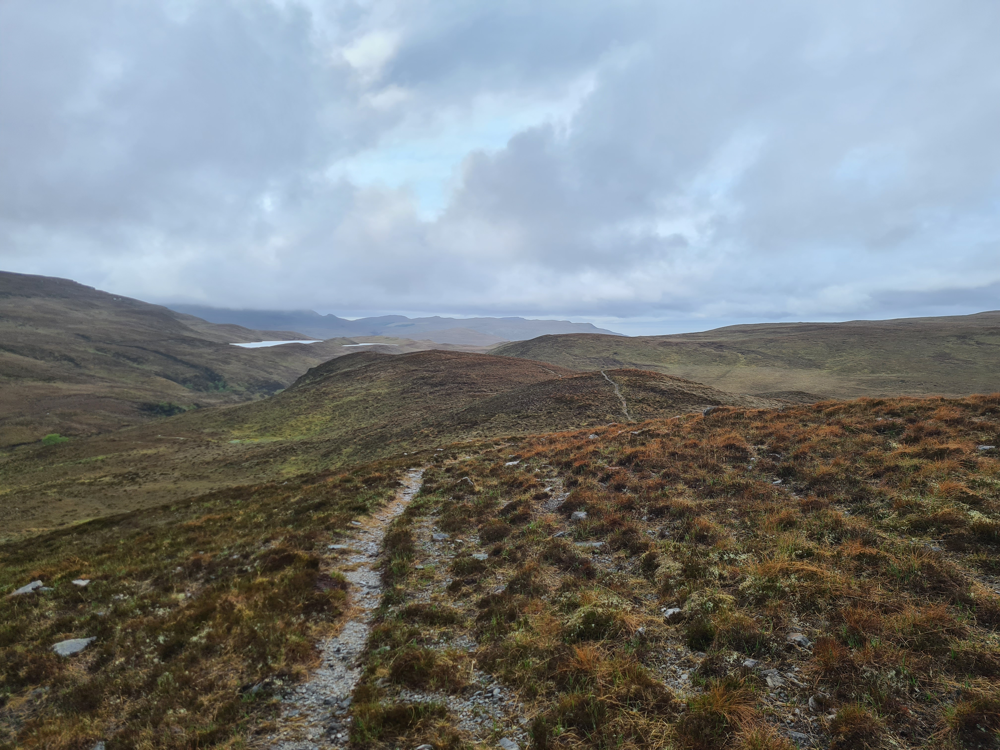
  <figcaption><i>On the way to Ullapool</i></figcaption>
</figure>

 <figure style="text-align: center;">
  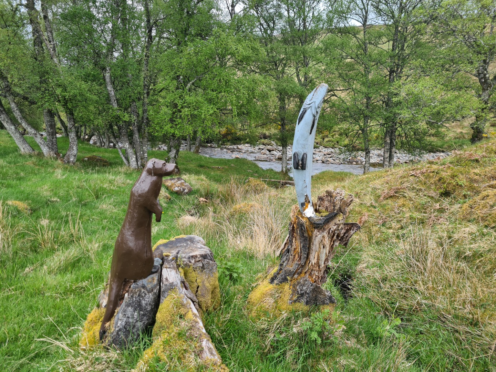
  <figcaption><i></i></figcaption>
</figure>

 
## Day 8 Ullapool campsite to Poolewe campsite
**63.7 7hr 52m**

I was nervous about this day and it turned into the shortest, slowest full day, but not as bad as expected. I had great weather, only one easy river crossing, some hard pushes but some fantastic mountain biking with the best natural track I'd encountered so far.

From Ullapool the A835 takes you to Croft Town and a push up the Coffin Road which took me ages. It was unbelievably steep in places, I'd need an electric bike to ride it all, but at least it was smooth. There was some great riding over the top although the descent caught me out a couple of times right at the end with some very slow speed falls.

The climb up and over Dundonnel Forest was on a good track and there was a surprising amount of people on it. In fact today, at least up to Shenaval Bothy near Loch na Sealga, was one of the busiest so far. I saw more people here than the rest of the route combined. 

The descent to Sheneval Bothy was rough in places, it would have been good on an unloaded full sus bike. The river crossing was easy, wide but only shin deep. The ride over to Carnmore Bothy started well on a good track, followed by so technical sections which were mostly rideable but slow. The final push up to Clach na Frithealaidh was not big but it was steep, rocky and tiring. I was
averaging 8km/h at the moment but over the top was much more rideable. At Carnmore Bothy I was contemplating having a short day and camping, if the path out was rough I could be on it for hours. Luckily a bloke who was camping nearby knew the path to Poolewe well and said it was in good condition. He was right and it turned out to be fantastic mountain biking on singletrack, one of the highlights of the trip.

This whole day was fantastic. Some great riding coupled with two horrible pushes but with unbelievable scenery the whole way. I also felt quite good, I was pacing myself better and no longer felt knackered. If I didn't ride hard I felt that I could ride all day.

 <figure style="text-align: center;">
  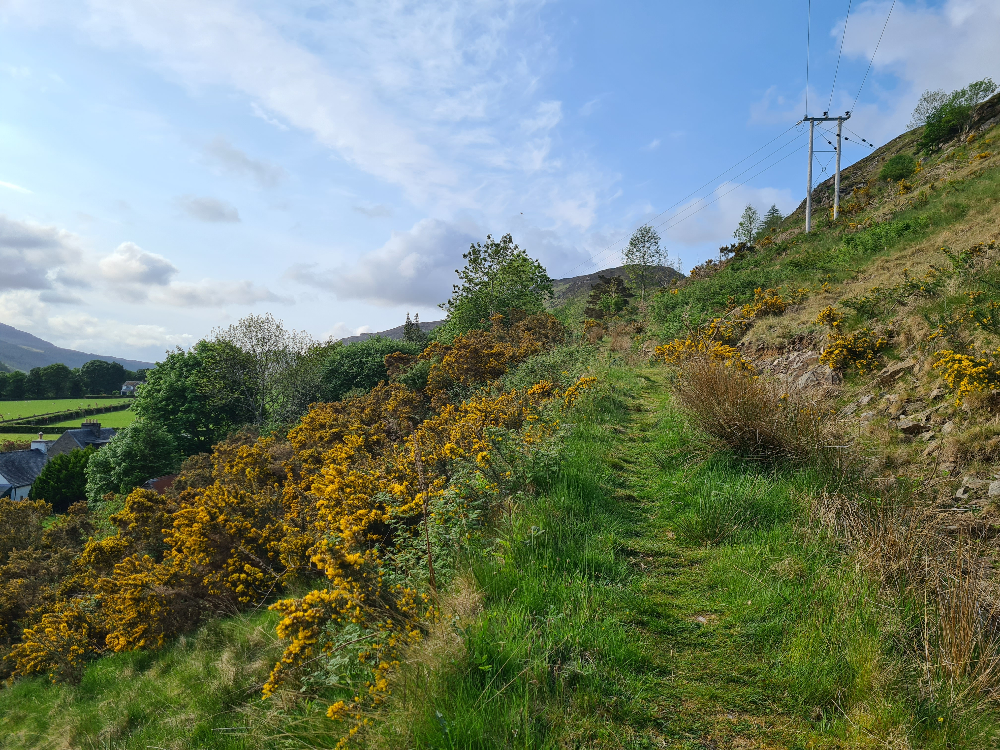
  <figcaption><i>Coffin Road from Auchnumachan</i></figcaption>
</figure>

 
<figure style="text-align: center;">
  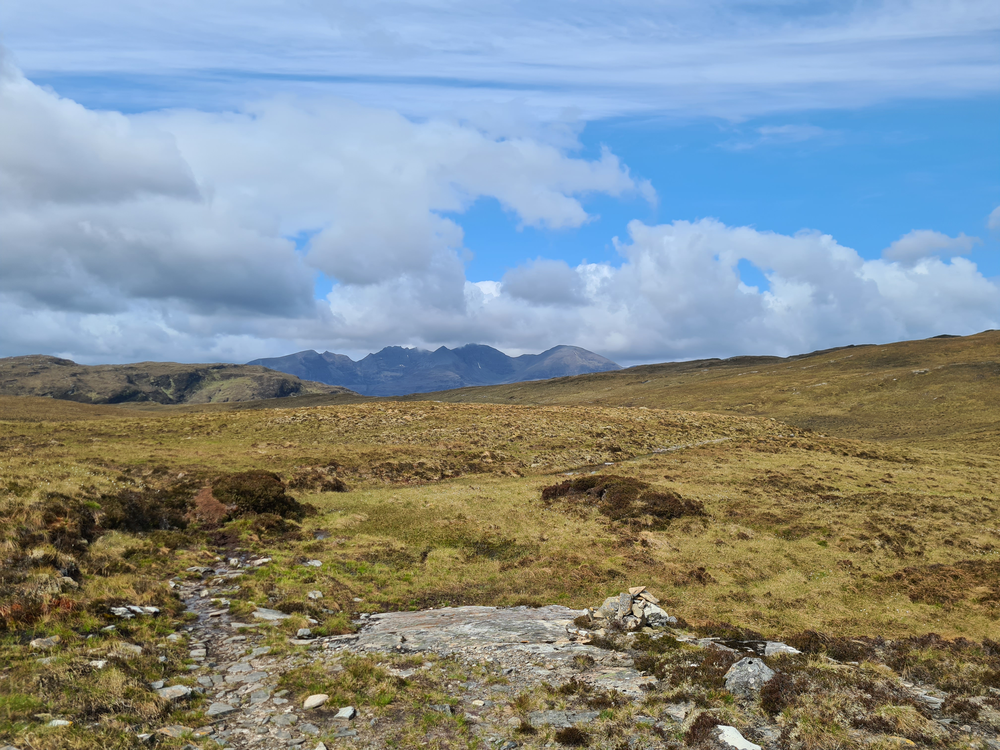
  <figcaption><i>Fisherfield Forest ahead</i></figcaption>
</figure>

<figure style="text-align: center;">
  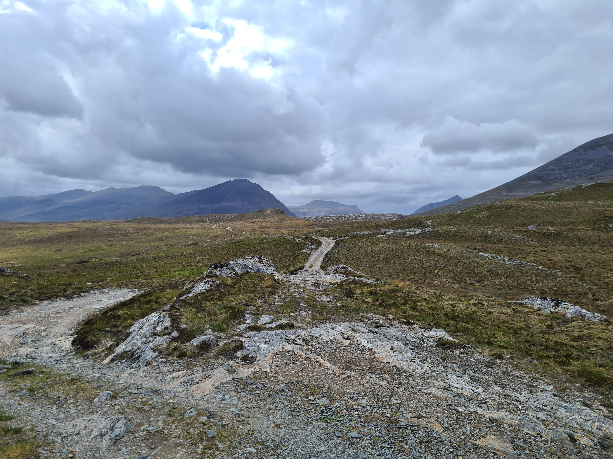
  <figcaption><i>Crossing Dundonnel Forest towards Sheneval bothy</i></figcaption>
</figure>
 

<figure style="text-align: center;">
  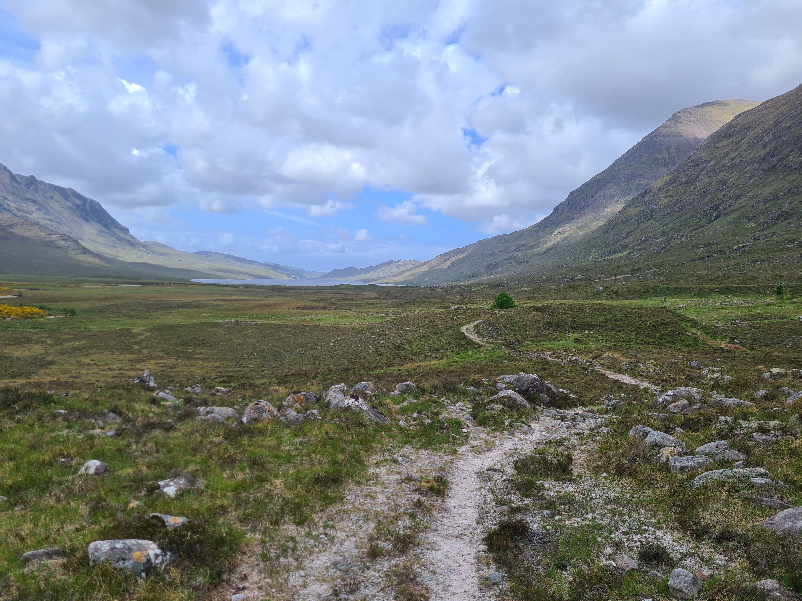
  <figcaption><i>Loch na Sealga</i></figcaption>
</figure>
 
<figure style="text-align: center;">
  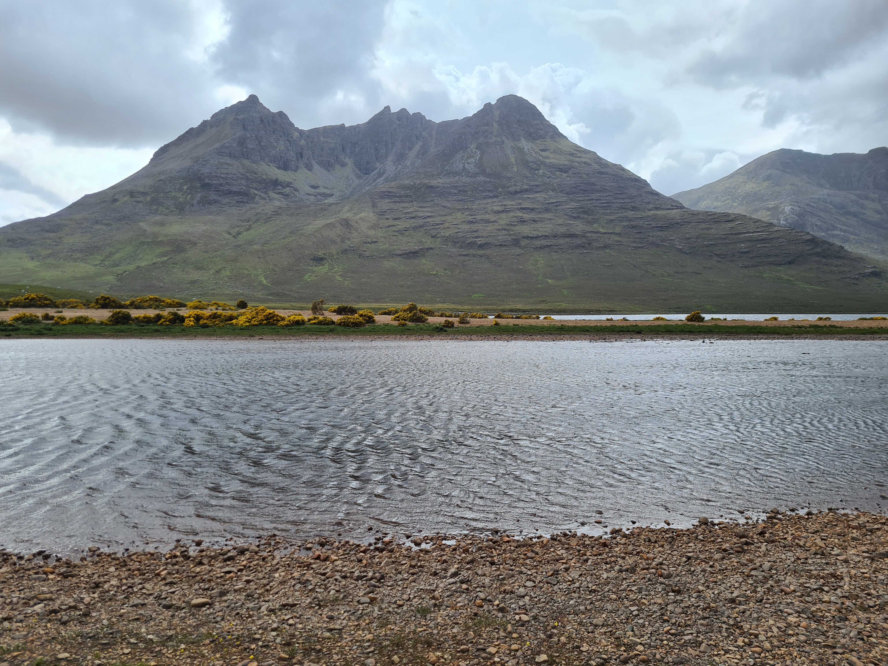
  <figcaption><i>Abhainn Strath river crossing</i></figcaption>
</figure>

<figure style="text-align: center;">
  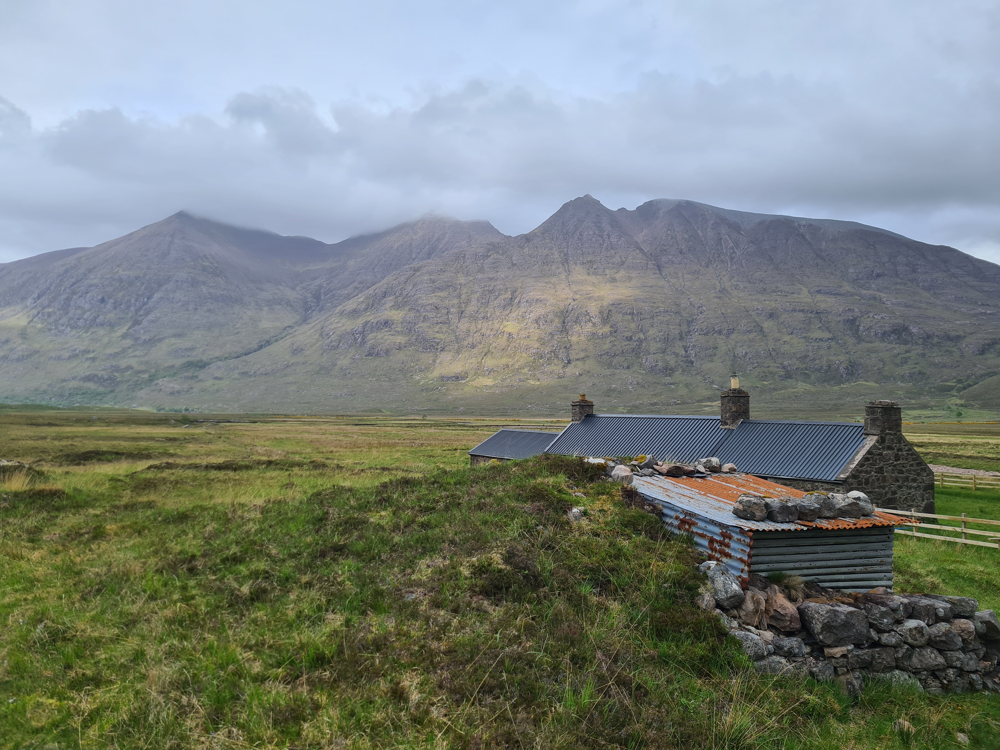
  <figcaption><i>Sgur Fiona</i></figcaption>
</figure>

<figure style="text-align: center;">
  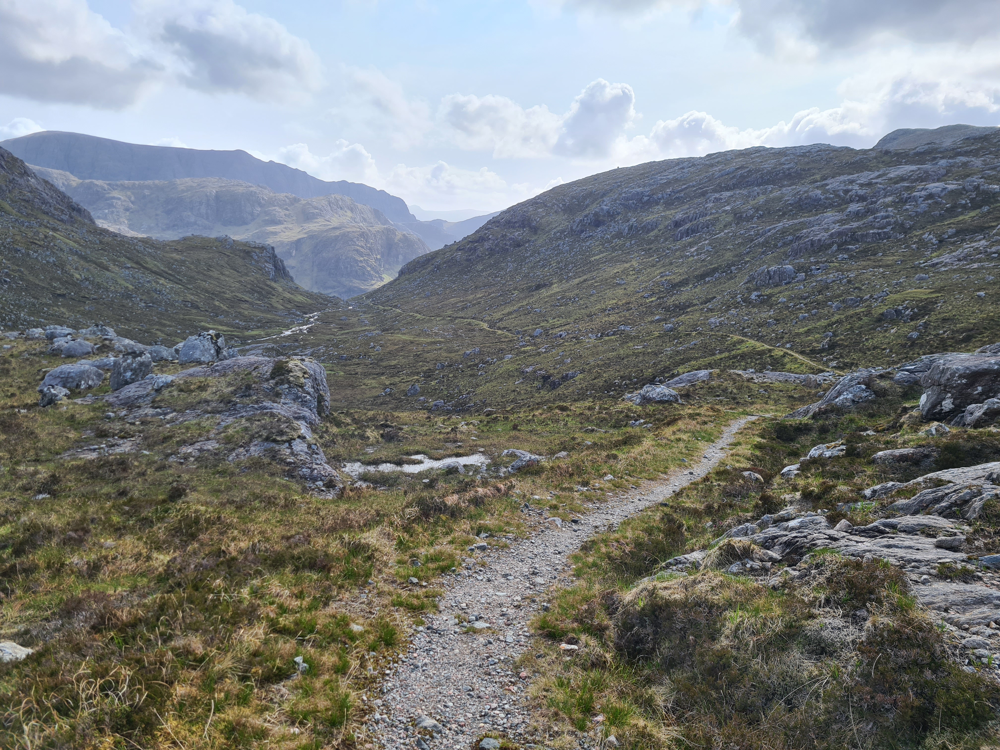
  <figcaption><i>Descent to Carnmore bothy</i></figcaption>
</figure>

 <figure style="text-align: center;">
  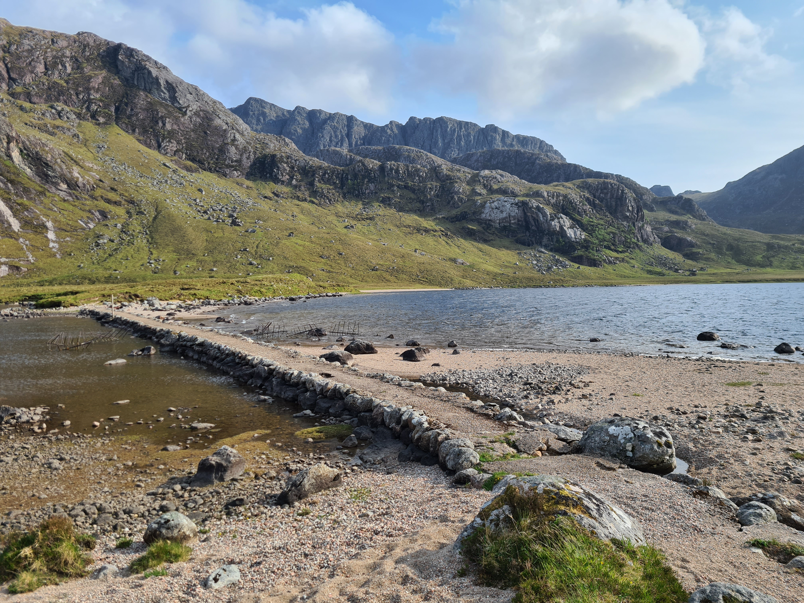
  <figcaption><i>Causeway_ etween Dubh Loch and Fionn Loch</i></figcaption>
</figure>

 
<figure style="text-align: center;">
  
  <figcaption><i>Singletrack to Poolewe</i></figcaption>
</figure>

## Day 9 Poolewe campsite to Dornie campsite
**86.7km 8hr 12m**

An easy day according to the map. I didn't have much food with me and wanted to start early which meant that the shop at Poolewe wasn't open. Not to worry though, there's a cafe and shop at Kinlochewe and there was a flattish path from Poolewe followed by a lot of road to get there. The path was awful, probably as bad as Suilvan, and by Kinlochewe I was starving and pissed off. I'd got there about 11.30 but the cafe didn't open till 12. I did some shopping, waited for the cafe and then stayed there for ages, eating far too much. There was some rain forecast today and it was a bit chilly. Kinlochewe was the first habitation where the midges were out during the day.

The path up Glen Coulin was superb, after an estate track it was mostly rideable singletrack and over the top it was like a mini Moab, brilliant riding. Some of the descent was a bit too technical on a loaded bike but overall a great section. Of course there was a sting in the tail, the final footpath section down Glen Ling was pants.

The Dornie campsite had a fantastic homemade pizza place about a minute away, in the garden of a house full of comical witches houses and gargoyles. To top it all off I was still able to keep up with the Giro as I'd had enough signal at most campsites to download a podcast or watch GCN.

 <figure style="text-align: center;">
  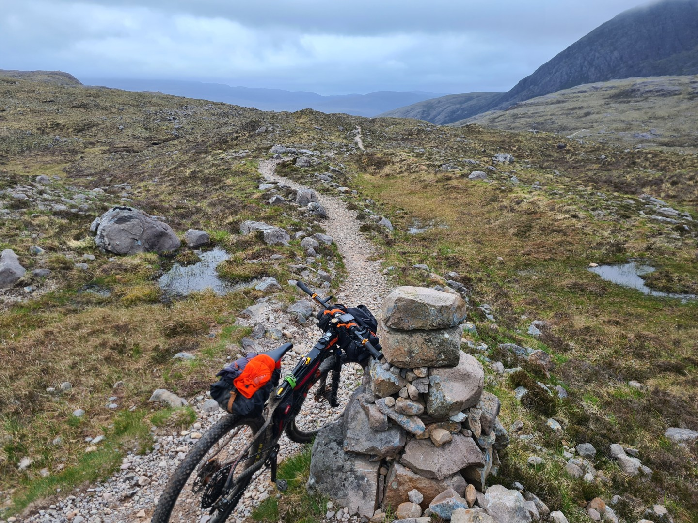
  <figcaption><i>Towards Loch Coire Lair</i></figcaption>
</figure>

<figure style="text-align: center;">
  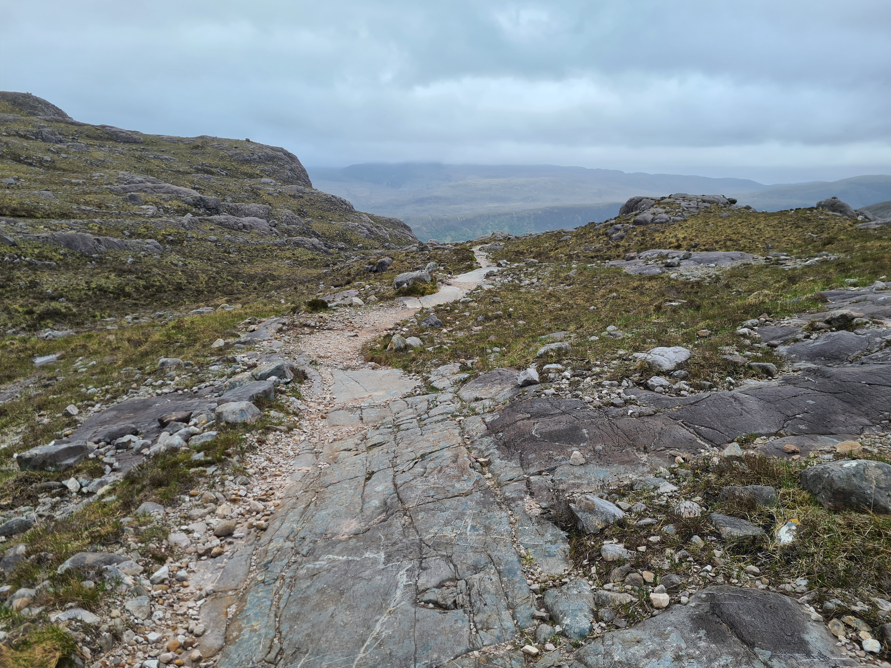
  <figcaption><i>Mini Moab above Glen Coulin</i></figcaption>
</figure>

<figure style="text-align: center;">
  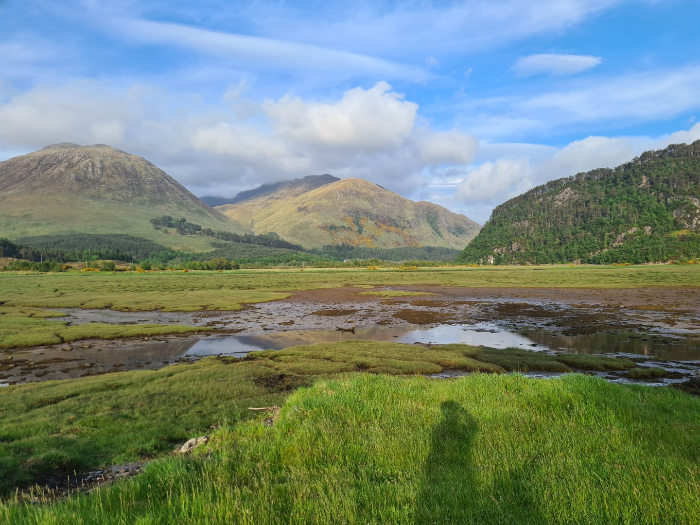
  <figcaption><i>Loch Long</i></figcaption>
</figure>

<figure style="text-align: center;">
  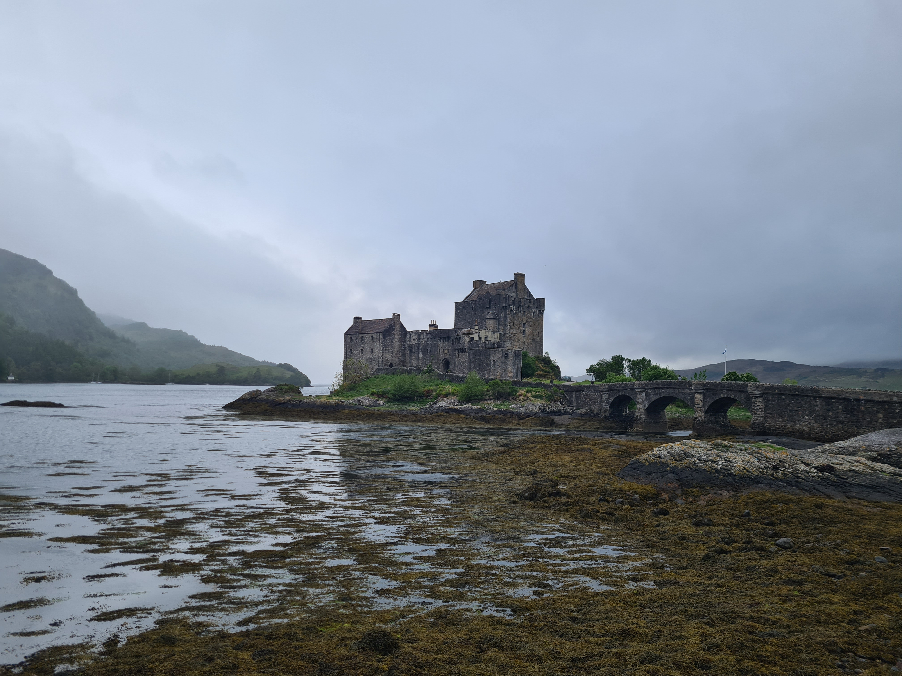
  <figcaption><i>Dornie Castle</i></figcaption>
</figure>

 

## Day 10 Dornie campsite to Loch Lochy Locks
**103km 8hr 19m**

Yesterday I'd felt much better physically, I knew I'd finish the route and wasn't worried about my legs giving up. I was really enjoying the ride but definitely didn't want to do any extra days. Two days of about 100km each should get me to the end and the route looked much easier now. These turned into two of the best days. The sun came out, it was warm and there was enough easy riding to make lots of progress without flogging myself.

The zip on my waterproof had failed yesterday and today I had  damp start. I pinned it together with safety pins and it seemed to work. The ride up Glen Licht was easy but the push over to Glen Affric was horrible, steep, stepped and took forever. Riding over the top was great, it was sunny and warm now and I stopped at the Glen Affric YHA and had a good chat with the warden and a passing walker. It's supposedly one of the remotest YHA's and runs off wind and solar power. I had a tailwind the rest of the way down Glen Affric, two easy hills over to Fort Augustus where I had a fish butty from the chippy and then a final cruise down the Caledonian Canal to Loch Lochy Locks where you were allowed to camp. Loch Lochy Locks, I've not made that name up.

I'd been storing my waterproof trousers on my rear seat bag under the elastic straps but somewhere along the way they decided to make a run for it and disappeared.

 
<figure style="text-align: center;">
  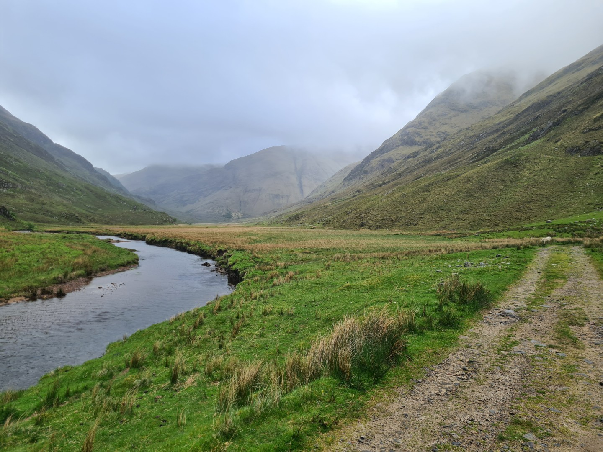
  <figcaption><i>Glean Lichd</i></figcaption>
</figure>

 

 <figure style="text-align: center;">
  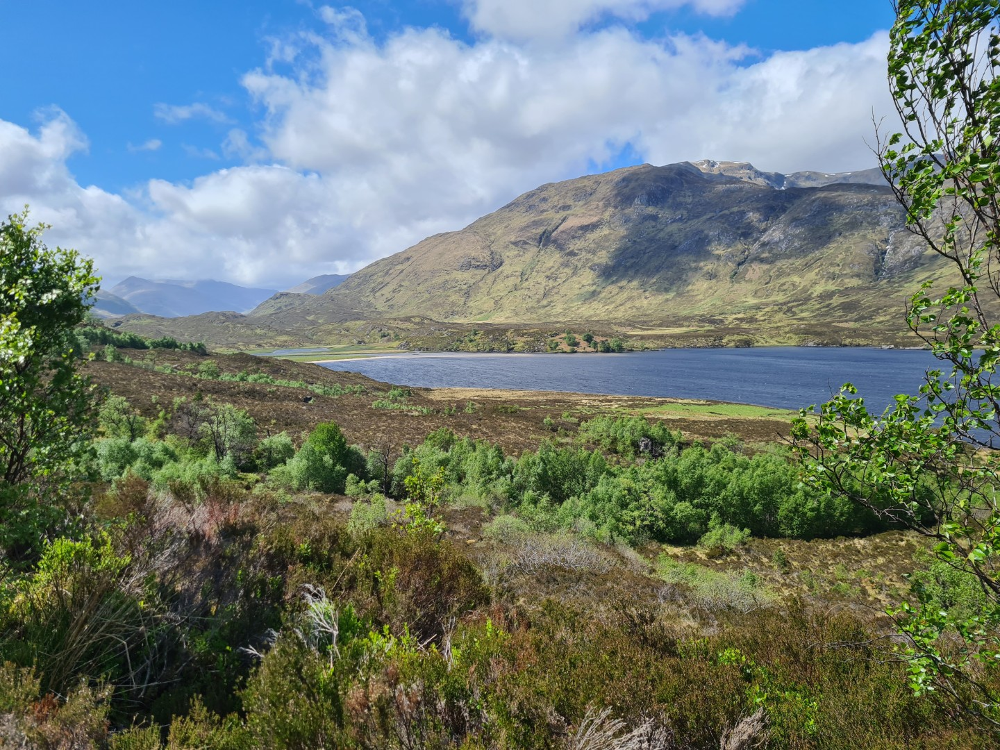
  <figcaption><i>Glen Affric</i></figcaption>
</figure>

## Day 11 Loch Lochy Locks to Tyndrum
**101km 8hr 10m**

I left at 7am and felt rubbish till Fort William 30km later. A decent breakfast seemed to sort me out and I was now on the West Highland Way and it was rammed with walkers going north to south. I saw more people today that during the rest of the trip combined and plenty of them looked broken. For most of them what they were doing in a day I'd cover in a couple of hours. I think I'd want to be higher up on rougher tracks if I was walking.

It was good riding and Kinlochleven looked a bit like the French Alps in today's glorious weather. The the push up out of Kinlochleven was smooth but hard and too steep after 10 days of riding and turned into a massive push. There was a bit of riding towards the top but then had to push down the Devil's Staircase. The West Highland Way improved after this and it was easy fast riding all the way back to Tyndrum, gloriously sunny, almost too hot with a tailwind to finish.

<figure style="text-align: center;">
  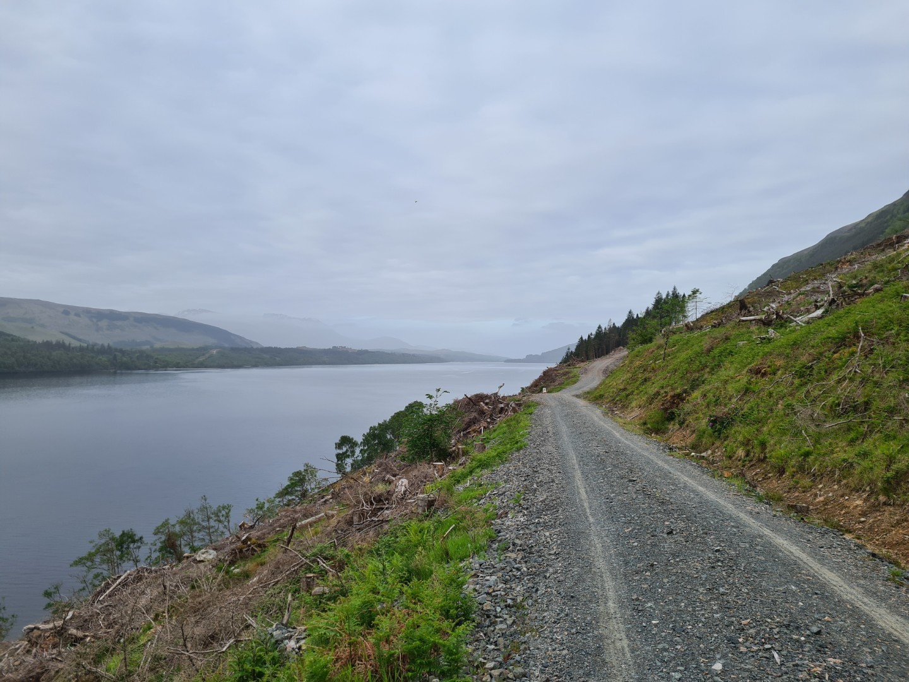
  <figcaption><i>The Great Glen</i></figcaption>
</figure>

<figure style="text-align: center;">
  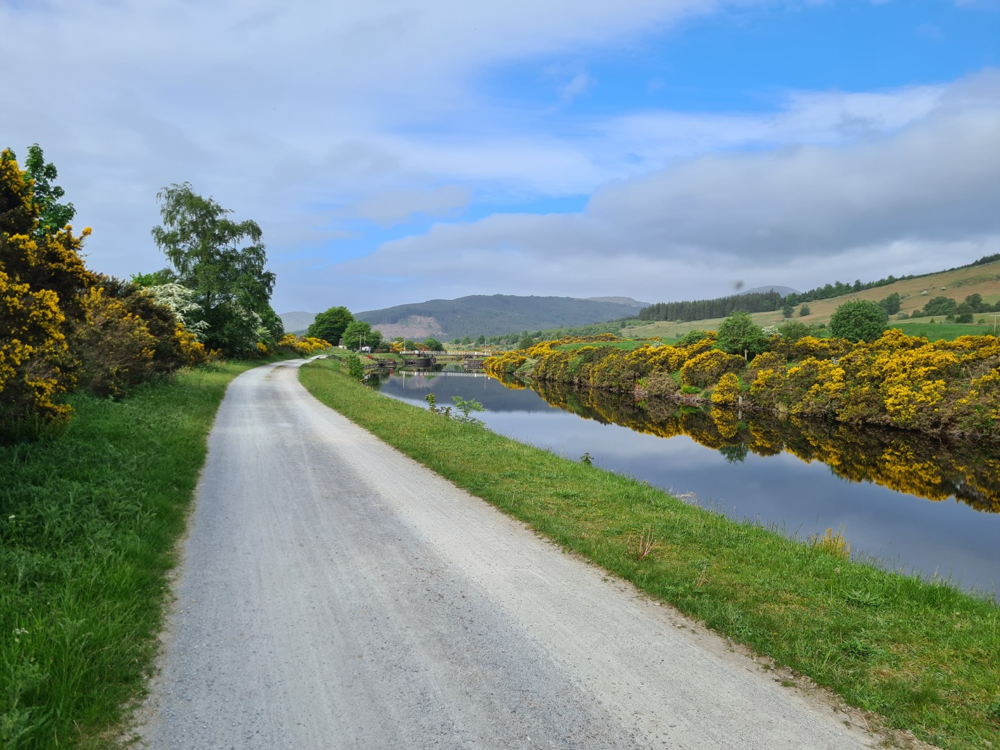
  <figcaption><i>The Caledonian Canal</i></figcaption>
</figure>
 
<figure style="text-align: center;">
  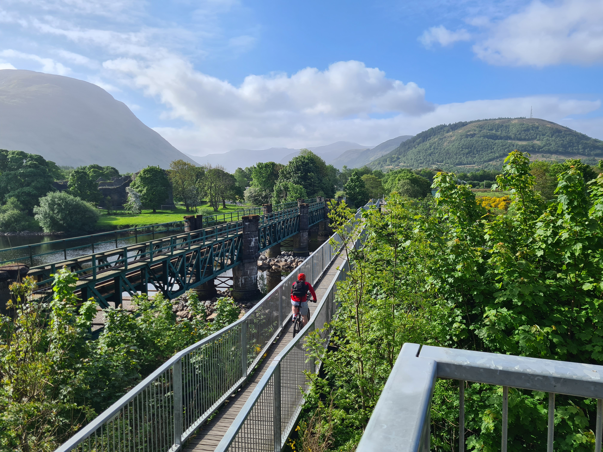
  <figcaption><i>Bridge near Fort William</i></figcaption>
</figure>

  <figure style="text-align: center;">
  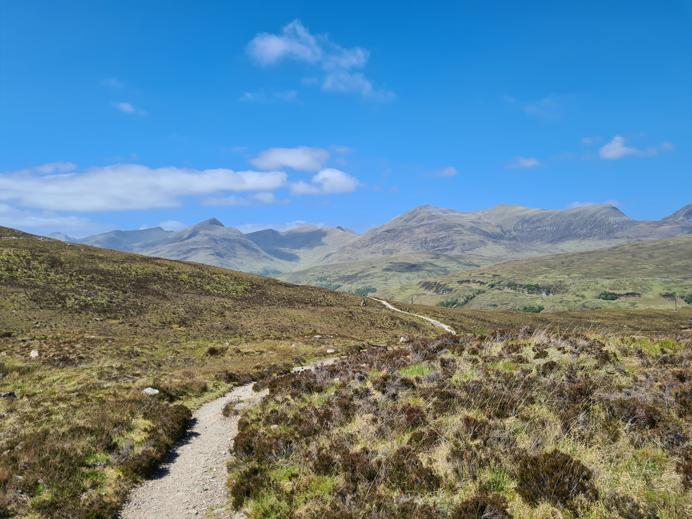
  <figcaption><i>The rideable bit above Kinlochleven</i></figcaption>
</figure>

 
<figure style="text-align: center;">
  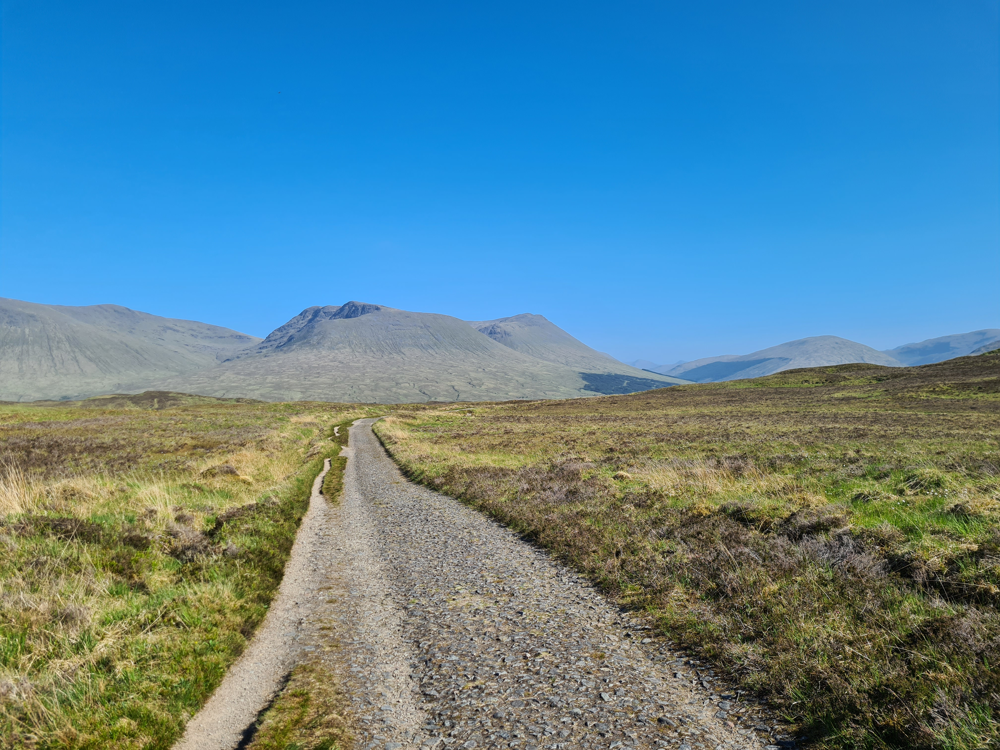
  <figcaption><i>General Wade's military road</i></figcaption>
</figure>

 <figure style="text-align: center;">
  
  <figcaption><i>Nearly there</i></figcaption>
</figure>

This was a great trip. I had doubts I could finish it and some of the route was really tough. In the end I had great weather; I only got slightly damp on two days, I missed a torrential downpour by minutes as I rolled up to the Suilvan bothy, and it was mostly quite cool and a good riding temperature. The midges did just start to come out on about day 3.

It's a frustrating route in some ways. It feels like there's quite a lot of road and smooth estate tracks and that a narrow tyred gravel bike would be best. A few of the downhills felt like quite rough tracks and then I was quite happy to have bigger tyres. Once you hit the northern loop and then head south having a mountain bike makes more sense. You could do it on any bike really except a road bike, although that would be easier on the hike a bike sections, you just have to compromise somewhere.

The Suilvan and Poolewe path are definite low points. If I did the route again I'd miss these out. The loop round Creagan Meall Horn is superb and not to be missed, as is the Fisherfield Forest section. The Drumbeg to Lochinver section is beautiful and everything from Ullapool onwards is really good.

Well worth doing, highly recommended.

### Things to change

I probably need a slightly warmer bag or quilt, I'm sure I sleep a bit colder now. I'll probably stick with a quilt as it's easier to sleep in, especially as a side sleeper, and it's easier to vent if you're too warm. I think that if I get one comfort rated to zero I should definitely be OK to 3 to 5 degrees C.

On some of the techy sections I definitely missed having a dropper post. If I install one it would also be better getting a rear rack so that there's less strain on the dropper. I'm quite keen on the [Tailfin](https://www.tailfin.cc/product/seat-packs/carbon-aeropacks/aeropack-carbon/?wccps_c0=33797&wccpm0=1567077845&wccpl=4&v=79cba1185463), which gets good reviews and is much easier to pack than a rear bag.