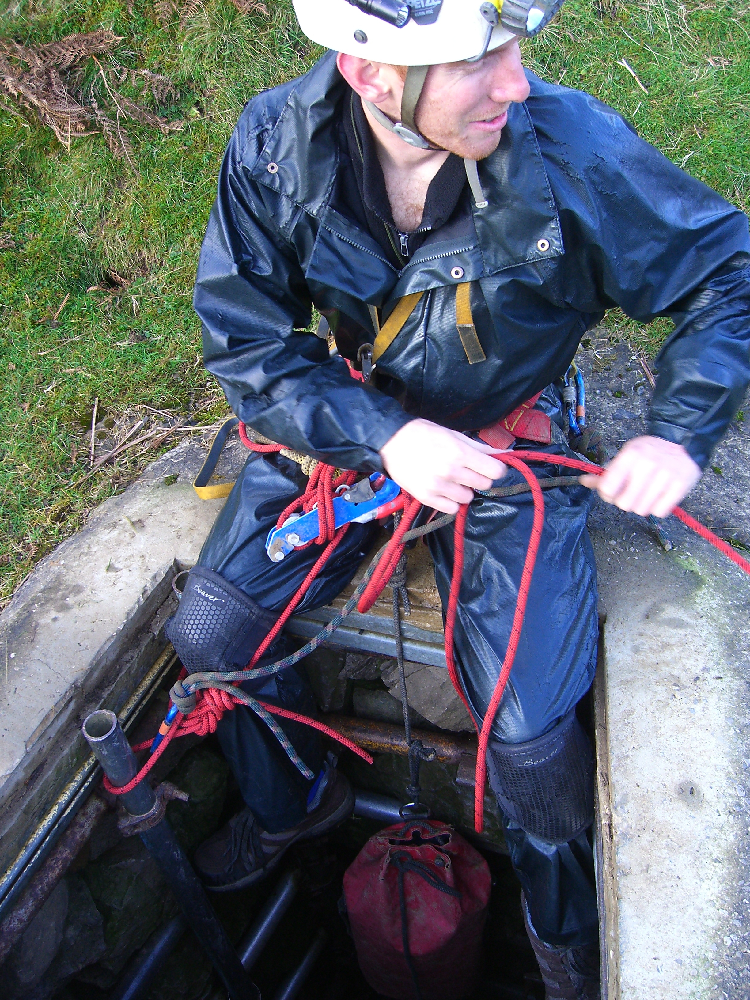
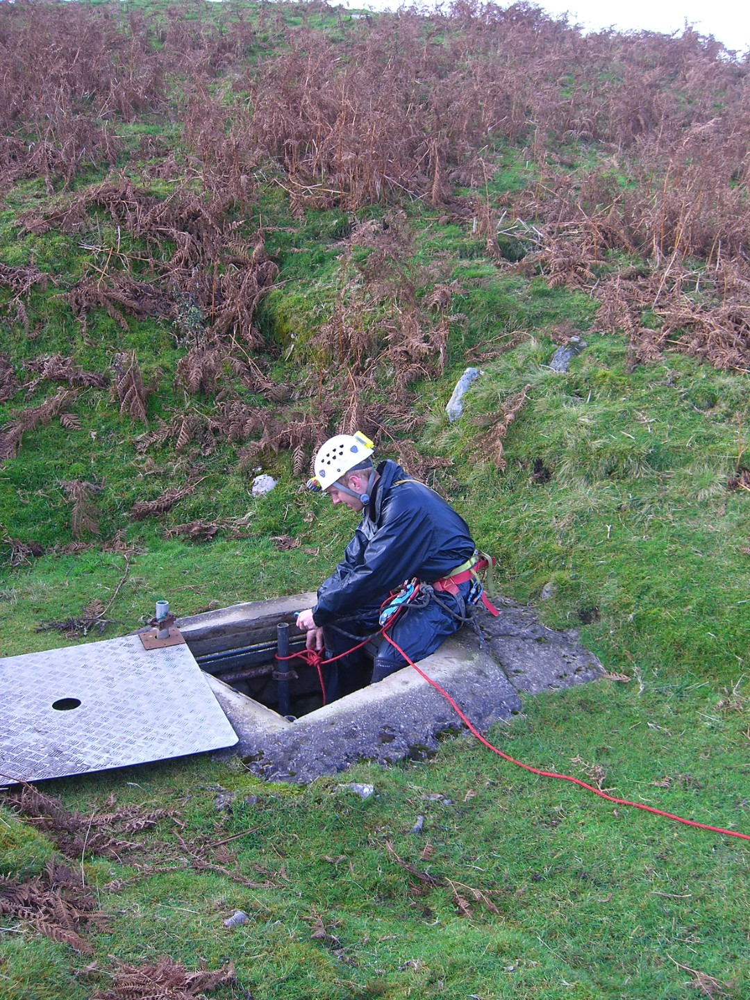
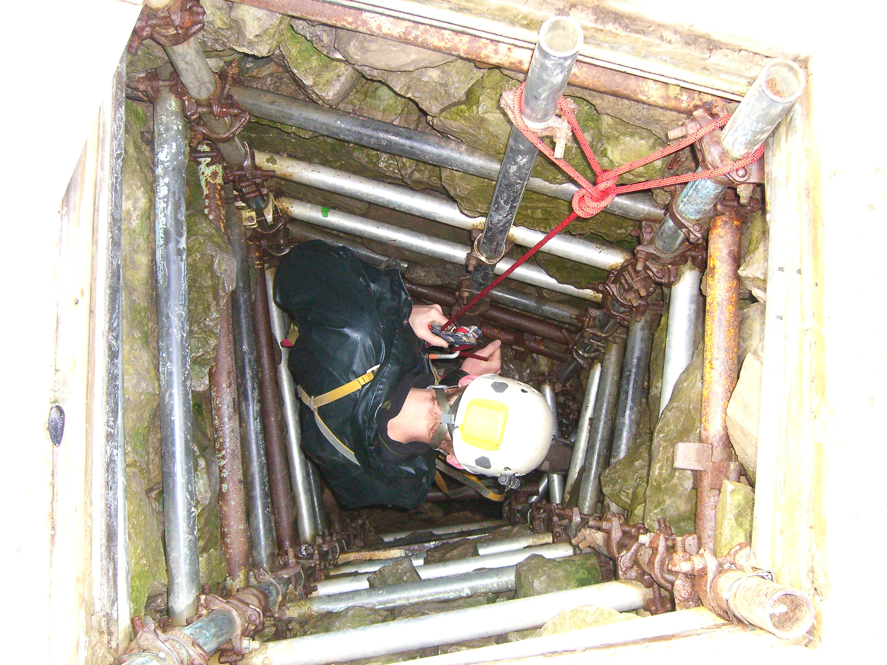
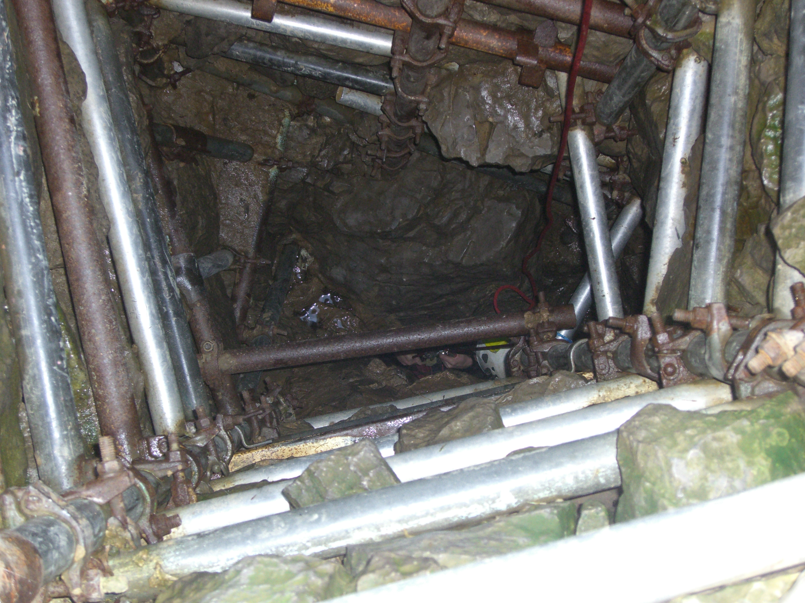
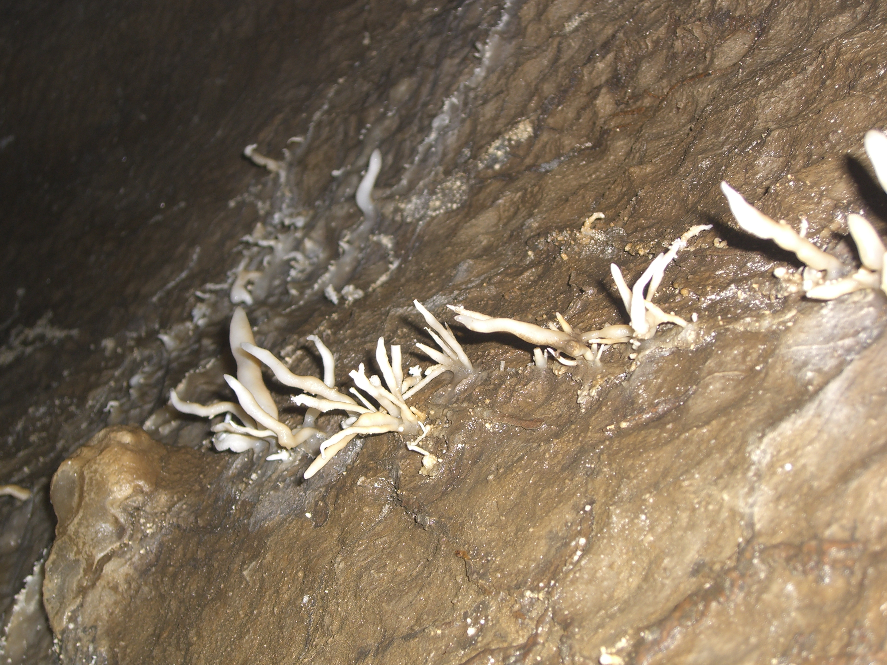
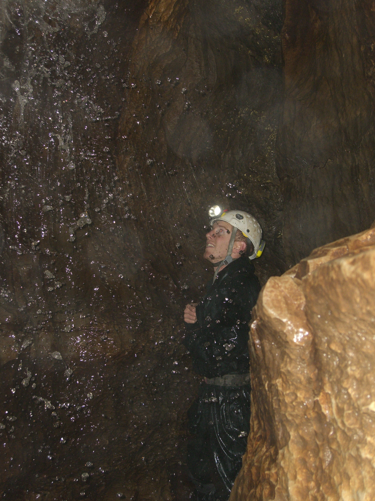

---

# Hagg Gill Pot  - Sunday 5th November 2011

Grade III     Length 1500m     Depth 63m

Jonathan Tompkins, Henry Exon

1.5 hours

[Surveys](http://cavemaps.org/cavePages/Langstrothdale__Hagg%20Gill%20Pot.htm)

I'd been down Hagg Gill Pot 8 years ago and the note in my guidebook reads "Fantastic formations, go back for photos". So that's what Henry and I did except I'm not much of a photographer, didn't really know what I was doing and didn't have any remote slave flashes. Or a decent camera. Nice cave though.

<figure style="text-align: center;">  <figcaption><i>Henry rigging the entrance</i></figcaption> </figure>

<figure style="text-align: center;">  <figcaption><i></i></figcaption> </figure>

We met at Raisgill Farm where according to the guidebooks you need to ask for permission or write before visiting the cave. At the risk of being controversial I'd say don't bother, mainly because the farm is empty and no one lives there. A short drive up the valley goes past Yockenthwaite which is the other side of the river and soon brings you opposite Cow Garth Barn, the first barn on the left over the river. There's a lay by a little bit further back to park in. Henry parked half on the grass, half on the road because the grass looked a bit damp. I decided to stomp around a bit and declared it safe, especially if I backed up the banking a so I could get a bit of a run up to get back onto the road.

Just up valley is a stream near a wall, follow this up the hill until the stream goes through the wall. Don't cross the wall but turn left and walk to a dry valley. Follow this uphill till you see the obvious lidded shaft. 

<figure style="text-align: center;">  <figcaption><i>Entrance abseil.</i></figcaption> </figure>

<figure style="text-align: center;">  <figcaption><i>You can just see Henrys' head.The scaffolding in the shaft looks like it holds back a lot of rock but it's not far down to solid rock and the constriction. I thought this might be a bit of a pain both up and down but it turned out to be easily passable. </i></figcaption> </figure>

<figure style="text-align: center;">  <figcaption><i>Helictites</i></figcaption> </figure>

From the main chamber we first headed upstream through easy vadose passage. There are some fine flowstone and helictites along here and it was probably even more impressive when it was first discovered. It's a sad fact that as a community, cavers aren't always the best people at looking after caves. There are plenty of examples of damage in caves that couldn't have been done by adventurous non cavers. The highlight of the upstream section is the chamber at the end. It's full of pristine straws and looks relatively undamaged. To get through requires a bit of a squeeze next to a waterfall so I left my camera behind so as not to damage it. I decided this wasn't the best decision when I saw the beautiful chamber.

<figure style="text-align: center;">  <figcaption><i>Henry doing some modelling</i></figcaption> </figure>

We then returned to the main chamber and investigated downstream. After a quick look at the sump, where Henry refused my suggestion that he should swim in it, Henry had a quick climb up a rope to investigate a dig. "Horrible", was his verdict, so I believed him and stayed where I was. After squirming through holes and small waterfalls we arrived at a low streamway where a crawl to the right brought us out into a large breakdown chamber. At this point we were struggling to tally the description with what we had just been through and rather than follow some pipes through a low crawl underneath some boulders we climbed up the same boulder slope. After a few minutes of getting muddy we ended up back in the streamway. By now we were running out of time; his girlfriend had an appointment with a bonfire, he said. We decided to leave rather than faff around rushing and looking for the Thin White Line at the end of the cave. The exit was uneventful, surprising myself because I was sure the constriction would cause a certain amount of cursing.

We returned to the vehicles and Henry was obviously concerned that I may not make it off the grass and asked if I would be all right. "It's a van, it'll go anywhere" I said, so off he went, probably disappointed at a bit of entertainment lost. 

I only just made it off the grass.