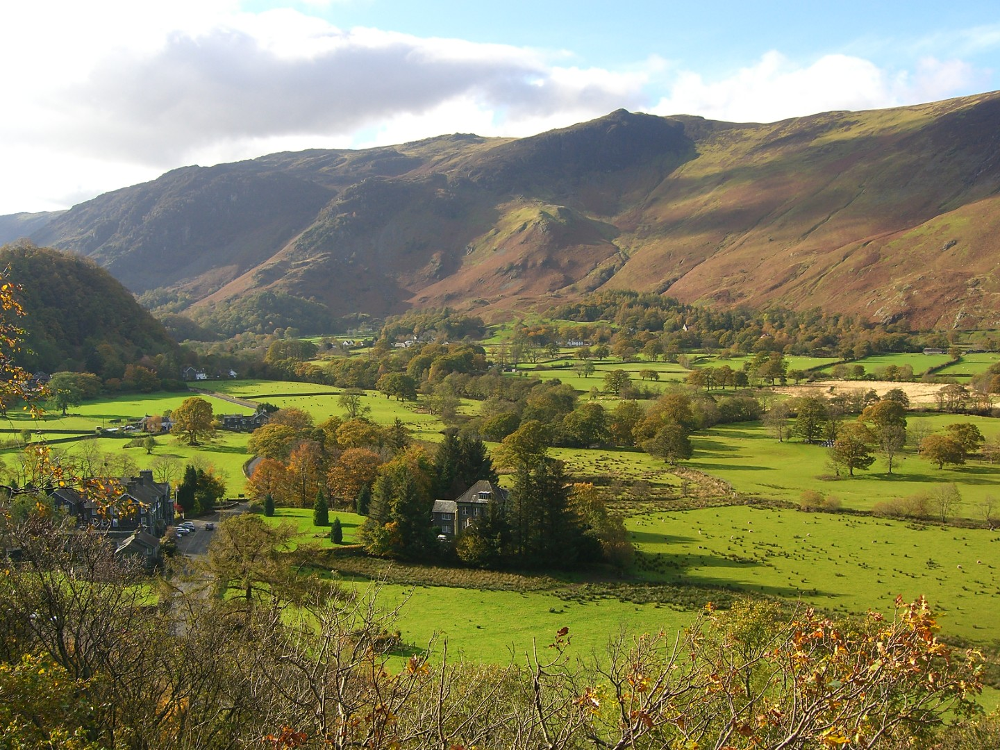
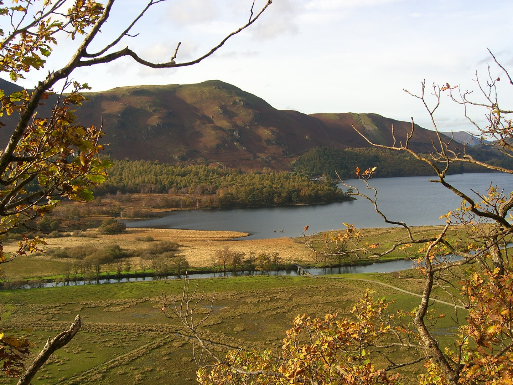
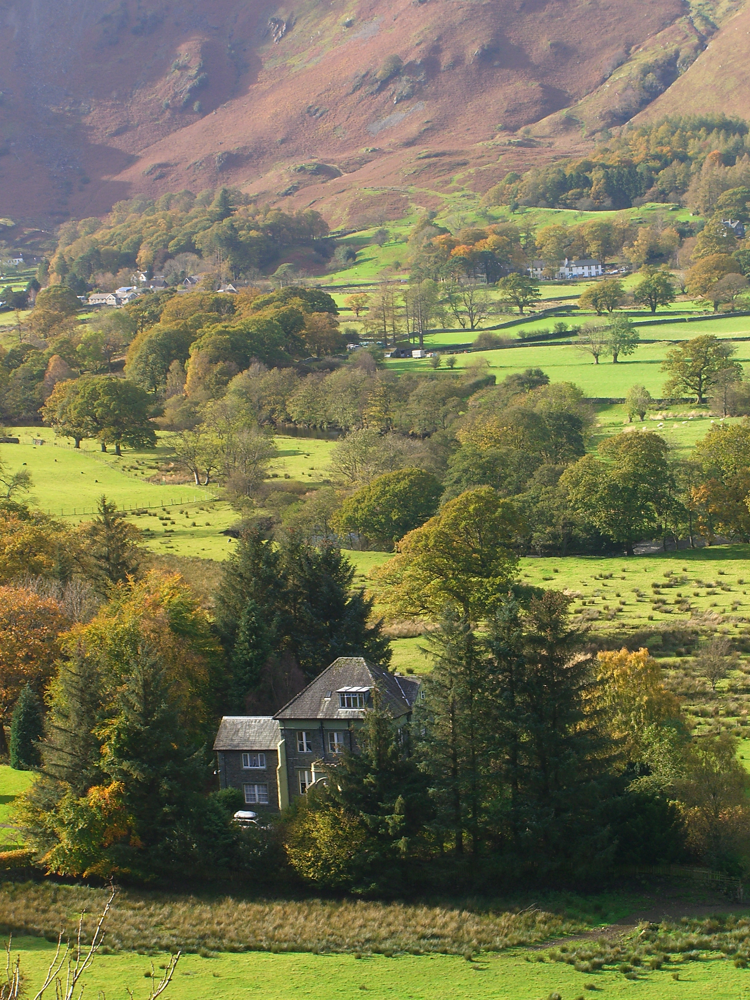
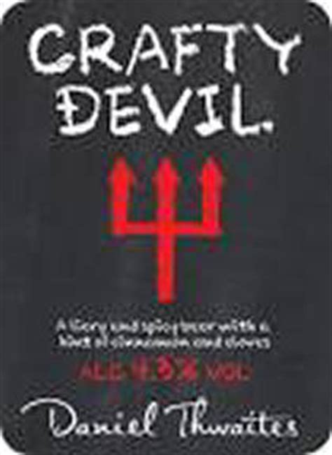

---
**I've given up climbing.** It used to be my main passion and every weekend was planned around climbing. However, years of getting no better, of actually getting worse, and not being able to climb the things I want to climb have finally got to me. I'm not scared of heights but I'm never relaxed when climbing and so I tense up, lose any balance I had and generally climb like a beginner. I'll probably get back into it after a decent break but it gives me time to concentrate on caving (I'm planning on doing the Cave Instructor Certificate) and my other main passion, mountain biking.

Unfortunately this has coincided with my partner, Sue, getting back into climbing in a big way. She's now planning every spare day around climbing and because we've generally climbed together she's lost touch with her old climbing partners. Luckily for her I like to help out so when she wants to go climbing and has no one to go with, she asks me. I pull a face, um and ah, complain about how I don't enjoy it any more and then with a great show of reluctance, agree to spend my whole day belaying and climbing with her. 

Brownie points earned: 5

This discussion happened last Thursday and with a good forecast we decided to go and stay in the Lake District. We would climb at Shepherd's Crag in Borrowdale on Friday and mountain bike on Saturday, with me being allowed to do a long ride by myself. Result. As it turned out the weather forecast changed from nice on Saturday to pants so we ditched that plan and just climbed on the Friday. 

<figure style="text-align: center;">  <figcaption><i>Looks too nice for October</i></figcaption> </figure>

Upon arriving at the crag Sue was immediately disappointed that the café wasn't open. Sue likes coffee and she likes drinking coffee in cafés. I think she likes this more than anything else but she won't admit it. She certainly likes coffee; along with wine it's the only thing most people have seen her drinking, in fact she doesn't even like water. Sue was so concerned about the café not being open that she suggested we visit one down the road that she had seen on the way. "No! Lets get the climbing out of the way!" I never miss an opportunity to get my point across that I'm helping her and sacrificing myself. 

Brownie points earned : 1, although if Sue saw through my plan it's minus 5

The walk in to Shepherd's is approximately 3 minutes, we found our route after about an hour of wandering along the bottom of the crag. Molly enjoyed herself. 

We were looking for Little Chamonix, a classic VD multipitch. To be fair to Sue she hadn't been here for a long time but that wasn't the problem, her guidebook reading skills were. Of course I could have helped out but by moping along behind her, leaning on things to emphasise the weight of the rucksack (I have to carry everything) and generally looking down trodden I hoped to earn more points.

Brownie points earned: 1 for the rucksack carrying, 2 for enduring the arduous trek. 

We eventually found the route, having already walked past it once. The start was wet so we, meaning Sue, decided to start on a different route. We walked back to the base of Jackdaw Ridge, a route we had just been at as we looked for Little Chamonix. By now I was sure my brownie point total would be astronomical.

<figure style="text-align: center;">  <figcaption><i>Sound of me moaning not included</i></figcaption> </figure>

Sue sets off up the climb and I belay, occasionally throwing sticks for Molly. Eventually it's time for me to follow and I find the climb reasonable although I don't particularly enjoy it. When I reach the belay all thoughts of brownie points disappear and a mild panic sets in. I'm a bit pedantic about placing gear on climbs and belays in particular. Sue is belayed to a small oak tree by a sling which is bombproof. She's is also tied into one of it's roots which looks decidedly rotten. I test it, it moves, I panic. Sue's third piece of gear is one of her favourites, the smallest Friend on her rack rammed into a slightly flared shallow crack. By now my generally good mood has gone dramatically downhill and what follows was a period of me moaning, rearranging the belay, faffing around and making a bit of a tit of myself. 

Brownie points earned: minus 5 for lots of moaning and faffing by me.

<figure style="text-align: center;">  <figcaption><i>View from Shepards Crag</i></figcaption> </figure>

The final pitch is an easy scramble and we returned to our faithful hound, Sue having enjoyed the climb, me relieved to be alive. Molly is still perfectly happy and shows this by finding a stick.

We then go back to Little Chamonix and it's dried out sufficiently to give it a go. The first and second belay are fantastic and I don't get a chance to moan. The true second pitch involves an awkward step over a gap, which Sue is eagerly waiting for me to flail around on. I'm actually quite enjoying this climb and because I don't want to spoil it I cleverly (sneakily, according to Sue) avoid the crux by taking a slightly lower route and squirming up a chimney. It was a bit like caving which is always fun. "This is great, I could get back into climbing". Then I see the belay. It's bomber but involves perching on a knife edge behind Sue with my back to a big drop. More faffing with ropes ensues but eventually I'm firmly ensconced and Sue is off up the final steep pitch.

Brownie points earned: minus 2 for moaning too much at the belay

Sue wanted to do another route but she always does too much, hurts herself and then gets upset when I say I told her so. Plus it was late and would soon be cold and I didn't want to be stuck up a route, in the dark with a frozen girlfriend. Girlfriends are difficult to carry off a crag when frozen, although easier to slide down a hill. Sue was reluctant to leave the crag at first but then I mentioned that the café would be open and we were off. A black coffee for a Sue (instant, not what Sue wanted) and a coffee and cheesecake for me (lemon, nice but base too soft) and Molly found another stick.

Total brownie points earned: 9

Total brownie points lost: 7

As a brownie point earning exercise it wasn't really a success. Two points for a days effort isn't economical. However, I did actually enjoy one of the routes and Sue bought me a pub meal that evening. The best result was finding a new beer at the pub, The Gamecock in Austwick. 

<figure style="text-align: center;">  <figcaption><i></i></figcaption> </figure>

Crafty Devil by Thwaites is absolutely fantastic. The description immediately puts you off - a 4.3% bitter with cinnamon and cloves! It fact it tastes great and the spices knock the edge off the bitter and to me it's more like a stout. It was so good I had another one the next day.
