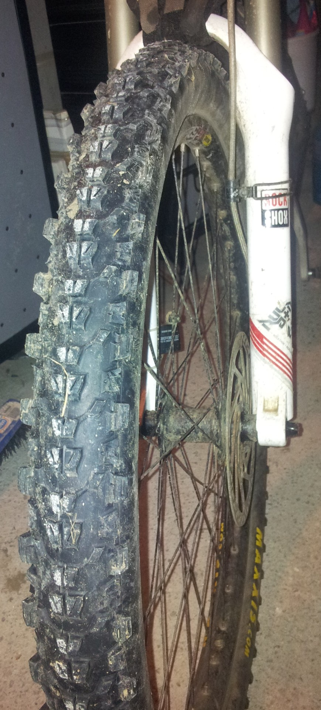
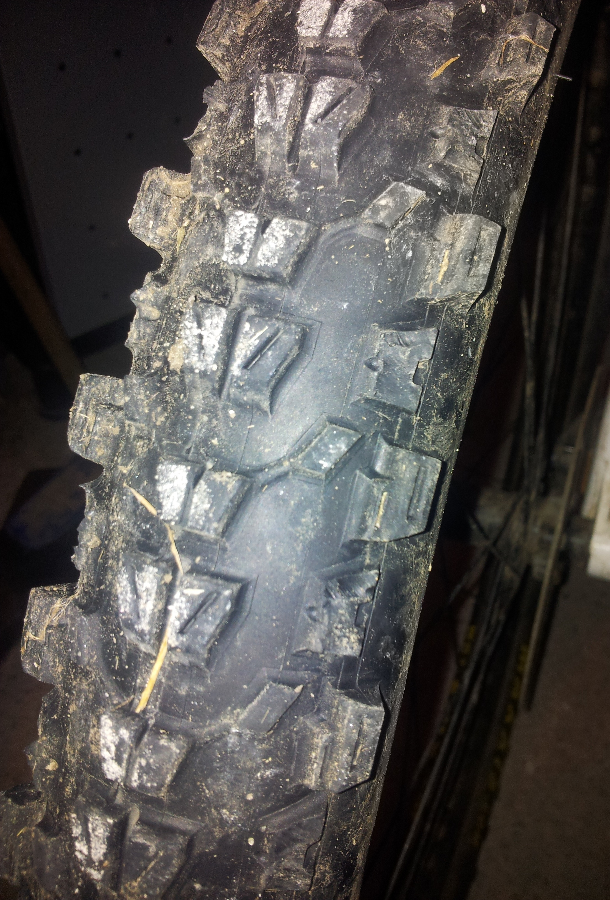

# How to ignore the skill of professionals and do your own thing.

Bicycle tyre manufacturing is big business now, especially mountain bike tyres where a new tyre seems to be produced every week. These aren't small firms making these tyres, they are international tyre companies with vast resources and expertise making all sorts of tyres. They have teams of experienced, knowledgeable people designing compounds and tread patterns, tested by highly skilled riders in all sorts of terrains and conditions. There is a lot of skill and effort gone into the production of these tyres. So, for an amateur to come along and decided the tread isn't quite right and modify it with a knife in their garage would be ludicrous. This is what I thought for a long time, until I found myself in my garage, with a knife and a tyre that I thought needed a bit more grip in the corners. 

I've recently got into fast rolling, big volume tyres. I had a [Maxxis CrossMark](http://www.maxxis.com/Bicycle/Mountain/CrossMark.aspx) on the back which was great in summer, it was like always riding slightly downhill. I needed a bit more grip on the front so I put a [Maxxis Ardent](http://www.maxxis.com/Bicycle/Mountain/Ardent.aspx) on, a big 2.3 with more tread than the CrossMark but still with low rolling resistance due to the centre tread. I liked this combination although I always wanted a bit more grip on the front when leaning over in the bends. To misquote [Stuart Rider](http://yorkshirebiking.com/) ["grip is not in the hands of this pilot"](http://jonathantompkins.blogspot.com/2011/11/riderisms.html). Now Stuart would tell me to man up and get some skills but because I've been trying this method for the past 30 years of riding without much success I thought I would try a different method.

After careful examination of the Ardent, with full acknowledgement of the skill and effort of the manufacturer, I decided that if I cut off every other knob on the outside edge, the increased space would provide more grip. So out came the sharpest knife I had, the tyre stayed on the rim and the knobs came off.

<figure style="text-align: center;">
  
  <figcaption><i>Modified Ardent</i></figcaption>
</figure>

<figure style="text-align: center;">
  
  <figcaption><i>Modified Ardent</i></figcaption>
</figure>

 I have to admit to being slightly apprehensive about this but the result was surprisingly effective.

Mr Rider, you can stop shouting at the screen now, you know you'll copy it soon.