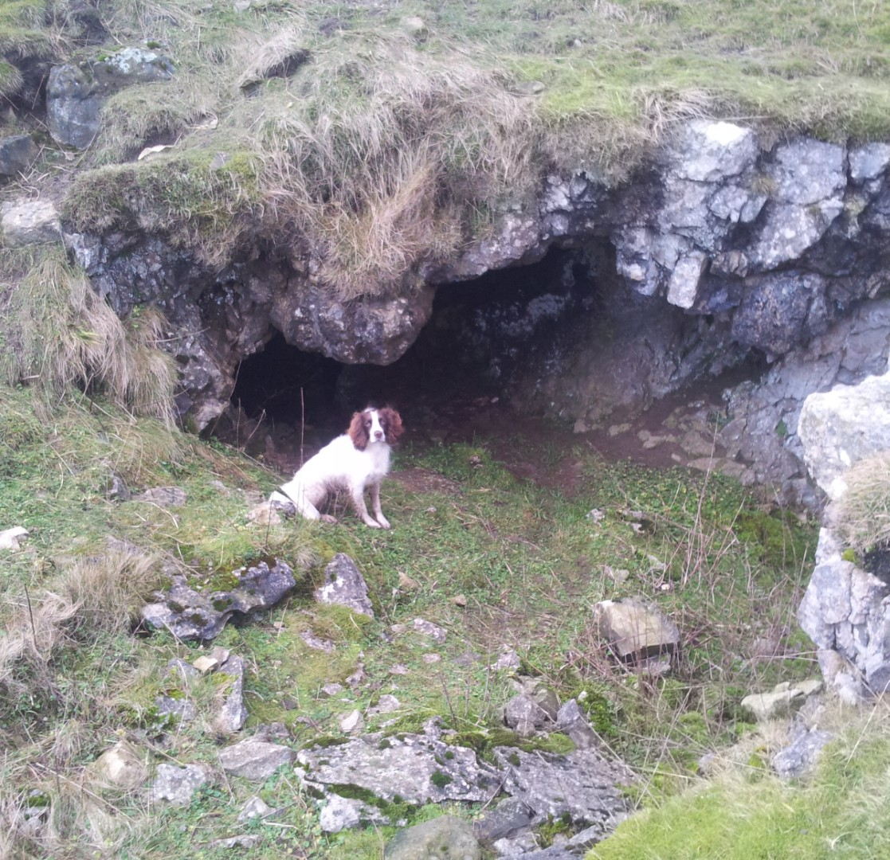
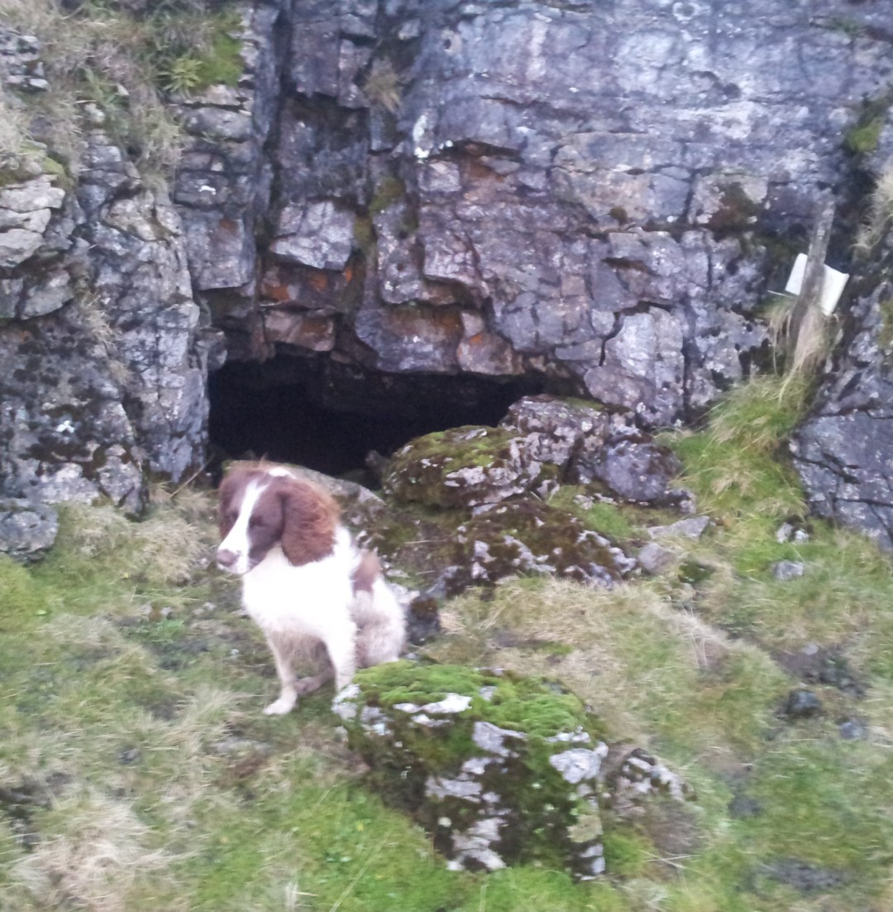
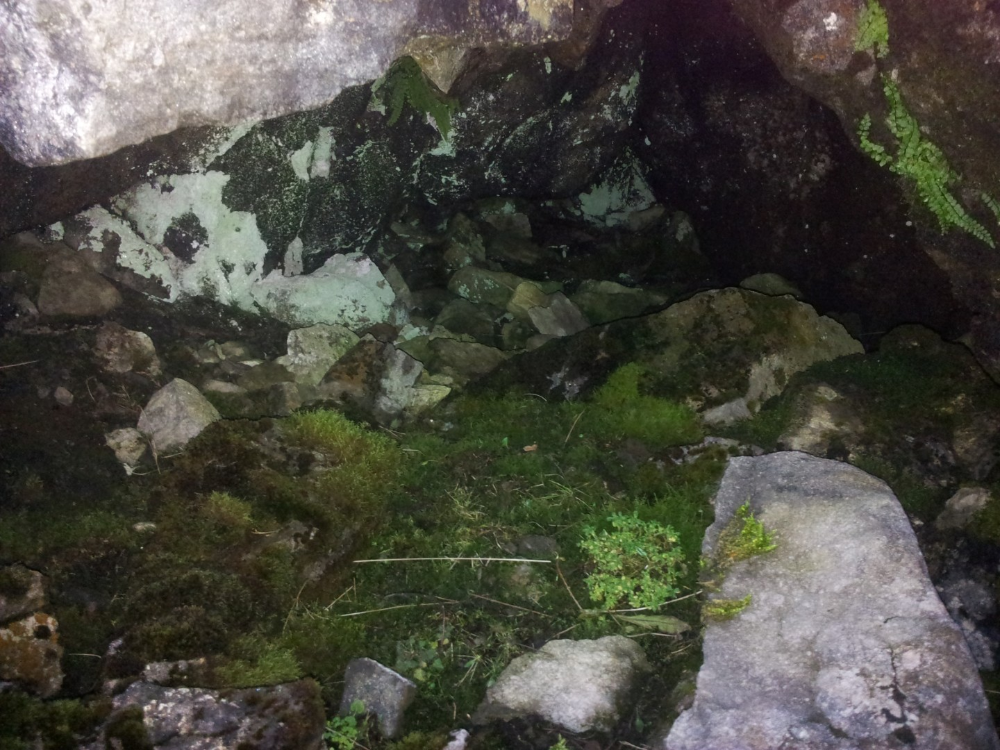

---
tags:
  - caving
  - Yorkshire-Dales
description: A leisurely stroll above Malham looking at obscure, short caves
draft: false
date: 2011-12-28
author: Tompkins Jonathan
title: I know there's a cave here somewhere
---
# I know there's a cave here somewhere

 **28th December 2011**
**Grizedale Hole**

The plan was to take Molly for a walk and look for some obscure cave entrances whilst I was out, in particular Grizedale Hole and Kuling Hole which have both been dye tested to Malham Cove. They are currently both short caves although there is massive potential, Malham Cove is approximately 2.5km away and over 250m lower. So I drove up to Langscar gate and set off walking with Northern Caves 2, OL2, a compass and a torch. 

It was blowing a hooley, the Met Office had issued strong wind warnings for today. It was also really muddy underfoot because some 4wds had decided that the Gorbeck Road bridleway was open to vehicles again, when it wasn't. It was really churned up. On the way I had a look at the entrance to The Grollit, a small cave that had been mined for the copper content of it's sediment. I soon got to the point along the wall where I needed to use my compass. I took a bearing and started pacing. 

No cave. I'd taken little side detours along the way to look in shakeholes; I'd found lots of rifts and shakeholes but no cave. I ambled around the top, found nothing and went back to try again. Saw the same holes, no cave. I felt a bit better as the guidebook describes it as obscure. I shall have to go back with a GPS.

**Kuling Hole**
Second objective was Kuling Hole which was easy to find. The entrance didn't look very enticing though, it was small, under boulders with a stream flowing into it and a lot of shale around. Probably isn't the most stable cave in the guidebook. On the way I looked in Corner Cave, a low bedding plane entrance that didn't look like it would every see me down there! There were a few more caves nearby; Low Grit Hole was easy to find but not suitable without a cave suit, it also looked a bit loose. Miners Hole was hidden away down the side of Pikedaw Hill. It was easy enough to walk and stoop into without a helmet. The guide mentions some deep wading but there was none of that, even though it has been wet recently. Not a particularly inspiring hole although the view from the entrance is nice. Finally I headed back past Twin Bottom Scar Caves which also looked like they had been mined. It was very blocky inside with a significant scree slope outside the most southerly entrance.

**Miners' Hole**

Grade II  Length 73m  Depth 4.5m

Jonathan Tompkins

10 minutes 

<figure style="text-align: center;">
  
  <figcaption><i>Miners' Hole</i></figcaption>
</figure>

**Twin Bottom Scar Caves  - Tuesday 28th December 2011**

Grade I  Length 30m  Depth 4.5m

Jonathan Tompkins

10 minutes

<figure style="text-align: center;">  <figcaption><i>Twin Bottom Scar entrance</i></figcaption> </figure>

<figure style="text-align: center;">  <figcaption><i>Well worth a visit</i></figcaption> </figure>
