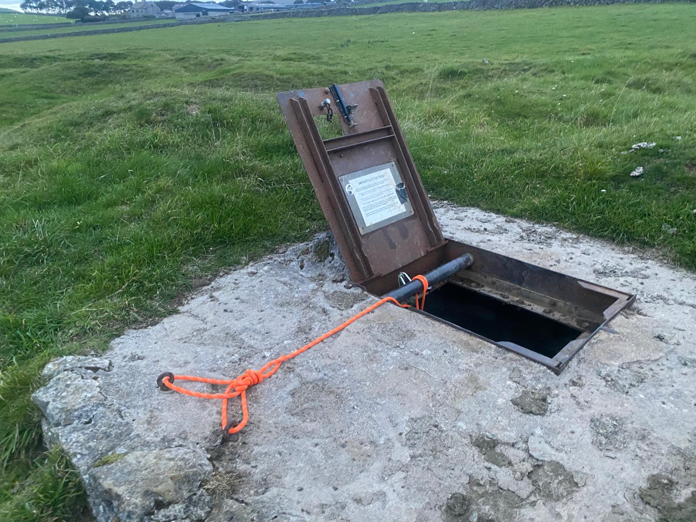
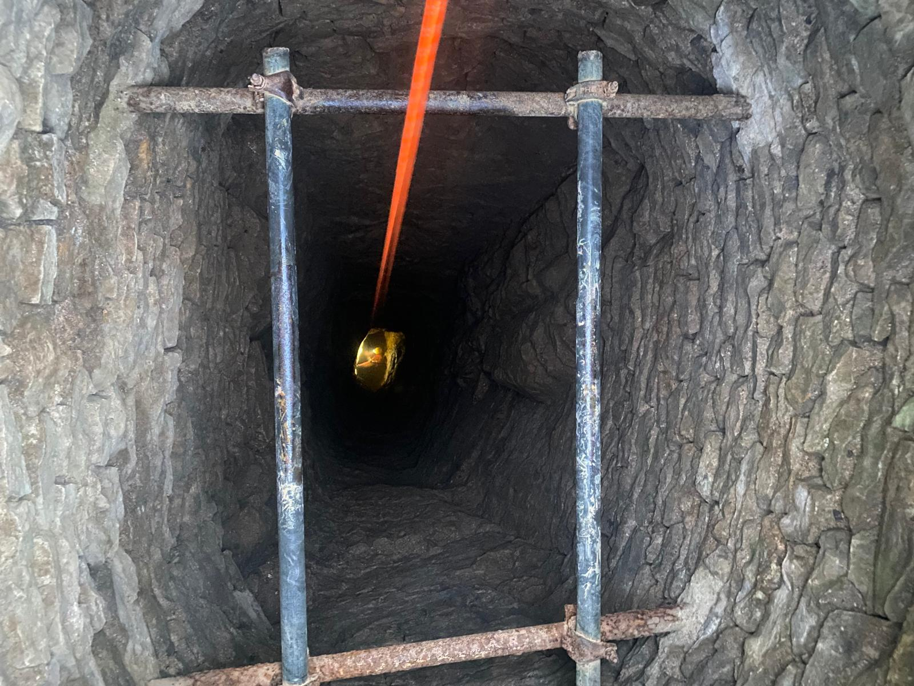
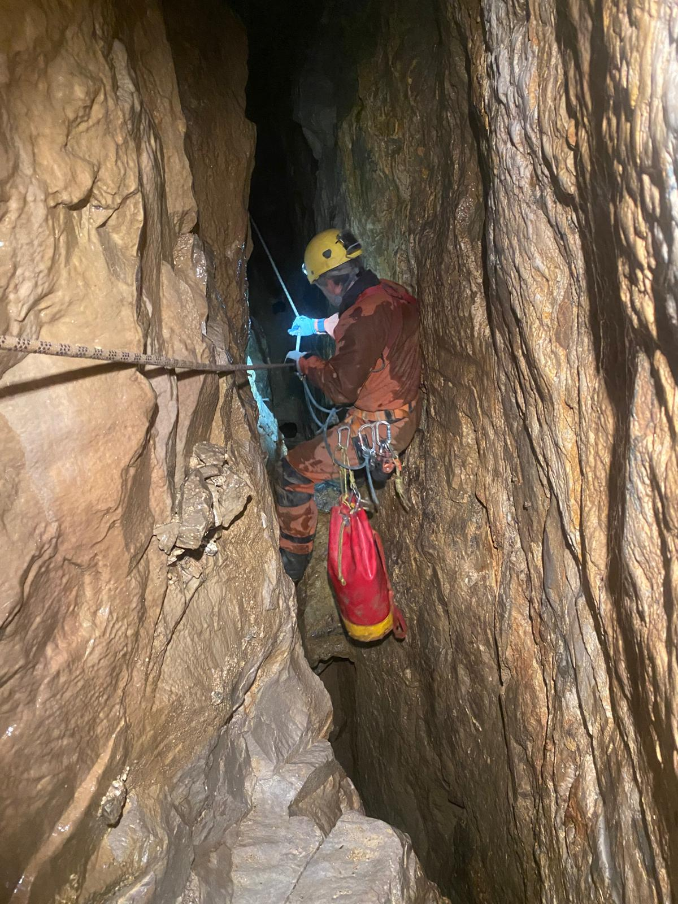
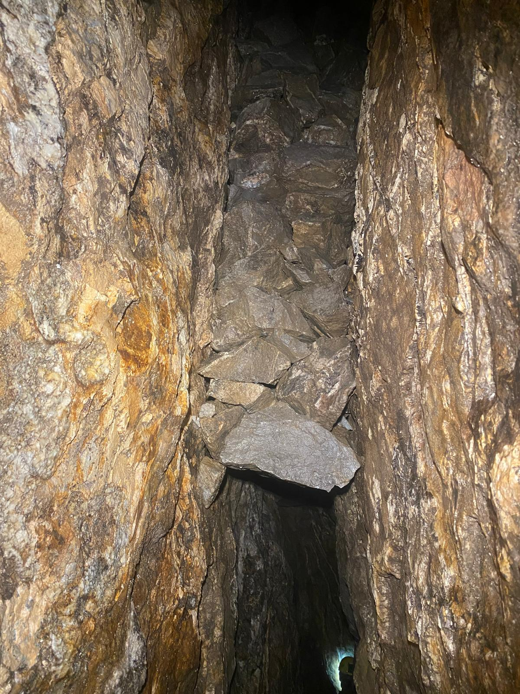
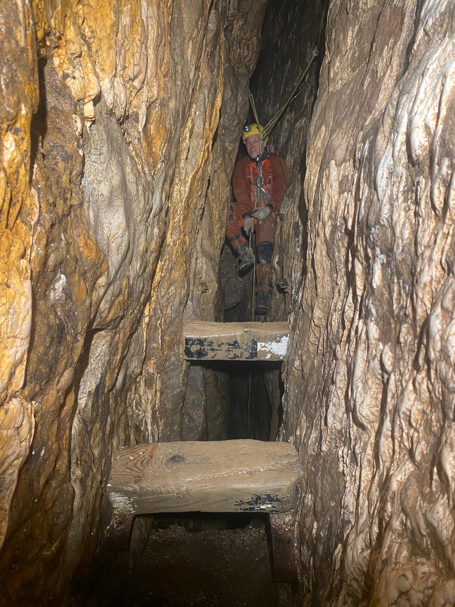

# James Hall Mine, Peak District
**30th September 2025 with John Martin**

This was the second time I'd been here and my memories were of less than ideal bolts, lots of dodgy deads and a general feeling off "can we go now".

Surprisingly my memories were correct. The rift pitch had rope rub, there were really dodgy looking deads everywhere and I had to constantly tell myself not to look all the hanging death. Well worth a visit.

<figure style="text-align: center;">  <figcaption><i>It starts of well.</i></figcaption> </figure>

<figure style="text-align: center;">
  
  <figcaption><i>And goes down an impressive entrance shaft.</i></figcaption>
</figure>

<figure style="text-align: center;">
  
  <figcaption><i>There's the odd traverse to do over collapsed sections of floor. Makes you wonder what you're normally walking on.</i></figcaption>
</figure>

<figure style="text-align: center;">
  
  <figcaption><i>There's lot of deads, these look relatively safe.</i></figcaption>
</figure>

<figure style="text-align: center;">
  
  <figcaption><i>The thickest stemples sat on some reassuring ironmongery</i></figcaption>
</figure>
