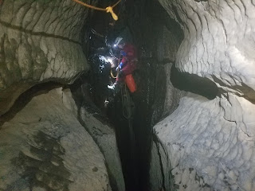
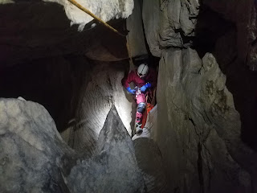
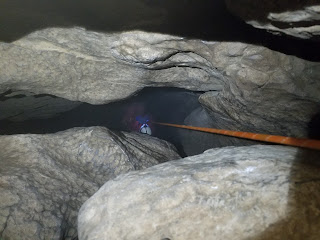

# Juniper Gulf
**Wednesday 12th December with John Martin**

128m deep, 244m long but requires 275m of rope. There's a lot of traversing. Supposedly doable in wet weather except for the last pitch but that didn't matter today. It was a dry forecast and had been dry the day before. However, there was a large cloud sat on Ingeborough.

We parked in Crummack Dale and the walk up took about an hour. The first pitch starts with a short traverse to a Y hang, of which one of the bolts is really high, much higher than the traverse, and awkward to use. We decided to not drop into the stream way because although the forecast was good that cloud had me slightly worried. I read the CNCC rigging as requiring a 25 and 50m rope for this pitch. In fact you need a 25m to the stream way or a 50m to do the traverse, not both.

What follows is some easy traversing in the rift as the stream drops away, there's good holds either side and plenty of room to manoeuvre. The pitch at the end is narrow but easy.

Another traverse follows which contains a widening at a drippy inlet, not too bad if you have long legs or a rope. There's an easy pitch at the end.

<figure style="text-align: center;">  <figcaption><i>The widening on the way to the 2nd pitch</i></figcaption> </figure>

The traverse to the third pitch is more arduous. It's never really difficult, especially if you rope it, but there are sections of unroped traversing above a serious drop, sometimes hand and knees, sometimes flat out. It's narrow though and generally you have a knee on either side. The "bad step" is a slight widening that requires a step onto a sloping rock and a friction traverse. Relatively easy with a rope but hairy without. On the way in I dangled the rope bag on it's long extension and it sometimes jammed  in the rift. On the way out I attached it directly to my harness and it didn't jam although it did get in the way of my legs. Take your pick

<figure style="text-align: center;">  <figcaption><i>An easier bit of the traverse to the 3rd pitch</i></figcaption> </figure>

<figure style="text-align: center;">  <figcaption><i>The narrow slot at the top of the 3rd pitch</i></figcaption> </figure>

The third pitch was dry "but flood conditions make the last ten metres distinctly unpleasant" according to [braemoor](https://www.braemoor.co.uk/caving/juniper.shtml) . 

An easy bit of traversing and a short pitch bring you to an awkward rock obstacle and then the final pitch. The last pitch is very impressive. A very easy but exposed traverse leads to a Y hang and a short drop over the edge to a single bolt rebelay. This is a bit of a surprise considering the enormous drop below you! This last pitch would be horrendous in wet weather, or more likely impossible. At the bottom your can supposedly use a thread to rebelay the rope for the final short drop to the stream way and the sump. We couldn't find it so we just carried on abseiling.

Great trip, highly recommended. My caving bags are Warmbac which take 75m of 10mm. This is a three bag trip on 9mm although the first pitch is over quickly. If there's enough of you it's probably worth using small bags and having one rope per bag, it would make the traversing much easier. If you're nervous about traversing unroped over big drops then it's not the best place to be although it's never really that hard or difficult.

3.50hrs in, about 2.30 hrs out.