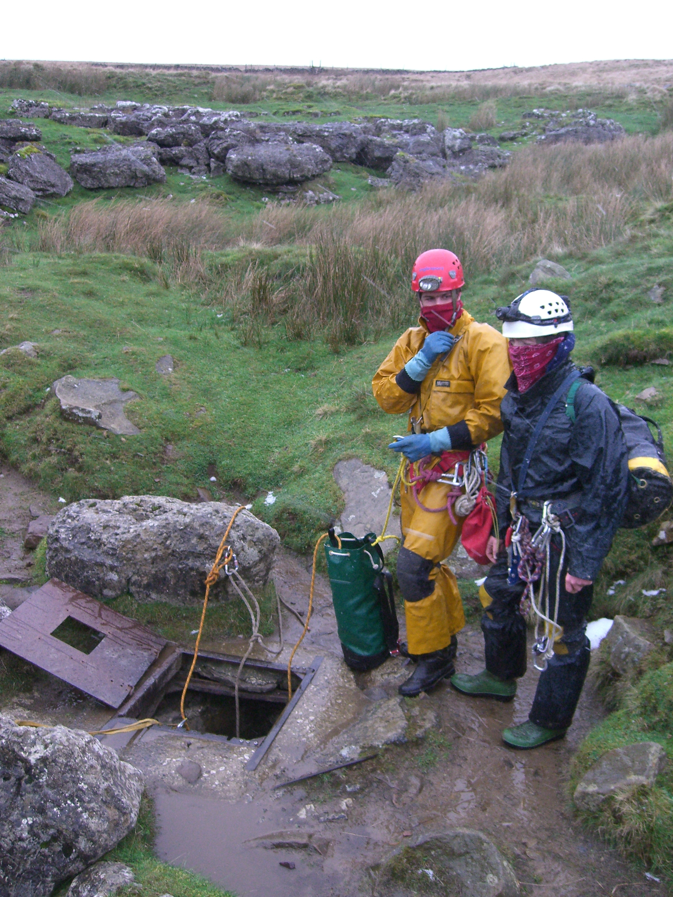
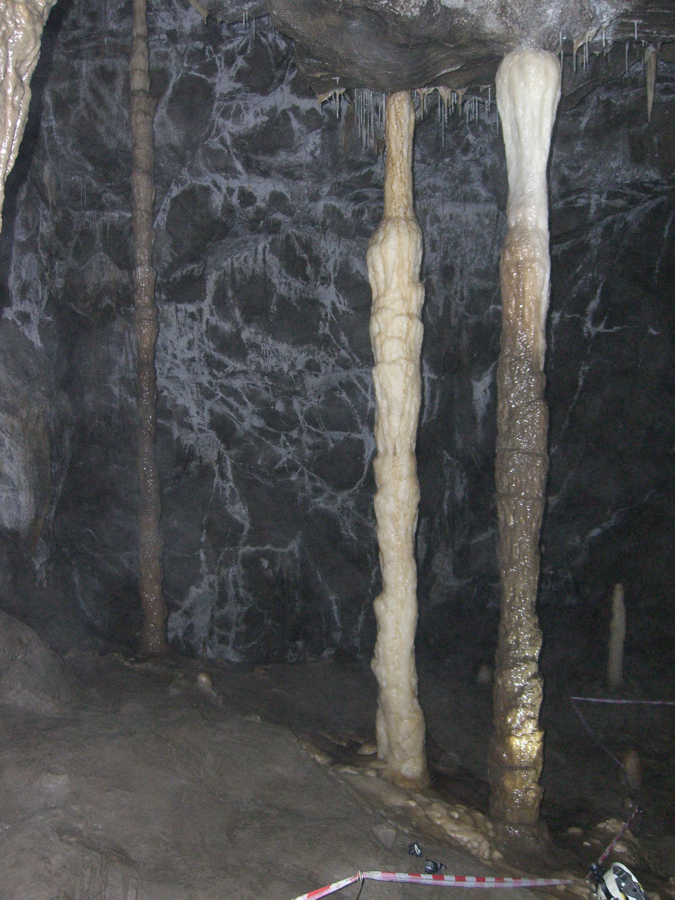
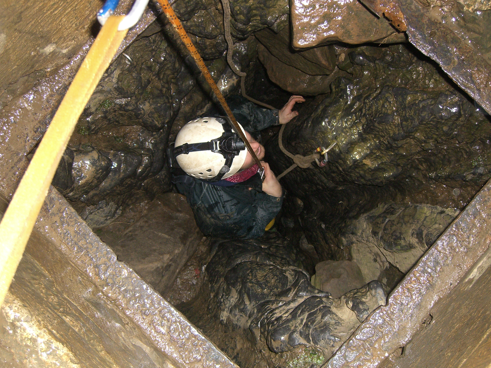

---
tags:
  - Yorkshire-Dales
  - England
  - caving
title: Lancaster Hole
description: A caving trip down the very popular Lancaster Hole, part of the very extension Easegill system in the Yorkshire Dales
draft: false
date: 2011-12-15
author: Tompkins Jonathan
---
# Lancaster Hole, Easegill
## Wednesday 14 December 2011

**Grade ?    Length ?m  Depth ?m **

**Jonathan Tompkins, Mick Ellerton, Olly Rees**

[Surveys](http://cavemaps.org/cavePages/Ease%20Gill__Lancaster%20Hole.htm)

It's wet.

Lancaster Hole is dry.

Other bits will be wet. Very wet.

I didn't think we would get to Wretched Rabbit and I was right. We had a good look round though.

We met at Emily's Tea Rooms in Kirby Lonsdale at 9am, frighteningly early in my current no work situation. On the way up I secretly hoped that someone would be late so I had time to sample some cakes and Olly duly obliged. We ummed and ahhed for a while deciding what trip we would do, during which time I realised that all my work photocopying surveys and descriptions and then laminating them was wasted as I'd left them all at home. Doh! Luckily for me Mick was organised and had a memory that worked. We didn't know the route from Lancaster Hole to Wretched Rabbit well but we knew that certain areas would be wet and some areas would flood to the roof. Having seen a lot of water on the way up we decided to abandon our planned trip through to wretched Rabbit and instead just have a good look around.

<figure style="text-align: center;">  <figcaption><i>Cold at the entrance</i></figcaption> </figure>

We drove up to Bull Pot, parked up and got changed. Bloody hell it was cold!

Olly rigged and soon we were at the bottom, considerably warmer. Because we wouldn't be doing any more pitches we abandoned our SRT kit and set off to explore. We soon arrived at the impressive Bridge Hall and then dropped through the scaffolded boulders into Kath's Way and Bill Taylor's Passage for a bit of stooping and crawling. From Montagu cavern we headed up Montagu West with me surprised by all the mud and fine formations. The T junction at the end of this passage was a fine phreatic passage

We were now off our survey and going off Olly's memory. I hoped it was better than mine. At one section, possibly Cross Passage, Olly mentioned that on his last trip this was a significant stream. Today there was nothing. It seemed like the water levels in Easegill were lower than in other parts of the Dales. We had a quick look at the sump that leads to Bull Pot of the Witches. We then went down the fantastic Wilf Taylors passage, a narrow, clean water washed rift with plenty of sharp rock. At Double Decker Pot we saw our first flood froth, way above our heads. This was significant as we then descended the fixed handline down the pot; the flood froth was now a long way up. At the bottom there was a beautifully coloured shale layer where I managed to persuade the two whipper snappers to stop for lunch.

<figure style="text-align: center;">  <figcaption><i>Colonnades</i></figcaption> </figure>

We next headed for Fall Pot and then upstream in the main drain. Olly wanted to take us to see some pools which were nice but deeper than I anticipated. I'd stayed perfectly dry till this point and had not realised how cold the water was until it surrounded my crotch! A damp climb up through the boulder choke of Fall Pot saw us arrive in Montagu Cavern where we'd been earlier in the trip, not that I immediately recognised it. On the way back to Bridge Cavern we passed a spot that was dry but was now showing significant water percolation. It must be raining and maybe we had been right not to do the through trip. We explored some passages off Bridge Cavern and the obligatory trip to see the Colonnades and then back to Lancaster Hole. 

<figure style="text-align: center;">  <figcaption><i>Exit</i></figcaption> </figure>

On the surface there was some fresh snow on the surrounding hills and a little bit around us. It must have snowed and melted and the sodden ground had meant the water immediately flowed into the system. 

I'd somehow managed not to carry or haul Mick's safety bag at all and Mick had been left with hauling that bag plus the rope bag up the entrance pitch. I figured he was young enough to enjoy it. Back at the vans we decided to go to the newly reopened Marton Arms for a pint.

It was closed.

We then tried the Wheat Sheaf in Ingleton.

Closed.

Inglesport cafe was open though so a coffee and two scones went down well. 

I've been vaguely interested in doing some digging, but not enough to actually do any. To be honest I wanted to move a few rocks and find some virgin passage and large pitches. The reality of digging is lying in mud shoveling it behind you or poking a crowbar above your head into a boulder choke and hoping a rock falls down, but not onto your head. Dave Ramsey, who is the High Chief Digger, was in Inglesport and I foolishly mentioned that I was interested in digging. He immediately seized upon my naivety and mentioned that I could come along on Sunday! He was polite enough to say I could say no. I await his text.