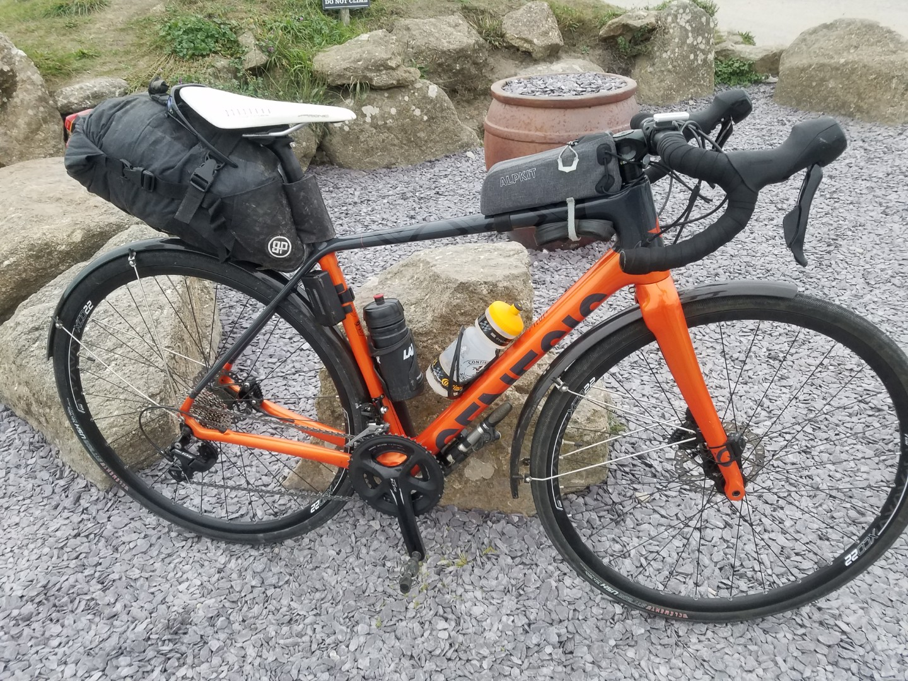
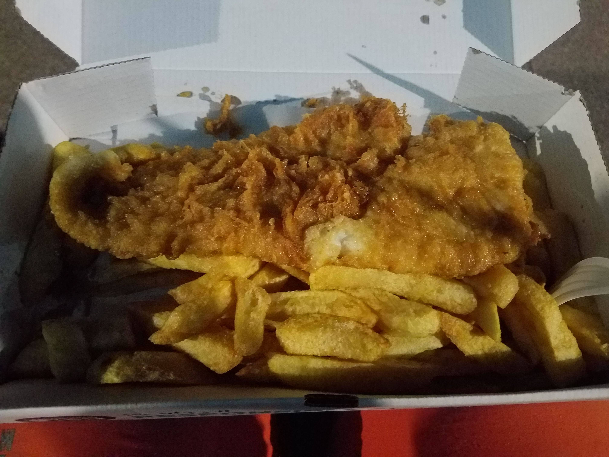
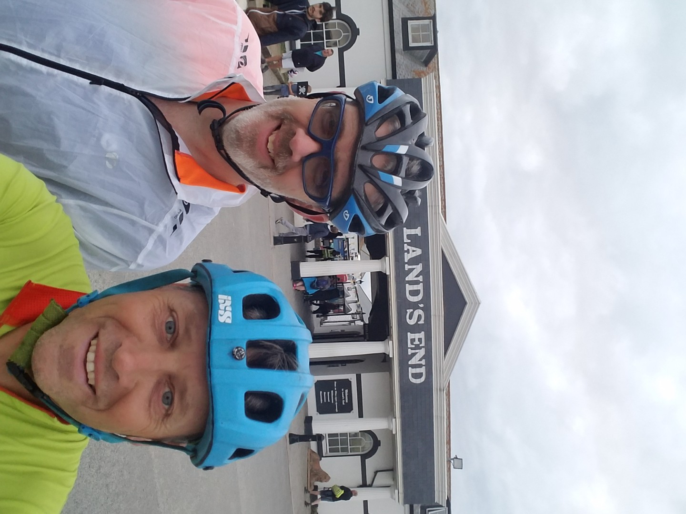

---
tags:
  - England
  - bikepacking
  - road-cycling
title: LEJOG day 1, Penzance to Land's End to Penzance
description: Land's End to John O'Groats day 1 Penzance to Lands End to Penzance
draft: false
date: 2018-08-28
author: Tompkins Jonathan
---

# LEJOG day 1
## Penzance to Land's End to Penzance

**28th August 2018**
**36km, 1hr 52mins, 19.5av**

Of course I had to nearly forget something but luckily I remembered my mud guards in the morning.

The first hiccup was receiving a saloon hire car that was impossible to fit two bikes in, despite Jim asking for a suitable car. To be fair when they replaced it it was a better car than we booked but we were behind schedule.

We arrived in Penzance five minutes before closing time at six. I'm still amazed that a one way car hire from Guiseley to Penzance is cheaper than getting the train.

The ride itself was uneventful. We were worried about it going dark so once we got to Land's End we took some photos and left. It helped that it's a particularly tacky, touristy place. A quick blast back to the &nbsp; Penzance Backpackers Hostel www.pzbackpack.com/ (enlivened by riding along tree covered roads at dusk in dark sunglasses) and we got to the chippy just before they closed. They were great fish and chips as well which we ate on the sea front. Not that I could see the sea as it was pitch black.

Tomorrow looks a bit daunting. The profile looks like the blade of a saw with 2.4 vertical kilometres but only 119 km of riding,

<figure style="text-align: center;">
  
  <figcaption><i>My sleek, light weight steed, unlike the pilot.</i></figcaption>
</figure>

<figure style="text-align: center;">
  
  <figcaption><i></i></figcaption>
</figure>

<figure style="text-align: center;">
  
  <figcaption><i>We're smiling because we made it to Land's End, not because it's a nice place.</i></figcaption>
</figure>

