---
tags:
  - bikepacking
  - road-cycling
  - Scotland
title: LEJOG day 10 Ardrossan to Oban via Arran
description: Land's End to John O'Groats day 10, Ardrossan to Oban via Arran
draft: false
date: 2018-09-06
author: Tompkins Jonathan
---
# LEJOG day 10 Ardrossan to Oban via Arran

**6th September 2018**
**6.08hrs 123.9km 1.4vkm 20.2av**

<figure style="text-align: center;">
  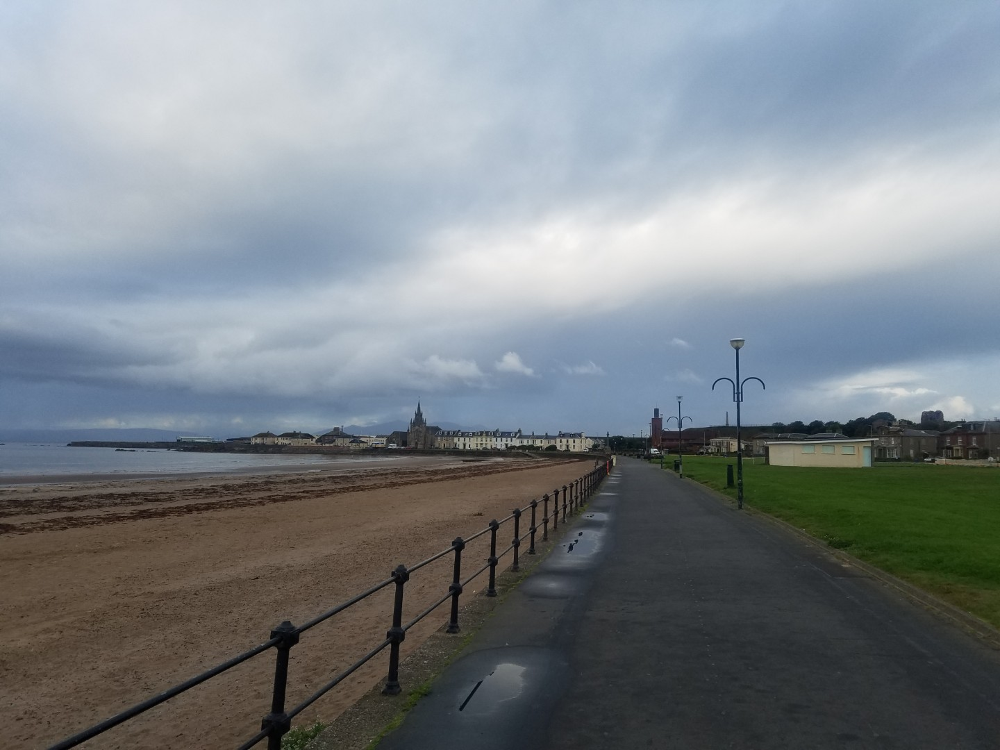
  <figcaption><i>Short ride to ferry terminal</i></figcaption>
</figure>

The forecast was for showers and a north westerly wind.  We reluctantly left Agnes's house for the short pootle along the sea front to the ferry. No reservation required, just pay at the terminal and get on the 8.20 to Brodick on Arran. Jim had, at some point yesterday, stood in a gigantic dog turd. You could hardly see his egg beater pedal and the cleat of his shoe was covered in it. He tried to clean his shoe in the sea when we got off on Arran, then got a car cleaning jet wash to clean his pedal and then we stopped later on for a final cleat cleaning session. I'd hate to see the size of the dog that produced it.

<figure style="text-align: center;">
  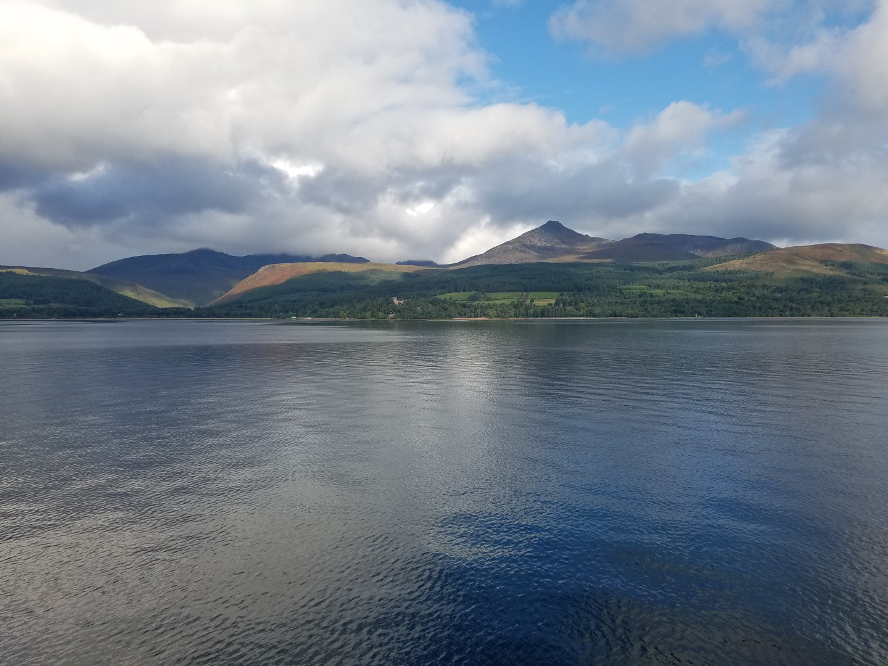
  <figcaption><i>Arran from the ferry</i></figcaption>
</figure>

<figure style="text-align: center;">
  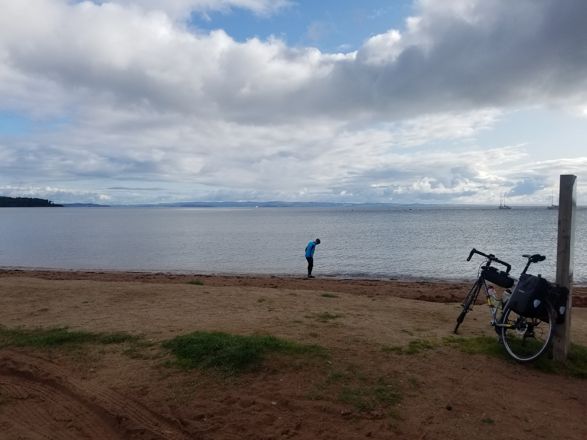
  <figcaption><i>Jim at the start of "Operation Clean That Shit"</i></figcaption>
</figure>

Arran was gorgeous although we didn't see any otters or seals, or seals fighting otters. Had a fantastic salmon sandwich at the Lochranza ferry terminal and then hopped on the incredibly cheap ferry (£5.80 for two, one way) to the mainland.

<figure style="text-align: center;">
  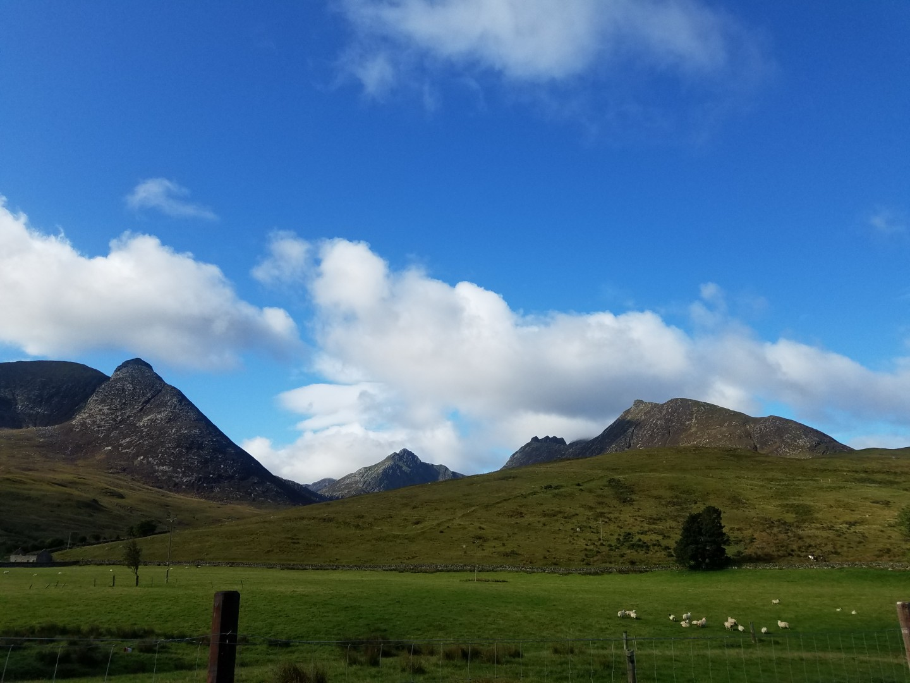
  <figcaption><i>Arran</i></figcaption>
</figure>

<figure style="text-align: center;">
  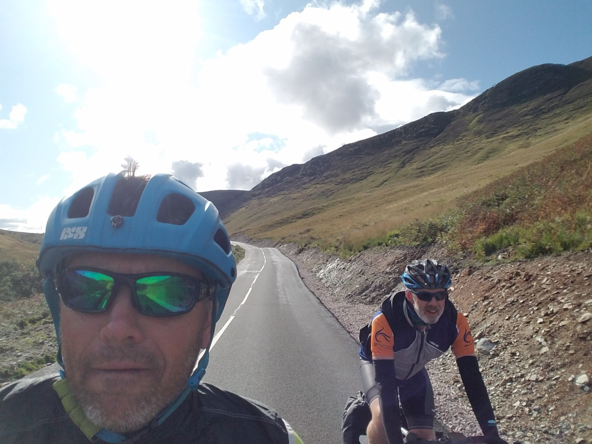
  <figcaption><i>Sunny, warm and still awake.</i></figcaption>
</figure>

<figure style="text-align: center;">
  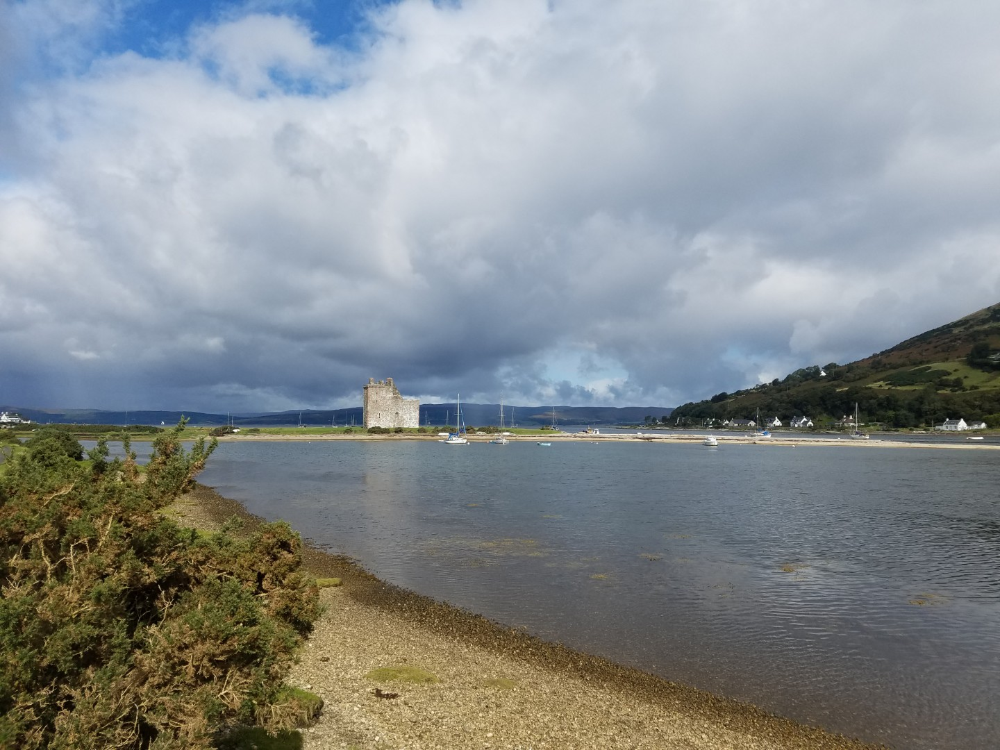
  <figcaption><i>The obligatory "Scottish castle near a loch" picture.</i></figcaption>
</figure>

<figure style="text-align: center;">
  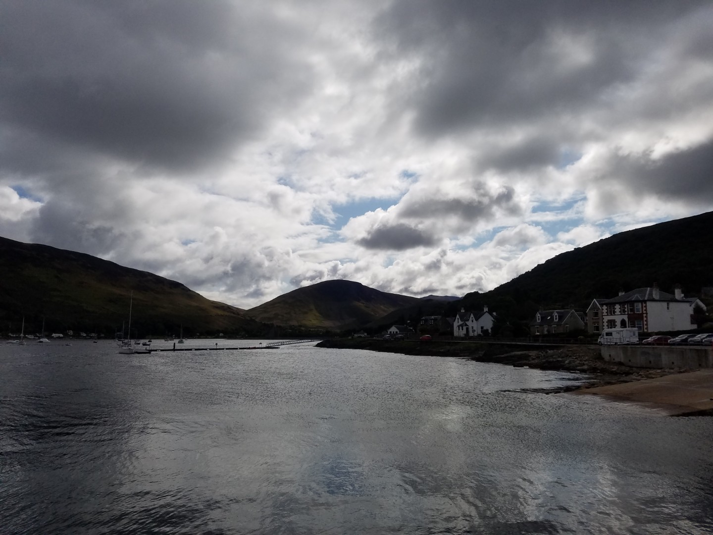
  <figcaption><i>Lochranza</i></figcaption>
</figure>

<figure style="text-align: center;">
  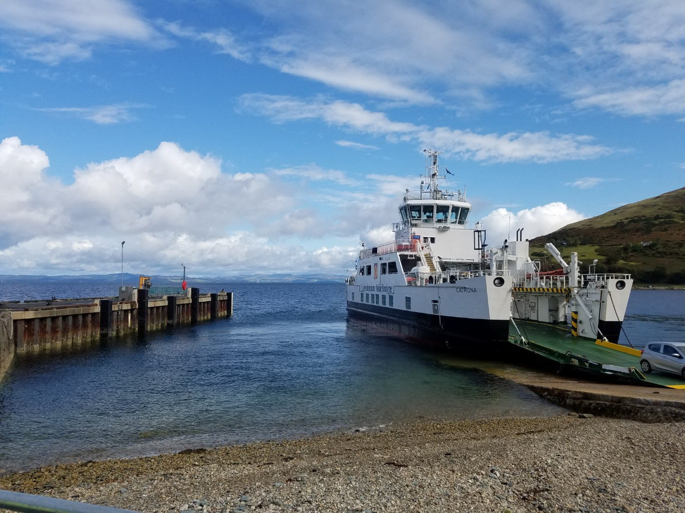
  <figcaption><i>LEJOG doping</i></figcaption>
</figure>

I felt ok up to this point but I had a nap on the ferry. When we got off I just couldn't ride fast enough to keep up with Jim. I free wheeled as much as possible and if the gap to Jim got too large I made a bit of an effort. 35km later we stopped in Ardrishaig for some food and a coffee. I put my head on the table and closed my eyes five 5 minutes until the food arrived. It did the trick and when we set off I felt normal again. There were some great views along this stretch to Ardrishaig although I mostly stared at the tarmac in front of me.

<figure style="text-align: center;">
  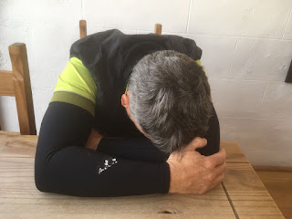
  <figcaption><i>Much needed</i></figcaption>
</figure>

<figure style="text-align: center;">
  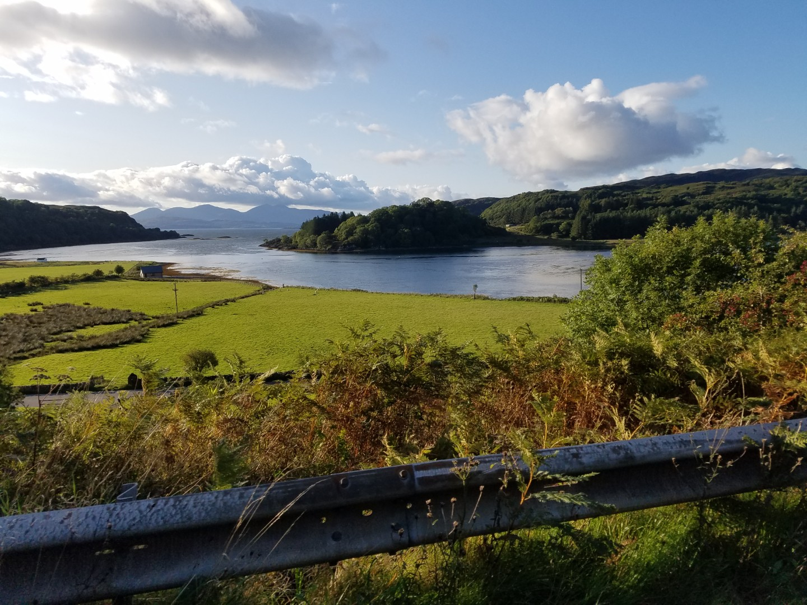
  <figcaption><i>Somewhere</i></figcaption>
</figure>

After that it was back to normal. The dreaded logging trucks didn't materialize and most of the drivers were quite sensible when overtaking. We only got caught in two showers and the headwind wasn't quite as bad as it was forecast. 

A quick shower at the hostel and then the largest fish and chips I've ever seen at one of the gadzillion chippies on Oban.

<figure style="text-align: center;">
  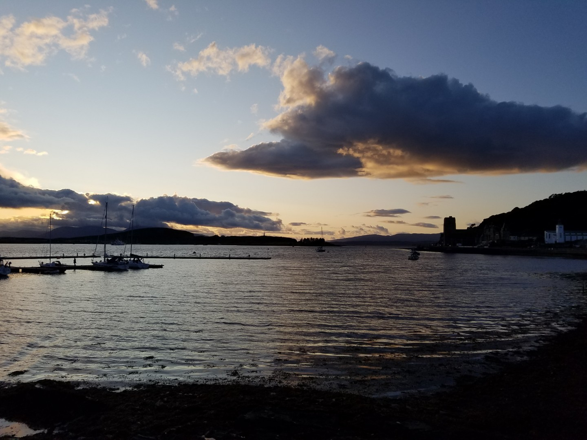
  <figcaption><i>Oban</i></figcaption>
</figure>

<figure style="text-align: center;">
  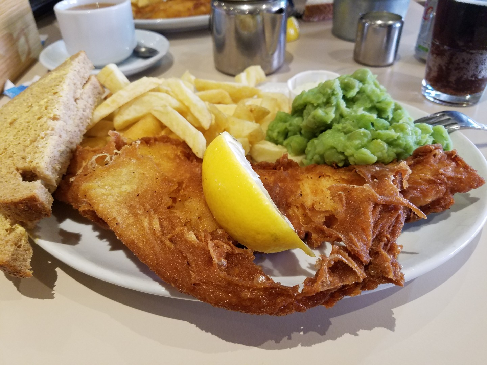
  <figcaption><i>This is what all the best athletes eat.</i></figcaption>
</figure>
