---
tags:
  - road-cycling
  - bikepacking
  - Scotland
title: LEJOG day 11 Oban to Loch Ness
description: Land's End to John O'Groats day 11 Oban to Loch Ness
draft: false
date: 2018-09-07
author: Tompkins Jonathan
---
# LEJOG day 11 Oban to Loch Ness

**7th September 2018**
**7.30hrs 157.6km 21av 1.2vkm**

The best riding of the whole trip so far. We mostly followed the Sustrans 78 route so we had a traffic free, stress free, flattish route along the Great Glen. Some of it was on quiet back roads and some of it on the Caledonian canal towpath which was silky smooth. Along Loch Lochy (it's a real name, honest) we followed a fire road which was a bit too rough but otherwise it was a great day. Great views, dry all day and minimal head wind. Slightly let down by me putting the accommodation in the wrong location in the GPS, therefore adding 14km onto the end of the day. I'm sure Jim will never bring that up in the future.

<figure style="text-align: center;">
  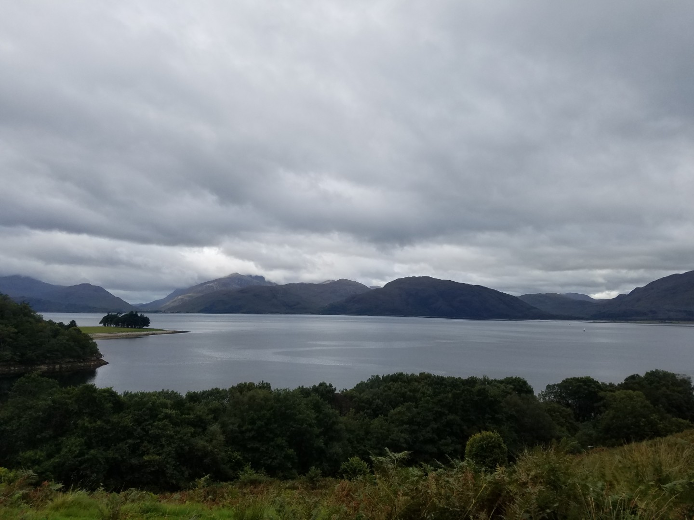
  <figcaption><i>Near Oban</i></figcaption>
</figure>

<figure style="text-align: center;">
  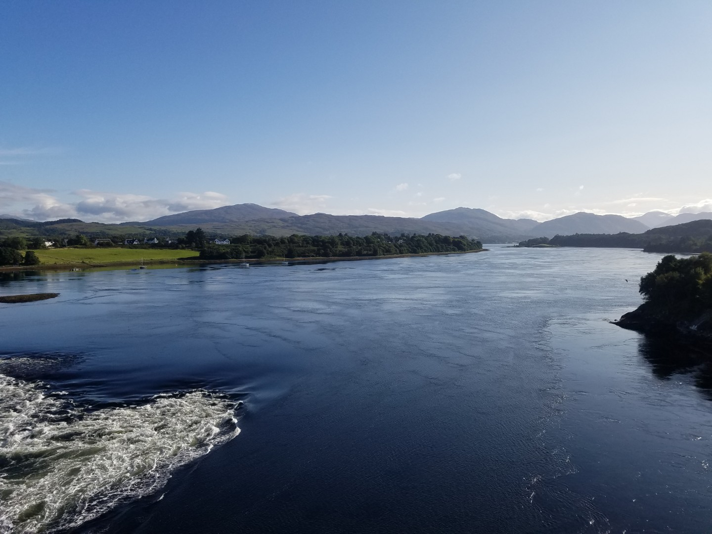
  <figcaption><i></i></figcaption>
</figure>

<figure style="text-align: center;">
  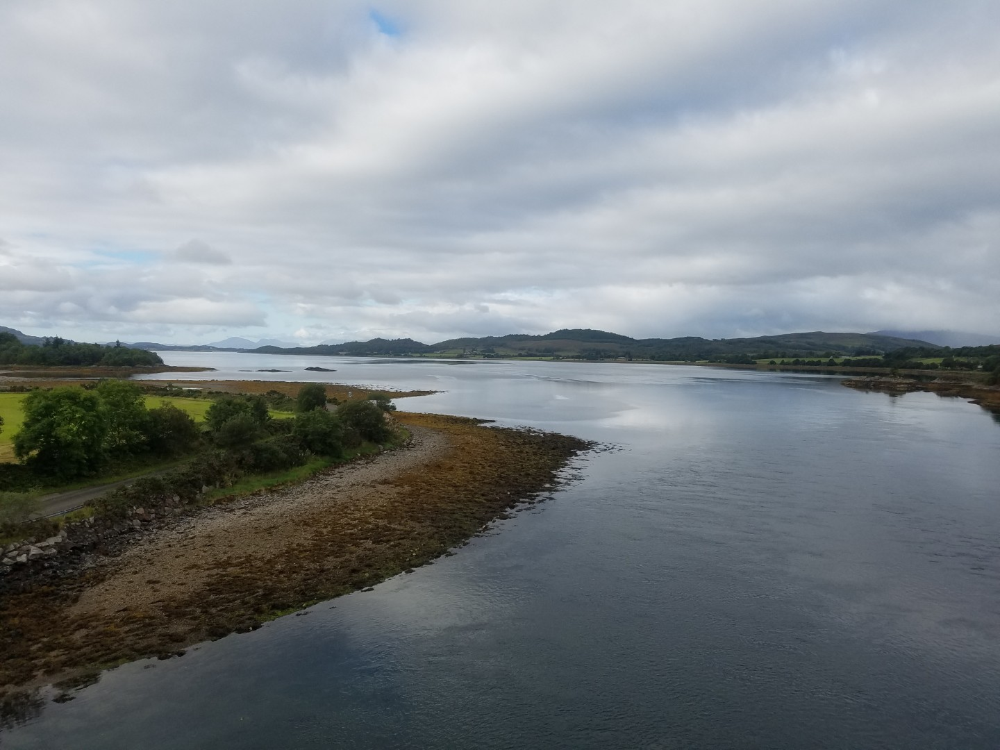
  <figcaption><i></i></figcaption>
</figure>

<figure style="text-align: center;">
  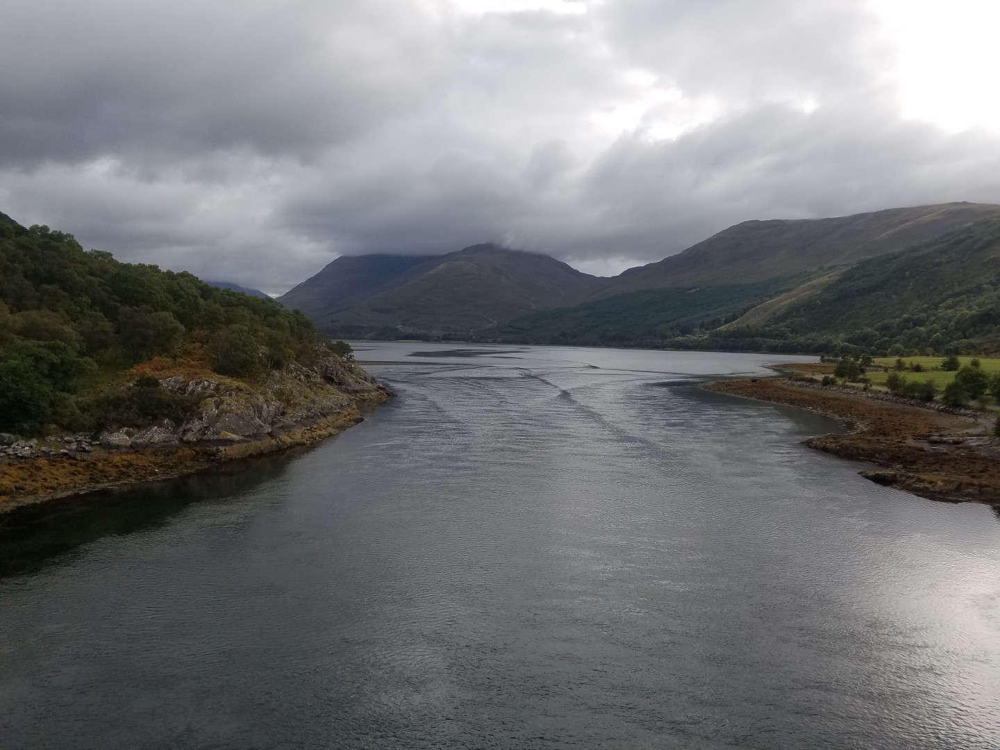
  <figcaption><i></i></figcaption>
</figure>

  

<figure style="text-align: center;">
  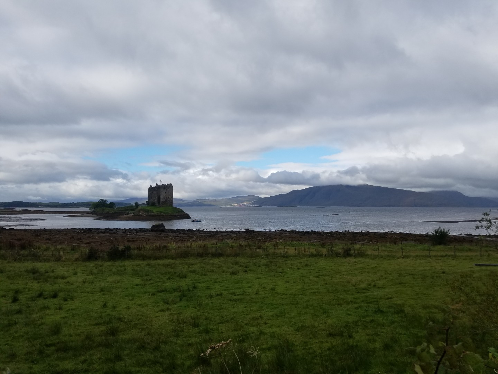
  <figcaption><i></i></figcaption>
</figure>

<figure style="text-align: center;">
  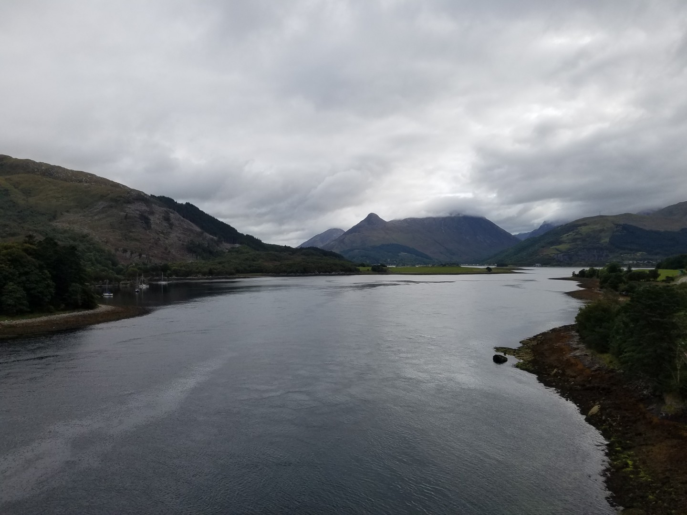
  <figcaption><i></i></figcaption>
</figure>

<figure style="text-align: center;">
  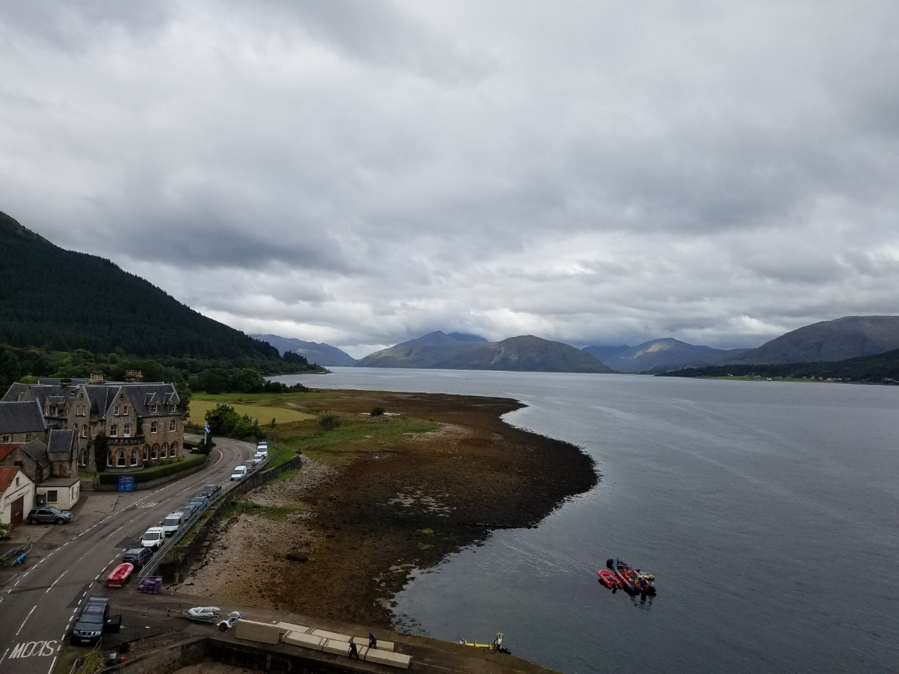
  <figcaption><i></i></figcaption>
</figure>

<figure style="text-align: center;">
  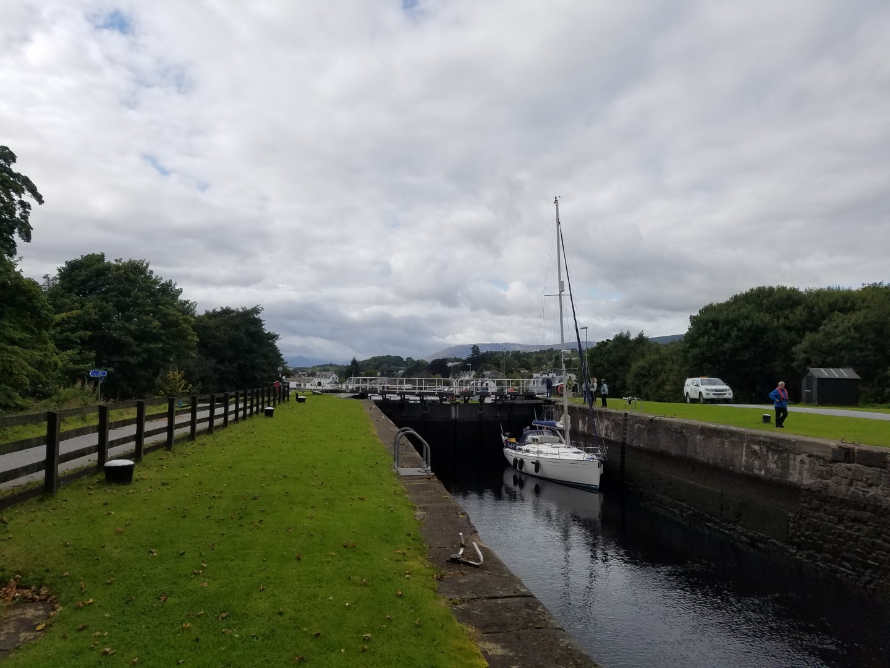
  <figcaption><i>Caledonian Canal</i></figcaption>
</figure>

<figure style="text-align: center;">
  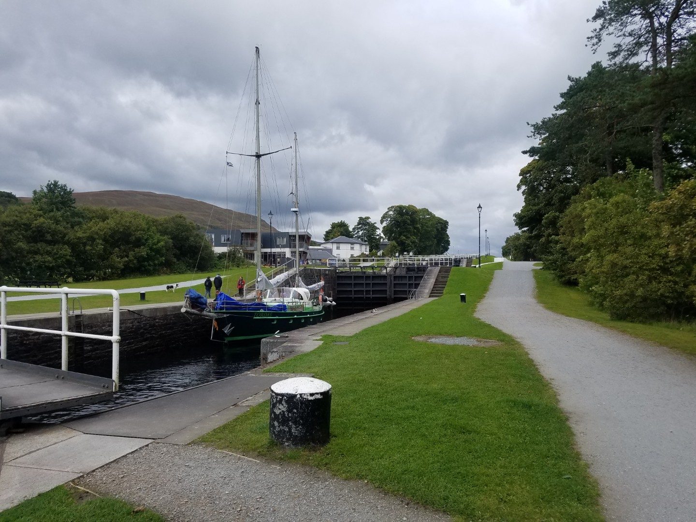
  <figcaption><i>Caledonian Canal</i></figcaption>
</figure>

<figure style="text-align: center;">
  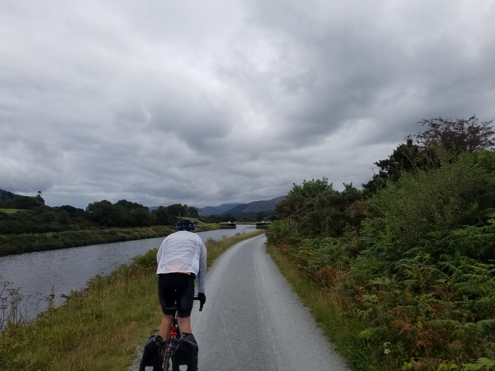
  <figcaption><i>Caledonian Canal</i></figcaption>
</figure>

<figure style="text-align: center;">
  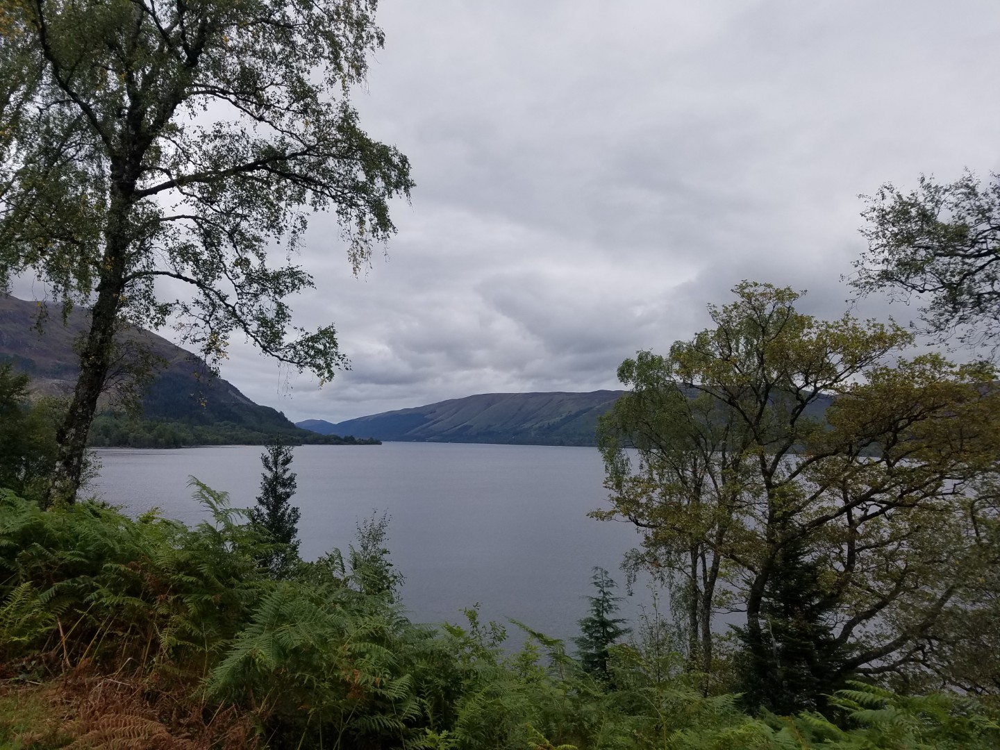
  <figcaption><i>Loch Ness</i></figcaption>
</figure>
