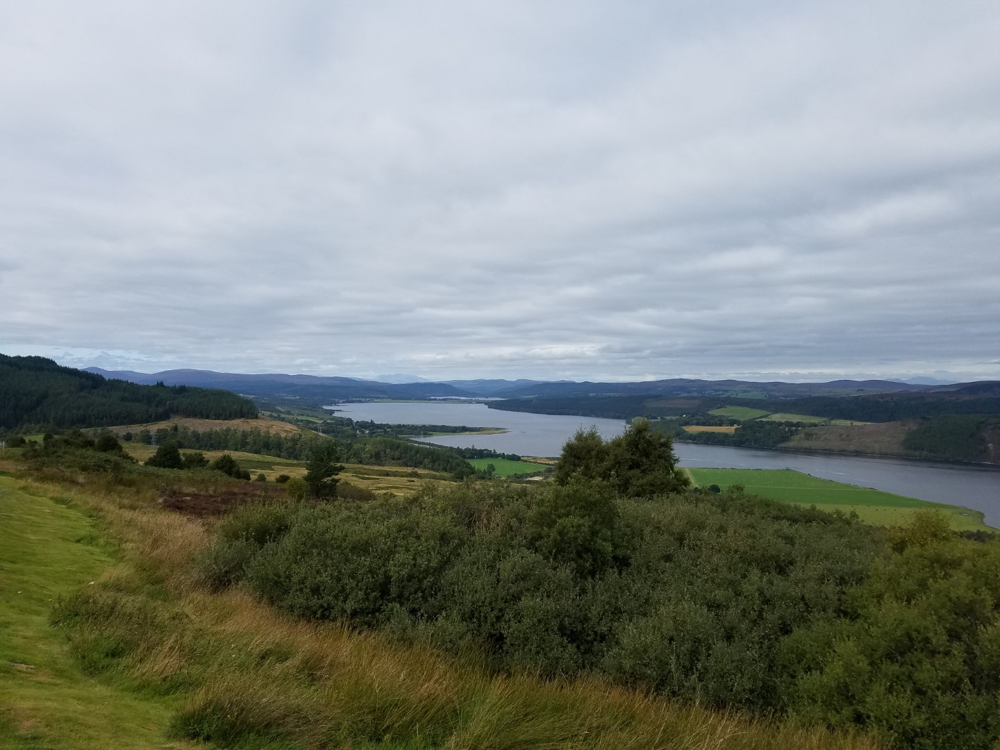
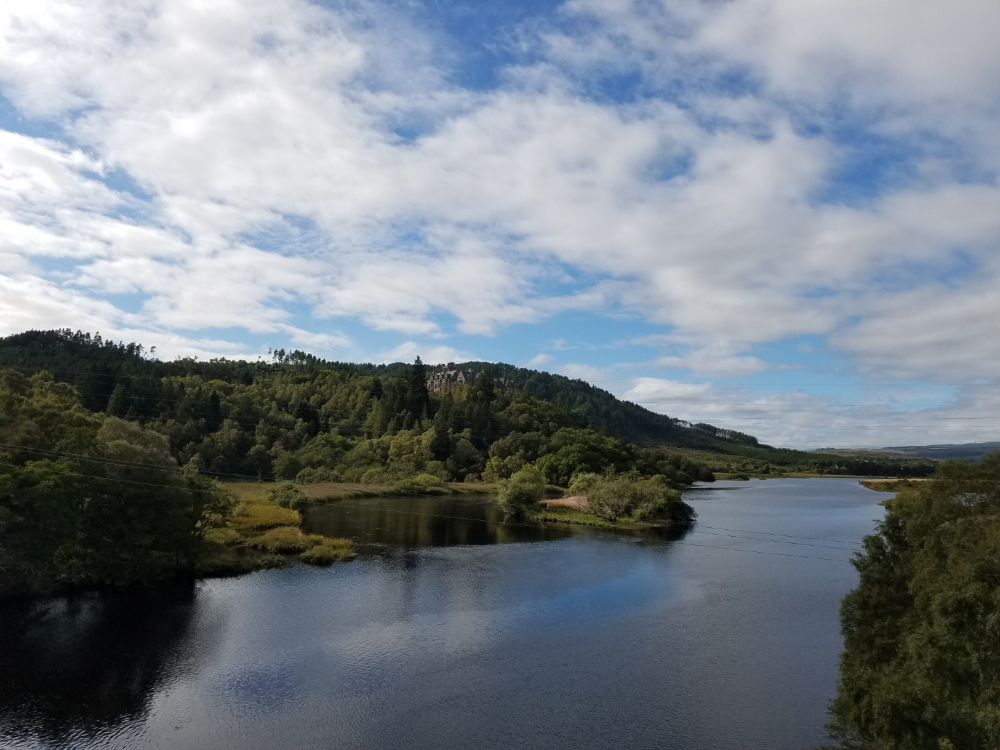

---
tags:
  - Scotland
  - bikepacking
  - road-cycling
title: LEJOG day, 12 Loch Ness to Invershin
description: Land's End to John O'Groats day 12 Loch Ness to Invershin
draft: false
date: 2018-09-08
author: Tompkins Jonathan
---
# LEJOG day, 12 Loch Ness to Invershin

**8th September 2018**

There was a British girl talking to a German lad last night. He was a test driver for various car manufacturers and he was droning on about car tests, driving, the autobahn, different cars, other drivers blah de blah de blah. To be fair she appeared interested but they went to separate rooms at the end of the evening so his chat up lines can't have worked. There were four of us in an adjacent part of the room listening to all this, shaking our heads.

It's a short day today, made shorter by the addition of 14km yesterday, something that Jim keeps mentioning for some reason. Our legs are tired today, partly due to all the cycling and the long day yesterday, and partly due to the flatulent snorers in our tiny room keeping us awake.

It was a gloriously sunny start and after we picked up one of Jim's panniers that his bike ejected into the middle of the road we got to the first hill, a steep one. With virtually zero warm up we struggled up it, I would have pushed if I thought Jim wouldn't have known.

The downhill was long and fast enough to free wheel up a little climb in the middle, even Jim and his shipping container like aerodynamics managed it I think. I was free wheeling as much as possible although even short stints of this were giving me bakery legs.

An easy pootle along the valley and over one small steep climb brought us to the final hill. The B9176 over Easter Ross wasn't steep but it went up for about 10km, over the undulating top for another 10km then down a slow descent for 5km, all on a crappy, slow road surface. It was, quite literally, a pain in the arse.

Getting into Invershin was great, as was a short nap in the afternoon. Another short day tomorrow, hopefully with the same good forecast.

<figure style="text-align: center;">
  
  <figcaption><i></i></figcaption>
</figure>

<figure style="text-align: center;">
  
  <figcaption><i>Kyle of Sutherland</i></figcaption>
</figure>

