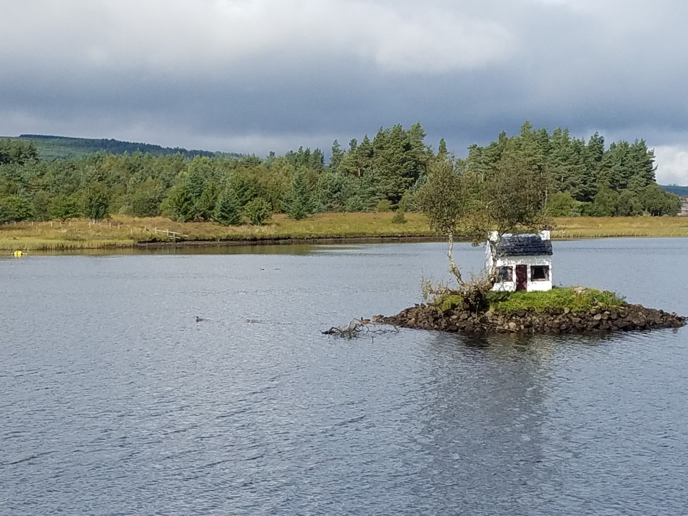
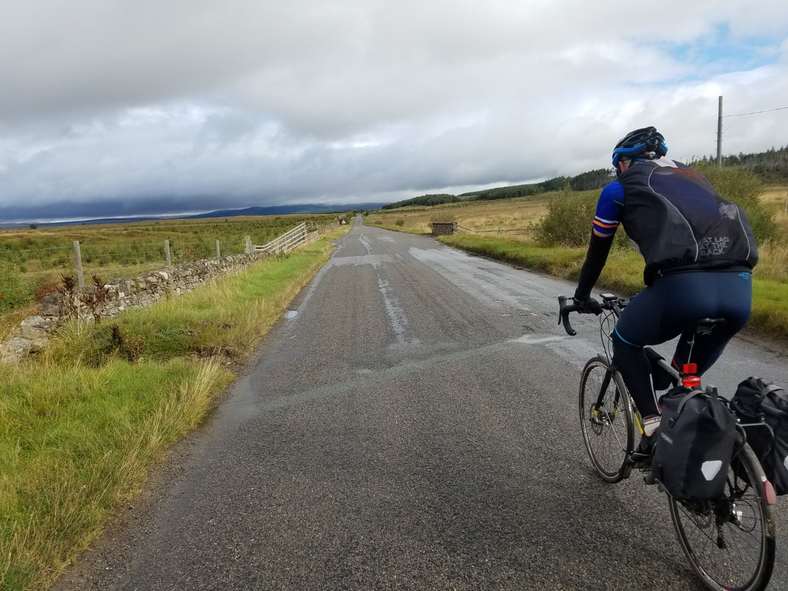
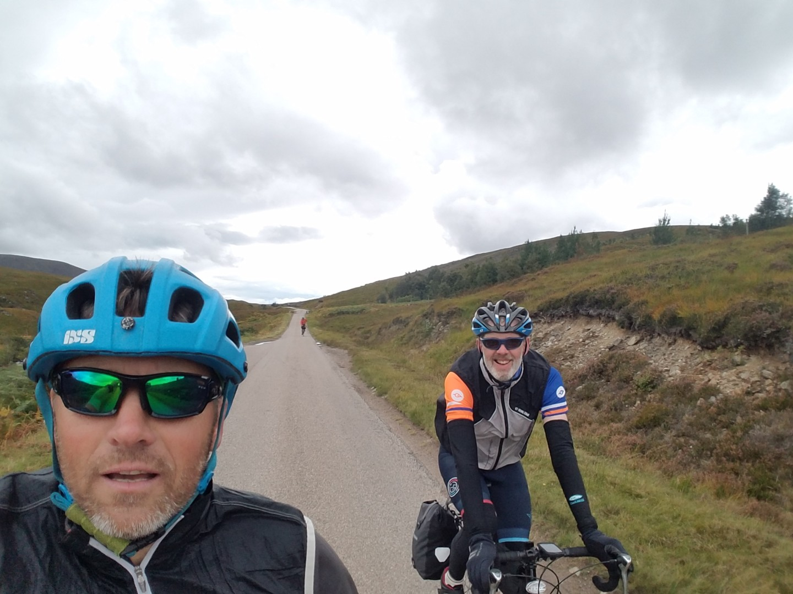
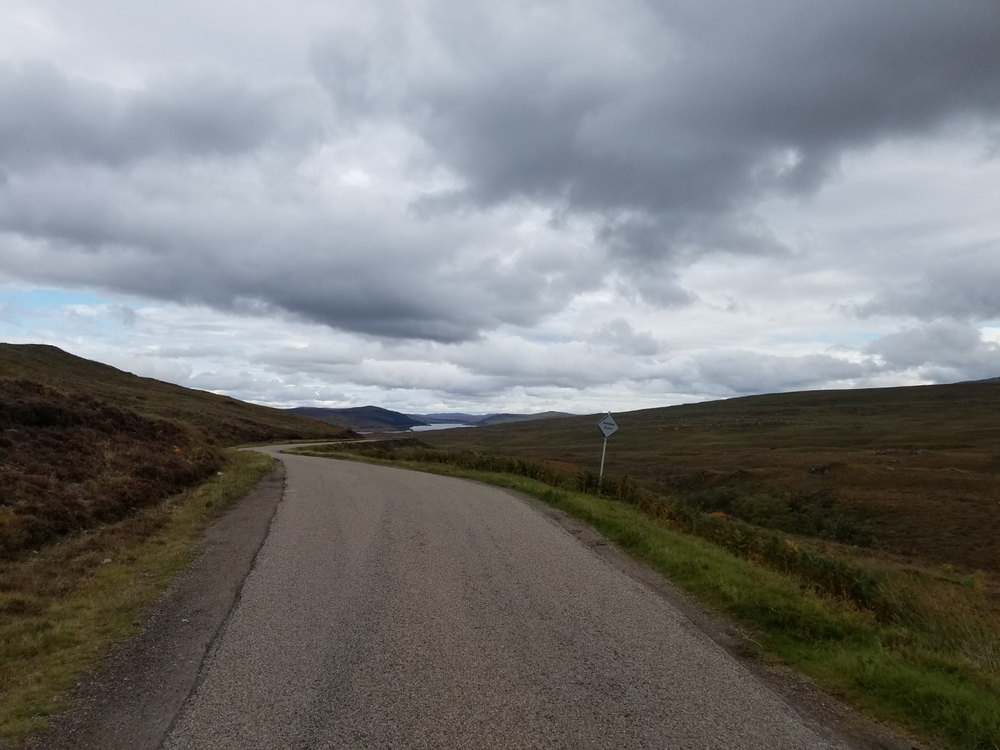
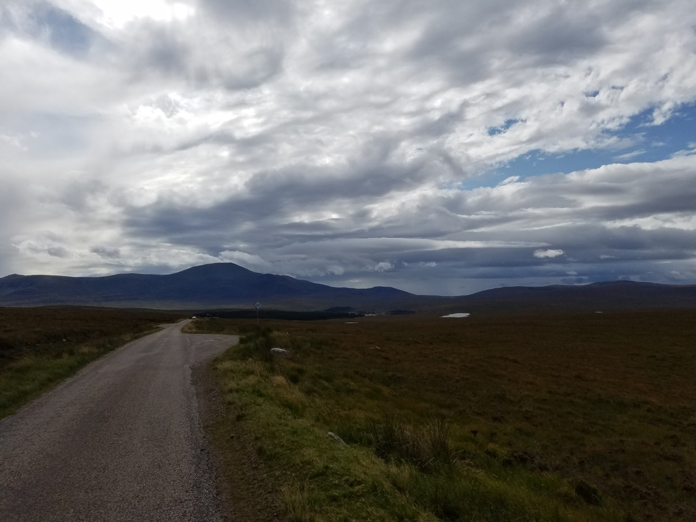
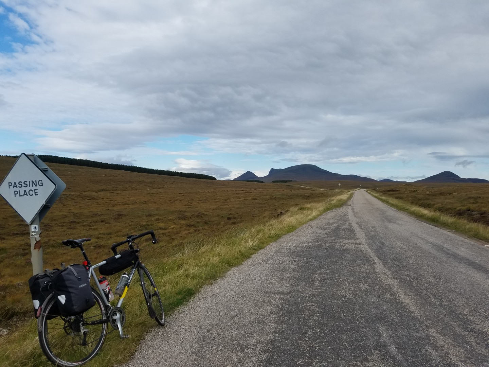
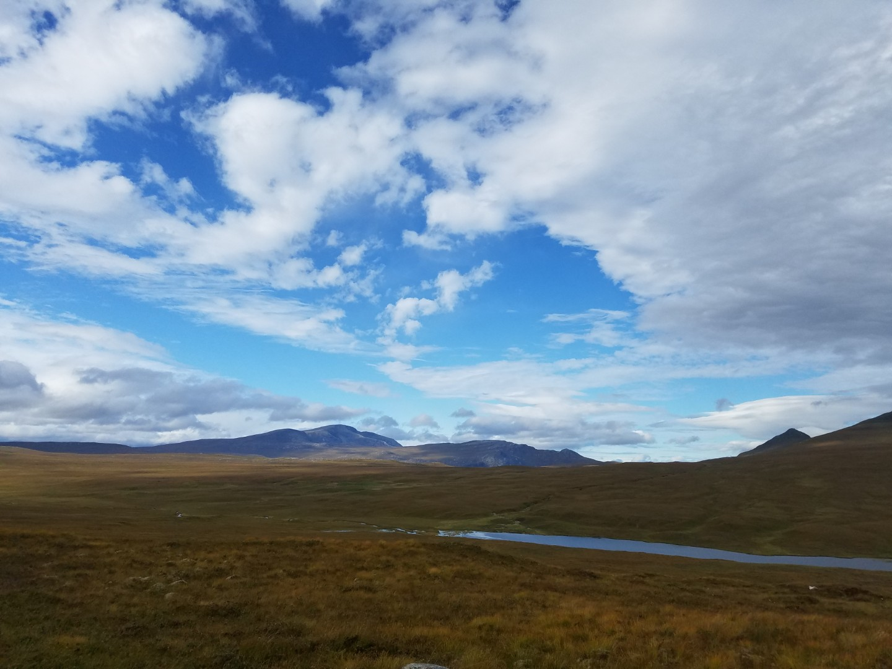
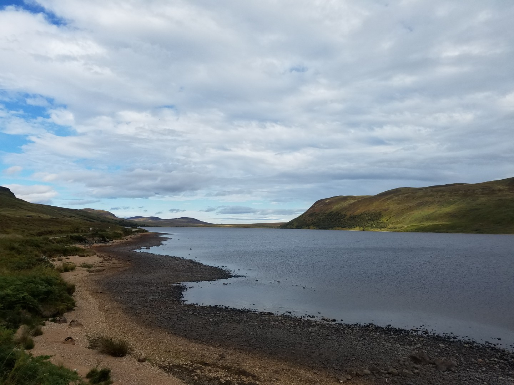
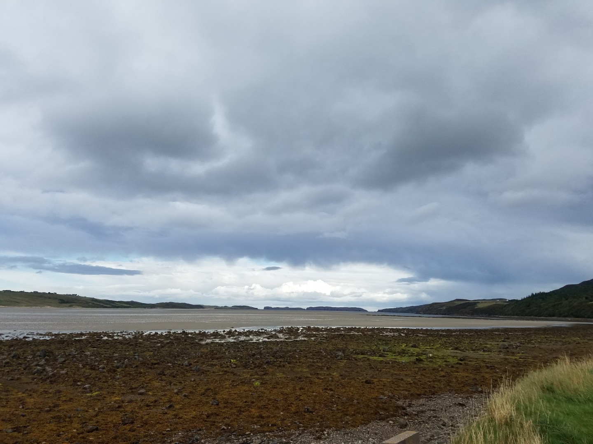
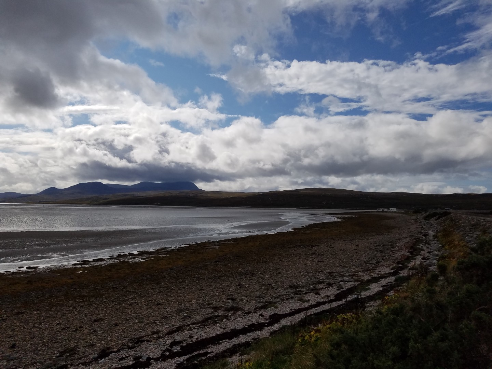

---
tags:
  - bikepacking
  - road-cycling
  - Scotland
title: LEJOG day 13 Invershin to Tongue
description: Land's End to John O'Groats day 13 Invershin to Tongue
draft: false
date: 2018-09-09
author: Tompkins Jonathan
---
# LEJOG day 13 Invershin to Tongue

**9th September 2018**

We had a fantastic afternoon of snoozing and doing as little as possible yesterday. Four Sheffield cyclists turned up later on, they were doing JOGLE in 10 days, mostly on A roads. They had campervan backup so they didn't have to carry anything but I didn't envy them cycling on A roads. Later on we saw two cyclists arrive in the dark and leave in the morning before everyone else. We meet them the next day on the road, they were doing LEJOG in seven days and wild camping so hadn't wanted to stay in the hostel. One obviously had all the kit and knew what he was doing and his mate had been persuaded to do it, on an old steel framed bike with old school cantilever brakes and a year off the bike. Looked like they were really enjoying it.

After listening to an episode of Athletico Mince (if you like Bob Mortimer, look it up) we went to sleep at 21.30 till about 7.30, it's worth getting a twin room occasionally!

Yesterday it felt like either I had a sweaty bum or that I'd shat my pants. Luckily it was neither, I'd just applied to much bum butter and it was squelching around. I was a bit more careful today.

<figure style="text-align: center;">
  
  <figcaption><i>No further information available, sorry.</i></figcaption>
</figure>

Another gloriously short day today, only 74km to Tongue. I could have merged the last three days into two but at the time I wasn't sure if we could cope with the mileage. The forecast was for showers and a tailwind, in the end we got the tailwind and about five minutes of light showers on the descent to the hostel.

<figure style="text-align: center;">
  
  <figcaption><i></i></figcaption>
</figure>

<figure style="text-align: center;">
  
  <figcaption><i>That suspiciously looks like we overtook someone.</i></figcaption>
</figure>

<figure style="text-align: center;">
  
  <figcaption><i></i></figcaption>
</figure>

<figure style="text-align: center;">
  
  <figcaption><i></i></figcaption>
</figure>

<figure style="text-align: center;">
  
  <figcaption><i></i></figcaption>
</figure>

<figure style="text-align: center;">
  
  <figcaption><i></i></figcaption>
</figure>

<figure style="text-align: center;">
  
  <figcaption><i></i></figcaption>
</figure>

The profile showed one long massive uphill followed by a final smaller hill. They were both really easy gradients with great views along a single track road. It's an A road (A836) of the type you only find in Scotland and it was surprisingly busy because they aren't many roads around here. The views were stunning if a little bleak but at Tongue it got even better. It's a beautiful place and well worth a visit. Mountains, sea lochs and lots of weather.

The Tongue hostel, now in private hands, is the best we've stayed in. It's almost like a private house with some twin rooms and spacious bunk rooms. Friendly staff and beautiful views.

<figure style="text-align: center;">
  
  <figcaption><i>Kyle of Tongue</i></figcaption>
</figure>

<figure style="text-align: center;">
  
  <figcaption><i></i></figcaption>
</figure>

I learnt something new about Jim yesterday that I forgot to mention, he's keeping a tally of dead badgers. He's up to five. He also wants a weather station and a windsock for his garden. He's odd.